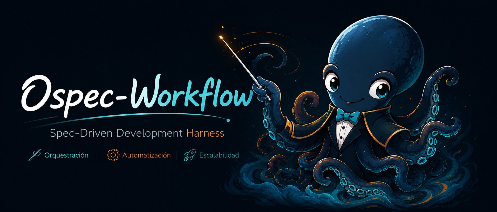

# ospec-workflow



> **La inmediatez sin contrato es velocidad falsa.** `ospec-workflow` es un arnés de desarrollo Spec-Driven Development (SDD) llave en mano. Utiliza **OpenSpec** como única fuente de verdad y proporciona un orquestador inteligente que coordina agentes de fase, garantizando Strict TDD, control de tamaño de revisiones y gates de seguridad activos en cada commit.

Está basado en [Gentle-ai de Gentleman Programming](https://github.com/Gentleman-Programming/gentle-ai).

---

## Filosofía SDD: Diseñar antes de Construir

En el desarrollo asistido por IA, programar antes de comprender el problema genera deuda técnica y código incoherente. `ospec-workflow` impone una barrera de disciplina:

1. **El Contrato es lo Primero**: Definimos la intención (`proposal`), el comportamiento observable (`spec.md`) y la arquitectura (`design.md`) antes de tocar una sola línea de código.
2. **Evidencia sobre Opinión**: La fase `/sdd-verify` requiere pruebas reales ejecutadas y niveles de evidencia verificables, nunca supuestos.
3. **El Repositorio es la Memoria**: Todo el estado del cambio y los supuestos de diseño viven en archivos versionables (`openspec/`), no en el historial volátil del chat.
4. **Protección del Revisor**: Limitamos los cambios a un presupuesto recomendado de **400 líneas**. Si el cambio es mayor, el orquestador propone estrategias de PRs encadenadas para evitar fatiga en la revisión.

---

## Inicio Rápido en 3 Pasos

### 1. Preparar las Instrucciones de tu Proyecto
Copia la plantilla de instrucciones adecuada en la raíz de tu repositorio de destino para fijar el contrato de que el agente debe **coordinar en vez de implementar a mano**:
- [`CLAUDE.md`](CLAUDE.md) $\rightarrow$ Para **Claude Code** (copia a tu repo).
- [`AGENTS.md`](AGENTS.md) $\rightarrow$ Variante **agnóstica** para VS Code, Copilot u otros editores.

### 2. Instalar el Plugin en tu Herramienta
Elige tu target y ejecuta su configurador automático:

| Entorno / Target | Comando de Instalación Rápida | ¿Qué hace? |
| :--- | :--- | :--- |
| **VS Code** | `npm run setup:vscode` | Compila a `dist/vscode` y lo añade a `chat.pluginLocations`. |
| **Claude Code** | `npm run setup:claude` | Compila, valida de forma estricta e instala como plugin persistente. |
| **Copilot CLI** | `npm run setup:copilot` | Compila e instala globalmente en tu máquina (`~/.copilot/`). |
| **opencode** | `npm run setup:opencode` | Compila e instala en la carpeta de OpenCode (`~/.config/opencode/`). |

### 3. Iniciar un Ciclo SDD
Una vez cargado el plugin en tu agente de chat:
1. **Inicializa el proyecto**: Escribe `/sdd-init`. Esto detectará automáticamente tu stack y test runner.
2. **Comienza un cambio**: Escribe `/sdd-new <nombre-del-cambio>` (ej. `/sdd-new login-session-timeout`).
3. **Completa el flujo**: Sigue la secuencia recomendada por el orquestador (`/sdd-continue` $\rightarrow$ `/sdd-apply` $\rightarrow$ `/sdd-verify` $\rightarrow$ `/sdd-archive`).

---

## Configuración Detallada por Target

### 🛠️ VS Code (Carga Directa del Source)
- **Opción A (Uso directo del source - sin ruteo de modelos)**:
  Añade la raíz de este repositorio clonado a `chat.pluginLocations` en tu `settings.json`.
- **Opción B (Compilado con ruteo de modelos - Recomendado)**:
  ```powershell
  npm run setup:vscode
  ```
  Para actualizar tras realizar cambios en el source:
  ```powershell
  npm run reload:vscode
  ```

### 🤖 Claude Code (Plugin Persistente y Marketplace)
- **Para usuarios finales** (sin clonar el repositorio):
  ```powershell
  claude plugin marketplace add https://github.com/snakeblack/ospec-workflow.git#release
  claude plugin install ospec-workflow@ospec-tools
  ```
- **Para desarrollo del plugin** (instalación idempotente local):
  ```powershell
  npm run setup:claude
  ```
  *(Dentro de la sesión de Claude Code, escribe `/reload-plugins` para aplicar cambios).*
- **Reconstrucción rápida durante el desarrollo**:
  ```powershell
  npm run reload:claude
  ```

### 💻 GitHub Copilot CLI (Carga Global)
- **Instalación Global (Recomendado)**:
  ```powershell
  npm run setup:copilot
  ```
  *(Esto copia agentes, instrucciones y comandos a `~/.copilot/` y fusiona el archivo `mcp-config.json` global).*
- **Instalación Local (Solo para un proyecto específico)**:
  ```powershell
  npm run install:copilot -- ../mi-proyecto
  ```

### 🧬 opencode
- **Instalación Global (Recomendado)**:
  ```powershell
  npm run setup:opencode
  ```
  *(El agente principal se renombra automáticamente a `ospec-workflow` para facilitar su descubrimiento por autocompletado).*
- **Instalación Local**:
  ```powershell
  npm run install:opencode -- ../mi-proyecto
  ```

Consulta la [guía de instalación](docs/plugin-installation.md) para más detalles sobre instalación remota, desarrollo local, marketplace y confianza del plugin.

## Qué incluye

| Ruta | Propósito |
| --- | --- |
| `CLAUDE.md` / `AGENTS.md` | Plantillas de instrucciones de proyecto (Claude Code y agnóstica) que fijan el contrato coordinador-no-ejecutor. Copialas a tu repo. |
| `.plugin.json` | Manifiesto **canónico** (VS Code/direct-load). Editá este primero. |
| `.claude-plugin/plugin.json` | Copia de compatibilidad para la distribución Claude; también es la fuente que lee el generador (`scripts/configure/cli.js`). Debe reflejar el canónico — `scripts/manifest-sync.test.js` lo verifica en CI. |
| `agents/` | Orquestador y agentes especializados por fase. |
| `commands/` | Comandos visibles y routing hacia el orquestador. |
| `skills/` | Capacidades bajo demanda y contratos compartidos. |
| `rules/` | Reglas persistentes de SDD, OpenSpec y Strict TDD. |
| `hooks/` | Declaración de eventos del ciclo de vida del plugin. |
| `scripts/hooks/` | Runtime de los hooks (Node.js) y sus tests. |
| `scripts/lib/` | Librerías compartidas: estado OpenSpec, artifact-store y el núcleo del generador (`frontmatter`, `model-resolver`, `target-transform`, perfiles). |
| `scripts/configure/` | CLI del generador multi-target (`cli.js`), validadores por perfil y fixtures golden. |
| `models.yaml` | Tablas tier→modelo por target para el generador. |
| `profiles/models/` | Perfiles opcionales de routing de modelos (uso directo en VS Code). |
| `docs/` | Documentación detallada de arquitectura y uso. |
| `.mcp.json` | Configuración MCP mínima del plugin. |
| `openspec/` | Fuente de verdad versionable de cada cambio SDD. |

## Comandos SDD

| Comando | Uso |
| --- | --- |
| `/sdd-init` | Detecta el proyecto y prepara OpenSpec, testing y registro de skills. |
| `/sdd-baseline` | Seed openspec/specs/ with baseline specs of existing behavior (brownfield repos, resumable batches). |
| `/sdd-workspace` | Gestiona la federación multi-repo: atlas (`init`), estado cross-repo (`status`), impacto por contratos (`impact`). |
| `/sdd-new` | Inicia un cambio persistido y selecciona el workflow. |
| `/sdd-lite` | Ejecuta el flujo reducido para cambios pequeños y de bajo riesgo. |
| `/sdd-ff` | Completa la planificación: propuesta, specs, diseño y tareas. |
| `/sdd-continue` | Reanuda la siguiente fase disponible desde OpenSpec. |
| `/sdd-explore` | Investiga una idea sin implementar. |
| `/sdd-propose` | Define intención, alcance, riesgos y enfoque del cambio. |
| `/sdd-spec` | Escribe requisitos y escenarios verificables. |
| `/sdd-design` | Define arquitectura, flujo de datos y estrategia de testing. |
| `/sdd-tasks` | Divide el cambio en unidades implementables y revisables. |
| `/sdd-apply` | Implementa tareas en tandas revisables. |
| `/sdd-verify` | Comprueba specs, diseño, tareas y evidencia de tests. |
| `/sdd-archive` | Consolida y archiva un cambio verificado. |
| `/sdd-onboard` | Guía un ciclo SDD real sobre el repositorio actual. |

`sdd-foundation` crea la base documental cuando el proyecto está vacío. Los agentes de fase no deben invocarse como un equipo descoordinado: el orquestador conserva el orden y los contratos.

## Flujos

El ciclo completo estándar recorre todas las fases de planificación, implementación y cierre:

```text
propose → spec → design → tasks → apply → verify → archive
```

Pero no todo cambio necesita el ciclo entero. El orquestador evalúa la tabla de routing
(`openspec/config.yaml`) de arriba a abajo y activa la **primera ruta que coincide**.

### Rutas canónicas

| Ruta | Clasificación | Cuándo | Fases |
| --- | --- | --- | --- |
| **foundation** | normal, high-risk | Proyecto vacío, sin stack ni arquitectura | `sdd-foundation` |
| **federated** | normal, high-risk | Workspace multi-repo (`workspace-federated`) | `sdd-workspace` → propose → spec → design → tasks → apply → verify → archive |
| **bugfix** | small, normal | El usuario indica intención explícita de bugfix | `sdd-explore` → tasks → apply → verify → archive |
| **brownfield** | normal, high-risk | Hay código pero `openspec/specs/` está vacío | `sdd-baseline` (en tandas por dominio) |
| **refactor** | small, normal | El usuario indica intención explícita de refactor | design → tasks → apply → verify → archive |
| **hotfix** | trivial, small | Parche de emergencia explícito | apply → verify → archive |
| **standard** | normal, high-risk | Proyecto activo (ruta por defecto) | propose → spec → design → tasks → apply → verify → archive |
| **lite** | trivial, small | Cambio pequeño y de bajo riesgo | propose → tasks → apply → verify → archive |

### Atajos de entrada

| Comando | Qué hace |
| --- | --- |
| `/sdd-new` | Clasifica el cambio, selecciona la ruta y arranca la primera fase. |
| `/sdd-ff` | Fast-forward de planificación: ejecuta propose → spec → design → tasks sin implementar. |
| `/sdd-lite` | Inicia la ruta lite directamente. |
| `/sdd-continue` | Recupera estado desde `state.yaml` y reanuda la siguiente fase pendiente. |

### Gates

Algunas rutas incluyen gates que bloquean el avance hasta que se resuelven:

- **clarify** — el orquestador detecta ambigüedad y pide aclaraciones antes de continuar.
- **4r-review-gate** — tras un `sdd-verify` exitoso, evalúa si el cambio requiere revisión humana.
- **impact** — en rutas federadas, evalúa impacto cross-repo antes de implementar.
- **brownfield-advisory** — informa sobre el estado de baseline antes de ejecutar.

### Implementación por tandas

`/sdd-apply` trabaja por tandas revisables (fusiona `apply-progress.md`). Cuando el cambio supera el
presupuesto de ~400 líneas, el orquestador propone PRs encadenadas (`stacked-to-main` o
`feature-branch-chain`) o exige una `size:exception` consciente.

### Modos de ejecución

| Modo | Comportamiento |
| --- | --- |
| **Interactive** (default) | Pausa entre fases para revisar decisiones. |
| **Automatic** | Encadena fases sin pausar, pero nunca evita los gates de riesgo, arquitectura, testing o carga de revisión. |

Detalle completo en [docs/sdd-workflows.md](docs/sdd-workflows.md).

## Runtime y continuidad

Los hooks descargan del prompt tareas repetitivas del ciclo de vida y aplican políticas de seguridad y control:

| Evento | Responsabilidad |
| --- | --- |
| `SessionStart` | Valida OpenSpec, refresca la caché compacta de skills y ejecuta escaneos de seguridad de **AgentShield** (alertas por archivos `.env` expuestos o credenciales en `.git/config`). |
| `PreToolUse` | Bloquea o solicita confirmación para comandos peligrosos, evalúa límites de **Token Budget Advisor** (límite de 50k tokens por archivo, 220k tokens acumulados por sesión) e implementa **AgentShield** (bloqueo de claves SSH, `.npmrc`, `.git/config`, y prompts interactivos ante secretos). |
| `PreCompact` | Persiste un resumen recuperable antes de compactar contexto. |
| `SubagentStop` | Detecta degradación en la resolución de skills. |
| `Stop` | Registra la continuidad mínima de la sesión. |

### Variables de Entorno de Bypass (Harness Gates)

Puedes omitir temporalmente las distintas comprobaciones de seguridad, presupuestos y validadores utilizando las siguientes variables de entorno:

- `DISABLE_AGENT_SHIELD=true`: Desactiva el escaneo y los bloqueos/preguntas de archivos sensibles y credenciales (AgentShield).
- `DISABLE_TOKEN_ADVISOR=true`: Desactiva la comprobación del tamaño de tokens estimados en lecturas de archivos de la sesión (Token Budget Advisor).
- `DISABLE_OSPEC_PRECOMMIT=true`: Desactiva la ejecución local de la validación del espacio de trabajo y Strict TDD en el hook pre-commit de Git.

Los hooks ejecutan código nativo (Node.js o ejecutables Go optimizados). `.ospec/cache` y `.ospec/session` son auxiliares; **OpenSpec sigue siendo la fuente de verdad**.

## Routing de modelos

Los agentes no fijan nombres de modelos concretos. Por defecto heredan el modelo seleccionado y pueden usar perfiles locales:

- `default`: fallback de un solo modelo;
- `cheap`: reduce coste en exploración y propuesta;
- `premium`: aumenta razonamiento en diseño y verificación.

Los perfiles viven en `profiles/models/`. Consulta [model-routing.md](docs/model-routing.md).

## Compatibilidad multi-target

El origen canónico está en formato VS Code y se carga directamente, sin transformación.
Para otros targets, un generador puro (`scripts/configure/cli.js`) produce un árbol nativo
y validado en `dist/<target>/` sin tocar el origen:

| Target | Salida |
| --- | --- |
| `vscode` | Identidad canónica: VS Code carga el repositorio tal cual, sin generar `dist/`. |
| `claude` | Árbol `.claude-plugin`: renombra archivos, reestructura manifiesto y hooks, sustituye herramientas (context-aware), reescribe variables de comando, incorpora `rules/` y emite el orquestador como **skill**. Gate: `claude plugin validate --strict` 0/0. |
| `github-copilot` | Layout `.github/`: agentes a `.github/agents/*.agent.md` (`target: github-copilot`, `vscode/askQuestions`→`ask_user`), comandos a `.github/prompts/*.prompt.md`, reglas a `.github/instructions/*.instructions.md` (`applyTo: "**"`), hooks a `.github/hooks/hooks.json` (schema Copilot) y `.mcp.json` tal cual. Validado por `scripts/configure/validate-github-copilot.js` dentro del flujo de perfiles. |
| `opencode` | Layout `.opencode/` + `opencode.json`: agentes a `.opencode/agents/*.md` (`mode: primary\|subagent`, `tools:` como **mapa**, modelo `provider/model`), comandos a `.opencode/commands/*.md` (conserva `agent:`, args `$1`/`$ARGUMENTS`), reglas a `.opencode/instructions/*.md` referenciadas por `instructions` en `opencode.json`, MCP plegado dentro de `opencode.json` (`mcp` con `type: local\|remote`) y, como opencode no tiene hooks de shell, el runtime se puentea con un plugin JS en `.opencode/plugins/ospec.js`. Validado por `scripts/configure/validate-opencode.js`. |

```powershell
node scripts/configure/cli.js --target claude          --out dist/claude
node scripts/configure/cli.js --target github-copilot  --out dist/github-copilot
node scripts/configure/cli.js --target opencode        --out dist/opencode
```

La transform es pura y testeada bajo Strict TDD; el CLI es la capa de IO con un gate de
validación por target (golden fixtures, `claude plugin validate` para `claude` y validadores Node para GitHub Copilot y opencode). La selección de
modelo se abstrae en tiers (`models.yaml`). Cada árbol generado es **autocontenido**: el generador
sigue los `require` desde los hooks e incluye su runtime (`scripts/hooks/` + sus dependencias de
`scripts/lib/`), sin tests ni el propio generador. Consulta [model-routing.md](docs/model-routing.md)
y la [guía de instalación](docs/plugin-installation.md).

## MCP

La configuración predeterminada se mantiene deliberadamente pequeña:

- Context7 para documentación actualizada de librerías;
- MarkItDown para conversión de documentos.

Los servidores adicionales deben activarse explícitamente. Consulta [mcp-policy.md](docs/mcp-policy.md).

## Garantías del workflow

- Strict TDD cuando el proyecto dispone de runner compatible.
- Artefactos y progreso recuperables desde `openspec/changes/{change-name}/`.
- Aprobaciones bloqueantes persistidas en `state.yaml`, nunca inferidas del historial del chat.
- Prompts dinámicos delimitados para separar intención, artefactos, estándares y contexto de aprobación.
- Skills resueltas como reglas compactas para controlar el presupuesto de tokens.
- Cambios organizados en unidades revisables, con guardas cuando la carga supera el presupuesto recomendado.

## Documentación

| Documento | Contenido |
| --- | --- |
| [docs/README.md](docs/README.md) | Índice y recorrido recomendado. |
| [docs/sdd-metodologia.md](docs/sdd-metodologia.md) | Principios y modelo mental. |
| [docs/sdd-fases.md](docs/sdd-fases.md) | Contratos de cada fase. |
| [docs/sdd-workflows.md](docs/sdd-workflows.md) | Líneas de trabajo: estándar, lite, fast-forward, foundation, baseline brownfield, continuación, workspace y onboarding. |
| [docs/openspec.md](docs/openspec.md) | Persistencia, specs delta y archivado. |
| [docs/tdd-y-revision.md](docs/tdd-y-revision.md) | Strict TDD y presupuesto de revisión. |
| [docs/harness-runtime.md](docs/harness-runtime.md) | Arquitectura del runtime de hooks. |
| [docs/model-routing.md](docs/model-routing.md) | Tiers de modelo y formato por target (`models.yaml`). |
| [docs/mcp-policy.md](docs/mcp-policy.md) | Política y configuración de servidores MCP. |
| [docs/plugin-installation.md](docs/plugin-installation.md) | Instalación, generación por target, confianza y diagnóstico. |

## Validación

Un solo comando cubre la verificación local y de CI del runtime de hooks, generador multi-target,
validadores de perfiles y artefactos esperados:

```powershell
node scripts/check.js
```

CI ejecuta el mismo gate en `.github/workflows/validate-harness.yml` con Node 22 y matriz multi-OS.

Antes de publicar cambios en el manifiesto, hooks, MCP o el generador, revisa expresamente la nueva
superficie de ejecución y confianza.
