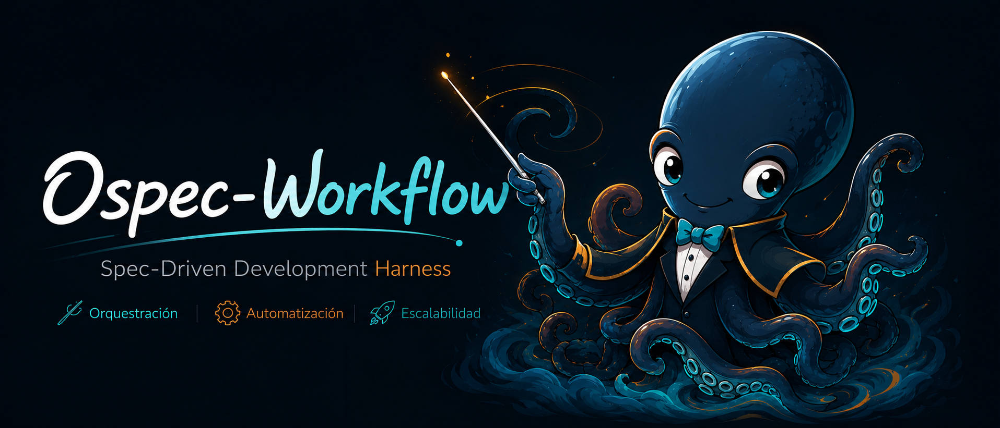

# ospec-workflow



> **🌐 English** · [Español](./README.es.md)

## 📖 Read this in Spanish / Leer en español

The primary documentation is in English. Spanish versions of the main guides:

| Document | Link |
| --- | --- |
| Full README | [README.es.md](./README.es.md) |
| Installation guide | [docs/plugin-installation.es.md](./docs/plugin-installation.es.md) |
| SDD methodology | [docs/sdd-metodologia.es.md](./docs/sdd-metodologia.es.md) |

Internal architecture and workflow references remain available in Spanish under [`docs/`](./docs/README.md).

---

> **Immediacy without a contract is false speed.** `ospec-workflow` is a turnkey Spec-Driven Development (SDD) harness. It uses **OpenSpec** as the single source of truth and provides an intelligent orchestrator that coordinates phase agents, enforcing Strict TDD, review-size control, and security gates active on every commit.

It is based on [Gentle-ai by Gentleman Programming](https://github.com/Gentleman-Programming/gentle-ai).

---

## SDD Philosophy: Design Before Building

In AI-assisted development, coding before understanding the problem generates technical debt and incoherent code. `ospec-workflow` imposes a discipline barrier:

1. **Contract First**: We define intent (`proposal`), observable behavior (`spec.md`), and architecture (`design.md`) before touching a single line of code.
2. **Evidence over Opinion**: The `/sdd-verify` phase requires actually executed tests and verifiable evidence levels, never assumptions.
3. **The Repository is the Memory**: All change state and design assumptions live in versionable files (`openspec/`), not in volatile chat history.
4. **Reviewer Protection**: We keep changes within a recommended budget of **400 lines**. If a change is larger, the orchestrator proposes chained-PR strategies to avoid reviewer fatigue.

---

## Quick Start in 3 Steps

### 1. Prepare Your Project Instructions
Copy the appropriate instructions template to the root of your target repository to establish the contract that the agent must **coordinate instead of implementing manually**:
- [`CLAUDE.md`](CLAUDE.md) → For **Claude Code** (copy it to your repo).
- [`AGENTS.md`](AGENTS.md) → **Agnostic** variant for VS Code, Copilot, or other editors.

### 2. Install the Plugin in Your Tool
Choose your target and run its automatic configurator:

| Environment / Target | Quick Install Command | What does it do? |
| :--- | :--- | :--- |
| **VS Code** | `npm run setup:vscode` | Builds to `dist/vscode` and adds it to `chat.pluginLocations`. |
| **Claude Code** | `npm run setup:claude` | Builds, validates strictly, and installs as a persistent plugin. |
| **Copilot CLI** | `npm run setup:copilot` | Builds and installs globally on your machine (`~/.copilot/`). |
| **opencode** | `npm run setup:opencode` | Builds and installs into the OpenCode folder (`~/.config/opencode/`). |
| **Codex CLI** | `npm run setup:codex` | Builds `dist/codex`, registers the marketplace, adds only missing global MCPs and copies `.codex/agents/*.toml`. |
| **Cursor** | `npm run setup:cursor` | Builds `dist/cursor`, syncs to `~/.cursor/`, configures MCPs and preserves hooks. |
| **Antigravity** | `npm run setup:antigravity` | Builds `dist/antigravity` and installs into `~/.gemini/config/` with a transactional manifest. |

### 3. Start an SDD Cycle
Once the plugin is loaded in your chat agent:
1. **Initialize the project**: Type `/sdd-init`. It will automatically detect your stack and test runner.
2. **Start a change**: Type `/sdd-new <change-name>` (e.g. `/sdd-new login-session-timeout`).
3. **Complete the flow**: Follow the sequence recommended by the orchestrator (`/sdd-continue` → `/sdd-apply` → `/sdd-verify` → `/sdd-archive`).

---

## Detailed Setup per Target

### 🛠️ VS Code (Direct Source Loading)
- **Option A (Direct source usage - no model routing)**:
  Add the root of this cloned repository to `chat.pluginLocations` in your `settings.json`.
- **Option B (Compiled build with model routing - Recommended)**:
  ```powershell
  npm run setup:vscode
  ```
  To update after making changes to the source:
  ```powershell
  npm run reload:vscode
  ```

### 🤖 Claude Code (Persistent Plugin and Marketplace)
- **For end users** (without cloning the repository):
  ```powershell
  claude plugin marketplace add https://github.com/snakeblack/ospec-workflow.git#release
  claude plugin install ospec-workflow@ospec-tools
  ```
- **For plugin development** (idempotent local installation):
  ```powershell
  npm run setup:claude
  ```
  *(Inside the Claude Code session, type `/reload-plugins` to apply changes).*
- **Fast rebuild during development**:
  ```powershell
  npm run reload:claude
  ```

### 💻 GitHub Copilot CLI (Global Loading)
- **Global Install (Recommended)**:
  ```powershell
  npm run setup:copilot
  ```
  *(This copies agents, instructions, and commands to `~/.copilot/` and merges the global `mcp-config.json` file).*
- **Local Install (For a specific project only)**:
  ```powershell
  npm run install:copilot -- ../my-project
  ```

### 🧬 opencode
- **Global Install (Recommended)**:
  ```powershell
  npm run setup:opencode
  ```
  *(The main agent is automatically renamed to `ospec-workflow` to make it easier to discover via autocomplete).*
- **Local Install**:
  ```powershell
  npm run install:opencode -- ../my-project
  ```

### 🧠 Codex CLI
- **Global Install (Recommended)**:
  ```powershell
  npm run setup:codex
  ```
  *(Builds `dist/codex`, syncs `AGENTS.md`, agents, skills and runtime into `~/.codex/`, merges native hooks into `~/.codex/hooks.json` and registers missing global MCPs.)*
- **Per-repository Local Install**:
  ```powershell
  npm run install:codex -- ../my-project
  ```
  *(Copies only `.codex/agents/*.toml` to the target repo and does not modify `.codex/config.toml`.)*

  By default the installer does not alter `.codex/config.toml`. If Codex rejects the exact legacy key `service_tier = "default"`, the repair is an explicit opt-in:
  ```powershell
  npm run setup:codex:repair
  ```
  The dedicated script is the recommended path on Windows PowerShell because it does not depend on npm flag forwarding. As a fallback you can run `node scripts/configure/install-codex.js --repair-config`; to preview without writing, use `node scripts/configure/install-codex.js --dry-run --repair-config`.

  The repair removes only that top-level assignment, keeps a single byte-for-byte backup and restores the original if the write, rename, or validation with Codex fails. Other incompatible keys remain intact and produce a diagnostic. It does not touch `auth.json`, other keys, or MCP entries; per-repository local installation never repairs global configuration.

### 🖱️ Cursor
- **Global Install**:
  ```powershell
  npm run setup:cursor
  ```
  *(Builds `dist/cursor`, syncs to `~/.cursor/`, translates `.mcp.json` and preserves user hooks in `hooks.json`.)*

### 🌌 Antigravity IDE
- **Global Install**:
  ```powershell
  npm run setup:antigravity
  ```
  *(Builds `dist/antigravity` with profiles and validation, deploying adapted skills, agents and hooks into `~/.gemini/config/` with a transactional manifest.)*
- **Fast rebuild during development**:
  ```powershell
  npm run reload:antigravity
  ```

See the [installation guide](docs/plugin-installation.md) for more details on native global installation and the hooks runtime.

## What's included

| Path | Purpose |
| --- | --- |
| `CLAUDE.md` / `AGENTS.md` | Project instruction templates (Claude Code and agnostic) that set the coordinator-not-executor contract. Copy them to your repo. |
| `.plugin.json` | **Canonical** manifest (VS Code/direct-load). Edit this one first. |
| `.claude-plugin/plugin.json` | Compatibility copy for Claude distribution; also the source read by the generator (`scripts/configure/cli.js`). It must mirror the canonical one — `scripts/manifest-sync.test.js` verifies this in CI. |
| `agents/` | Orchestrator and specialized agents per phase. |
| `commands/` | Visible commands and routing to the orchestrator. |
| `skills/` | On-demand capabilities and shared contracts. |
| `rules/` | Persistent SDD, OpenSpec and Strict TDD rules. |
| `hooks/` | Declarative definition of plugin lifecycle events. |
| `scripts/hooks/` | Hooks runtime (Node.js) and its tests. |
| `scripts/lib/` | Shared libraries: OpenSpec state, artifact-store and the generator core (`frontmatter`, `model-resolver`, `target-transform`, profiles). |
| `scripts/configure/` | Multi-target generator CLI (`cli.js`), per-profile validators and golden fixtures. |
| `models.yaml` | Tier→model tables per target for the generator. |
| `profiles/models/` | Optional model-routing profiles (direct use in VS Code). |
| `docs/` | Detailed architecture and usage documentation. |
| `.mcp.json` | Canonical MCP source. Codex does not bundle it: `setup:codex` translates its entries to the native CLI and avoids duplicates. |
| `openspec/` | Versionable source of truth for every SDD change. |

## SDD Commands

| Command | Usage |
| --- | --- |
| `/sdd-init` | Detects the project and prepares OpenSpec, testing and the skill registry. |
| `/sdd-baseline` | Seeds openspec/specs/ with baseline specs of existing behavior (brownfield repos, resumable batches). |
| `/sdd-workspace` | Manages multi-repo federation: atlas (`init`), cross-repo state (`status`), contract-based impact (`impact`). |
| `/sdd-new` | Starts a persisted change and selects the workflow. |
| `/sdd-lite` | Runs the reduced flow for small, low-risk changes. |
| `/sdd-ff` | Completes planning: proposal, specs, design and tasks. |
| `/sdd-continue` | Restores state from OpenSpec and resumes the next available phase. |
| `/sdd-explore` | Investigates an idea without implementing. |
| `/sdd-propose` | Defines intent, scope, risks and approach of the change. |
| `/sdd-spec` | Writes requirements and verifiable scenarios. |
| `/sdd-design` | Defines architecture, data flow and testing strategy. |
| `/sdd-tasks` | Breaks the change into implementable, reviewable units. |
| `/sdd-apply` | Implements tasks in reviewable batches. |
| `/sdd-verify` | Checks specs, design, tasks and test evidence. |
| `/sdd-archive` | Consolidates and archives a verified change. |
| `/sdd-onboard` | Walks through a real SDD cycle on the current repository. |

`sdd-foundation` builds the documentary base when the project is empty. Phase agents must not be invoked as an uncoordinated team: the orchestrator preserves order and contracts.

## Flows

The standard full cycle goes through every planning, implementation, and closing phase:

```text
propose → spec → design → tasks → apply → verify → archive
```

But not every change needs the full cycle. The orchestrator evaluates the routing table
(`openspec/config.yaml`) top-down and activates the **first matching route**.

### Canonical routes

| Route | Classification | When | Phases |
| --- | --- | --- | --- |
| **foundation** | normal, high-risk | Empty project, no stack or architecture | `sdd-foundation` |
| **federated** | normal, high-risk | Multi-repo workspace (`workspace-federated`) | `sdd-workspace` → propose → spec → design → tasks → apply → verify → archive |
| **bugfix** | small, normal | User states an explicit bugfix intent | `sdd-explore` → tasks → apply → verify → archive |
| **brownfield** | normal, high-risk | There is code but `openspec/specs/` is empty | `sdd-baseline` (in batches per domain) |
| **refactor** | small, normal | User states an explicit refactor intent | design → tasks → apply → verify → archive |
| **hotfix** | trivial, small | Explicit emergency patch | apply → verify → archive |
| **standard** | normal, high-risk | Active project (default route) | propose → spec → design → tasks → apply → verify → archive |
| **lite** | trivial, small | Small, low-risk change | propose → tasks → apply → verify → archive |

### Entry shortcuts

| Command | What it does |
| --- | --- |
| `/sdd-new` | Classifies the change, selects the route and starts the first phase. |
| `/sdd-ff` | Planning fast-forward: runs propose → spec → design → tasks without implementing. |
| `/sdd-lite` | Starts the lite route directly. |
| `/sdd-continue` | Restores state from `state.yaml` and resumes the next pending phase. |

### Gates

Some routes include gates that block progress until resolved:

- **clarify** — the orchestrator detects ambiguity and requests clarifications before continuing.
- **quality-review-gate** — after a successful `sdd-verify`, runs deterministic quality classification (Trust, Runtime, Evolution, Efficiency) and bounded review lineage. Legacy **`4r-review-gate`** applies only to in-flight `schema_version: 1` lineages.
- **impact** — in federated routes, evaluates cross-repo impact before implementing.
- **brownfield-advisory** — reports baseline status before executing.

### Batched implementation

`/sdd-apply` works in reviewable batches (it merges `apply-progress.md`). When a change exceeds the
~400-line budget, the orchestrator proposes chained PRs (`stacked-to-main` or
`feature-branch-chain`) or requires a conscious `size:exception`.

### Execution modes

| Mode | Behavior |
| --- | --- |
| **Interactive** (default) | Pauses between phases to review decisions. |
| **Automatic** | Chains phases without pausing, but never bypasses risk, architecture, testing, or review-load gates. |

Full detail in [docs/sdd-workflows.md](docs/sdd-workflows.md).

## Runtime and continuity

Hooks offload repetitive lifecycle-cycle tasks from the prompt and enforce security and control policies:

| Event | Responsibility |
| --- | --- |
| `SessionStart` | Validates OpenSpec, refreshes the compact skill cache and runs **AgentShield** security scans (alerts for exposed `.env` files or credentials in `.git/config`). |
| `PreToolUse` | Blocks or asks for confirmation for dangerous commands, evaluates **Token Budget Advisor** limits (limit of 50k tokens per file, 150k accumulated tokens per session) and implements **AgentShield** (blocking of SSH keys, `.npmrc`, `.git/config`, and interactive prompts for secrets). |
| `PreCompact` | Persists a recoverable summary before compacting context. |
| `SubagentStop` | Detects degradation in skill resolution. |
| `Stop` | Records minimal session continuity. |

### Bypass Environment Variables (Harness Gates)

You can temporarily skip the various security checks, budgets, and validators using the following environment variables:

- `DISABLE_AGENT_SHIELD=true`: Disables AgentShield scanning and blocking/prompting of sensitive files and credentials.
- `DISABLE_TOKEN_ADVISOR=true`: Disables the estimated token-size check on file reads during the session (Token Budget Advisor).
- `DISABLE_OSPEC_PRECOMMIT=true`: Disables local workspace-validation and Strict TDD enforcement in the Git pre-commit hook.

Hooks run native code (Node.js or optimized Go executables). `.ospec/cache` and `.ospec/session` are auxiliary; **OpenSpec remains the source of truth**.

## Model routing

Agents do not hardcode concrete model names. By default they inherit the selected model and can use local profiles:

- `default`: single-model fallback;
- `cheap`: reduces cost during exploration and proposal;
- `premium`: increases reasoning during design and verification.

Profiles live in `profiles/models/`. See [model-routing.md](docs/model-routing.md).

## Multi-target compatibility

The canonical origin is in VS Code format and is loaded directly, without transformation.
For other targets, a pure generator (`scripts/configure/cli.js`) produces a native, validated tree
in `dist/<target>/` without touching the origin:

| Target | Output |
| --- | --- |
| `vscode` | Canonical identity: VS Code loads the repository as-is, without generating `dist/`. |
| `claude` | `.claude-plugin` tree: renames files, restructures manifest and hooks, substitutes tools (context-aware), rewrites command variables, incorporates `rules/` and emits the orchestrator as a **skill**. Gate: `claude plugin validate --strict` 0/0. |
| `github-copilot` | `.github/` layout: agents to `.github/agents/*.agent.md` (`target: github-copilot`, `vscode/askQuestions`→`ask_user`), commands to `.github/prompts/*.prompt.md`, rules to `.github/instructions/*.instructions.md` (`applyTo: "**"`), hooks to `.github/hooks/hooks.json` (Copilot schema) and `.mcp.json` as-is. Validated by `scripts/configure/validate-github-copilot.js` inside the profile flow. |
| `opencode` | `.opencode/` layout + `opencode.json`: agents to `.opencode/agents/*.md` (`mode: primary\|subagent`, `tools:` as a **map**, model `provider/model`), commands to `.opencode/commands/*.md` (keeps `agent:`, args `$1`/`$ARGUMENTS`), rules to `.opencode/instructions/*.md` referenced via `instructions` in `opencode.json`, MCP folded into `opencode.json` (`mcp` with `type: local\|remote`) and, since opencode has no shell hooks, the runtime is bridged with a JS plugin in `.opencode/plugins/ospec.js`. Validated by `scripts/configure/validate-opencode.js`. |
| `codex` | `.codex-plugin/` layout + `.codex/agents/*.toml`, without `.mcp.json` in the bundle: the plugin and agents are installed separately; `setup:codex` registers missing global MCPs with valid IDs and deduplication by identity. The generator rejects `.codex/config.toml`, `.mcp.json` and `mcpServers` inside the payload. Validated by `scripts/configure/validate-codex.js`. |

```powershell
node scripts/configure/cli.js --target claude          --out dist/claude
node scripts/configure/cli.js --target codex           --out dist/codex
node scripts/configure/cli.js --target github-copilot  --out dist/github-copilot
node scripts/configure/cli.js --target opencode        --out dist/opencode
```

The transform is pure and tested under Strict TDD; the CLI is the IO layer with a
validation gate per target (golden fixtures, `claude plugin validate` for `claude` and Node validators for GitHub Copilot and opencode). Model selection is abstracted into tiers (`models.yaml`). Each generated tree is **self-contained**: the generator
follows `require`s from the hooks and includes their runtime (`scripts/hooks/` + their dependencies from
`scripts/lib/`), without tests or the generator itself. See [model-routing.md](docs/model-routing.md)
and the [installation guide](docs/plugin-installation.md).

## MCP

The default configuration is kept deliberately small:

- Context7 for up-to-date library documentation;
- MarkItDown for document conversion.

Additional servers must be activated explicitly. See [mcp-policy.md](docs/mcp-policy.md).

## Workflow guarantees

- Strict TDD when the project has a compatible runner.
- Artifacts and progress recoverable from `openspec/changes/{change-name}/`.
- Blocking approvals persisted in `state.yaml`, never inferred from chat history.
- Dynamic delimited prompts to separate intent, artifacts, standards, and approval context.
- Skills resolved as compact rules to control the token budget.
- Changes organized into reviewable units, with guards when load exceeds the recommended budget.

## Documentation

| Document | Content |
| --- | --- |
| [docs/README.md](docs/README.md) | Index and recommended reading path. |
| [docs/sdd-metodologia.md](docs/sdd-metodologia.md) | Principles and mental model. |
| [docs/sdd-fases.md](docs/sdd-fases.md) | Contracts of each phase. |
| [docs/sdd-workflows.md](docs/sdd-workflows.md) | Work lines: standard, lite, fast-forward, foundation, brownfield baseline, continuation, workspace and onboarding. |
| [docs/openspec.md](docs/openspec.md) | Persistence, delta specs and archiving. |
| [docs/tdd-y-revision.md](docs/tdd-y-revision.md) | Strict TDD and review budget. |
| [docs/harness-runtime.md](docs/harness-runtime.md) | Hooks runtime architecture. |
| [docs/model-routing.md](docs/model-routing.md) | Model tiers and format per target (`models.yaml`). |
| [docs/mcp-policy.md](docs/mcp-policy.md) | MCP policy and server configuration. |
| [docs/plugin-installation.md](docs/plugin-installation.md) | Installation, generation per target, trust and diagnostics. |

Spanish versions of the main guides are listed in the language section at the top of this file.

## Validation

A single command covers local and CI verification of the hooks runtime, multi-target generator,
profile validators and expected artifacts:

```powershell
node scripts/check.js
```

CI runs the same gate in `.github/workflows/validate-harness.yml` with Node 22 and a multi-OS matrix.

Before publishing changes to the manifest, hooks, MCP, or the generator, explicitly review the new
execution and trust surface.
