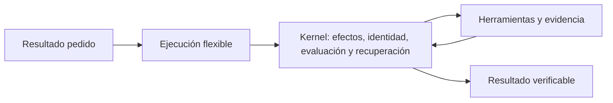
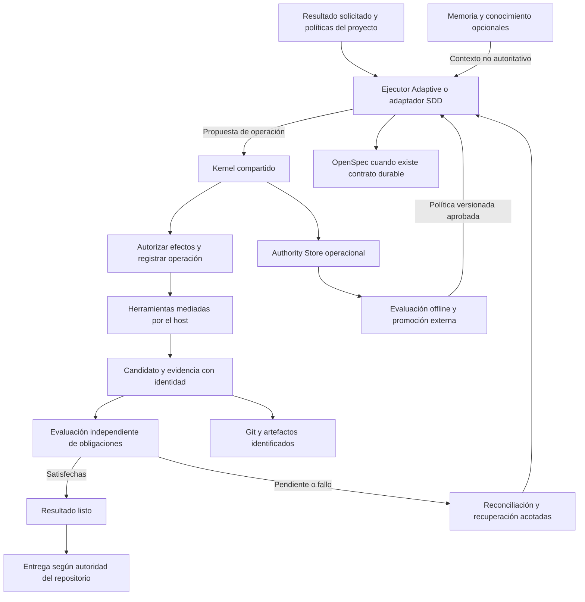
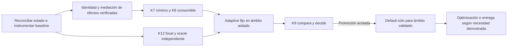

# OSPEC Adaptive: revisión crítica y arquitectura propuesta

> **Fuente canónica:** este documento es la única fuente de verdad para las decisiones arquitectónicas, guardrails y dirección del roadmap de OSPEC Adaptive. `docs/roadmaps/harness-evolution.md` es su proyección operativa de backlog y estados; `docs/architecture/harness-evolution.md` conserva la referencia del kernel existente. Ninguno de esos documentos puede introducir una decisión conceptual nueva sin reconciliarla aquí.

Estado: revisión documental completada; cinco checkpoints persistidos. Fecha: 2026-09-19.
Base declarada para contrastar: v2.68.0, commit 56912ee5f86d90f4e7798ed61c10e8559e760397.

## Siguiente change del roadmap

El siguiente change nuevo y explícito es **`adaptive-operation-identity-binding`**. PP2 y CX1 están archivados; su auditoría de consumidores y reconciliación forman el preflight, no una nueva implementación. El change siguiente debe convertir el primer slice recomendado en un contrato comprobable: vincular cada operación a `changePath`, `phase`, `expectedRevision` y `operation`, conservar fallback legacy y reconciliar resultados desconocidos. CX2 queda como lane mecánica de vistas derivadas, posterior o paralela solo cuando tenga un consumidor concreto; no adelanta el runtime Adaptive ni sustituye el binding de identidad.

## Veredicto provisional

La dirección es razonable: separar libertad de ejecución y garantías compartidas permite reducir ceremonia sin eliminar autoridad. No está demostrado que Adaptive sea superior al flujo actual o a Gentle AI; presentarlo como predeterminado antes de medirlo sería prematuro.

La mejora principal debe ser reducir las decisiones y representaciones que el usuario y el agente deben mantener. Convertir cada fase SDD en una nueva capability con su propia máquina de estados reproduciría el problema. Propongo cuatro responsabilidades del kernel: autorizar efectos; vincular candidato y evidencia; evaluar obligaciones con cobertura independiente; reconciliar operaciones acotadas.

La admisión únicamente antes del primer write es insuficiente. Una herramienta de exploración puede ejecutar scripts, contactar servicios o alterar un entorno. La frontera debe cubrir cada efecto material y las ampliaciones de alcance, con mediación efectiva del host. Ningún reducer determinista demuestra por sí mismo que el clasificador semántico haya descubierto todas las obligaciones.

Puede haber cero documentos semánticos para una tarea pequeña, pero no cero registro operacional cuando hay efectos que requieren reconciliación. Git conserva contenido; OpenSpec conserva intención, contratos y decisiones cuando se materializan; Authority Store conserva verdad operacional. Una memoria opcional no concede permisos ni demuestra hechos actuales.

## Evidencia inicialmente pendiente (resuelta en checkpoints 3–4)

- Contrastar qué partes K1–K12 están implementadas frente a diseñadas o proyectadas.
- Verificar fuentes primarias de Gentle AI, Engram y Dream-RSI, incluidas sus limitaciones.
- Resolver dependencias del roadmap y criterios medibles de promoción.
- Completar arquitectura, evaluación adversarial, respuestas a las veinte preguntas y clasificación de iniciativas.

## Registro de checkpoints

1. 2026-09-19: guardado inicial con veredicto condicionado, cuatro responsabilidades y fallos críticos. Este documento es recuperable aunque la sesión se interrumpa; todavía no es una evaluación terminada.

## A. Dirección: conservar el objetivo, corregir la frontera

La propuesta acierta al hacer opcional la ceremonia visible y mantener invariantes compartidos. Su novedad respecto a la arquitectura declarada de OSPEC parece menor de lo que su extensión sugiere: el valor pendiente está en convertir esos principios en una entrada cotidiana sencilla y medible, y en quitar autoridad a las fases sin perder contratos. Esta es una hipótesis de producto y una migración de integración, no una razón para inventar otro kernel.

Rechazaría cuatro premisas: que explorar sea inherentemente inocuo; que un manifiesto seleccionado por el ejecutor pruebe cobertura suficiente; que replay estime resultados de acciones nunca ejecutadas; y que el instalador deba recomendar Adaptive antes de validar un ámbito concreto. También rechazaría prometer una reducción del 50 % de complejidad sin definir primero qué se cuenta.

«El modelo decide cómo trabajar» necesita un límite: decide entre acciones permitidas, presupuestos disponibles y requisitos de coordinación. «OSPEC decide qué no puede quedar sin demostrar» necesita otro: OSPEC puede exigir evidencia de obligaciones conocidas, pero no garantizar que su interpretación semántica del encargo sea completa. La propuesta debe ofrecer assurance trazable y falible, no una apariencia de demostración universal.

## B. Arquitectura objetivo

La vista principal cabe en cinco responsabilidades de producto; memoria, evaluación offline y documentación son conexiones opcionales, no pasos que el usuario deba operar.

El siguiente desglose muestra las fronteras internas, sin añadir productos o lifecycles:

Las cajas son responsabilidades, no servicios nuevos ni una secuencia obligatoria de llamadas al modelo. Una operación local simple puede atravesarlas en una única invocación del runtime. La revisión humana o especializada es un productor de evidencia dentro de evaluación; no exige otra capa permanente. La entrega administrada vuelve a validar identidad, alcance y autorización antes del efecto externo.

La autoridad se particiona por pregunta. Git responde qué contenido existe. OpenSpec responde qué intención, contrato y decisiones durables se aceptaron. Authority Store responde qué operación fue admitida, intentada, observada y reconciliada. Ninguno reemplaza automáticamente a los demás. Una vista derivada puede reunirlos, pero nunca resolver conflictos creando una cuarta copia canónica.

## C. Kernel mínimo estable

| Responsabilidad | Invariante que debe sobrevivir | Reutilización y límite |
|---|---|---|
| Autorizar efectos | Cada efecto material cae dentro del alcance, política y permiso vigentes | K1/K2/K2.1; no una máquina Mutation Admission paralela |
| Vincular candidato y evidencia | Cada afirmación identifica exactamente contenido, entorno relevante y productor | Candidate y contratos existentes; un resultado de otro candidato no autoriza éste |
| Evaluar obligaciones | La decisión usa obligaciones aplicables y evidencia válida; no se acepta cobertura autodeclarada como garantía | Manifiesto, verifier y autoridad de review; cobertura semántica sigue siendo falible |
| Reconciliar operaciones | Un resultado desconocido no se repite a ciegas; intentos y presupuestos no se reinician | Lifecycle, CAS, permisos, recuperación tipada y lineage existentes |

Este mínimo es lógico, no un plan para comprimir todo en cuatro archivos. CAS no elimina carreras con sistemas externos: hacen falta claves idempotentes o comprobación del efecto realmente producido. Una identidad Candidate exacta no implica capturar cada byte del universo: el contrato debe declarar entradas y entorno relevantes, y rechazar confianza donde no puede observarlos.

La mediación debe ser completa dentro del ámbito que se anuncie. Si el agente tiene shell, extensiones o conectores que el runtime no controla, OSPEC no puede afirmar enforcement universal. El host debe declarar capacidades observadas y límites: enforcement de efectos concretos, comprobación posterior o simple recomendación. Un prompt que pide respetar un permiso no equivale a un permiso impuesto.

La frontera propuesta es **admisión de efectos**, aplicada antes de cada operación material y ante ampliaciones de alcance. Una autorización de alcance puede cubrir un conjunto acotado de ediciones; cada OperationPermit concreto sigue siendo de consumo único, ligado a operación, identidad, recursos, límites y vigencia. Esto no exige preguntar al humano por cada línea. Las lecturas autenticadas, instalaciones, tests con hooks, consultas que revelan datos y accesos de red pueden tener efectos. El nombre de la herramienta no prueba su inocuidad.

## D. Ejecución adaptativa y obligaciones independientes

El modelo elige exploración, orden del trabajo, estrategias de diagnóstico, agrupación de cambios y conveniencia de delegar. Puede proponer documentación, tests, revisión y recuperación. El kernel valida operaciones y decisiones; no sustituye el razonamiento del agente ni impone una fase por cada responsabilidad.

El ciclo práctico es: comprender lo suficiente para proponer una acción; admitir sus efectos; ejecutarla; contrastar observaciones con alcance y obligaciones; cerrar o continuar. Una nueva frontera de seguridad, migración o contrato público amplía obligaciones antes de la siguiente acción afectada. Las obligaciones no se eliminan porque la tarea se haya vuelto incómoda; su descarga requiere razón y evidencia versionadas.

El punto más peligroso es el denominador. Si el agente propone tres obligaciones y satisface las tres, «100 % de cobertura» solo significa tres de tres obligaciones propuestas. Para evaluar omisiones se necesita una referencia independiente: contratos existentes, políticas mecánicas, análisis del diff y pruebas seleccionadas por un evaluador que no dependa exclusivamente del resumen del ejecutor. En benchmarks se necesita un oracle o adjudicación independiente que pueda detectar obligaciones omitidas. Independencia de proceso y permisos reduce conflictos; usar otro agente del mismo modelo no elimina errores correlacionados.

La revisión puede ser vacía solo cuando queda registrado cómo se descargó el residual aplicable y qué política/evidencia lo justifica. «No seleccioné ninguna lens» no demuestra ausencia de riesgo. Tampoco hace falta un generalista fijo que vuelva a leer todo: seleccionar con evidencia y conservar límites de lineage evita tanto fan-out inútil como limpieza ficticia.

## E. Estructura progresiva y durabilidad

No modelaría Contract → Spec → Design → Tasks → Graph como escalera. Son documentos y proyecciones con consumidores distintos, no niveles crecientes de madurez. Un cambio puede necesitar una decisión arquitectónica sin tareas separadas; otro, una partición de trabajo sin nueva especificación.

| Estructura | Motivo concreto para materializarla | Qué evita |
|---|---|---|
| Intención/aceptación compacta | Una decisión material debe sobrevivir a la sesión o compartirse | Reinterpretar alcance o aprobación al reanudar |
| Spec | Hay comportamiento durable, contrato público o coordinación basada en requisitos | Que tests o implementación redefinan silenciosamente lo pedido |
| Design/ADR | Hay una decisión no obvia, alternativas o consecuencias futuras | Redescubrir una decisión costosa |
| Tasks | Existen varios actores, dependencias o checkpoints útiles | Confundir progreso narrativo con trabajo pendiente |
| Execution Graph | La coordinación, invalidación o recuperación necesita topología real | Introducir un grafo decorativo para una tarea lineal |
| Review | Queda incertidumbre material que los checks disponibles no descargan | Sustituir juicio por una casilla verde |
| Archivo | Existe un cambio OpenSpec durable que debe cerrarse | Fabricar un lifecycle documental para cada edición |

Antes del primer efecto material debe existir el registro operacional mínimo necesario para recuperar su identidad y estado. Este registro no tiene por qué ser un documento semántico visible ni duplicar un event log existente. La retención, privacidad y limpieza se definen por política; la recuperación no depende de recordar una conversación perdida.

Persistir documentación semántica es una decisión distinta: se hace antes de perder una decisión necesaria para autorizar, coordinar o recuperar. «Cambio pequeño» no exime de journal si produce un efecto externo; «muchos archivos» no obliga por sí mismo a cuatro documentos. Aprovechar el contrato compacto existente es preferible a crear un nuevo objeto universal Work que duplique Candidate, WorkOrder, manifiesto y estado.

## F. Lugar exacto del SDD

Structured SDD sigue siendo una interfaz explícita de planificación, documentación y coordinación. Su adaptador satisface contratos compartidos mediante proposal/spec/design/tasks y conserva las garantías de continuidad ya existentes. Adaptive satisface esos contratos mediante la representación mínima suficiente. El riesgo incrementa obligaciones; la elección documental depende de política, coordinación o preferencia explícita.

El adaptador SDD no debe inventar fases completadas para que Adaptive pase por validadores antiguos. Tampoco debe transformar un cambio SDD ya activo en Adaptive durante una reanudación. Ruta y decisiones persistidas conservan su significado hasta un cierre o migración explícita. Si una organización exige especificación durable, Adaptive debe satisfacer esa exigencia: «opcional» se refiere al producto general, no a poder ignorar una política vinculante.

La migración correcta extrae contratos reutilizables y vuelve las vistas de fase proyecciones de los hechos correspondientes, conservando qué hechos realmente ocurrieron. La compatibilidad debe demostrarse con continuaciones existentes, no con un happy path recién creado.

## Registro de checkpoints: actualización 2

2026-09-19: arquitectura, kernel, ejecución, estructura progresiva y relación con SDD persistidos. Se descarta una escalera de documentos y una frontera limitada al primer write. Pendientes integración de evidencia local/externa, evaluación estadística y roadmap final.

## Evidencia contrastada: diseño escrito no equivale a implementación

La inspección focal del repositorio distingue tres estados que el briefing mezcla a veces. K1–K6d aparecen entregados, con remediaciones posteriores; K7 es la siguiente pieza elegible, y K8/K9/entrega administrada siguen pendientes. Que ya exista review-lineage no prueba que la integración autoritativa K7 propuesta esté completa. Esta revisión es documental y estática: no es una certificación de seguridad ni una ejecución de tests.

Hay además deuda de reconciliación del roadmap: PP2 y CX1 figuran como futuros en [el roadmap](../roadmaps/harness-evolution.md), pero existen cambios archivados de septiembre que implementan contratos compactos y proyección mecánica. [PP2 archivado](../../openspec/changes/archive/2026-09-11-compact-lite-contract-and-consumer-compatibility/state.yaml) conserva cinco fases: no implementa por ello ejecución Adaptive libre. [CX1 archivado](../../openspec/changes/archive/2026-09-11-phase-envelope-state-mechanical-projection/state.yaml) y sus remediaciones requieren revisar qué falta realmente antes de construir otro estado canónico.

El [PhaseCompletionReducer](../../scripts/lib/lifecycle-kernel/phase-completion-reducer.js) ya ofrece reducción pura, replay y preservación de aprobaciones. [Permits](../../scripts/lib/lifecycle-kernel/permits.js), [lifecycle-kernel](../../scripts/lib/lifecycle-kernel/index.js) y [Authority Store](../../scripts/lib/authority-store/index.js) contienen enforcement concreto de permisos y CAS. Pero [ospec-state](../../scripts/lib/ospec-state.js) mantiene una vía de proyección con lock, backup y escritura atómica, sin que ello demuestre mediación universal por OperationPermit. Esto no identifica por sí solo una vulnerabilidad: obliga a delimitar la afirmación de enforcement y su integración.

El adaptador de herramientas y los perfiles declarativos del host tampoco prueban confinamiento de todas las superficies. La arquitectura propuesta debe reutilizar mecanismos existentes y comprobar cobertura operacional real. Los documentos [harness-evolution](harness-evolution.md) y [harness-proportionality](harness-proportionality.md) ya contienen ejecución intercambiable, proporcionalidad y durabilidad JIT: la aportación de este informe es corregir fronteras y convertirlas en una migración verificable.

## G. Engram: recuperación de conocimiento, sin autoridad adicional

Engram documenta almacenamiento local con SQLite/FTS5 e interfaces MCP, HTTP y CLI. Su actualización por topic_key y sus resúmenes son útiles para recuperar contexto; la arquitectura admite actualizar contenido conservando un contador de revisiones. Eso no equivale a un journal inmutable de decisiones o permisos. Fuentes: [README fijado a commit](https://github.com/Gentleman-Programming/engram/blob/c1536ad96d4581abff08092b4906c81fe0b0f056/README.md) y [arquitectura](https://github.com/Gentleman-Programming/engram/blob/c1536ad96d4581abff08092b4906c81fe0b0f056/docs/ARCHITECTURE.md).

Integraría un adaptador opcional y prescindible: consultas limitadas por repositorio y tema, resultados etiquetados como observaciones no confiables, referencia a origen/revisión y contraste con archivos actuales antes de tomar decisiones materiales. No bloquearía tareas porque la memoria esté caída. Tampoco sincronizaría secretos o payloads completos de herramientas por defecto; retención y exportación necesitan límites explícitos.

| Dato | Autoridad propuesta | Uso permitido de memoria |
|---|---|---|
| Contenido fuente actual | Git/worktree identificado | Sugerir dónde buscar |
| Intención o aprobación durable | Ledger OpenSpec aplicable | Enlazar al registro, nunca sustituirlo |
| Permiso, operación y resultado desconocido | Authority Store | Ayudar a localizar la operación |
| Candidate y evidencia aceptada | Contrato e identidad registrados por runtime | Explicar antecedentes |
| Patrón, descubrimiento o hipótesis | Fuente vigente que lo sustente | Recuperar contexto falible |

Memory poisoning incluye instrucciones maliciosas persistidas, conclusiones obsoletas, mezcla de repositorios y resúmenes falsamente seguros. Delimitar el texto reduce confusión, pero la defensa decisiva es impedir que ese contenido altere permisos, evaluadores, políticas o aprobaciones. No se ha verificado una defensa semántica completa en Engram; no debe atribuírsela sin evidencia. Si una observación contradice estado canónico, se conserva como conflicto investigable, no como verdad más reciente por estar mejor redactada.

## H. Dream-RSI: laboratorio posterior, con límites causales

El trabajo existe como [Dream-RSI: Recursive Self-Improvement through Evolving Worlds, v1](https://arxiv.org/abs/2609.14858v1), publicado el 14 de septiembre de 2026. La [sección 3 del artículo](https://arxiv.org/html/2609.14858v1) describe replay que revela hijos registrados y mantiene fijo el agente subyacente mientras cambia la política de exploración. Sus dominios experimentales no demuestran transferencia a mantenimiento general de software.

Hay que separar reproducción de eventos, simulación contrafactual y ejecución nueva. Un historial puede demostrar qué sucedió y evaluar selección entre ramas ya registradas. No dice qué patch habría producido otro prompt, otra delegación o una rama nunca ejecutada. Una garantía sobre score en historia fija no es una garantía de generalización online. No utilizaría replay para afirmar que omitir una revisión habría mantenido la calidad cuando no se observó ese mundo.

K12 debe derivar una proyección de eventos, WorkOrders, candidatos, evidencia, costes y recuperación existentes. No crearía un Discovery Graph autoritativo. Si hace falta representar parentesco de ramas, añadiría a la proyección el mínimo identificador causal que no exista, indicando observaciones ausentes. Un dataset derivado versionado puede ser necesario para evaluar; no concede autoridad operacional.

Primero se compara una política Adaptive fija. Solo tras demostrar valor se abre optimización offline de orden de exploración, búsqueda de contexto, selección entre acciones permitidas, delegación y parada. Se prohíbe modificar evaluator, obligaciones de referencia, permisos de herramientas, políticas protegidas, límites humanos, holdout o presupuestos creando ramas/sucesores artificiales. Los presupuestos agregan descendientes; la política no obtiene más intentos cambiando de nombre.

Cada época congela política de assurance y configuración del evaluador. El optimizador ve entrenamiento; el holdout lo opera un proceso separado. Una revisión independiente de política, pruebas adversariales, ejecuciones nuevas aisladas, canary acotado y rollback preceden a promoción. Cambiar modelo, prompt relevante, herramientas o entorno invalida las comparaciones causales que dependan de ellos; no se reutiliza un hijo histórico como si hubiera sido producido bajo la nueva configuración.

## Evaluación mínima útil: K12 focal antes de K9

El primer experimento debe responder si una política Adaptive fija reduce fricción sin degradar resultados bajo obligaciones comunes. La instrumentación y un corpus focal preceden a la promoción; no aparecen después de K9. Shadow es útil para comparar selección de obligaciones y decisiones de admisión, pero no mide defectos evitados, coste real de implementación o éxito de recuperación de acciones no ejecutadas. Para esas afirmaciones hacen falta ejecuciones emparejadas en entornos aislados.

Un piloto de 20–30 tareas independientes con tres repeticiones por política sirve para encontrar defectos de diseño y estimar varianza. No basta para demostrar seguridad ni superioridad. Estratificaría por tarea local reversible, reparación de comportamiento, múltiples módulos y escenarios adversariales; mantendría migraciones y efectos externos fuera del primer ámbito promovido. Emparejar tarea, snapshot, modelo, esfuerzo, host y evaluator; aleatorizar orden; separar cachés y worktrees; contar abandonos, timeouts y bloqueos.

| Dimensión | Medida que evita una conclusión engañosa |
|---|---|
| Calidad | Aceptación externa y defectos escapados; no solo tests escritos por el ejecutor |
| Cobertura | Obligaciones omitidas frente a referencia independiente |
| Autoridad | Efectos fuera de permiso, intento de bypass, revocación y comportamiento ante desconocidos |
| Coste | Tokens, llamadas, tiempo y trabajo humano por tarea aceptada, incluyendo fallos |
| Ceremonia | Interrupciones, artefactos semánticos, handoffs y lecturas repetidas por ejecución |
| Varianza | Dispersión por tarea y tasas de fracaso; no ocultar colas con la media |
| Recovery | Recuperación correcta tras fallos inyectados y límites de reintentos respetados |
| Complejidad | Esquemas, autoridades, reglas normativas duplicadas y overrides añadidos/eliminados |

Las repeticiones de una tarea están correlacionadas. Los intervalos deben agrupar por tarea, y la generalización debe probarse con repositorios o familias de tareas reservados; no tratar noventa ejecuciones de treinta tareas como noventa problemas independientes. Con cero fallos en 300 observaciones iid, el límite superior unilateral aproximado del 95 % es 1 %: ni siquiera eso demostraría ausencia de fallos. La dependencia y la distribución elegida pueden invalidar esa interpretación. Para fallos raros de autoridad, usar además escenarios adversariales y fault injection, no esperar a encontrarlos al azar.

Antes de ejecutar el experimento deben fijarse márgenes de no inferioridad de calidad, mejora práctica esperada de coste/ceremonia y fallos que vetan promoción. No inventaría ahora porcentajes aceptables: requieren baseline y decisión de producto. Publicar numeradores, denominadores, intervalos, cohortes excluidas y versiones. Un holdout consultado repetidamente deja de ser reservado; rotarlo y registrar exposición. La promoción es por ámbito y combinación de capacidades, con caducidad/revalidación, no una etiqueta global «modelo capaz».

## Registro de checkpoints: actualización 3

2026-09-19: evidencia local y fuentes externas integradas; memoria, replay y protocolo de evaluación persistidos. Se corrige el estado PP2/CX1 y se distingue código presente de autoridad integrada pendiente. El roadmap, los casos operativos y las respuestas rápidas quedan cerrados en los checkpoints siguientes.

## I. Roadmap corregido desde v2.68.0

La primera entrega debe reconciliar realidad y roadmap, no iniciar una segunda implementación de PP2/CX1. El orden propuesto conserva hitos existentes y divide evaluación de promoción:

| Pieza | Decisión | Resultado concreto |
|---|---|---|
| K1–K6d | KEEP + integración focal | Conservar invariantes y remediaciones; medir cobertura real de entradas |
| K7 | KEEP mínimo | Integrar autoridad de review sin generalista ni fan-out obligatorios |
| K8 | KEEP | Atacar un consumidor real: evaluación comparable ligada al candidato; evitar attestation decorativa |
| K9 | KEEP | Promoción externa por ámbito; depende de baseline y evaluación, no de intuición |
| K12 | PRIORITIZE focal | Instrumentación y corpus adversarial pequeño desde el inicio; ampliar según incertidumbre |
| PP2 | RECONCILE + RESCOPE | Reutilizar contrato compacto entregado; evaluar delta Adaptive conservando compatibilidad |
| CX1 | RECONCILE + MERGE | Aprovechar proyección/reducer existentes; no duplicar estado ni fingir fases |
| CX2 | KEEP condicionado | Vistas y trazabilidad derivadas con consumidor; archive solo donde existe cambio durable |
| CX3 | DEFER | No crear subsistema ContextProjection antes de demostrar coste de contexto |
| CX4 | RESCOPE | Bootstrap pequeño protegido y referencias JIT; distinguir seguridad de conocimiento |
| CX5a/CX5b | MERGE condicionado | Integrar responsabilidades útiles en contratos existentes; no borrar sin mapear consumidores |
| CX6 | DEFER | Exigir evidencia de necesidad y dependencia concreta |
| K10 recipes | RESCOPE | Conjuntos composicionales de obligaciones, no rutas encubiertas |
| K10 delivery | KEEP opcional | Autoridad exacta de entrega donde hay mediación comprobada; no prerequisite del piloto local |
| K11a/K11b | DEFER | Multi-target/routing tras evidencia; fijar versiones para comparar |
| K11c | DEFER producto general | Reutilizar aislamiento mínimo para experimentos, sin construir scheduler universal |
| K11d roles fijos | DELETE como objetivo | Los roles solo sobreviven por independencia o coordinación demostradas |
| R2/Foundation | RESCOPE | Bootstrap obligatorio mínimo; conocimiento durable a demanda |
| R4 federation / Change Program | DEFER | Esperar consumidores reales y límites operativos probados |
| Discovery Graph nuevo | DELETE de esta propuesta | Derivar historia causal de datos existentes |
| Aprendizaje Dream-RSI | DEFER experimental | Primero demostrar política fija y evaluador resistente |

Direct/Repair/Bounded/Planned/Critical mezclan dimensiones: reparación es tipo de tarea, planificación es coordinación y critical es riesgo. No son un enum coherente. Conservaría identificadores existentes para compatibilidad/telemetría, mapeándolos a conjuntos versionados: reproducción/regresión; contrato público; efectos irreversibles; coordinación; revisión residual. La composición suma requisitos y resuelve conflictos explícitamente; no permite que un perfil barato anule un requisito fuerte.

**Primer slice recomendado:** vincular explícitamente cada productor a changePath, revisión esperada y operación, y medir el flujo actual. La inspección de [subagent-stop](../../scripts/hooks/subagent-stop.js) encuentra un hook que puede inferir fase por nombre del agente y elegir el primer cambio activo; ese mecanismo no basta para atribuir trabajo Adaptive concurrente. Los contratos de [result-envelope](../../scripts/lib/result-envelope.js) y [sdd-verify](../../skills/sdd-verify/SKILL.md) obligan además a distinguir `status: success` de un envelope —la ejecución de la fase terminó— de `verify_outcome: FAIL` —la verificación falló—. Ni el hook ni una vista pueden promover el primero a éxito funcional.

Como alternativa de menor impacto, una única vista compacta derivada puede alimentar apply de lite manteniendo sus documentos y fases canónicos. Permite medir contexto y recuperación, pero no prueba autonomía Adaptive ni justifica un subsistema CX3. Recomiendo primero identidad explícita porque evita medir un piloto sobre atribución ambigua. La convención lite y [validate-phase](../../scripts/configure/validate-phase.js) actuales exigen artefactos físicos: suprimirlos requiere un contrato de integración, no cambiar una instrucción del prompt.

Las decisiones sobre CX5a/CX5b son propuestas condicionadas: esta inspección no ha validado todos sus consumidores ni autoriza una eliminación concreta.

Cada slice necesita consumidor, criterios de aceptación y rollback propios. La configuración ausente conserva comportamiento legado. Las tareas activas fijan política y versión; una actualización del instalador no cambia silenciosamente su ruta. El primer default Adaptive debe cubrir solo tareas reversibles en hosts medidos; lo demás conserva el flujo previo o solicita una decisión pertinente.

## Tres casos que ejercitan la propuesta

1. **Renombre cosmético local.** Alcance entendido, permiso acotado a archivos, journal operacional y comprobación proporcional. No requiere proposal/spec/design ni revisión especializada si la política descarga explícitamente su residual. Si el rename altera imports o comportamiento, deja de ser cosmético y se actualizan obligaciones.
2. **Bug de comportamiento.** Se recupera el contrato vigente, reproduce el fallo y prueba la corrección con evidencia ligada al candidato. Una nota compacta basta si hay continuidad que preservar. Ni un test que replica la implementación ni un receipt de su ejecución prueban por sí solos que el oracle sea correcto.
3. **Autenticación descubierta tarde y crash.** La nueva frontera invalida la autorización de acciones afectadas; se registra contrato necesario, se amplían obligaciones y se pide decisión solo cuando la política o el alcance lo exigen. Trabajo independiente puede continuar si se demuestra que no depende de esa frontera. Si el crash ocurre entre intención, efecto y receipt, el estado queda desconocido: inspeccionar/reconciliar antes de reintentar. Un proveedor sin idempotencia no permite prometer exactamente una ejecución del efecto externo.

Una revocación o corrección de alcance del usuario sigue el lifecycle existente: invalida permisos afectados antes de nuevos efectos. Bootstrap y políticas protegidas no pueden modificarse con el mismo grant que autorizó trabajar bajo ellas. El resultado «listo localmente» no significa «publicado»: una entrega manual no hereda garantías de exactitud de una entrega administrada que no se ejecutó.

## J. Regla contra la sobreingeniería

No admitir una nueva abstracción sin cinco respuestas verificables: quién la consume ahora; qué invariante o coste observado resuelve; qué representación o regla reemplaza; qué evidencia probará su valor; y cómo se retira sin perder estado. Si solo agrega una caja al diagrama, se difiere.

Durante el piloto, mantener un inventario antes/después de autoridades canónicas, esquemas, transiciones obligatorias, reglas normativas duplicadas, excepciones por adaptador y llamadas de coordinación. «Reducir complejidad a la mitad» puede convertirse en un objetivo sobre un conjunto contado de reglas duplicadas o decisiones manuales; no debe presentarse como promesa de mitad de LOC o riesgo. Una fusión de módulos que oculta condiciones en prompts no cuenta como reducción.

Eliminaría primero fases sintéticas, modelos de estado paralelos, generalista obligatorio, fan-out constante y configuración que el usuario puede evitar con un default probado. Mantendría identidad, permisos, límites, reconciliación y evidencia independiente incluso con modelos mucho mejores. Su razón de existir son fallos parciales, concurrencia y autoridad, no una supuesta incapacidad de razonar del modelo.

## K. Comparación defendible con Gentle AI

La [documentación de uso de Gentle AI](https://github.com/Gentleman-Programming/gentle-ai/blob/82a6de96ca6e1cb4f6bf603fe0c08ef1c2039833/docs/intended-usage.md) confirma ODD como entrada cotidiana, SDD explícito y separación entre riesgo y selección de SDD. Documenta un registro de trabajo compacto, continuidad y distinción entre review y entrega. Esta evidencia describe producto y contratos; no acredita por sí sola todos sus mecanismos de enforcement.

Gentle ofrece hoy una historia de uso más simple: pedir un resultado, dejar trabajar y recibir evidencia. OSPEC propuesto puede ofrecer mejor trazabilidad operacional y promoción empírica, pero esas ventajas todavía necesitan integración y medición. Añadir Engram, más agentes o más perfiles no constituye superioridad.

OSPEC seguiría siendo innecesariamente complejo si Adaptive debiera producir estados sintéticos para consumidores SDD, si todo resultado exigiera una attestation durable sin lector, o si usuario y agente tuvieran que operar simultáneamente modalidad, recipe, perfil, grafo y nivel de memoria. La interfaz final debería ser «OSPEC» y una opción explícita de SDD; Adaptive puede servir como nombre de despliegue, sin selector obligatorio de modo en cada tarea.

Para afirmar ventaja se necesita, en tareas comparables, no inferioridad de calidad dentro de márgenes predeclarados, reducción práctica de ceremonia/coste, capacidad de recuperación observada y control de complejidad total. Una mejora de Pareto universal es una hipótesis demasiado fuerte: publicar qué ámbitos mejoran, cuáles empatan y dónde OSPEC cuesta más por garantías que el usuario valora. Evitar una puntuación única que permita compensar un efecto no autorizado con ahorro de tokens.

## Respuestas directas a las veinte preguntas

| Nº | Respuesta |
|---|---|
| 1 | Sí: mismo kernel y contratos; diferencias de interfaz y documentación, no autoridades separadas. |
| 2 | Reformular como admisión de efectos continua, implementada sobre mecanismos existentes. El primer write no cubre la superficie real. |
| 3 | Responsabilidades/obligaciones con artefactos opcionales; capabilities solo si tienen consumidor, no una fase renombrada. |
| 4 | Spec/design/tasks/clarify sobreviven según necesidad; apply es ejecución, verify es evaluación permanente, archive es cierre documental condicionado. |
| 5 | Conservar compatibilidad de nombres; reemplazar exclusividad conceptual por composición de obligaciones. |
| 6 | K7 y K8 son dependencias útiles de una decisión K9; baseline y K12 focal deben comenzar antes. |
| 7 | Reconciliar PP2/CX1, adelantar evaluación e identidad, reducir K7 y diferir optimización/contexto/federación generales. |
| 8 | Adaptador opcional con procedencia, límites y contraste live; memoria no autoriza y debe poder fallar sin impedir trabajo. |
| 9 | Sí como experimento posterior sobre política de ejecución permitida, no kernel ni evaluador. |
| 10 | Evaluador y obligaciones independientes, permisos fijos, presupuestos agregados, holdout separado y promoción externa. |
| 11 | Proyección causal derivada de operaciones/resultados/evidencia; marcar ausencia de observaciones y configuración. |
| 12 | Sí, sería prematuro un Discovery Graph canónico; una vista derivada basta hasta prueba contraria. |
| 13 | Piloto repetido, agrupación por tarea, holdout por familia, intervalos y escenarios adversariales; no promesas con muestras pequeñas. |
| 14 | Son candidatas a simplificación las representaciones y ceremonias duplicadas; las garantías ante concurrencia, efectos y crashes siguen justificadas. |
| 15 | Construir Adaptive, memoria, optimizer, perfiles y nuevos grafos simultáneamente antes de demostrar una política fija. |
| 16 | Confundir menos documentos con ausencia de journal, y completitud de obligaciones con cobertura autodeclarada. |
| 17 | Puede ser mejor en ámbitos medidos; no está demostrado, y Gentle ya resuelve mejor la explicación cotidiana del producto. |
| 18 | Cuatro responsabilidades estables, dos interfaces, artefactos bajo demanda y eliminación medida de duplicaciones. |
| 19 | Reconciliar/instrumentar → identidad/efectos → K7/K8 + K12 focal → piloto fijo aislado → K9 → default por ámbito. |
| 20 | OSPEC Adaptive es útil para despliegue; SDD explícito sigue claro. Prefiero «ejecución adaptativa, estructura progresiva, garantías invariantes» a sugerir que la assurance básica llega después. |

## L. Auditoría sección por sección del roadmap

La auditoría se hizo contra cada sección operativa de `docs/roadmaps/harness-evolution.md`, preservando las entradas históricas y corrigiendo solo las afirmaciones que podían ampliar el diseño canónico. `ALINEADA` significa que la sección ya expresa la arquitectura sin cambios materiales; `AJUSTADA` significa que se añadió una guarda, dependencia o límite; `HISTÓRICA` significa que se conserva como registro y no se interpreta como trabajo vigente.

| Sección del roadmap | Estado | Resultado de la revisión |
|---|---|---|
| Preámbulo, precedencia y regla de estado | ALINEADA | El análisis es fuente canónica Adaptive; código/OpenSpec conserva los hechos de implementación y el roadmap proyecta backlog/estado. |
| Decisión de producto, guardas y estado conservado | ALINEADA | Mantiene `fixed`, evita runtime global, exige admisión continua de efectos, cobertura independiente y K12 antes de K9. |
| Hitos y decisión por iniciativa | ALINEADA | PP2/CX1 pasan a archivado + preflight; CX2 queda vista derivada condicionada; no se crea un Discovery Graph nuevo. |
| Orden recomendado y siguiente change | AJUSTADA | El orden explícito es preflight → `adaptive-operation-identity-binding` → K12 focal + K7/K8 → piloto fijo → K9 → K10-delivery; R2/CX son apoyo y el preflight inventaría capabilities de efectos por host. |
| Fichas PP1, PP2, CX1, binding, CX2, FU1 y R2 | AJUSTADA | PP2/CX1 describen trabajo archivado y migración pendiente; binding incluye identidad, unknown reconciliation, fallback y `CapabilityProof`. |
| Estado ejecutivo | ALINEADA | PP2/CX1 cerrados; binding es el siguiente change nuevo; K7 es next-eligible; K8/K9/K10/K12 siguen pendientes en el orden indicado. |
| Reglas, glosario y dependencias | ALINEADA | Conservar autoridad OpenSpec/Git/Candidate, Assurance Graph derivado, CAS, lineage y separación attestation/authorization. |
| Bloques 0–1 y K3 | HISTÓRICA/ALINEADA | Estados entregados y contratos base se conservan; no se reabre K1 ni K3 ni se infiere Adaptive implementado. |
| K2, K2.1 y K2a | AJUSTADA | CAS/permits y el host de referencia se conservan; la garantía de efectos queda limitada a superficies mediadas y a `CapabilityProof`. |
| K4a, K5 y K6a–K6d | AJUSTADA | El manifest de K4a es cobertura declarada, cuya completitud requiere oracle independiente y análisis externo al ejecutor; budgets, aislamiento y evidencia siguen siendo primitivos existentes. |
| K7 review authority | AJUSTADA | “Ninguna lens” solo permite omitir modelo con descarga registrada, referencia independiente y política; una WARNING material debe elevarse. |
| K8 Candidate Evaluation Attestation | AJUSTADA | Consume el binding de `changePath`, `phase`, `expectedRevision` y `operation`; `status: success` no equivale a verificación funcional y unknown se reconcilia. |
| K9 promoción y Gate D | AJUSTADA | K9 depende de K12 focal/oracle; exige diseño emparejado, repeticiones, holdout, márgenes y vetos predeclarados, además de scope tarea/profile/host/capabilities. |
| K10 recipes y K10-delivery | AJUSTADA | Los cinco nombres son compatibilidad/telemetría y se mapean a obligaciones composicionales; solo K9 promociona un profile antes de delivery. |
| K11a–K11d | ALINEADA | Expansión multi-target, routing, ownership y roles quedan diferidos a evidencia y no redefinen el kernel. |
| K12 corpus y evaluación longitudinal | AJUSTADA | Se separa el piloto focal (20–30 tareas, repeticiones, emparejamiento, holdout y adjudicación independiente) del catálogo 14+ y del longitudinal 10–30. |
| Mapa histórico y cobertura P0–P27 | AJUSTADA/HISTÓRICA | Se rotula `Estado heredado`, se añaden PP2/CX1 archivados, binding y CX2, y P3 deja de tratar rutas como enum homogéneo. |
| Gates A–F | AJUSTADA | Gate D incorpora oracle independiente, admisión continua, control-surface, ceremony cost, capability honesta y promoción por ámbito. |
| Review path del programa | AJUSTADA | El registro durable puede ser proposal/spec/design/tasks o contrato/journal compacto según la política; no se exige una escalera documental artificial. |
| Lanes Targets, CX, R2 y R4 | AJUSTADA | CX conserva proyecciones derivadas e hipótesis no normativas; R2 explicita que Engram/memoria es opcional, no autoritativo y contrastado en vivo. |
| Métricas por bloque | AJUSTADA | Se añaden oracle/denominador, cobertura de superficies de efectos, unknown reconciliation, agrupación por tarea, holdout y ceremonia. |
| Riesgos y guardas | AJUSTADA | Se hacen operativos los límites de manifest, efectos, Discovery Graph, Dream-RSI y memoria. |
| Gotchas vigentes | AJUSTADA | Se añaden prohibiciones explícitas contra enforcement universal, replay contrafactual, memoria autoritativa y cobertura autodeclarada. |
| Historial consolidado | HISTÓRICA + ACTUALIZADA | No se reescriben fechas antiguas; se añaden las entradas de K6d/CX1/PP2 y la reconciliación canónica del 2026-09-19. |

La conclusión de la auditoría es concreta: el roadmap ya no deja un trabajo nuevo ambiguo. El siguiente change es `adaptive-operation-identity-binding`; completar CX2, R2 o una optimización de contexto no lo sustituye. Las secciones marcadas `AJUSTADA` contienen ahora el límite que evita interpretar el análisis como autorización para un runtime Adaptive universal.

### Checkpoint 5: auditoría por secciones

2026-09-19: se revisaron las secciones operativas del roadmap contra este documento. Se corrigieron orden, binding de identidad, cobertura independiente, evaluación K12/K9, recipes composicionales, memoria no autoritativa, métricas y guardas; no se modificó runtime ni el estado de OpenSpec.

## Estado final y límites de este informe

La revisión conceptual, el diseño y la auditoría sección por sección están completos como propuesta documental. No se ha cambiado runtime, configuración ni la ruta de ningún change; la proyección del roadmap se ha reconciliado para reflejar este diseño, sin alterar el estado de OpenSpec. No se ha implementado Adaptive, ejecutado un benchmark o certificado cobertura de seguridad. La auditoría local fue focal y las fuentes externas están fijadas a versiones; los resultados futuros pueden invalidar decisiones de este diseño.

Quedan como trabajo empírico explícito: inventario exhaustivo de superficies efectivas por host; baseline de coste/calidad; referencia independiente de obligaciones; auditoría exhaustiva de consumidores del roadmap; márgenes de promoción aceptables; prueba de continuidad de cambios existentes. Son criterios de implementación y evaluación, no resultados que esta revisión finja haber obtenido.

### Checkpoint 4–5: cierre del diseño y auditoría

2026-09-19: roadmap corregido, auditoría sección por sección, casos operativos, regla anti-sobreingeniería, comparación y veinte respuestas guardados. El documento distingue observaciones verificadas, inferencias arquitectónicas y trabajo pendiente de demostrar. Su propuesta central queda lista para revisar sin depender de la conversación.
