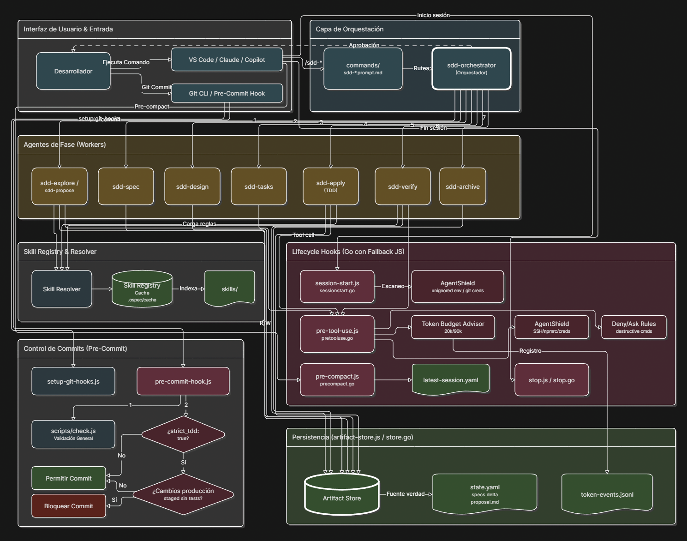

# Harness Runtime

## Objetivo

Reducir carga permanente del prompt y mover automatización repetitiva a hooks.

## Diagrama General de Flujos y Componentes

El siguiente diagrama detalla cómo interactúan los comandos de usuario, el orquestador, los agentes de fase, las capas de persistencia y el ciclo de vida de los hooks (seguridad, tokens y Git):



## Capas

1. Commands: routing visible.
2. Orchestrator: coordinación.
3. Phase agents: ejecución.
4. Skills: capacidades on-demand.
5. Hooks: lifecycle automation.
6. OpenSpec: fuente de verdad.
7. `.ospec/cache`: cache auxiliar; el registro compacto de skills vive en `.ospec/cache/skill-registry.cache.json`.
8. `.ospec/session`: continuidad auxiliar.

### Esquema de la cache del registro (v2)

`.ospec/cache/skill-registry.cache.json` usa `version: 2`:

```json
{
  "version": 2,
  "fingerprint": "sha256:…",
  "generated_at": "…ISO…",
  "skills": [ { "id": "…", "path": "…", "triggers": ["…"], "compact_rules": ["…"] } ],
  "workspace": { "members": [ { "id": "api", "reachable": true } ], "contracts": [ { "id": "auth", "provider": "api", "consumers": ["web"] } ] }
}
```

- `workspace` solo aparece en modo `workspace-federated`: federa el atlas (miembros y
  contratos) en la cache para que un delegador lea el contexto cross-repo sin reparsear
  `workspace.yaml`. En modo `openspec` se omite.
- Migración: `session-start` invalida cualquier cache con `version` distinto de 2 (cache miss)
  y la regenera; no hay migración manual.
- El hook reporta `registry.status`: `generated` (creada/refrescada), `reused` (hit de
  fingerprint, sin escritura) o `skipped` (sin OpenSpec).

## No fuente de verdad

`.ospec/cache` y `.ospec/session` nunca sustituyen a OpenSpec. `.atl/` es residuo legacy ignorado; no es estado activo del registro ni del runtime.

## Backend de artefactos (adapter)

Los hooks no conocen rutas concretas. Toda la política de layout vive en un solo
sitio: `scripts/lib/artifact-store.js`. Cada hook crea un store con
`createArtifactStore({ mode, workspace })` y pide rutas y operaciones al
contrato, en vez de hardcodear `openspec/` o `.ospec/`.

| Capa | Qué expone el store |
| --- | --- |
| Canónica (fuente de verdad) | `configPath()`, `isInitialized()`, `readConfig()`, `findActiveChanges()`, `changeDirectory()`, `writeSessionSummary()` |
| Derivada (auxiliar) | `cachePath()`, `sessionSummaryPath()`, `latestSessionPath()`, `runtimeEventPath()`, `appendRuntimeEvent()` |

Modos:

- `openspec` (por defecto): adapter actual. Delega en `scripts/lib/ospec-state.js`;
  comportamiento idéntico al previo a la extracción.
- `workspace-federated`: comparte el layout derivado `.ospec/` (workspace-local) y
  resuelve lo canónico desde un atlas `openspec/workspace.yaml`. `isInitialized` lee el
  atlas; `findActiveChanges` agrega los changes de cada miembro alcanzable etiquetados
  con `source` (coordinador = `.`) reusando `ospec-state.findActiveChanges`; los miembros
  inalcanzables se omiten fail-open. Implementado para **lectura**; la escritura
  coordinada multi-repo queda en el roadmap (`changeDirectory`/`writeSessionSummary`
  permanecen coordinator-local). Parser del atlas: `scripts/lib/workspace-atlas.js`.

Selección de backend: los hooks llaman `createArtifactStoreFromConfig`, que lee
`artifact_store.backend` de `openspec/config.yaml` (`readBackendMode`) y construye el
store; ausente o desconocido → `openspec`. Front door: `sdd-workspace` (init/status/impact).

Este `mode` del arnés (dónde y cómo se resuelve el backend) es distinto del
`artifact_store.mode` de la capa de prompts (`openspec | none`, que decide si una
fase persiste o devuelve inline). Ver [openspec.md](openspec.md) y la
`persistence-contract` compartida.

## Filtros de Seguridad y Presupuesto de Tokens (AgentShield y Token Budget Advisor)

El arnés incorpora políticas activas durante el ciclo de vida del agente para evitar el consumo desmedido de tokens y proteger archivos o credenciales sensibles.

### 1. Token Budget Advisor (PreToolUse)
Controla la lectura excesiva de archivos para proteger el contexto del modelo:
- **Límite de archivo individual**: Bloquea con advertencia interactiva (`ask`) lecturas de un único archivo que estime más de **50,000 tokens** (~200 KB en código o ~300 KB en texto).
- **Límite acumulado de sesión**: Si el total acumulado de la sesión excede los **150,000 tokens** (registrado en `.ospec/session/<changeName>/token-events.jsonl`), advierte interactivamente para aconsejar una compactación de contexto.
- **Bypass**: Habilita la variable de entorno `DISABLE_TOKEN_ADVISOR=true` para omitir esta validación.

### 2. AgentShield Security (SessionStart y PreToolUse)
Protege contra fugas de información confidencial y el acceso no deseado a credenciales:
- **SessionStart**:
  - Escanea la raíz del espacio de trabajo para detectar archivos sensibles (`.env`, `.env.local`, `.env.development`, `.env.production`, `.npmrc`) que no estén ignorados en `.gitignore`.
  - Verifica si `.git/config` contiene credenciales incrustadas en texto plano en URLs `http`/`https`.
  - Emite alertas en el canal del sistema si se encuentran riesgos.
- **PreToolUse (Lectura de archivos)**:
  - **Bloqueo Estricto (`deny`)**: Niega el acceso a claves privadas SSH (ej. `id_rsa`, `id_ed25519`, archivos que empiecen con `id_` con extensión `.key`/`.pem`), el archivo `.npmrc` y el archivo `.git/config` del repositorio.
  - **Pregunta Interactiva (`ask`)**: Solicita aprobación explícita del usuario para leer archivos `.env*`, `secrets.json`, `credentials` o cualquier archivo menor a 1 MB que contenga patrones de claves API conocidas (OpenAI `sk-`, Google Cloud `AIzaSy`, AWS `AKIA`, Slack `xox-`, JWT) o expresiones regulares de contraseñas/secretos (`password = "..."`).
- **Bypass**: Habilita la variable de entorno `DISABLE_AGENT_SHIELD=true` para desactivar este escudo.

### 3. Git Pre-commit Hook
Validador local que asegura la calidad del repositorio antes de consolidar cambios:
- **Instalación**: Se configura de manera idempotente usando `npm run setup:git-hooks` (ejecuta [setup-git-hooks.js](../scripts/setup-git-hooks.js) para instalar los hooks en `.git/hooks/`).
- **Validación de Workspace**: Invoca `scripts/check.js` para asegurar que el plugin compila y todos los tests pasan.
- **Validación de Strict TDD**: Si `strict_tdd: true` en `openspec/config.yaml`, rechaza commits si hay cambios de código de producción preparados (`staged`) sin sus correspondientes archivos de prueba (`*_test.go`, `*.test.js`) o su archivo `tasks.md` de planificación.
- **Bypass**: Habilita la variable de entorno `DISABLE_OSPEC_PRECOMMIT=true` o usa `git commit --no-verify`.

### 4. No-Model-Attribution Enforcement (Tres Capas)
Protege estrictamente contra la inserción de atribución AI/modelo en commits y PRs. La política se define en [no-model-attribution.instructions.md](../rules/no-model-attribution.instructions.md) y se aplica mediante **tres capas de defensa**:

| Capa | Cuándo actúa | Qué bloquea |
| --- | --- | --- |
| **PreToolUse DENY** (`pre-tool-use.js`) | Antes de que el agente ejecute `git commit -m "..."` | Escanea el argumento `-m`/`--message` del comando; deniega si contiene patrones prohibidos |
| **Git `commit-msg` Hook** (`commit-msg-hook.js`) | Después de que el usuario/IDE componga el mensaje | Lee el archivo temporal de mensaje de Git; rechaza el commit si contiene atribución |
| **Rules file** (`rules/no-model-attribution.instructions.md`) | Carga del contexto del agente | Instruye al modelo para que nunca genere atribución; primera barrera pasiva |

**Patrones prohibidos** (case-insensitive): `co-authored-by`, `generated with|by`, `🤖`, nombres de modelos y vendors (`claude`, `anthropic`, `opus`, `sonnet`, `haiku`, `fable`, `gpt`, `chatgpt`, `openai`, `codex`, `copilot`, `gemini`, `bard`, `llama`, `mistral`, `cohere`).

**Instalación**: `npm run setup:git-hooks` instala tanto el `pre-commit` como el `commit-msg` hook. El PreToolUse DENY está integrado en el hook `PreToolUse` del arnés y no requiere instalación adicional.

**Bypass**: `DISABLE_OSPEC_ATTRIBUTION_CHECK=true` desactiva únicamente el `commit-msg` hook. El DENY de PreToolUse no tiene bypass — es un bloqueo absoluto para agentes.
