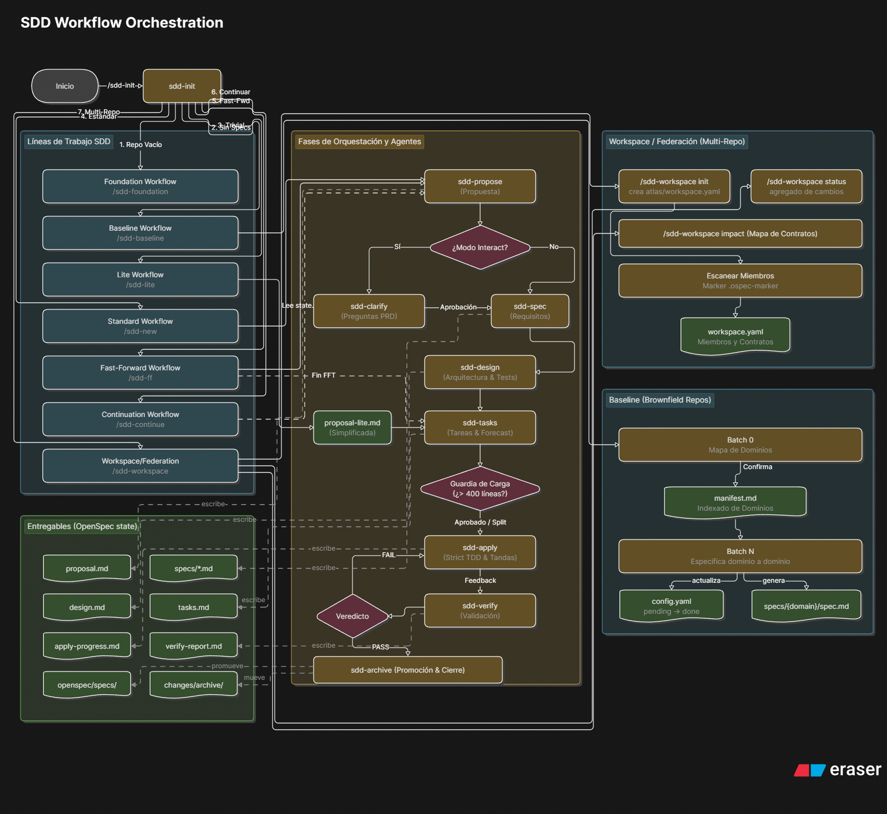

# Lineas de workflow SDD

El plugin soporta varias lineas de trabajo. Todas comparten una idea: el estado persistido vive en OpenSpec y el orquestador decide la siguiente fase segura.

## Mapa General de Flujos, Agentes y Caminos SDD

El siguiente diagrama detalla la orquestación completa de todos los flujos de trabajo admitidos, los entregables de cada fase, las guardas y la interacción del orquestador con agentes especializados (como `sdd-clarify`):



## Modos de ejecucion

Antes de la primera ejecucion, el orquestador pregunta el modo:

| Modo | Comportamiento |
|------|---------------|
| **Interactive** (default) | Muestra resumen tras cada fase y pregunta si continuar, detener o ajustar. |
| **Automatic** | Ejecuta todas las fases seguidas sin pausar. |

Estrategia de entrega (se elige una vez y se cachea):

| Estrategia | Comportamiento |
|------------|---------------|
| `ask-on-risk` (default) | Pregunta solo si hay riesgo de PR grande. |
| `auto-chain` | Divide automaticamente en PRs encadenadas. |
| `single-pr` | Intenta una sola PR, exige excepcion si supera presupuesto. |
| `exception-ok` | Permite PR grande con excepcion explicita. |

## 1. Proyecto existente

Usa esta linea cuando el repo ya tiene codigo, tests o arquitectura detectable.

```text
/sdd-init
/sdd-new add-user-session-timeout
/sdd-continue add-user-session-timeout
/sdd-apply add-user-session-timeout
/sdd-verify add-user-session-timeout
/sdd-archive add-user-session-timeout
```

Que pasa:

1. `sdd-init` prepara contexto y testing. Solo se autoejecuta si el usuario pidio trabajo SDD persistido de forma explicita; para preguntas vagas debe pedir permiso antes de crear `openspec/`.
2. `sdd-new` normalmente produce exploracion y propuesta.
3. `sdd-continue` avanza por specs, design y tasks segun dependencias.
4. `sdd-apply` implementa una tanda de tareas.
5. `sdd-verify` comprueba cumplimiento real.
6. `sdd-archive` actualiza specs principales y cierra.

## 2. Proyecto nuevo o vacio

Usa esta linea cuando no hay producto, stack o arquitectura definidos.

```text
/sdd-init
/sdd-foundation
/sdd-new scaffold-project
/sdd-ff first-capability
```

El guard de foundation se activa si `openspec/config.yaml` indica repo vacio, arquitectura no detectada, stacks vacios o el usuario pide construir desde cero.

`sdd-foundation` pregunta una sola cosa bloqueante cada vez. Esto es intencionado. Cuando no sabemos producto, usuarios, stack o testing, inventar una app completa es velocidad falsa. Primero hay que fijar cimientos.

## 3. Fast-forward de planificacion

Usa esta linea cuando el cambio esta claro y quieres llegar rapido hasta tareas.

```text
/sdd-ff add-export-csv
```

Equivale a avanzar por:

```text
proposal -> specs -> design -> tasks
```

No salta implementacion ni verificacion. Solo compacta la planificacion. Si aparece un bloqueo, el orquestador debe parar.

## 4. Lite para cambios triviales o small

Usa esta linea cuando el cambio es pequeno y no necesita specs/diseno completos.

```text
/sdd-lite tweak-doc-linking
```

El flujo reducido es:

```text
proposal-lite -> tasks -> apply -> verify
```

Reglas:

- `proposal-lite.md` es valido solo en lite mode.
- Si durante planning o apply el cambio deja de ser `trivial` o `small`, se bloquea y se escala al workflow estandar.
- En lite mode, `proposal-lite.md` hace de contrato de comportamiento para `tasks`, `apply` y `verify`.

## 5. Continuacion por estado

Usa esta linea cuando ya hay artefactos en `openspec/changes/{change-name}/` y no recuerdas donde quedo el trabajo.

```text
/sdd-continue add-export-csv
```

El orquestador recupera estado desde:

```text
openspec/changes/{change-name}/state.yaml
openspec/changes/{change-name}/proposal.md o proposal-lite.md
openspec/changes/{change-name}/specs/**
openspec/changes/{change-name}/design.md
openspec/changes/{change-name}/tasks.md
openspec/changes/{change-name}/apply-progress.md
```

Esta es una de las razones fuertes para usar OpenSpec: la conversacion puede perder contexto, pero el repo no. Y eso depende de que cada fase actualice `state.yaml`; sin ese merge, la recuperacion queda coja.

## 6. Apply por tandas

Usa esta linea cuando el cambio tiene varias fases o debe dividirse por review.

```text
/sdd-apply add-export-csv
/sdd-apply add-export-csv
/sdd-verify add-export-csv
```

`sdd-apply` debe leer `apply-progress.md` si existe y fusionar progreso previo. El protocolo actual es append-first: conserva historial y agrega la nueva tanda en vez de regenerar el archivo entero.

`tasks.md` usa estados de ciclo de vida, no solo binario:

- `[ ]` no empezado
- `[~]` implementado pero con verificacion local pendiente
- `[x]` implementado y verificado localmente

Si la spec esta mal, se contradice o no se puede verificar, `sdd-apply` debe parar con `spec-change-required`; no corrige specs en caliente. Si el trabajo real se dispara mas de un 50% sobre el forecast o va a romper el presupuesto antes del siguiente corte sano, persiste el parcial y devuelve `workload-escalation`.

Si `tasks.md` marca riesgo alto de review, el orquestador debe resolver antes:

| Estrategia | Uso |
| --- | --- |
| `ask-on-risk` | Pregunta al usuario si dividir o aceptar excepcion. |
| `auto-chain` | Aplica solo el siguiente slice autonomo. |
| `single-pr` | Requiere `size:exception` si supera presupuesto. |
| `exception-ok` | Continua con excepcion aceptada. |

Automatico no significa "sin guardas". Si hay riesgo de review, el guard manda.

## 7. PRs encadenadas

Cuando el forecast supera el presupuesto de 400 lineas, hay dos estrategias sanas:

| Estrategia | Cuando usarla |
| --- | --- |
| `stacked-to-main` | Slices independientes que pueden ir entrando en `main` en orden. |
| `feature-branch-chain` | Trabajo que necesita integrarse antes de tocar `main`. |

Tambien existe `size:exception`, pero debe ser una decision consciente. Para generated code, migraciones o cambios indivisibles puede tener sentido. Para "me da pereza partirlo", no. Ahi hay que subir el nivel.

## 8. Verify y archive

La linea de cierre es:

```text
/sdd-verify add-export-csv
/sdd-archive add-export-csv
```

`sdd-verify` puede terminar en:

| Veredicto | Significado |
| --- | --- |
| `PASS` | Specs, diseno, tareas y tests estan cubiertos. |
| `PASS WITH WARNINGS` | Hay riesgos no criticos que deben conocerse. |
| `FAIL` | Hay CRITICAL, tests fallan o faltan pruebas obligatorias. |

`sdd-verify` ya no colapsa toda la evidencia a "tested/untested". Clasifica por niveles `runtime-test`, `static-proof`, `inspection-proof`, `manual-proof` y `no-proof`, y devuelve pistas de origen (`code-bug`, `tasks-gap`, `design-gap`, `spec-gap`) para rutear el fix.

`sdd-archive` bloquea `FAIL` por completo. Con `PASS WITH WARNINGS`, solo puede seguir si esos riesgos quedan aceptados explicitamente o convertidos en follow-up. Al archivar, las delta specs pasan a `openspec/specs/` solo en esa fase y el cambio se mueve a `openspec/changes/archive/`.

## 9. Onboarding

Usa esta linea para aprender la metodologia sobre un caso real:

```text
/sdd-onboard
```

El agente busca una mejora pequena, la propone y guia el ciclo completo. Si el repo esta vacio, debe mandar a `sdd-foundation`.

## 10. Modo de ejecucion

Para `/sdd-new`, `/sdd-ff` y `/sdd-continue`, el orquestador puede trabajar en dos modos:

| Modo | Comportamiento |
| --- | --- |
| `interactive` | Resume cada fase y pide confirmacion antes de continuar. |
| `auto` | Ejecuta fases encadenadas y muestra resultado final, salvo que un guard bloquee. |

El modo interactivo es mas lento, pero mejor para aprender y tomar decisiones. El automatico sirve cuando el equipo ya confia en el workflow y el cambio esta acotado.

## 11. Continuación tras compactación o nueva sesión

Cuando una sesión se compacta o se cierra, la recuperación se hace en este orden:

1. `openspec/changes/{change-name}/state.yaml`
2. artefactos de fase existentes;
3. `.ospec/session/session-summary.md`, si existe;
4. cache de skills, si fingerprint sigue válido;
5. conversación solo como contexto auxiliar no canónico.

## 12. Baseline para repos brownfield

Usa esta linea cuando el repo tiene codigo existente pero `openspec/specs/` esta vacio y necesitas establecer una linea base de comportamiento actual.

```text
/sdd-init
# Advisory aparece → consentir o saltar
/sdd-baseline        # batch 0: mapa de dominios
/sdd-baseline        # batch 1: primer dominio
/sdd-baseline        # batch 2: segundo dominio
# ... un batch por dominio hasta que devuelva success
```

### Flujo batch-0 — Mapa de dominios

El primer `/sdd-baseline` detecta que no existe `openspec/specs/_baseline/manifest.md` y:

1. Escanea el repo y agrupa archivos en clusters de capacidad (NO listados de directorios).
2. Devuelve `blocked` con `question_gate` que incluye el mapa de dominios propuesto.
3. El orquestador presenta el mapa al usuario via `vscode/askQuestions`.
4. Con el mapa aprobado, el ejecutor escribe `openspec/specs/_baseline/manifest.md` (seccion Domain Map) e `openspec/specs/_baseline/index.md`, actualiza `openspec/config.yaml` con `domains_pending` y devuelve `partial`.

### Flujo por dominio — batch N

Cada batch posterior:

1. Lee el manifest para identificar que dominios ya tienen entrada `done`.
2. Toma el primer dominio pendiente de `domains_pending` que no tenga `spec.md` existente (skip rule).
3. Explora las fuentes del dominio y escribe `openspec/specs/{domain}/spec.md`.
4. Captura `git rev-parse --short HEAD` como hash de commit.
5. APPENDA una fila en la tabla Entries de `openspec/specs/_baseline/manifest.md` (`domain | done | N | hash | UTC`).
6. APPENDA una linea en `openspec/specs/_baseline/index.md`.
7. Mueve el dominio de `domains_pending` a `domains_done` en `openspec/config.yaml`.
8. Devuelve `partial` si quedan dominios pendientes, o `success` si todos estan listos.

### Flujo de resume tras interrupcion

Si una sesion muere a mitad de un batch, el manifest no tendra entrada para ese dominio (las entradas se escriben SOLO en completion). En el siguiente `/sdd-baseline`:

- Manifest sin entrada `done` para ese dominio → se trata como pendiente.
- El executor re-especifica el dominio desde cero, sobreescribiendo el `spec.md` huerfano si existiera.
- El historial del manifest nunca se edita; solo se appendean filas nuevas.

Esta propiedad se garantiza escribiendo entradas **solo al completar** el dominio, nunca al empezar.

### Flujo de staleness y refresh

Cuando `sdd-status` detecta que archivos de un dominio cambiaron desde el hash registrado en el manifest, escribe `stale_domains` y `last_checked` en `openspec/config.yaml`. El hook `session-start.js` lee ese cache y emite un hint sin ejecutar git.

Para refrescar:

```text
/sdd-baseline
```

El ejecutor re-especifica solo los dominios en `stale_domains` o con `status: pending`, appendeando filas `refreshed` con el nuevo hash. Los dominios `done` y no-stale no se tocan.

### Skip rule y ownership

`sdd-baseline` NUNCA escribe donde ya existe `openspec/specs/{domain}/spec.md`, sin importar quien lo creo. Los dominios con spec preexistente se registran como `skipped` en el manifest.

`sdd-archive` owns los specs que evolucionan. Una vez que un cambio se archiva y su spec se promueve a `openspec/specs/`, ese dominio queda fuera del alcance de baseline para siempre.

### Advisory del orquestador

Cuando `baseline.status` es `pending` o `partial`, el orquestador muestra el Baseline Advisory antes del primer `/sdd-new` o `/sdd-explore` de la sesion. El advisory cubre: que es, ganancias, costos, y la advertencia de skip-rule loss. Es informativo; no bloquea otros comandos. Ver la seccion **Baseline Advisory** en `agents/sdd-orchestrator.agent.md`.
