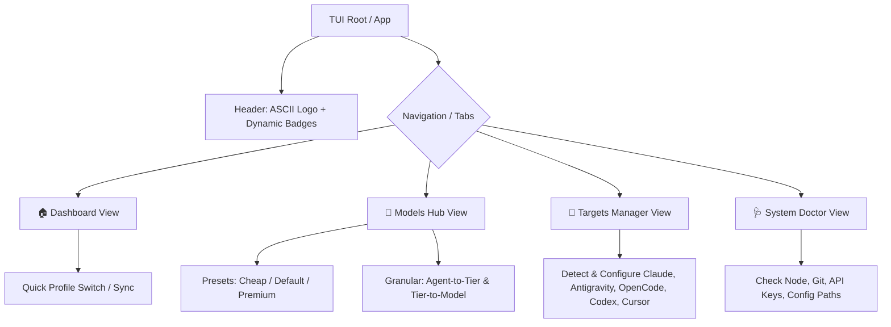
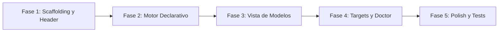

# Arquitectura y Roadmap: TUI `ospec` (Go Standalone Configurator)

Este documento define la arquitectura, decisiones de diseño, contratos de desacoplamiento y el roadmap de implementación para la TUI interactiva `ospec`, inspirada en las mejores prácticas de herramientas como **Gentle-AI**.

---

## 1. Visión y Objetivos

- **Propósito:** Proporcionar una interfaz de terminal moderna, intuitiva y rápida para configurar modelos, perfiles, targets y parámetros del ecosistema `ospec-workflow` sin necesidad de ejecutar múltiples comandos `npm run setup:...`.
- **Desacoplamiento Total:** La TUI se implementa como una herramienta independiente en Go (Opción B: manipulador declarativo). No depende del runtime de Node.js ni invade el arnés principal.
- **Entrypoint:** Comando ejecutable `ospec`.
- **Experiencia de Usuario (UI/UX):** Cabecera estilizada con logo ASCII, badges informativos (versión, target, modelo activo), navegación fluida por teclado y componentes interactivos claros.

---

## 2. Estructura de Paquetes

```text
ospec-workflow/
├── cmd/
│   ├── ospec/                      # Entrypoint principal de la TUI
│   │   └── main.go
│   └── ospec-hooks/                # Binario de hooks del arnés (independiente)
├── internal/
│   ├── tui/                        # Arquitectura Bubbletea Elm
│   │   ├── app.go                  # Root Model & Dispatcher de vistas
│   │   ├── header/                 # Banner ASCII, badges y métricas rápidas
│   │   ├── theme/                  # Paleta Lipgloss, bordes, estados y estilos
│   │   └── views/                  # Vistas modulares de la interfaz
│   │       ├── dashboard/          # Resumen general y acciones rápidas
│   │       ├── models/             # Selector de Presets y mapeo granular de modelos
│   │       ├── targets/            # Gestor de clientes AI (Claude, Codex, OpenCode, etc.)
│   │       └── doctor/             # Diagnóstico de prerrequisitos y variables de entorno
│   ├── config/                     # Motor de persistencia declarativa (Opción B)
│   │   ├── models_manager.go       # Lectura/escritura de models.yaml y profiles/models/
│   │   └── openspec_manager.go     # Lectura/escritura de openspec/config.yaml
│   ├── targets/                    # Adaptadores declarativos por cliente AI
│   └── system/                     # Detección de entorno, Git root y binarios en PATH
├── docs/
│   └── tui/
│       └── architecture-and-roadmap.md
├── go.mod
└── go.sum
```

---

## 3. Decisiones Arquitectónicas (ADR Summary)

### ADR-TUI-001: Framework de Interfaz de Terminal
- **Decisión:** Utilizar el ecosistema **Charmbracelet** (`bubbletea`, `lipgloss`, `bubbles`, `huh`).
- **Razón:** Ofrece una arquitectura de flujo de datos unidireccional (Elm: *Model-Update-View*), alto rendimiento, manejo robusto de terminales ANSI y soporte de componentes de formulario modernos.

### ADR-TUI-002: Persistencia Declarativa (Opción B)
- **Decisión:** La TUI interactúa exclusivamente mediante lectura y escritura directa de archivos de configuración declarativos (`models.yaml`, `profiles/models/*.yaml`, `openspec/config.yaml`) usando `gopkg.in/yaml.v3`.
- **Razón:** Garantiza desacoplamiento total del runtime de Node.js. No hay llamadas síncronas/asíncronas frágiles hacia scripts JS a menos que el usuario invoque explícitamente una sincronización externa.

### ADR-TUI-003: Identidad Visual y Ergonomía
- **Decisión:** Cabecera con banner ASCII art distintivo `OSPEC`, paleta de alto contraste con temática nórdica/scandinavian (cyan, magenta, esmeralda, gris tenue) y atajos de teclado estándar (`Tab`, `Enter`, `Esc`, `↑/↓`, `q`, `?`).

---

## 4. Vistas y Capacidades



1. **Dashboard:** Resumen del estado actual del repositorio, target activo, perfil de modelo seleccionado y accesos directos.
2. **Models Hub:**
   - **Presets:** Un solo clic para cambiar entre `Cheap`, `Default` y `Premium`.
   - **Ajuste Fino:** Configurar qué tier utiliza cada subagente (`sdd-propose`, `sdd-design`, `sdd-apply`, `sdd-verify`, `review-*`) y el mapeo por cliente AI.
3. **Targets Manager:** Detección de herramientas instaladas y generación/sincronización de configuraciones de clientes.
4. **System Doctor:** Validación de variables de entorno, herramientas necesarias en PATH y salud de los archivos de configuración.

---

## 5. Roadmap de Implementación



### Fase 1: Scaffolding, Tema y Cabecera
- Configurar dependencias en `go.mod` (`charmbracelet/bubbletea`, `lipgloss`, `bubbles`, `huh`, `yaml.v3`).
- Crear punto de entrada en `cmd/ospec/main.go`.
- Diseñar el tema base Lipgloss (`internal/tui/theme/`) y el componente Header con banner ASCII (`internal/tui/header/`).

### Fase 2: Motor de Configuración Go (Opción B)
- Implementar `internal/config/models_manager.go` con soporte para parsear y guardar `models.yaml` y `profiles/models/*.yaml`.
- Implementar `internal/config/openspec_manager.go` para `openspec/config.yaml`.
- Crear suite de pruebas unitarias (`go test ./internal/config/...`).

### Fase 3: Vista Interactiva de Modelos (Models Hub)
- Diseñar e implementar el selector de presets (`Cheap`, `Default`, `Premium`).
- Implementar la vista de personalización detallada por agente y por target.
- Conectar las modificaciones al motor de persistencia.

### Fase 4: Gestor de Targets y Diagnóstico (Doctor)
- Implementar `internal/system/` y `internal/targets/` para detección de herramientas.
- Construir vistas interactivas de Targets y Doctor.

### Fase 5: Pulido UI/UX, Build y Verificación
- Integrar barra de estado / footer con atajos de teclado y ayuda.
- Probar compilación del binario (`go build -o ospec ./cmd/ospec`).
- Verificar que el arnés Node.js y los tests existentes sigan funcionando al 100% sin interferencias.
