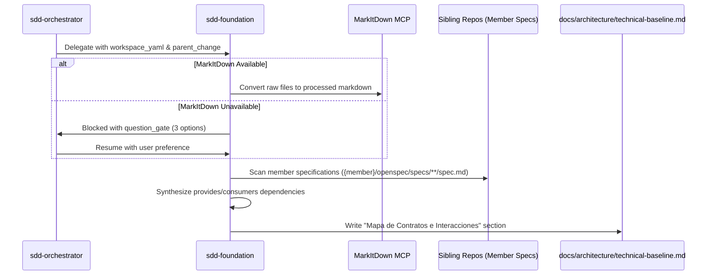

# Design: Ingesta de Documentos y Síntesis de Foundation Federado (C3)

## Technical Architecture

El módulo `sdd-foundation` opera bajo el control del orquestador. Cuando detecta el modo federado, lee el atlas y delega de manera estructurada los parámetros para mapear especificaciones e interacciones locales.

### 1. Flujo de Datos para Ingesta y Matriz de Contratos

### 2. Flujo de Remediación de MarkItDown

Cuando `mcp__microsoft_markitdown__convert_to_markdown` no está registrado, se dispara una pregunta interactiva con las siguientes opciones:
- **Configurar MarkItDown automáticamente**: El agente intenta instalar/configurar localmente el servidor MCP.
- **Configurar manualmente con guía**: El agente provee las instrucciones paso a paso para que el usuario registre `markitdown-mcp` en `.mcp.json`.
- **Saltar ingesta de documentos**: Se omite el paso y se continúa al descubrimiento guiado manual de preguntas.
