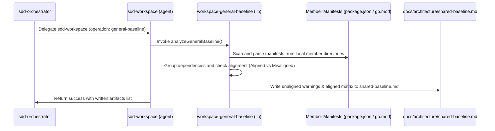

# Design: Detección de Base Compartida Cross-Repo (C4)

## Architecture Overview

La capacidad de detección de base compartida se compone de un módulo extractor de dependencias, un motor de comparación de alineación y un sintetizador de informes.



## Detailed Component Design

### 1. Extractor y Analizador (`scripts/lib/workspace-general-baseline.js`)

Este archivo expone una función principal `analyzeGeneralBaseline(workspaceYamlPath, coordinatorRoot)`:
- Lee el atlas `workspace.yaml` para obtener la lista de miembros y sus rutas relativas.
- Para cada miembro, resuelve su directorio raíz.
- Intenta leer y parsear:
  - `package.json` (extrayendo dependencias de `dependencies` y `devDependencies`).
  - `go.mod` (extrayendo dependencias de los bloques `require`).
- Consolida las dependencias en una estructura interna:
  ```json
  {
    "dependencies": {
      "lodash": {
        "aligned": false,
        "versions": {
          "member-a": "^4.17.21",
          "member-b": "^4.17.15"
        }
      },
      "react": {
        "aligned": true,
        "versions": {
          "member-a": "^18.2.0",
          "member-b": "^18.2.0"
        }
      }
    }
  }
  ```

### 2. Sintetizador (`shared-baseline.md` Generator)

Toma el resultado del analizador y genera el reporte `docs/architecture/shared-baseline.md` en el repositorio coordinador:
- Cabecera del documento y metadatos generales del análisis.
- **Aligned Dependencies**: Tabla markdown con el nombre del paquete, la versión compartida y el número de miembros que lo utilizan.
- **Misaligned Dependencies (Deviations)**: Tabla markdown con el nombre del paquete, y una columna desglosada por miembro indicando las versiones en discrepancia.
- **Infrastructure & Tools**: Detección de herramientas compartidas (Docker, ESLint, etc.).
