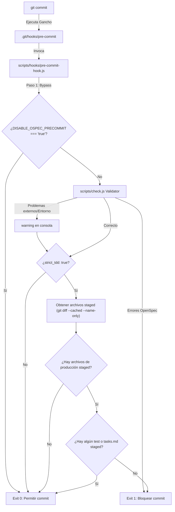

# Diseño: git-precommit-hook

Este documento detalla el diseño de la validación local pre-commit y el script de instalación automática de ganchos de Git para el arnés `ospec-workflow`.

---

## 1. Arquitectura de Componentes



---

## 2. Detalles de Implementación

### 2.1 Script Instalador (`scripts/setup-git-hooks.js`)
* **Propósito**: Registrar el gancho de Git de manera idempotente.
* **Comportamiento**:
  1. Verifica que la carpeta `.git/` exista en la raíz del proyecto.
  2. Lee o crea el archivo `.git/hooks/pre-commit`.
  3. Inserta/actualiza el código shell de invocación de forma segura.
  4. Agrega permisos de ejecución si el sistema operativo no es Windows (`fs.chmodSync(path, 0o755)`).

Contenido del hook de shell (`.git/hooks/pre-commit`):
```sh
#!/bin/sh
node "$(git rev-parse --show-toplevel)/scripts/hooks/pre-commit-hook.js"
```

### 2.2 Validador Pre-commit (`scripts/hooks/pre-commit-hook.js`)
* **Bypass de entorno**:
  ```javascript
  if (process.env.DISABLE_OSPEC_PRECOMMIT === "true") {
    console.log("OSPEC-PRECOMMIT: Bypass activo via env var. Omitiendo validación.");
    process.exit(0);
  }
  ```

* **Validación de OpenSpec**:
  Ejecuta `node scripts/check.js` usando `child_process.spawnSync`.
  - Si finaliza con errores sintácticos o del workspace, muestra los errores y retorna código `1`.
  - Si falla por razones externas (Node corrupto, permisos denegados sobre subdirectorios no relacionados), se atrapa el error (`catch`), se emite un `warning` y se continúa (Opción 4: B).

* **Enrutamiento de Strict TDD**:
  1. Lee `openspec/config.yaml` de forma robusta. Busca la línea `strict_tdd: true`.
  2. Si está activo, ejecuta `git diff --cached --name-only` para obtener los nombres de archivos preparados en Git.
  3. Clasifica los archivos:
     - **Producción**: `internal/**/*.go`, `cmd/**/*.go`, `scripts/hooks/*.js` (excluyendo archivos con sufijo `_test.go` o `.test.js`).
     - **Tests**: `*_test.go`, `*.test.js`.
     - **Planificación**: `openspec/changes/**/tasks.md`.
  4. Si hay archivos de producción staged pero no hay tests ni archivos de planificación `tasks.md` staged, se bloquea el commit indicando la violación de paridad de Strict TDD (Opción 1: A y Opción 3: A).

---

## 3. Plan de Verificación de Diseño

### Pruebas Unitarias
- Escribir tests en `scripts/hooks/pre-commit-hook.test.js` simulando diferentes entradas de archivos staged:
  - Sin archivos staged → ALLOW.
  - Archivos de producción sin tests con Strict TDD inactivo → ALLOW.
  - Archivos de producción sin tests con Strict TDD activo → DENY.
  - Archivos de producción con tests staged con Strict TDD activo → ALLOW.
  - Archivos de producción con `tasks.md` staged con Strict TDD activo → ALLOW.
  - Bypass activo via variable de entorno → ALLOW.
