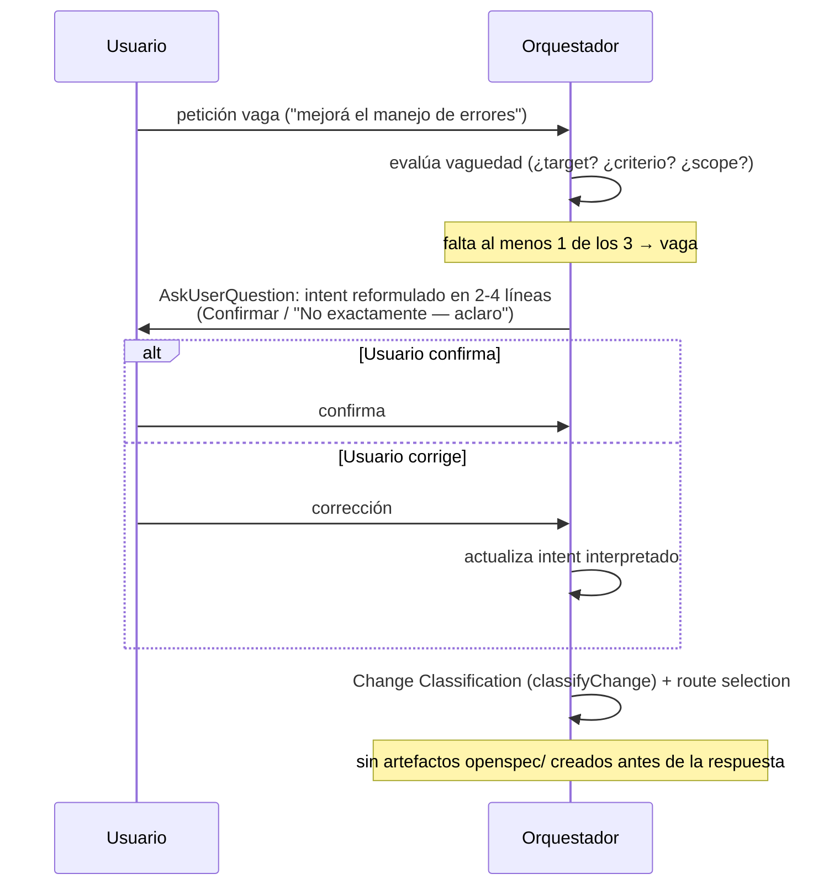
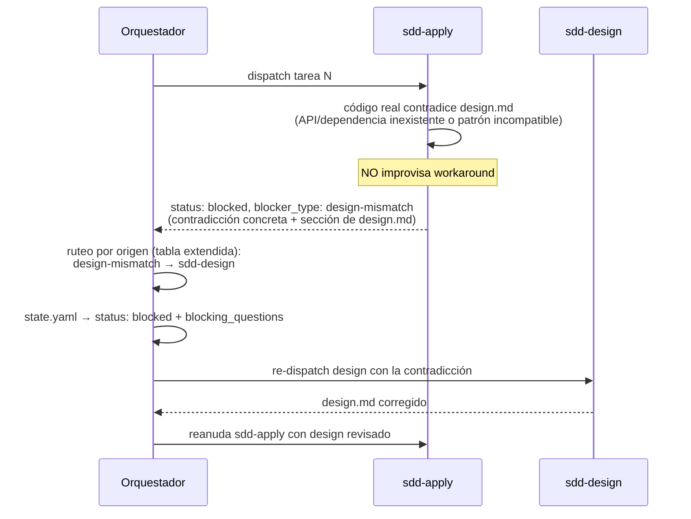

# Design: Contrato de recomendación y detección de ambigüedad temprana/tardía (A2 + A3)

> Mode: `design-after-spec` — las tres specs change-local existen y se asignan abajo.
> Cambio puramente documental/normativo: los agentes y skills son plantillas markdown,
> no código de runtime. El "código" afectado son fuentes de prompts + un test de contrato.

## Technical Approach

Editar cuatro fuentes de prosa normativa (envelope compartido, orquestador, skill de
apply y baseline `agents/spec.md` §6.1), añadir un test de contrato prose-invariant
(patrón ya existente en el repo) y regenerar `dist/` para los 4 targets. Todo es
aditivo: nuevos campos documentados, nuevas reglas y un paso condicional; ningún shape
existente se rompe.

## Architecture Decisions

| # | Decisión | Alternativa descartada | Racional |
|---|----------|------------------------|----------|
| D1 | Verificación vía test de contrato prose-invariant nuevo (`scripts/recommendation-ambiguity-contract.test.js`), siguiendo el patrón exacto de `scripts/assumption-ledger-contract.test.js` (leer los .md fuente y asertar landmarks de prosa con `assert.match`) | No testear (solo revisión manual) o implementar lint de shape (E3) | Es el precedente TDD del repo para cambios de solo-prosa ("the contract IS the prose"); E3 está explícitamente fuera de alcance |
| D2 | Intent restatement inline en la zona CORE del orquestador, dentro de `### Change Classification` | Handler on-demand en `skills/_shared/` | El delta de `agents` lo exige (corre ANTES de clasificación/route, junto a SDD Init Guard — §15 baseline); un handler lazy no puede gatear un paso pre-routing |
| D3 | `blocker_type` como fila OPCIONAL aditiva en ambas tablas de envelope, con enum de 4 valores | Reestructurar el envelope o hacer el campo obligatorio | Los envelopes existentes sin `blocker_type` siguen siendo válidos; rollback trivial (spec: "Existing envelope shape unaffected") |
| D4 | Ruteo de `design-mismatch` extendiendo la sección `Verification Failure Routing` existente (renombrando su alcance a ruteo por origen, disparable también desde apply) | Sección de ruteo nueva y separada | Reusa la tabla de prioridades ya establecida (`spec-gap` > `design-gap` > ...); un solo lugar para ruteo por origen evita drift |
| D5 | Corregir los ejemplos embebidos de `question_gate` no conformes en el mismo commit de A2 | Dejarlos como están (son "solo ejemplos") | Los ejemplos son la referencia de facto que copian los fase-agents; un ejemplo no conforme anula el contrato (riesgo Med de la propuesta) |

## File Changes

| File | Action | Dónde exactamente / qué cambia |
|------|--------|-------------------------------|
| `skills/_shared/sdd-phase-common.md` | Modify | **§D Return Envelope** (lista de campos, líneas ~144-151): añadir bullet `blocker_type` (OPCIONAL; presente cuando `status: blocked`) + tabla enum con los 4 valores conocidos: `needs_user_decision`, `design-mismatch`, `spec-change-required`, `workload-escalation` (con 1 línea de significado y fase emisora cada uno). **§D Blocking Question Envelope** (líneas ~190-233): tras el JSON, añadir el contrato de contenido: toda opción `recommended: true` DEBE llevar `description` con (1) racional de 1 línea, (2) trade-off principal frente a la alternativa líder, (3) reversibilidad; `reason` DEBE incluir el costo de equivocarse. Alcance explícito: solo `question_gate.options[]`; el legacy `next_question` (texto plano) queda fuera. Actualizar el ejemplo JSON embebido para que su opción recomendada cumpla los 3 elementos y su `reason` nombre un costo |
| `agents/sdd-orchestrator.agent.md` | Modify | **§Change Classification** (línea ~100): insertar subsección `#### Intent Restatement (pre-classification)` ANTES de la tabla de clases: criterio de vaguedad (falta módulo/target O criterio de aceptación O límite de scope), reformulación en 2-4 líneas validada con `AskUserQuestion`, máx. 1 iteración salvo nueva ambigüedad, sin crear artefactos OpenSpec como efecto colateral; si la petición no es vaga, saltar el paso. **§Verification Failure Routing** (línea ~416): extender a "Failure & Blocker Routing" — añadir que un envelope `status: blocked` con `blocker_type: design-mismatch` recibido desde `sdd-apply` rutea a `sdd-design` (no `sdd-clarify`, no reintento silencioso) y `spec-change-required` a `sdd-spec`, reusando la misma tabla origen→fase. **§Sub-Agent Clarification Contract** (línea ~613): referenciar el enum de `blocker_type` de `sdd-phase-common.md` §D y hacer conforme la `description` del ejemplo (línea ~636, hoy "Optional explanation."). **§Review Workload Guard** (ejemplo línea ~392): completar la `description` de "Chained PRs" con trade-off y reversibilidad, y añadir/ajustar `reason` con costo |
| `skills/sdd-apply/SKILL.md` | Modify | **Step 3 task loop** (línea ~134): junto a la línea existente `If the spec is wrong… STOP with \`blocked: spec-change-required\``, añadir línea paralela: si el código existente contradice el design (API/módulo/dependencia asumidos que no existen o difieren, o patrón establecido incompatible), STOP con `blocked: design-mismatch`, citando la contradicción concreta y la sección de `design.md` afectada. **Rules** (línea ~228): regla espejo con la exclusión explícita — desviación cosmética (naming, helper equivalente con el mismo contrato) NO es design-mismatch: se procede con el código existente. Sigue el patrón textual exacto de `spec-change-required` (misma redacción "STOP and return `blocked: …`") |
| `openspec/specs/agents/spec.md` (baseline) | Modify (en apply) | **§6.1 tabla de envelope** (línea ~345): añadir fila `blocker_type` — tipo enum (`needs_user_decision` \| `design-mismatch` \| `spec-change-required` \| `workload-escalation`), OPTIONAL; SHOULD estar presente cuando `status: blocked`. Esta edición puntual es entregable en apply por mandato del delta ("blocker_type Enum Field Formalization"). Los 4 requirements ADDED del delta (`specs/agents/spec.md` change-local) se sincronizan al baseline en archive, per convención OpenSpec: el contrato de recomendación como nueva subsección bajo §6 (p. ej. §6.7), intent restatement anclado a §1/§15, y design-mismatch anclado a §4.3 |
| `scripts/recommendation-ambiguity-contract.test.js` | Create | Tests prose-invariant (node:test + assert), espejo de `assumption-ledger-contract.test.js`: (a) §D lista `blocker_type` con los 4 valores enum; (b) §D exige rationale/trade-off/reversibility para `recommended: true` y costo en `reason`; (c) orquestador contiene `Intent Restatement` antes de la tabla de clasificación y el ruteo `design-mismatch → sdd-design`; (d) `sdd-apply/SKILL.md` contiene `blocked: design-mismatch` y la exclusión cosmética; (e) baseline §6.1 contiene la fila `blocker_type` |
| `dist/**` | Regenerated | Salida de los 4 targets; no se edita a mano |

Barrido adicional en apply: `grep "recommended": true` sobre `agents/`, `skills/`,
`commands/`, `profiles/` para detectar cualquier otro ejemplo embebido no conforme
(riesgo Med de la propuesta).

## Spec-to-Design Allocation

| Requirement (spec) | Asignación |
|---|---|
| Recommended Option Description Contract + Gate Reason Cost + Multiple Recommended (recommendation-contract) | `sdd-phase-common.md` §D + ejemplos del orquestador (D5) |
| Intent Restatement Before Change Classification (ambiguity-detection-boundaries) | Orquestador §Change Classification, zona CORE (D2) |
| sdd-apply design-mismatch Blocker (ambiguity-detection-boundaries) | `sdd-apply/SKILL.md` Step 3 + Rules; ruteo en orquestador (D4) |
| blocker_type Enum Field Formalization (delta agents) | Tablas §6.1 baseline y §D común (D3) |
| Requirements ADDED restantes (delta agents) | Sync a baseline en archive |

## Data Flow

### Flujo 1 — Intent restatement (petición vaga)



### Flujo 2 — design-mismatch durante apply



## Interfaces / Contracts

Campo formalizado (aditivo, sin cambiar nesting):

```yaml
blocker_type: needs_user_decision | design-mismatch | spec-change-required | workload-escalation
# OPTIONAL; presente cuando status: blocked. Enum abierto: nuevo valor ⇒ actualizar ambas tablas en el mismo cambio.
```

## Testing Strategy

TDD estricto para un cambio de solo-prosa = **contract tests red-first**: el precedente
del repo es `scripts/assumption-ledger-contract.test.js` (y
`federation-baseline-contract.test.js`): se escriben primero los asserts sobre landmarks
de prosa en los .md fuente (fallan en rojo), luego se editan los markdown hasta verde.

| Layer | What to Test | Approach |
|-------|-------------|----------|
| Contract (nuevo) | Landmarks de prosa: enum blocker_type en ambas tablas, contrato de description/reason, Intent Restatement en CORE, regla design-mismatch en apply + ruteo | `scripts/recommendation-ambiguity-contract.test.js`, escrito ANTES de editar los .md |
| Generación/dist (existente) | Los 4 targets se regeneran sin romper estructura ni frontmatter | Suite existente (`npm test` → `node scripts/check.js`); los tests de dist se auto-generan en dir temporal, nunca leen `dist/` gitignoreado |
| Consistencia de ejemplos | Ningún `question_gate` embebido con `recommended: true` queda no conforme | Manual en apply: grep + checklist; el lint automatizado es E3 (out of scope) |
| Docs lint (existente) | Links/estructura markdown válidos tras las ediciones | `scripts/docs-lint.test.js` dentro de `npm test` |

## Regeneration Impact

No hay `npm run build` único: regenerar por target — `npm run build:claude`,
`build:vscode`, `build:copilot`, `build:opencode` (todos derivan de `scripts/configure/`).
`npm test` (= `node scripts/check.js`) debe quedar verde después; los tests de e2e/
install-target validan la salida generada auto-generándola en directorios temporales.

## Migration / Rollout

No migration required. Commits separados A2 (contrato de recomendación) y A3
(restatement + design-mismatch) para revert independiente, per proposal. Rollback =
`git revert` + regenerar los 4 targets; al ser aditivo, los envelopes y gates previos
siguen válidos sin los nuevos campos/reglas. Refinamiento post-lectura: el revert de A3
también deshace la fila `blocker_type` en baseline §6.1 — aceptable porque el campo
volvería a su estado previo (solo en ejemplos JSON), sin artefactos huérfanos.

## Open Questions

Ninguna que bloquee. No-bloqueante para tasks: nombre exacto del fichero de test
(`recommendation-ambiguity-contract.test.js` propuesto; ajustable al patrón
`*-contract.test.js`).
