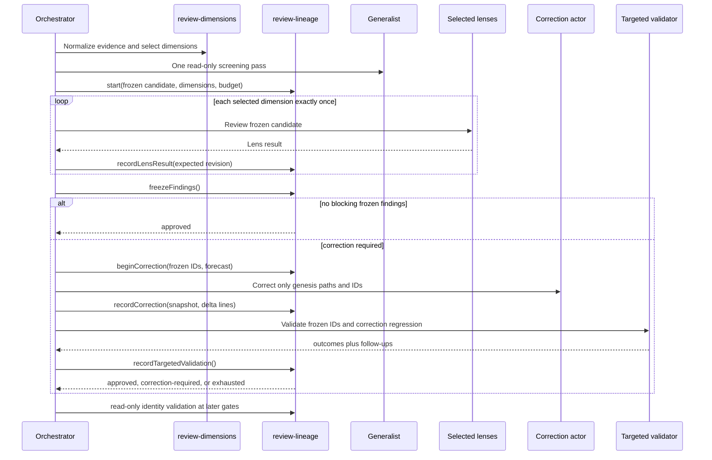

# Design: Selective 4R with Bounded Review Lineage

## Technical Approach

Retain the deterministic O4 classifier and O5 read-only generalist, but replace post-fix owner rereview with a native, pure CommonJS review transaction. `scripts/lib/review-lineage.js` owns immutable lineage identity, legal transitions, one-shot lens execution, frozen findings, correction budgets, targeted validation, interruption reconciliation, and terminal outcomes. `scripts/lib/review-gate-state.js` remains the adapter-facing planner and may only request actions authorized by the lineage. The orchestrator performs Git reads, persistence, and agent dispatch; reviewers judge once and never control lifecycle authority.

This design follows the bounded-operation separation documented by `gentle-ai`: start is the sole ordinary budget-creating operation; status and downstream gates are read-only; ambiguous mutations require reconciliation; and a new review requires an explicit successor. Full cryptographic receipt publication, locks/CAS, and release-gate authority remain outside O4+O5 for later roadmap milestones.

## Architecture Decisions

### Decision: Deterministic classifier remains the sole lens-selection authority

**Choice**: Preserve `review-dimensions.js` schema v1 and its 0–2 normal/full-4R high-risk selection. The selected dimensions are copied into lineage genesis and become immutable.

**Alternatives considered**: Let the generalist select final lenses; recalculate lenses after each fix; always run all four reviewers.

**Rationale**: Selection stays reproducible while freezing it prevents a correction from silently allocating new review authority.

### Decision: A pure lineage transaction owns bounded review authority

**Choice**: Add `review-lineage.js` as a dependency-free reducer. Ordinary `start` freezes candidate identity, genesis paths, classification, selected dimensions, evidence fingerprint, authored/changed-line counts, and correction budget. Every mutation consumes an expected revision and returns a new serializable state; adapters persist it by read-merge-write.

**Alternatives considered**: Keep authority in orchestration prose; extend `planBoundedRereview`; use agents to decide whether another review is allowed.

**Rationale**: Termination must be executable and deterministic. Agents may return judgments, but cannot grant themselves another sweep or reset budget.

### Decision: Correction validation is a separate scoped contract

**Choice**: Add a read-only `review-correction` agent/skill. It receives frozen finding IDs, the correction delta, genesis paths, and regression test evidence, and returns only per-ID `resolved|unresolved`, correction-regression status, and non-blocking follow-ups.

**Alternatives considered**: Relaunch the owning specialist; use full `sdd-verify` as the reviewer; allow validators to add findings.

**Rationale**: Full rereview caused the R1–R9 discovery loop. A scoped validator can verify the fix without reopening discovery.

### Decision: Downstream gates revalidate identity, never create authority

**Choice**: Verify/delivery/archive adapters call a read-only lineage validation function against freshly derived Git identity. Mismatch, ambiguity, exhaustion, or escalation stops; no gate calls `start`, changes lenses, or allocates budget.

**Alternatives considered**: Automatically restart on candidate drift; treat terminal state as permission to rerun; silently replace the lineage.

**Rationale**: The same reviewed candidate must reach delivery. Further review is an explicit successor with a different lineage ID and predecessor link.

## Frozen Genesis and Identity

`startReviewLineage(input)` accepts repository-derived data only:

```js
{
  candidate: {
    projection: "workspace",
    base_tree: "<git tree identity>",
    candidate_tree: "<deterministic candidate identity>",
    paths: ["canonical/posix/path"],
    diff_hash: "sha256:<hex>",
    paths_digest: "sha256:<hex>",
    authored_lines: 120,
    original_changed_lines: 180
  },
  classification: "normal",
  selected_dimensions: ["risk", "reliability"],
  evidence_fingerprint: "sha256:<hex>"
}
```

`candidate_id` is SHA-256 over a domain-separated, stable serialization of every candidate field. `lineage_id` is SHA-256 over the candidate ID, classification, canonical selected dimensions, evidence fingerprint, and generation. Repeating ordinary `start` with identical genesis is idempotent and returns the existing lineage; it does not create another budget.

Genesis paths, classification, dimensions, evidence, and counts never change. The frozen correction allowance is:

```text
correction_budget_lines = min(200, ceil(original_changed_lines / 2))
```

The lineage records cumulative actual correction lines. Each accepted attempt must be based on the previous candidate snapshot, touch only a subset of genesis paths, and keep cumulative usage within the original allowance.

## Lifecycle and Legal Transitions

```text
reviewing -> findings-frozen -> approved
    |              |
    |              +-> correction-required -> correcting -> validating
    |                                            ^              |
    +-> reconciliation-required                  |              +-> approved
                                                  +--------------+ (failed < 3)
                                                                 +-> exhausted (failed = 3)
Any non-terminal state -> escalated | invalidated
```

- `reviewing`: each selected dimension has `pending|running|completed|unknown`; generalist and each selected lens may complete exactly once. A completed result is immutable.
- `findings-frozen`: all lens results are present and findings are canonicalized. IDs are domain-separated hashes of lineage ID, owner dimension, and normalized finding content; collisions or duplicate content fail closed. IDs and owners cannot be deleted, renumbered, or added later.
- `approved`: terminal when no blocking frozen finding exists or targeted validation resolves all of them without a correction regression.
- `correction-required`: exposes only frozen unresolved IDs and remaining budget.
- `correcting`: one attempt is pending with request ID, expected revision, base snapshot, and forecast.
- `validating`: correction snapshot and actual delta are committed; only targeted validation may continue.
- `exhausted`, `escalated`, `invalidated`: terminal. Ordinary dispatch cannot leave them or reset counters.
- `reconciliation-required`: an operation outcome is unknown. Status/reconciliation is the only allowed action; reviewers, corrections, validators, and successors are forbidden until resolved.

Each mutating plan persists `{request_id, request_digest, expected_revision, operation, status: "pending"}` before dispatch. `reconcilePendingOperation` may apply the exact committed result, restore the prior stable state when proven `not_started`, or remain stopped when still `unknown`; it never guesses from transport failure or replays changed inputs.

Every failed targeted validation increments `failed_attempts`, including a zero-line correction. The third failure transitions to `exhausted`. Path escape, candidate-base mismatch, forecast/actual/cumulative budget overflow, malformed evidence, or attempted lens replay transitions to `escalated` or fails closed without mutation according to whether an authoritative attempt had already committed.

## Targeted Validation Contract

The validator input contains exactly `lineage_id`, `revision`, frozen unresolved finding IDs with owner/acceptance criteria, `fix_delta_hash`, corrected snapshot identity, genesis paths, and targeted test evidence. Its output is:

```js
{
  lineage_id: "sha256:...",
  revision: 7,
  outcomes: [{ finding_id: "F-...", status: "resolved" }],
  correction_regression: { passed: true, evidence_hash: "sha256:..." },
  follow_ups: [{ owner: "reliability", summary: "bounded text" }]
}
```

The reducer rejects missing/extra frozen IDs, new blocking IDs, changed owners, or absent regression evidence. Follow-ups are append-only and non-blocking. Promoting one requires explicit successor authority; it never alters the current lineage outcome.

## Gate Sequence



The former `planBoundedRereview` path is removed. Neither owner reviewers nor newly selected dimensions run after findings freeze.

## Persisted State Contract

`gates.4r-review-gate` keeps its existing selection audit and adds a `lineage` object with `schema_version`, IDs, generation/predecessor, revision, lifecycle state, immutable genesis, per-lens execution/result hashes, frozen findings, correction budget/usage/attempts, pending operation, validation history, follow-ups, and terminal reason. Raw diffs and arbitrary diagnostics are not persisted. Legacy gates without `lineage` remain readable but cannot gain bounded authority retroactively.

An explicit successor requires a terminal predecessor, a different lineage ID, `predecessor_lineage_id`, recovery reason, and persisted approval reference. It is never created by verify, archive, retry, or interruption recovery.

## File Changes

| File | Action | Description |
|---|---|---|
| `scripts/lib/review-lineage.js` | Create | Pure immutable transaction, budgets, transitions, reconciliation, and read-only identity validation. |
| `scripts/lib/review-gate-state.js` | Modify | Consume lineage actions; remove `planBoundedRereview` and all owner-rereview authorization. |
| `scripts/lib/review-dimensions.js` | Modify | Expose canonical candidate facts/counts needed by lineage start without changing selection semantics. |
| `agents/review-correction.agent.md`, `skills/review-correction/SKILL.md` | Create | Read-only targeted validation boundary and exact envelope. |
| `skills/_shared/gate-4r-review.md` | Modify | Start once, freeze findings, correct/validate with bounded lineage, reconcile interruptions, never rereview. |
| `agents/sdd-orchestrator.agent.md` | Modify | Dispatch only lineage-authorized next action; require explicit successor approval. |
| `rules/sdd-common.instructions.md`, `rules/sdd-openspec.instructions.md` | Modify | Mirror bounded lifecycle and persistence contract. |
| `.github/instructions/sdd-common.instructions.md`, `.github/instructions/sdd-openspec.instructions.md`, `AGENTS.md` | Modify | Keep workspace/distribution mirrors synchronized with the canonical rules. |
| `skills/_shared/openspec-convention.md` | Modify | Document optional lineage audit and legacy read-only behavior. |
| `models.yaml`, `scripts/configure/cli.js` | Modify | Register targeted validator and generated runtime roots. |
| `scripts/review-lineage.test.js` | Create | Pure state-machine and invariant tests. |
| `scripts/review-correction-contract.test.js` | Create | Exact scoped validator contract and competence-boundary tests. |
| `scripts/review-gate-state.test.js`, `scripts/selective-4r-parity.test.js` | Modify | Prove no rereview, five-target parity, interruption stop, and read-only downstream gates. |

Generated `dist/` output is rebuilt, never hand-edited. `docs/roadmap.md`, specialist criteria, severity taxonomy, and concurrency policy remain unchanged.

## Strict TDD Strategy

| Layer | Required RED/GREEN proof |
|---|---|
| Unit | Start freezes identity and formula; lens replay fails; findings cannot expand; path/budget escape fails; zero-delta failures count; third failure exhausts; terminal state cannot restart. |
| Contract | Validator rejects extra/missing IDs, new blockers, owner changes, or absent regression evidence; unrelated observations become follow-ups. |
| Integration | Replace current owner-rereview fixture with correction -> targeted validation; prove no generalist/specialist dispatch after freeze; same start is idempotent; explicit successor differs. |
| Recovery | Persist `pending_operation` before dispatch; ambiguous result yields only reconciliation; exact request/revision replay is idempotent. |
| Gates | Verify/archive identity match is read-only; drift blocks without start/rebudget; legacy state stays readable and non-authoritative. |
| Generation | Identical lifecycle probes pass for claude, vscode, github-copilot, opencode, and codex; isolated mutations detect missing attempt cap, budget, one-shot, or follow-up rule. |
| Regression | Existing classifier/generalist/specialist contracts and full `npm test` remain green. |

## Migration / Rollout

No historical gate is rewritten. Active pre-lineage remediation history is retained as audit context, but the next apply creates one fresh bounded lineage from the then-current candidate; R1–R9 are not converted into invented attempts. Rollback removes the lineage/validator and restores the pre-change gate, while archived lineage audit remains readable.

## Out of Scope

Content-bound signed receipts, receipt publication/replay, filesystem locks and CAS durability, binary/provider negotiation, staged/pre-commit/pre-push/pre-PR/release authority, and malicious-local-actor resistance belong to later roadmap milestones. O4+O5 provide deterministic identity and enough append-only audit to prove termination, not the complete `gentle-ai` authority system.

## Open Questions

None.
