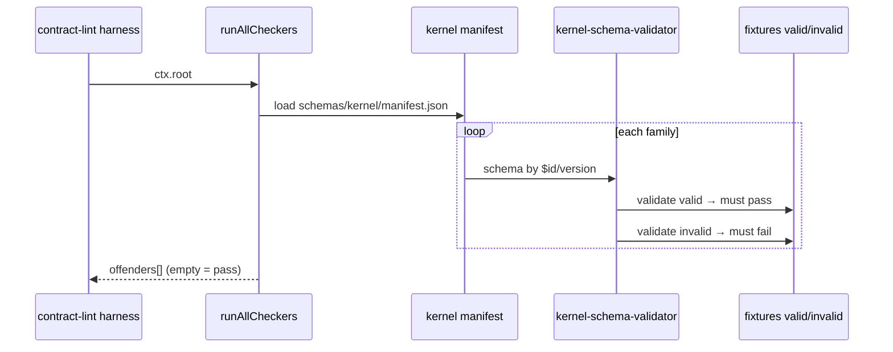
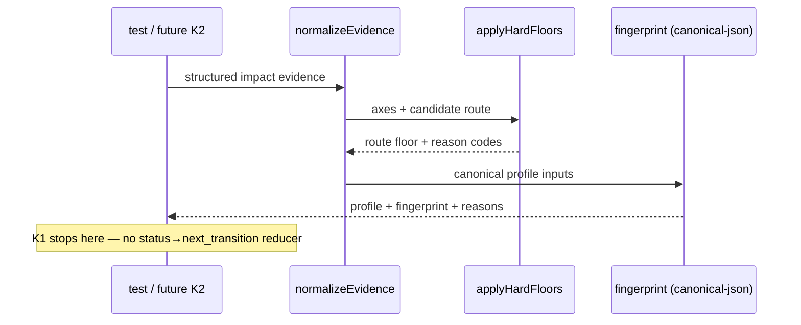

# Design: K1 — Contract Suite, Vocabulario y Clasificación

## Technical Approach

Materialize the K1 contract suite as **declarative, versioned JSON Schemas** under
`schemas/kernel/`, plus **dep-free pure validators/classifiers** in `scripts/lib/`
registered into the existing `contract-lint` aggregator. K1 publishes shapes,
aliases, fixtures, classification (fingerprint + hard floors), and surface-parity
checks. It does **not** implement the lifecycle reducer, wire adaptive routing, or
change fixed/default baselines (K2+).

Maps to change-local specs: `harness-authority-canon`, `kernel-contract-schemas`,
`change-classification`, `transition-surface-parity`, and the `contract-lint` delta
(REQ-008…011). Resolves open assumptions: schema tree = `schemas/kernel/`;
fingerprint = domain-prefixed `stableSerialize` + SHA-256 (`sha256:<hex>`).

## Architecture Decisions

### Decision: Schema tree at `schemas/kernel/` with pin-stable `$id`

**Choice**: Repo-root `schemas/kernel/{family}/v1.schema.json` + co-located
`fixtures/{valid,invalid}/`. `$id` =
`ospec://schemas/kernel/{family}/v1`. Index in `schemas/kernel/manifest.json`.
See ADR-001.
**Alternatives**: `openspec/schemas/` (mixes SDD artifacts with kernel contracts);
flat `schemas/*.json` (harder family versioning); `scripts/lib/schemas/` (hides
public pin surface).
**Rationale**: Proposal preferred `schemas/`; root tree is consumer-visible; `/v1`
path + `$id` enable pinning without silent substitution.

### Decision: Fingerprint = domain-prefixed stableSerialize + SHA-256

**Choice**: Reuse the existing harness canonicalization pattern
(`stableSerialize` / sorted-key recursive JSON, UTF-8) then
`sha256:` + hex. Classification uses domain `change-classification\0` before the
canonical bytes (same shape as `review-lineage.digest`). Extract shared helpers to
`scripts/lib/canonical-json.js`. See ADR-002.
**Alternatives**: Undomain'd hash (collides across fingerprint spaces); RFC 8785
JCS via new dep; hash of pretty-printed JSON (non-deterministic key order).
**Rationale**: Spec requires determinism only; this matches production fingerprints
already emitted as `sha256:<64 hex>` and stays dep-free.

### Decision: Declarative JSON Schema + constrained in-repo validator (no ajv)

**Choice**: Publish Draft 2020-12 JSON Schema documents as the normative contract
artifacts. Validate fixtures and instances with a **dep-free constrained subset
interpreter** in `scripts/lib/kernel-schema-validator.js` (type, properties,
required, additionalProperties, enum, const, oneOf, local `$ref`, and
kind-discriminated `if`/`then` where needed). Semantic rules beyond JSON Schema
(e.g. `collect` must not invent `command`) live as pure post-validators beside the
schemas. See ADR-003.
**Alternatives**: Add `ajv` (breaks zero-deps Node-22 policy, ADR-003 of
strict-result-envelope); hand-validators only without published schemas (fails
P19/$id pinning); vendor full ajv into-tree (oversized for K1 subset).
**Rationale**: Schemas remain the pin surface; enforcement stays CommonJS-pure and
testable under `node:test`.

### Decision: Versioned aliases preserve existing consumer tags

**Choice**: `schemas/kernel/aliases/v1.json` maps legacy/current stable codes →
canonical vocabulary; `resolveAlias(tag, {strict})` fail-closes on known-unmapped
tags in strict coverage mode. See ADR-004.
**Alternatives**: Silent rename (breaks consumers); big-bang cutover without map.
**Rationale**: Invariant 12 (compat before retirement) + REQ-kernel-contract-schemas-003.

### Decision: Classifier publishes floors; does not alter fixed routing

**Choice**: Pure `classifyChange(normalizedEvidence) → ClassificationProfile` with
hard-floor table and `reasons[]`. Not registered as a routing authority; fixed
policy/defaults untouched.
**Alternatives**: Wire into `openspec/config.yaml` routing now (out of scope);
defer classifier until K10 (blocks K2 vocabulary).
**Rationale**: Spec/proposal: publish floors + classifier without adaptive execution.

## Data Flow

### Schema load + fixture validation



### Classification → fingerprint (no route execution)



### Parity of human projection ↔ negotiated envelope

```text
human projection ──► extractDiscriminants ──┐
                                            ├─► compare(code, cause, next_action[, command])
negotiated envelope ► extractDiscriminants ─┘
         │                                         │
         └──── both validated via next_transition schema ────┘
```

## File Changes

| File | Action | Description |
|------|--------|-------------|
| `schemas/kernel/manifest.json` | Create | Family → path, `$id`, `schema_version` index |
| `schemas/kernel/{family}/v1.schema.json` | Create | 12 families (state-transition, classification, contract, graph-node, work-order, candidate, evidence, verification, finding-review, failure-recovery, receipt, event) |
| `schemas/kernel/{family}/fixtures/{valid,invalid}/*.json` | Create | ≥1 pass + ≥1 fail per family |
| `schemas/kernel/aliases/v1.json` | Create | Legacy/current tag → canonical map |
| `schemas/kernel/parity/fixtures/*.json` | Create | Paired human + envelope parity cases |
| `scripts/lib/canonical-json.js` | Create | `stableSerialize`, `sha256Fingerprint(domain, value)` |
| `scripts/lib/kernel-schema-validator.js` | Create | Constrained Draft 2020-12 subset + load-by-`$id` |
| `scripts/lib/kernel-aliases.js` | Create | `resolveAlias`, strict coverage mode |
| `scripts/lib/change-classification.js` | Create | Axes + hard floors + reasons + fingerprint |
| `scripts/lib/next-transition.js` | Create | Shape validate; kind rules for execute/collect/decide/stop |
| `scripts/lib/transition-parity.js` | Create | Discriminant extraction + parity compare |
| `scripts/lib/authority-canon.js` | Create | Structured-only authority helpers; Graph IR non-authority checks |
| `scripts/lib/contract-checkers/k1-schema-compat.js` | Create | REQ-contract-lint-008 |
| `scripts/lib/contract-checkers/k1-emission.js` | Create | REQ-contract-lint-009 |
| `scripts/lib/contract-checkers/k1-prose-authority.js` | Create | REQ-contract-lint-010 |
| `scripts/lib/contract-checkers/k1-maturity.js` | Create | REQ-contract-lint-011 |
| `scripts/lib/contract-lint.js` | Modify | Register four K1 checkers in `DEFAULT_REGISTRY` |
| `scripts/lib/*.test.js` (+ family fixture tests) | Create | Unit coverage for validators, floors, parity, aliases |
| `docs/architecture/harness-evolution.md` | Modify | Explicit `{implemented\|target\|experimental}` tags on maturity register; Graph IR authority stays non-implemented |
| Emission field catalogs (beside builders) | Create | Allowlists consumed by k1-emission (fields/commands actually built) |

`scripts/check.js` stays unchanged (glob already picks up new `*.test.js`).

## Interfaces / Contracts

### Schema family index (normative names → paths)

| Family | Path | `$id` |
|--------|------|-------|
| state-transition | `schemas/kernel/state-transition/v1.schema.json` | `ospec://schemas/kernel/state-transition/v1` |
| classification | `…/classification/v1.schema.json` | `…/classification/v1` |
| contract | `…/contract/v1.schema.json` | `…/contract/v1` |
| graph-node | `…/graph-node/v1.schema.json` | `…/graph-node/v1` |
| work-order | `…/work-order/v1.schema.json` | `…/work-order/v1` |
| candidate | `…/candidate/v1.schema.json` | `…/candidate/v1` |
| evidence | `…/evidence/v1.schema.json` | `…/evidence/v1` |
| verification | `…/verification/v1.schema.json` | `…/verification/v1` |
| finding-review | `…/finding-review/v1.schema.json` | `…/finding-review/v1` |
| failure-recovery | `…/failure-recovery/v1.schema.json` | `…/failure-recovery/v1` |
| receipt | `…/receipt/v1.schema.json` | `…/receipt/v1` |
| event | `…/event/v1.schema.json` | `…/event/v1` |

Every schema sets `"$schema": "https://json-schema.org/draft/2020-12/schema"`,
non-empty `$id`, and `schema_version: 1` (or equivalent const on instances).

### `next_transition` (subset of state-transition)

```js
// kind ∈ execute|collect|decide|stop
// execute ⇒ command non-empty + arguments[].token present for required argv
// collect ⇒ MUST NOT carry command inventing a missing artifact
// decide  ⇒ no command required
// stop    ⇒ MUST NOT name recovery command
{
  kind: "execute",
  operation: "repair-node",
  command: "ospec kernel repair-node --node-id=…",
  arguments: [{ name: "node_id", value: "…", token: "--node-id=…" }]
}
```

### Classification profile

```js
{
  schema_version: 1,
  risk: { /* structured axes */ },
  uncertainty: { /* … */ },
  execution: { /* … */ },
  route: "planned", // direct|repair|bounded|planned|critical
  reasons: ["hard_floor.auth_security", /* stable codes */],
  fingerprint: "sha256:…"
}
```

Hard-floor precedence (higher wins; LOC/files never lower):

| Evidence | Floor |
|----------|-------|
| data migration | `critical` |
| auth/security | `critical` |
| public API/contract | ≥ `planned` |
| localized reproducible bug (Repair) | `repair` |
| mechanical no-behavior (Direct) | `direct` |

### Maturity tags

Scoped register entries in `docs/architecture/harness-evolution.md` §Registro de
madurez MUST carry exactly one of `implemented` | `target` | `experimental`.
Graph IR as independent authority remains `experimental` (or `target`), never
`implemented`.

### Spec → design allocation (MUST coverage)

| Spec requirement | Component |
|------------------|-----------|
| REQ-harness-authority-canon-001…004 | `authority-canon.js` + maturity/prose checkers + docs tags |
| REQ-kernel-contract-schemas-001…005 | `schemas/kernel/**`, validator, aliases, emission checker |
| REQ-change-classification-001…003 | `change-classification.js` + classification schema/fixtures |
| REQ-transition-surface-parity-001…005 | `next-transition.js`, `transition-parity.js`, parity fixtures |
| REQ-contract-lint-008…011 | four `k1-*` checkers in aggregator |

## Testing Strategy

| Layer | What to Test | Approach |
|-------|-------------|----------|
| Unit | stableSerialize/fingerprint determinism; alias resolve; hard floors vs LOC; kind rules; parity discriminants; constrained validator accept/reject | `node:test` beside each module; golden vectors |
| Contract | Every family valid fixture passes / invalid fails; manifest `$id`+version present; alias coverage of known tags | Fixture runner + k1-schema-compat |
| Integration | `runAllCheckers` includes K1 checkers; mutation cases (doc names unemitted field; prose fallback; Graph IR `implemented`) | Extend `scripts/contract-lint.test.js` |
| Conformance | Classifier identical inputs → identical fingerprint+reasons; size-only evidence does not invent `critical` | Table-driven evidence matrices |
| Negative (scope) | Assert no lifecycle reducer module / no fixed-policy default edits land in K1 | Guard tests / path allowlist in apply |

Strict TDD (`openspec/config.yaml` `rules.apply.tdd: true`): RED→GREEN per task;
evidence in `apply-progress.md`.

## Migration / Rollout

1. Land schemas + validators + classifiers behind contract-lint (fail-closed once
   registered).
2. Seed `aliases/v1.json` from currently emitted stable tags (review reasons,
   route labels, envelope codes) before renaming anything.
3. Tag maturity register; do not promote Graph IR authority.
4. Delivery: `exception-ok` — tasks SHOULD still slice by review path
   (authority → shapes → classification/parity → lint) for reviewability.
5. Rollback: revert schemas/validators/checkers; unregister K1 checkers; leave
   fixed baseline untouched.

## Open Questions

- None blocking. Exact initial alias rows and per-family required properties are
  apply-time fill-ins constrained by architecture examples and existing emitters;
  they do not change the public algorithm or tree location decided here.
