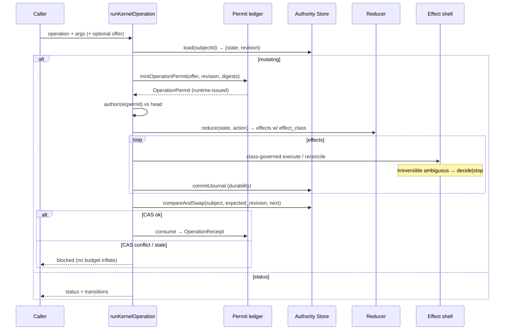

# Design: K2.1 — Authority Store, OperationPermit y semántica de efectos

## Technical Approach

Extend the K2 functional-core / imperative-shell without new runtime deps.
CAS becomes the **only** public mutation contract over the existing journaled
store; runtime-minted `OperationPermit` replaces non-empty `AuthorityToken` as
mutation authority; every reducer effect intent carries an explicit effect
class that drives shell retry / decide|stop.

Maps 1:1 to change-local specs `authority-store`, `operation-permits`,
`effect-semantics`, and the five deltas. Preserves K2 journal replay,
`commitJournal` barriers, bridges, and fixed-policy defaults.

Mode: `design-after-spec`.

## Architecture Decisions

### Decision: CAS wraps journaled commit (not a second store)

| Option | Tradeoff | Decision |
|--------|----------|----------|
| New store beside journal | Dual authority; replay drift | Reject |
| Replace journal with CAS log | Breaks K2 replay fixtures | Reject |
| Adapter: `load`/`compareAndSwap` over existing state+journal | Single authority; journal intact | **Choose** |

**Choice:** `scripts/lib/authority-store/` adapts K2 `createMemoryStore` (and
compatible injectables). `compareAndSwap` succeeds only when
`expectedRevision === headRevision`, then persists via existing commit
semantics. Public callers MUST NOT receive a bare `commit` path.
`commitJournal` remains for mid-op durability (pre-CAS). See ADR-001.

### Decision: Revision digest = canonical head fingerprint

**Choice:** `revision = sha256Fingerprint("authority-store:revision", { state_digest, journal_digest })`
where `state_digest` reuses `digestLifecycleState` and `journal_digest` is a
canonical hash of the ordered journal. Missing subject → fail-closed
(`subject-not-found`); no invented revision. Default subject id:
`lifecycle:default` for the single-subject K2 harness.

**Rationale:** CAS must observe both state and journal advances; state-only
digests would allow journal races.

### Decision: OperationReceipt is a new schema family

**Choice:** Publish `schemas/kernel/operation-permit/v1` and
`schemas/kernel/operation-receipt/v1` with distinct `$id`s. Kind
`operation-receipt/v1`. Never alias `receipt/v1`. See ADR-002.

### Decision: Runtime-owned permit registry (no model mint)

**Choice:** Only `mintOperationPermit(...)` inside the kernel runtime may insert
into an in-memory (or store-backed) permit ledger keyed by `permit_id`.
Authorize requires ledger membership + field validation +
`expected_revision === head`. Consume marks single-use and emits
`OperationReceipt`. Fabricated permits / non-empty `AuthorityToken` alone fail
closed. See ADR-003.

### Decision: Effect class drives retry; irreversible ambiguity → decide|stop

**Choice:** Reducer effects gain required `effect_class`. Shell policy table
from `effect-semantics` spec. Ambiguous `irreversible` → outcome/next kind
`decide` or `stop`; never blind re-execute. Extends `reconcileEffect` without
claiming false exactly-once over external I/O. See ADR-004.

### Decision: TransitionOffer remains non-authorizing

**Choice:** `next_transition` / offers may feed mint inputs (operation + digests)
but NEVER authorize. Mint = offer + head revision + digests + runtime issuer.

## Data Flow



```text
Concurrent writers (same R):
  W1 CAS(R) → win → head R'
  W2 CAS(R) → cas-conflict (budgets unchanged)

Exact replay (same R, same keys):
  journal shows completed → skip effects → CAS converges (no second advance)
```

## File Changes

| File | Action | Description |
|------|--------|-------------|
| `scripts/lib/authority-store/index.js` | Create | `load` / `compareAndSwap` / revision helpers; wrap memory store |
| `scripts/lib/authority-store/*.test.js` | Create | CAS conflict, stale, missing subject, convergent replay |
| `scripts/lib/lifecycle-kernel/permits.js` | Create | mint / authorize / consume / ledger; reject self-grant |
| `scripts/lib/lifecycle-kernel/permits.test.js` | Create | stale, reuse, token≠permit, offer-only reject |
| `scripts/lib/lifecycle-kernel/effect-policy.js` | Create | class → retry/decide/stop policy |
| `scripts/lib/lifecycle-kernel/index.js` | Modify | Require permit + CAS; drop bare `commit` as mutation API; wire mint/consume |
| `scripts/lib/lifecycle-kernel/operations.js` | Modify | Authorize via permit (token insufficient for mutate) |
| `scripts/lib/lifecycle-kernel/reducer.js` | Modify | Emit `effect_class` on every effect intent |
| `scripts/lib/lifecycle-kernel/journal.js` | Modify | Class-aware reconcile; irreversible ambiguity codes |
| `scripts/lib/minimal-kernel-harness.js` | Modify | Fault matrix: CAS/stale/reuse/ambiguous-irreversible via public API |
| `scripts/lib/lifecycle-model.js` | Modify | Seven executable K2.1 checkers; remove CAS/permit from deferred |
| `schemas/kernel/operation-permit/v1.schema.json` | Create | Permit contract + fixtures |
| `schemas/kernel/operation-receipt/v1.schema.json` | Create | Distinct from `receipt/v1` |
| `schemas/kernel/effect-class/v1.schema.json` | Create | Closed enum |
| `schemas/kernel/manifest.json` | Modify | Register three families |
| `scripts/lib/lifecycle-kernel/bridges.js` | Modify | No-regression; no second authority |
| `docs/roadmaps/harness-evolution.md` | Modify | Tag K2.1 surfaces `implemented` on archive/apply close |
| `docs/architecture/harness-evolution.md` | Modify | Same maturity labels; later slices stay `target` |

## Spec → design allocation

| Spec MUST | Component / interface |
|-----------|----------------------|
| REQ-authority-store-001..004 | `authority-store` `load`/`compareAndSwap` |
| REQ-operation-permits-001..004 | `permits.js` + schemas |
| REQ-effect-semantics-001..004 | reducer `effect_class` + `effect-policy` + shell |
| REQ-lifecycle-kernel-runtime-010..012 / 006 | `runKernelOperation` authorize + CAS path |
| REQ-minimal-kernel-harness-007..008 | harness fault matrix + fixed fixtures |
| REQ-lifecycle-model-conformance-007 / 003–004 | model checkers |
| REQ-kernel-contract-schemas-006..007 / 001 | schema families + manifest |
| REQ-harness-authority-canon-005..006 | docs maturity + no second authority |

## Interfaces / Contracts

```js
// Authority Store
load(subjectId) → { state, journal, revision } | fail(code)
compareAndSwap(subjectId, expectedRevision, nextState, nextJournal?)
  → { ok: true, revision } | { ok: false, code: "cas-conflict"|"stale-revision"|"subject-not-found", revision? }

// Permit (runtime-only mint)
mintOperationPermit({
  domain, operation, subject_id, expected_revision,
  arguments_digest, scope_digest, policy_digest, budget_ref,
}) → OperationPermit  // single_use: true; permit_id runtime-allocated

authorizeMutation({ permit, headRevision, ledger }) → { ok } | { ok:false, code }
consumePermit({ permit_id, ledger }) → OperationReceipt

// Effect intent (reducer)
{ effect_id, kind, payload, effect_class: "pure"|"idempotent-keyed"|"probeable"|"compensatable"|"irreversible" }
```

Stable reason codes (minimum): `cas-conflict`, `stale-permit`, `permit-reuse`,
`permit-not-runtime-issued`, `unauthorized` (token-only), `effect-class-required`,
`irreversible-ambiguous`, `subject-not-found`, `direct-write-blocked`.

`runKernelOperation` input grows: accept `operationPermit` (or mint from offer
+ digests when runtime path requests it). Mutating ops without permit → blocked.
Final state advance → `store.compareAndSwap` only.

## Testing Strategy

| Layer | What | Approach |
|-------|------|----------|
| Unit | CAS, revision, mint/authorize/consume, effect-policy, reducer classes | `node --test`; Strict TDD |
| Contract | Permit/receipt/effect-class schemas + valid/invalid fixtures | Schema suite + manifest pin |
| Integration | Kernel path: permit → effects → CAS → receipt; journal replay | Memory authority store |
| Harness | Fault matrix + fixed-path green | Public `runHarnessScenario` / kernel entry |
| Model | Seven K2.1 executable invariants | Real harness; no deferred placeholders |
| Negative | receipt/v1 as OperationReceipt; model self-grant; bare commit | Fail-closed assertions |

## Migration / Rollout

1. Schemas + authority-store behind tests.
2. Permits ledger + authorize boundary (token≠permit).
3. Effect classes on reducer + shell policy.
4. Wire `runKernelOperation` to CAS; remove public bare commit.
5. Harness fault matrix + model checkers.
6. Doc maturity labels; keep bridges/fixed unchanged.
7. Rollback: revert modules/schemas; restore K2 `commit` + token authorize; leave journal history.

`delivery_strategy: exception-ok` — slice tasks store → permits → effects → harness/model.

## Open Questions

None blocking. Apply MUST pin exact reason-code strings and default `subject_id`
in `apply-progress.md` when implementing.
