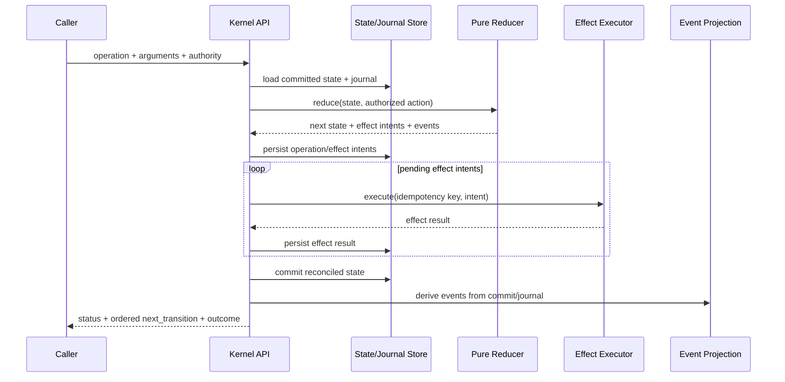

# Design: K2 — Lifecycle Kernel, Minimal Harness y Model-Based Conformance

## Technical Approach

K2 uses a **functional core / imperative shell**. The pure reducer owns lifecycle
semantics; an outer runtime owns persistence, journal reconciliation and effect
execution. `status` and `next_transition` are derived from committed state through
one public kernel API.

The Minimal Kernel Harness invokes that same public API with deterministic
in-memory/filesystem test boundaries. A bounded model generates action traces and
checks invariants; every counterexample is replayed through the harness.

K2 consumes K1 contracts and remains host-agnostic. It does not introduce
HostCapabilities, Candidate identity, Execution Graph, productive budgets,
workers, attestations or delivery authorization.

## Architecture Decisions

### Decision: Functional core, imperative shell

**Choice:** `reduceLifecycle(state, authorizedAction)` is pure and returns
`{state, effects, events, outcome}`. Persistence and effect execution occur in
`runKernelOperation(...)`.

**Rationale:** deterministic replay, model exploration and fail-closed behavior
cannot be trusted if the reducer performs I/O.

**Rejected:** command-oriented handlers that mutate state directly; event-sourced
authority; model-selected state mutations.

### Decision: Committed state and journal are authoritative; events are projections

**Choice:** lifecycle state plus operation/effect journal records are persisted
through an injected store. Events are deterministically derived after successful
state/journal commits.

**Rationale:** events must be rebuildable and cannot become a second authority.

### Decision: Stable idempotency keys before effects

**Choice:** each authorized operation has a stable operation ID derived from
kernel version, state digest, operation and normalized arguments. Each effect
derives a child idempotency key. The journal records intent/start/completion/fail
before reconciliation decides whether execution is required.

**Rationale:** interruption after effect completion but before final state commit
must not duplicate the effect.

### Decision: Transition priority is explicit and total

**Choice:** valid transitions are selected using an explicit priority table and
stable secondary ordering. No filesystem enumeration, object insertion order,
clock or model response affects ordering.

**Rationale:** “same state → same ordered transitions” must be mechanically true.

### Decision: Recovery is validated by execution, not wording

**Choice:** every named recovery fixture is executed through the Minimal Kernel
Harness. A recovery that returns the same blocking digest is rejected unless it
reaches a separately identified terminal outcome.

**Rationale:** syntactic command validity is insufficient; advertised recovery
must be operationally honest.

### Decision: Reduced model in Node.js, no external formal-method dependency

**Choice:** a finite model enumerates bounded operation states, interruption
points, journal states and actions. Exploration uses deterministic BFS/DFS under
`node:test`, emitting stable traces/seeds.

**Rationale:** gives executable invariant coverage now; TLA+/Alloy remains
available later for scheduler/worktree/federation complexity.

## Runtime Data Flow



## Interruption/Reconciliation Flow

```text
load state/journal
  → derive stable operation/effect IDs
  → if completed: do not execute again
  → if started/unknown: reconcile exact outcome
  → if pending: execute once
  → commit next state
  → derive events
```

## Proposed File Allocation

| File | Action | Responsibility |
|------|--------|----------------|
| `scripts/lib/lifecycle-kernel/index.js` | New | Public `status` / operation API |
| `scripts/lib/lifecycle-kernel/reducer.js` | New | Pure state transition function |
| `scripts/lib/lifecycle-kernel/operations.js` | New | Operation registry and validation |
| `scripts/lib/lifecycle-kernel/transition-selector.js` | New | Ordered `next_transition` derivation |
| `scripts/lib/lifecycle-kernel/journal.js` | New | Operation/effect IDs and journal reconciliation |
| `scripts/lib/lifecycle-kernel/events.js` | New | Derived non-authoritative event projection |
| `scripts/lib/lifecycle-kernel/state-digest.js` | New | Canonical state digest using K1 canonical JSON |
| `scripts/lib/lifecycle-kernel/bridges.js` | New | Existing routing/review/archive compatibility boundaries |
| `scripts/lib/minimal-kernel-harness.js` | New | Public-API headless scenario runner |
| `scripts/lib/lifecycle-model.js` | New | Reduced model and bounded exploration |
| `scripts/lib/next-transition.js` | Modify | Validate K2-selected transition and command honesty hook |
| `scripts/lib/transition-parity.js` | Modify | Runtime state-digest parity |
| `scripts/lib/**/*.test.js` | New/Modify | RED→GREEN unit, integration, harness and model tests |

Exact store integration points SHALL be selected during apply from existing
OpenSpec state readers/writers; K2 MUST NOT introduce a second state file format
when a compatible persisted authority already exists.

## Interfaces

### Public kernel operation

```js
runKernelOperation({
  operation,          // status|start|complete|fail|invalidate-node|recover
  arguments: {},
  authorityToken,
  store,
  effectExecutor,
  clock,              // injected; excluded from semantic digest
});
```

Result:

```js
{
  schema_version: 1,
  state_digest: "sha256:...",
  status: {},
  transitions: [],
  next_transition: {},
  outcome: "advanced|terminal|blocked|decision-required",
  events: [],
}
```

### Pure reducer

```js
reduceLifecycle(state, action) -> {
  state,
  effects: [{ effect_id, kind, payload }],
  events: [{ kind, subject, payload }],
  outcome,
}
```

The reducer MUST NOT accept a host adapter or process executor.

### Opaque model ports

```js
{
  subject_id: "opaque:...",
  authority_token: "opaque:...",
  budget_ref: "opaque:...",
  policy_ref: "opaque:...",
}
```

These values support equality/change checks only.

## Invariant Allocation

| Invariant | K2 implementation |
|-----------|-------------------|
| Same state → same transitions | State digest + explicit total ordering |
| Invalid transitions fail closed | Operation registry + reducer guard |
| Replay no duplicate effects | Journal + idempotency keys + harness interruption matrix |
| Recovery advances/terminates | Harness executes named recovery |
| Models cannot mutate state | Authorized operation boundary |
| Exhaustion cannot restart | Terminal-state selector rules |
| Events do not alter state | Derived event projection |
| Terminal has no ordinary execute | Selector terminal guard |
| Subject-bound invalidation | Opaque model port only |
| Candidate mutation invalidates verification | Deferred to K3/K6b |
| Correction budget monotonicity | Deferred to K5/K7 |
| Delivery authorization | Deferred to K10-delivery |
| Policy invalidates attestation/auth | Deferred to K8/K10-delivery |

## Testing Strategy

| Layer | Coverage |
|-------|----------|
| Unit | Reducer purity, operation guards, ordering, state digest, journal IDs, event derivation |
| Contract | K1 schema validation for selected transitions and failure/recovery/event shapes |
| Integration | Store + journal + effect executor reconciliation; review/archive bridges |
| Harness E2E | Interruption matrix, replay, recovery execution, snapshot round-trip, decide halt |
| Model | Bounded state/action exploration and eight executable invariants |
| Negative scope | No host API, Candidate, Graph, productive budget, attestation or delivery modules in K2 |
| Full regression | `npm test` |

Strict TDD is mandatory. Each behavioral slice starts with a failing test and
records RED/GREEN evidence in `apply-progress.md`.

## Migration / Rollout

1. Land pure state/digest/operation primitives behind tests.
2. Add journal and reconciliation while keeping existing callers unchanged.
3. Add Minimal Kernel Harness and make every named recovery executable in fixtures.
4. Add reduced model and CI conformance.
5. Introduce compatibility bridges one subsystem at a time:
   routing → review → archive → orchestrator.
6. Switch only covered lifecycle operations from prose interpretation to K2.
7. Keep `fixed` policy and all host-specific behavior unchanged.
8. Roll back by disabling bridges and reverting K2 modules; K1 contracts remain.

## Open Questions

None blocking for proposal/spec/design. Apply MUST inventory the exact existing
state readers/writers and operation entrypoints before editing, and MUST record
that mapping in `apply-progress.md`.
