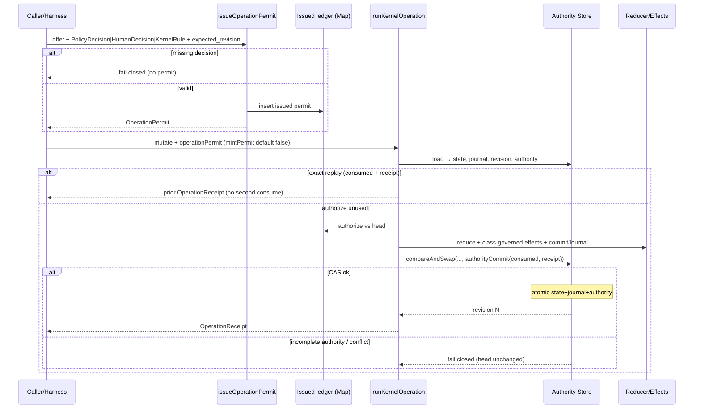

# Design: K2.1b — Permit issuance control and atomic consume

## Technical Approach

Correct K2.1 authority gaps without reopening K2a/K3: (1) separate controlled
issuer so public `runKernelOperation` never auto-mints; (2) fold permit consume
+ `OperationReceipt` into the same Authority Store CAS that commits
`next_state` / `next_journal`; (3) exact replay returns the stored receipt;
(4) in-process restart reloads consume/receipt from the store snapshot;
(5) roadmap WARNING5 quick-path wording.

Maps 1:1 to change-local deltas `operation-permits`, `authority-store`,
`lifecycle-kernel-runtime`, `minimal-kernel-harness`,
`lifecycle-model-conformance`, `harness-authority-canon`. Parent:
`archive/2026-08-04-k2-1-authority-store-permits/`. Mode: `design-after-spec`.

## Architecture Decisions

### Decision: Controlled issuer is a separate public API

| Option | Tradeoff | Decision |
|--------|----------|----------|
| Keep `mintPermit=true` default on `runKernelOperation` | State-valid ≡ authorized | Reject |
| Gate mint behind flag only | Callers still auto-mint on public path | Reject |
| `issueOperationPermit(offer + decision/rule + revision)` outside mutate path | Explicit authority; public path fail-closed | **Choose** |

**Choice:** Export `issueOperationPermit` from `permits.js` (re-exported by
kernel index). Require `TransitionOffer` + exactly one of
`PolicyDecision` | `HumanDecision` | `KernelRule` + `expected_revision`.
Remove the public auto-mint branch (`mintPermit` default `false`; `true` is
rejected with `auto-mint-disabled`). Low-level `mintOperationPermit` remains
internal to the issuer (tests may still call it only via issuer helpers).
See ADR-001.

### Decision: Consume + receipt live in the CAS subject authority bag

| Option | Tradeoff | Decision |
|--------|----------|----------|
| Keep post-CAS Map consume | Dual truth; CAS can succeed with null receipt | Reject |
| Put consume only in journal rows | Couples effect journal to authority ledger | Reject |
| Atomic `authority` bag on subject, written inside `compareAndSwap` | Single commit; restart via snapshot | **Choose** |

**Choice:** Each Authority Store subject holds
`authority: { permits: {id→{permit,status}}, receipts: {id→receipt} }`.
Permit-authorized CAS MUST pass `authorityCommit`; incomplete → fail closed
(`authority-commit-incomplete`) with head unchanged. Process-local Map remains
**issued-only** mirror until consume; winning revision is sole consume truth.
Revision fingerprint stays `{state_digest, journal_digest}` (parent ADR-001) so
mid-op baselines and in-flight `expected_revision` values stay stable; authority
is co-committed and returned by `load` / `snapshot`. See ADR-002.

### Decision: Exact replay short-circuits before re-consume

**Choice:** After load, if the presented permit is already `consumed` in the
authority bag and an `OperationReceipt` exists for that `permit_id` with matching
`operation` / `subject_id` / digests, return that receipt without re-running
effects or a second consume. Convergent CAS (`converged: true`) also resolves
receipt from the bag. Authorize `permit-reuse` still blocks a consumed permit
when no matching receipt/replay keys exist.

### Decision: Issuer decision DTOs are runtime-validated shapes (no new schema families)

**Choice:** Minimal frozen `kind` discriminators
(`policy-decision/v1` | `human-decision/v1` | `kernel-rule/v1`) validated in
`issueOperationPermit`. No new entries in `schemas/kernel/manifest.json` in this
slice (proposal did not add schema families). Later slices may promote schemas.

## Data Flow



```text
In-process restart:
  snap = store.snapshot()  → { state, journal, authority }
  store2 = createAuthorityStore({ initial: snap })
  load → consumed permit + receipt still verifiable
  (unused issued Map entries are not required across restart)
```

## Spec → design allocation

| Spec MUST | Component / interface |
|-----------|----------------------|
| REQ-operation-permits-005 | `issueOperationPermit` + decision DTO check |
| REQ-operation-permits-006 | CAS `authorityCommit` + replay short-circuit + snapshot |
| REQ-authority-store-005 / 006 / MOD-004 | `compareAndSwap` + `load`/`snapshot` authority bag |
| REQ-lifecycle-kernel-runtime-015 / 016 / MOD-011 | `runKernelOperation` defaults + wire CAS commit |
| REQ-minimal-kernel-harness-011 / 012 / MOD-007 | Issuer-first fixtures; atomic/replay/restart scenarios |
| REQ-lifecycle-model-conformance-009 / MOD-007 | K2.1b checkers 1–5 + inv 8–9 |
| REQ-harness-authority-canon-008 / 009 | Docs maturity + WARNING5 quick-path |

## File Changes

| File | Action | Description |
|------|--------|-------------|
| `scripts/lib/lifecycle-kernel/permits.js` | Modify | Add `issueOperationPermit`; decision validation; keep Map as issued ledger |
| `scripts/lib/lifecycle-kernel/permits.test.js` | Modify | Issuer RED/GREEN; offer-only reject; decision required |
| `scripts/lib/lifecycle-kernel/test-permit-helpers.js` | Modify | Issuer-first helpers for fixtures |
| `scripts/lib/lifecycle-kernel/index.js` | Modify | `mintPermit` default false; drop auto-mint; atomic CAS commit; replay receipt |
| `scripts/lib/lifecycle-kernel/index.test.js` | Modify | Default false; atomic consume; replay; restart |
| `scripts/lib/authority-store/index.js` | Modify | Authority bag; CAS `authorityCommit`; extend `load`/`snapshot`/`initial` |
| `scripts/lib/authority-store/index.test.js` | Modify | Atomic payload; incomplete reject; replay receipt; restart |
| `scripts/lib/lifecycle-kernel/memory-store.js` | Modify | Optional: persist authority if inner store owns it; prefer bag on Authority Store entry |
| `scripts/lib/minimal-kernel-harness.js` | Modify | Default `mintPermit: false`; issuer-first positive steps |
| `scripts/lib/minimal-kernel-harness.test.js` | Modify | Atomic/replay/restart + positive issuer companions |
| `scripts/lib/lifecycle-model.js` | Modify | K2.1b executable invariants/checkers |
| `scripts/lib/lifecycle-model*.test.js` / related | Modify | Pin new checkers non-optional |
| `docs/roadmaps/harness-evolution.md` | Modify | Quick-path: replace bare `Ejecutar K2a → K3`; tag K2.1b `implemented` |
| `docs/architecture/harness-evolution.md` | Modify | Same maturity / no K3-as-implemented claim |

Authority bag lives on the **Authority Store subject entry** (not only the inner
memory store) so `commitJournal` mid-op paths stay unchanged; CAS writes bag +
`inner.commit` in one success path before returning `ok: true`.

## Interfaces / Contracts

```js
// Decision DTOs (exactly one required by issuer)
{ kind: "policy-decision/v1", decision_id, subject_id?, operation?, note? }
{ kind: "human-decision/v1", decision_id, subject_id?, operation?, note? }
{ kind: "kernel-rule/v1", rule_id, subject_id?, operation?, note? }

issueOperationPermit({
  ledger, transitionOffer, expected_revision, subject_id,
  policyDecision?, humanDecision?, kernelRule?, // exactly one
  arguments?, arguments_digest?, scope_digest?, policy_digest?, budget_ref?,
}) → OperationPermit | throws/returns fail-closed

// Authority Store
load(subjectId) → { ..., authority: { permits, receipts } }
snapshot(subjectId) → { state, journal, authority }
compareAndSwap(subjectId, expectedRevision, nextState, nextJournal, midOpTicket?,
  authorityCommit?: {
    permit_id, receipt /* operation-receipt/v1 */, status: "consumed"
  } | null
)
// Permit-authorized mutate: authorityCommit REQUIRED; omit/partial →
//   { ok:false, code:"authority-commit-incomplete" }

runKernelOperation({ ..., mintPermit = false, operationPermit, permitLedger })
// mintPermit === true → blocked code "auto-mint-disabled"
```

Stable reason codes (additive): `auto-mint-disabled`, `issuer-decision-required`,
`issuer-decision-ambiguous`, `authority-commit-incomplete`, plus existing
`stale-permit`, `permit-reuse`, `cas-conflict`, `unauthorized`.

## Testing Strategy

Strict TDD (`strict_tdd: true`); `node --test` / `npm test`.

| Layer | What to Test | Approach |
|-------|-------------|----------|
| Unit | Issuer decision gate; CAS authorityCommit accept/reject; replay lookup | RED→GREEN in permits + authority-store tests |
| Integration | issue → authorize → CAS atomic bag; consume failure cannot advance head | Kernel index tests with memory authority store |
| Replay | Exact identical op returns same receipt_id; no second consume | Kernel + harness fixtures |
| Restart | `snapshot` → new store `initial` → load verifies consumed+receipt | Harness REQ-012 |
| Harness | Positive issuer-first; fault matrix unchanged; auto-mint path not counted | `minimal-kernel-harness` |
| Model | Invariants 1–5 (K2.1b) + inv 8–9; none deferred | `lifecycle-model` checkers |
| Docs | Quick-path ≠ bare `Ejecutar K2a → K3`; K2.1b implemented; K3 not | Contract/docs assertion or checklist in verify |

Acceptance gates: 0 state-valid-only auth; 0 commit without issued permit; 0
commit without same-revision consume; exact replay → prior receipt; in-process
restart verifiable; WARNING5 fixed.

## Migration / Rollout

1. Authority bag + CAS `authorityCommit` (store tests first).
2. Issuer API + kill public auto-mint default.
3. Wire kernel: prepare receipt pre-CAS; commit atomically; replay short-circuit.
4. Migrate harness/model/helpers to issuer-first (expect widespread fixture churn).
5. Docs WARNING5 + maturity labels.
6. Rollback: revert modules/docs; restore K2.1 `mintPermit=true` + post-CAS Map
   consume; leave journal history.

`delivery_strategy: exception-ok` — slice store → issuer → kernel wire →
harness/model → docs.

## Open Questions

None blocking. Apply MUST pin exact decision DTO field names and reason-code
strings in `apply-progress.md` when implementing.
