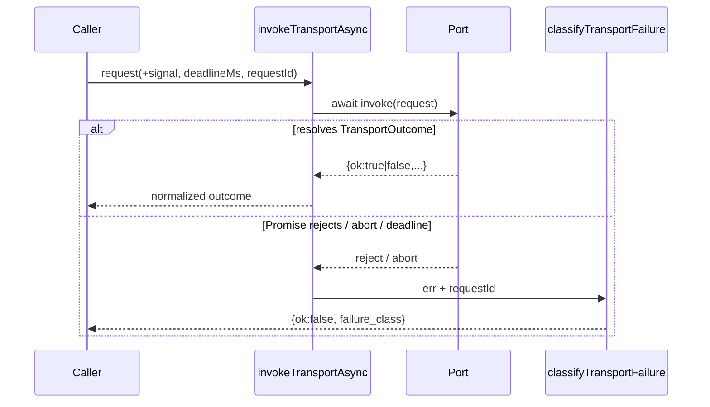

# Design: k2a-1 Live Capability Probes + Async Transports

## Technical Approach

Correct K2a in place under Strict TDD. Keep digest reproducibility for fixture
`evidence_digest`, but make `verifyCapabilityProof` fail closed unless callers
supply live expected identity and a probe digest distinct from the fixture
digest. Share one async invoke+classify path between Headless Conformance Host
and `lifecycle-kernel/host-boundary.js`. Gate Claude `enforced` on live probes.
Drive the fault matrix through failing port implementations. Publish additive
`transport-request` / `transport-outcome` / `transport-failure` v1 families
without rewriting existing transport `$id`s. Deep-freeze adapter surfaces after
`createHostAdapter`. Add a harness-alone negative runtime test for W4.

Maps to proposal CRITICAL 3–5 + W1–W4 and the seven change-local spec deltas.

## Architecture Decisions

### Decision: Live expected-identity + probe binding on verify

| Option | Tradeoff | Decision |
|--------|----------|----------|
| Keep positional verify; soft-match live fields | Callers can omit live bind; CRITICAL 3 stays open | Reject |
| New object API; require expected* + distinct probe digest | Migrates call sites in-change; fail-closed | **Choose** |
| Replace fixture digest with probe digest | Breaks reproducibility / proof identity | Reject |

**Choice**: Change `verifyCapabilityProof` to an options object requiring
`expectedAdapterId`, `expectedAdapterVersion`, `expectedHostRuntimeVersion`,
and `expectedProbeDigest`. Extend CapabilityProof with `adapter_id` and
`probe_digest`. Keep `createEvidenceDigest` unchanged. Add
`createProbeDigest` under domain `capability-probe/v1`. Reject when
`expectedProbeDigest === evidence_digest` (fixture ≠ live probe).
**Rationale**: Spec REQ-capability-proof-005; closes foreign adapter/host/
fixture-as-probe gaps. See ADR-001.

### Decision: Shared async transport normalize path

| Option | Tradeoff | Decision |
|--------|----------|----------|
| Per-caller await/catch | Drift between headless and kernel | Reject |
| Shared `invokeTransportAsync` + `classifyTransportFailure` | One contract; AbortSignal/deadline once | **Choose** |
| Sync-only + try/catch around invoke | Misses rejected Promises (CRITICAL 5) | Reject |

**Choice**: Host-contract exports `invokeTransportAsync(port, request)` returning
`Promise<TransportOutcome>`, awaiting port `invoke`/`run`/function, catching
rejections into `{ ok: false, failure_class, requestId? }`. Classes:
`timeout`, `cancel`, `reject`, `interrupt`, `worker-fail`. Request carries
`requestId`, optional `signal` (AbortSignal), optional `deadlineMs`.
**Rationale**: REQ-host-capabilities-contract-006/008;
REQ-headless-conformance-host-005; REQ-lifecycle-kernel-runtime-017.
See ADR-002.

### Decision: Claude `enforced` only after live probe

| Option | Tradeoff | Decision |
|--------|----------|----------|
| Fixture proof ⇒ `enforced` (today) | False enforcement authority | Reject |
| Probe gate + honest degrade without primitives | Honest states; `enforced` rare until probed | **Choose** |
| Always `instructional` | Blocks legitimate live demos | Reject |

**Choice**: Without injected primitives that complete a live probe, Claude
capabilities resolve to `unavailable` | `instructional` | `partial`.
`enforced` only when probe succeeds and proof verifies against live expected
identity + `expectedProbeDigest`. Fixture-only digests never authorize
`enforced`.
**Rationale**: REQ-reference-host-adapter-006/004. See ADR-003.

### Decision: Fault matrix through ports; synthetic inject non-normative

**Choice**: `runConformanceScenario` installs failing port wrappers (reject or
resolve `{ ok:false }`) then invokes via `invokeTransportAsync`. Keep
`injectFault` as a factory for those wrappers / expected shapes only — coverage
flags incomplete if faults never traverse published ports.
**Alternatives**: Synthetic outcome without invoke (status quo W1 gap);
private mocks bypassing ports (forbidden by spec).
**Rationale**: REQ-headless-conformance-host-002.

### Decision: Additive transport envelope schemas; deep-freeze ports

**Choice**: New families under `schemas/kernel/{transport-request,transport-outcome,transport-failure}/` with distinct `$id`s; pin existing five transport `$id`s via regression hashes. `createHostAdapter` deep-freezes transports, ports, and capability map (recursive `Object.freeze`).
**Alternatives**: Mutate existing transport v1 (forbidden); shallow freeze only (W3 gap).
**Rationale**: REQ-kernel-contract-schemas-011; REQ-host-capabilities-contract-007.

## Data Flow

```text
Live probe / AbortSignal request
        |
        v
 invokeTransportAsync ──catch──> classifyTransportFailure ──> {ok:false, failure_class}
        | resolve
        v
 TransportOutcome {ok:true|false, requestId?}
        |
   +----+----+
   |         |
   v         v
Headless   host-boundary.observeHostPort (async)
Conformance
   |
   | failing port wrappers (fault matrix)
   v
port_outcomes (never invent ok:true from rejection)

Claude primitives ──live probe──> createProbeDigest
        |                              |
        v                              v
CapabilityProof (adapter_id,           expectedProbeDigest
  evidence_digest, probe_digest)              |
        |                                     v
        +--------> verifyCapabilityProof <----+
                        |
              enforced | honest degrade
```



## Requirement Allocation

| Requirement | Allocation |
|-------------|------------|
| capability-proof 005, 002 | `capability-proof/index.js` object verify + `createProbeDigest`; schema `adapter_id`/`probe_digest`; call-site migration |
| host-capabilities-contract 006–008 | `host-contract/index.js` async invoke, classify, deep-freeze |
| reference-host-adapter 006, 004 | `host-adapters/claude.js` probe gate; registry/tests stop assuming fixture-only `enforced` |
| headless-conformance-host 005, 002 | await shared invoke; fault via port wrappers |
| lifecycle-kernel-runtime 017 | async `observeHostPort`; permit+CAS gate unchanged |
| kernel-contract-schemas 011, 001 | three new families + fixtures; manifest; pin tests |
| minimal-kernel-harness 013, 009 | negative runtime test harness-alone incompleteness |

## File Changes

| File | Action | Description |
|------|--------|-------------|
| `scripts/lib/capability-proof/index.js` | Modify | Object verify API; live bind; `createProbeDigest`; reason codes |
| `scripts/lib/capability-proof/index.test.js` | Modify | Foreign/missing/fixture≠probe cases |
| `scripts/lib/host-contract/index.js` | Modify | `invokeTransportAsync`, `classifyTransportFailure`, deep-freeze, forward expected* into resolve |
| `scripts/lib/host-contract/index.test.js` | Modify | Async reject/abort/freeze tests |
| `scripts/lib/host-adapters/claude.js` | Modify | Probe-gated states; async ports; live verify wiring |
| `scripts/lib/host-adapters/claude.test.js` | Modify | No fixture-only `enforced`; probe enables `enforced` |
| `scripts/lib/host-adapters/registry.test.js` | Modify | Stop requiring fixture-only enforced proofs as enforcement |
| `scripts/lib/headless-conformance-host.js` | Modify | Async invoke; fault-via-port wrappers |
| `scripts/lib/headless-conformance-host.test.js` | Modify | Rejection≠success; synthetic-alone incomplete |
| `scripts/lib/lifecycle-kernel/host-boundary.js` | Modify | Async observe + catch |
| `scripts/lib/lifecycle-kernel/host-boundary.test.js` | Modify | Rejected Promise → ok:false; no authority mint |
| `scripts/lib/minimal-kernel-harness.test.js` | Modify | W4 harness-alone negative runtime assertion |
| `scripts/lib/lifecycle-model.js` | Modify | Invariant checkers use new verify shape + live expected fields |
| `scripts/lib/k2a-schema-fixtures.test.js` | Modify | Add three families; pin five transport `$id` hashes |
| `schemas/kernel/capability-proof/v1.schema.json` | Modify | Add `adapter_id`, `probe_digest` (keep `$id`) |
| `schemas/kernel/capability-proof/fixtures/**` | Modify | Match new required/optional fields |
| `schemas/kernel/transport-{request,outcome,failure}/**` | Create | v1 schemas + valid/invalid fixtures |
| `schemas/kernel/manifest.json` | Modify | Register three additive families |

## Interfaces / Contracts

```js
// capability-proof
createProbeDigest({ capability_id, adapter_id, adapter_version, host_version, probe })
verifyCapabilityProof({
  capabilityId, expectedAdapterId, expectedAdapterVersion,
  expectedHostRuntimeVersion, expectedProbeDigest, proof, evidence
}) // → { ok, reason_code?, path?, evidence_digest?, probe_digest? }

// host-contract
invokeTransportAsync(port, { requestId, signal?, deadlineMs?, input? })
classifyTransportFailure(errOrOutcome, { requestId?, portName? })
createHostAdapter(...) // deep-frozen ports + capabilities

// Reason codes (stable): expected-field-missing, foreign-adapter,
// foreign-adapter-version, foreign-host, fixture-digest-not-live-probe,
// digest-mismatch, probe-digest-mismatch, ...
```

JSON Schema `$id`s:
`ospec://schemas/kernel/transport-request/v1`,
`.../transport-outcome/v1`,
`.../transport-failure/v1`.
`transport-failure` requires `ok: false` and `failure_class` ∈
`timeout|cancel|reject|interrupt|worker-fail`.

## Testing Strategy

| Layer | What to Test | Approach |
|-------|-------------|----------|
| Unit | Live bind mismatches; fixture≠probe; async reject/abort; deep-freeze; Claude degrade | Node test runner; table-driven; Strict TDD RED→GREEN |
| Contract | Three new families + pinned transport `$id`s; CapabilityProof field updates | `k2a-schema-fixtures.test.js` + validator |
| Integration | Fault matrix via ports; headless await+catch; Claude probe→enforced | Conformance host + adapter fixtures |
| Kernel | Boundary async failure; no permit/CAS bypass | `host-boundary.test.js` + existing suite |
| Negative | Harness-alone host-fault coverage incomplete | Dedicated runtime test (not prose) |

## Migration / Rollout

No data store migration. In-change call-site migration for `verifyCapabilityProof`
object form and CapabilityProof `adapter_id`/`probe_digest`. Suggested apply
slices (exception-ok delivery): (1) proof+schemas, (2) async host-contract +
boundary + headless, (3) Claude probe gate, (4) fault-via-port + W4 harness
negative. Rollback reverts those modules/schemas; leave K2.1b and K2a archive
untouched; K3 runtime stays blocked.

## Open Questions

None. Clarify skipped; observables fixed by specs and approvals.
