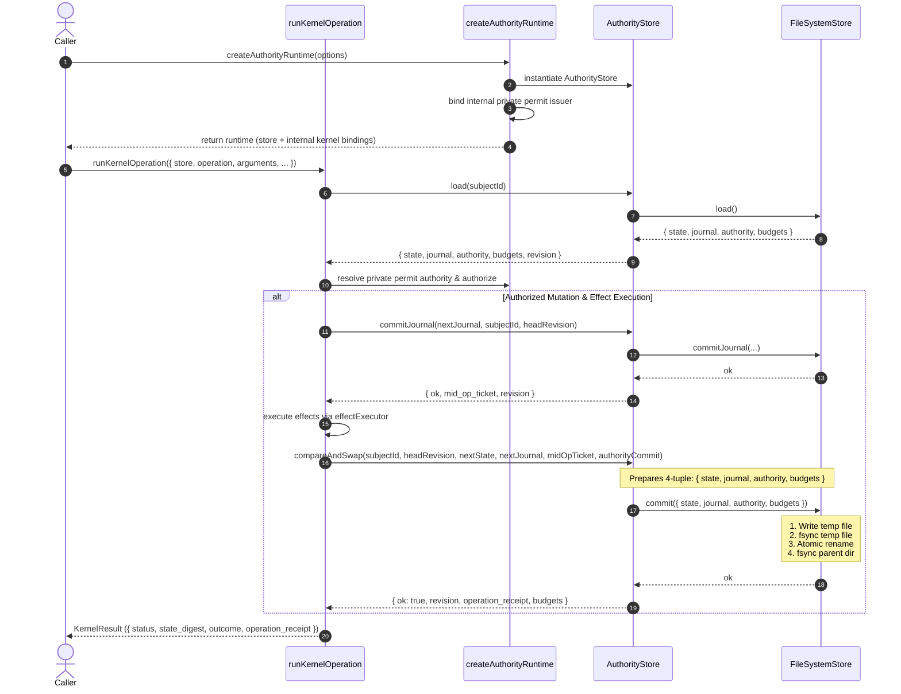

# Design Document: Private Issuer Capability & Single Atomic CAS Durable Record

**Change ID**: `k2-1d-private-issuer-durable-record`  
**Status**: Draft  
**Phase**: Design  

---

## 1. Architecture & Design Decisions

### Decision 1: Private Mint Authority Encapsulation

- **Context**: Previously, `AuthorityStore` exposed `getPermitIssuer()` on its public interface, and `permits.js` / `lifecycle-kernel` exported `PERMIT_AUTHORITY_ISSUER` with a global `Symbol.for("ospec.permitAuthorityIssuer")` brand. This allowed external callers or untrusted code to retrieve or fabricate permit minting capabilities.
- **Decision**:
  - Remove `getPermitIssuer()` from the public API of `AuthorityStore`.
  - Unexport `PERMIT_AUTHORITY_ISSUER` and `createPermitAuthorityIssuer` from public module surfaces (`permits.js`, `authority-store`, `lifecycle-kernel`).
  - Replace `Symbol.for("ospec.permitAuthorityIssuer")` with a module-scoped, unexported `Symbol()` (or internal Symbol identity). Forged objects using `Symbol.for(...)` will fail capability verification in `isPermitAuthorityIssuer`.
  - The public `AuthorityStore` interface exposes ONLY the following methods:
    - `load(subjectId)`
    - `compareAndSwap(subjectId, expectedRevision, nextState, nextJournal, midOpTicket, authorityCommit)`
    - `commitJournal(nextJournal, subjectId, fromRevision)`
    - `snapshot(subjectId)`
    - `computeRevision(state, journal, authority)`
    - `getBudgets(subjectId)`

### Decision 2: Single CAS Unit & Durability Schema

- **Context**: Previously, `AuthorityStore` maintained the `authority` bag and `budgets` in memory alongside the inner store, but passed only `{ state, journal }` to the inner store's `commit`/CAS method. This created potential torn-state scenarios where state/journal persisted while authority bag or budgets remained in detached in-memory structures or required manual `snapshot()` extraction across process restarts.
- **Decision**:
  - Unify state, journal, authority bag, and budgets into a single atomic durable record schema:
    ```json
    {
      "state": { ... },
      "journal": [ ... ],
      "authority": {
        "permits": { ... },
        "receipts": { ... }
      },
      "budgets": {
        "attempts": 0,
        "corrections": 0
      }
    }
    ```
  - The inner store CAS publishes this complete 4-tuple (`{ state, journal, authority, budgets }`) as a single atomic unit during `compareAndSwap`.
  - When reloading from disk, the inner store loads all 4 components together, ensuring complete restoration of the authority bag without manual out-of-band state copying or snapshot extraction.

### Decision 3: FileSystemStore Reference Implementation

- **Context**: File system storage must guarantee crash safety and prevent torn writes during CAS updates.
- **Decision**:
  - Implement `FileSystemStore` in `scripts/lib/filesystem-store.js` adhering to a strict 4-step atomic write sequence:
    1. **Temp Write**: Write the serialized JSON durable record `{ state, journal, authority, budgets }` to a unique temporary file path (e.g., `<head-path>.tmp.<uuid>`).
    2. **File `fsync`**: Perform explicit `fsync` (flush OS buffers to physical disk) on the open file descriptor before closing.
    3. **Atomic Rename**: Perform atomic rename (`rename` / `renameSync` with Windows fallback for EPERM/EEXIST) overwriting target path `head.json`.
    4. **Directory `fsync`**: Perform an `fsync` on the parent directory file descriptor to ensure the directory entry update is persisted to disk metadata.
  - Failure/Crash semantics:
    - Crash before rename: target `head.json` retains the previous committed head intact.
    - Crash after rename: target `head.json` retains the new committed head intact.
    - Zero torn state: write payload is atomic at OS filesystem level.

### Decision 4: Runtime Composition

- **Context**: The kernel requires access to permit minting capabilities to issue permits and authorize operations internally, but store instances and external callers must not hold or access the issuer capability directly.
- **Decision**:
  - Introduce `createAuthorityRuntime(options)` as the internal runtime composition factory.
  - `createAuthorityRuntime()` instantiates both the `AuthorityStore` and its private internal permit authority issuer capability, binding them privately within the runtime boundary.
  - Operations invoked through runtime composition (`runKernelOperation` or runtime environment) access the private issuer capability internally without surfacing `getPermitIssuer()` or exposing capability references on store instances or public APIs.

---

## 2. Data Flow & Sequence Diagram



---

## 3. File Changes Plan

| File | Change Description |
|------|-------------------|
| `scripts/lib/authority-store/index.js` | Remove `getPermitIssuer()` from public store interface. Update `compareAndSwap` and `load` to handle the full `{ state, journal, authority, budgets }` 4-tuple as a single atomic unit with inner store. Encapsulate permit issuer creation in `createAuthorityRuntime`. |
| `scripts/lib/lifecycle-kernel/permits.js` | Unexport `createPermitAuthorityIssuer` and `PERMIT_AUTHORITY_ISSUER`. Replace `Symbol.for("ospec.permitAuthorityIssuer")` with module-scoped private `Symbol()`. |
| `scripts/lib/lifecycle-kernel/index.js` | Update `runKernelOperation` to resolve issuer capability via private runtime context rather than calling `store.getPermitIssuer()`. |
| `scripts/lib/filesystem-store.js` | Implement reference `FileSystemStore` executing single 4-tuple atomic CAS (temp file + file `fsync` + atomic `rename` + dir `fsync`). |
| `scripts/lib/authority-store/index.test.js` | Update unit tests to verify `getPermitIssuer` is undefined, authority bag is preserved directly on disk reload, and atomic CAS 4-tuple operations. |
| `scripts/lib/lifecycle-kernel/index.test.js` | Add adversarial verification tests for symbol forgery, missing public capability exports, process restart recovery without `snapshot()`, and crash recovery. |

---

## 4. Testing Strategy & Adversarial Verification

1. **Public Surface Verification**:
   - Assert `store.getPermitIssuer === undefined` on initialized `AuthorityStore` instances.
   - Assert `PERMIT_AUTHORITY_ISSUER` and `createPermitAuthorityIssuer` are undefined on public exports of `lifecycle-kernel`, `authority-store`, and `permits`.

2. **Adversarial Symbol Forgery**:
   - Construct fake issuer object with `[Symbol.for("ospec.permitAuthorityIssuer")]: true`.
   - Pass fake issuer to `isPermitAuthorityIssuer` and kernel operation authorization; verify request is rejected with `issuer-capability-required` and zero state mutation.

3. **Disk Persistence & Restart**:
   - Perform a permit-authorized kernel mutation on a `FileSystemStore`-backed `AuthorityStore`.
   - Re-instantiate `AuthorityStore` from the same file path without calling `snapshot()`.
   - Verify `load()` immediately returns full state, journal, authority bag (consumed permits + receipts), and budgets intact.

4. **Atomic Write & Crash Resilience**:
   - Simulate process crash before atomic rename: verify original `head.json` remains untouched, incomplete temp files ignored.
   - Simulate process crash after atomic rename and dir `fsync`: verify new `head.json` loads cleanly with complete state + authority bag.
   - Verify zero torn writes (either full old head or full new head is read; never partial state).
