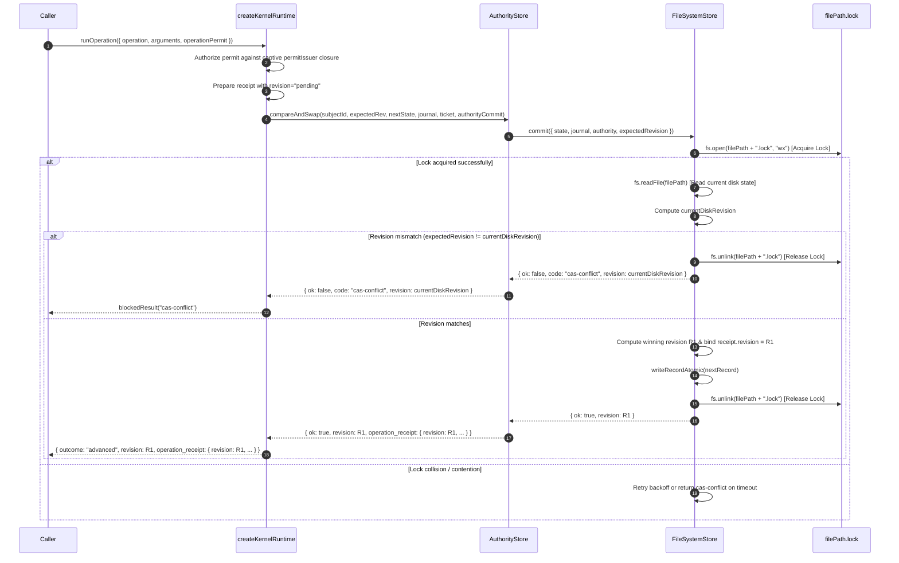

# Design: Private Runtime, Real Durable CAS & Crash-Safe Recovery

## 1. Architecture & Key Decisions

### Decision 1: Strict Runtime Closure & Elimination of Public Accessors
- **Context & Problem**: Internal capabilities such as `getPrivateIssuer` and `_createPermitAuthorityIssuerInternal` were previously exposed on public module exports (`authority-store/index.js`, `lifecycle-kernel/permits.js`, `lifecycle-kernel/index.js`, and `createAuthorityRuntime.getPrivateIssuer`). This created a capability leakage vector, enabling external callers to extract mint-capable permit authority objects outside runtime boundary controls.
- **Decision**: Completely remove `getPrivateIssuer` from `authority-store` and `lifecycle-kernel` exports. Remove `_createPermitAuthorityIssuerInternal` from `permits.js` exports. Introduce `createKernelRuntime(options)` as the sole public entrypoint for runtime operations and permit issuance.
- **Interface & Closure Scope**:
  `createKernelRuntime(options)` returns an unprivileged runtime interface:
  ```js
  {
    runOperation(input),
    issuePermitForSelectedTransition(input),
    getStatus(subjectId),
    snapshot(subjectId)
  }
  ```
  The `permitIssuer` (mint authority capability) is instantiated internally and held captive inside the closure scope of `createKernelRuntime`. No accessor, getter, or WeakMap reflection mechanism allows extracting `permitIssuer` outside the closure.

### Decision 2: Durable Convergent CAS Commit
- **Context & Problem**: In `AuthorityStore.compareAndSwap`, when an operation converged (where state and journal matched the existing committed record, but the authority bag required updating with consumed permits and receipts), `AuthorityStore` updated `entry.authority` in memory without invoking `inner.commit(...)`. Consequently, convergent authority healing was ephemeral and lost across process restarts.
- **Decision**: Update `compareAndSwap` in `AuthorityStore` so that convergent authority healing explicitly calls `await entry.inner.commit({ state: loaded.state, journal: loaded.journal, authority: nextAuthority, budgets: entry.budgets })` before returning `ok: true`.
- **Flow**:
  1. Detect state & journal unchanged, but `permitAuthorized` requiring authority bag update.
  2. Materialize `nextAuthority = materializeAuthorityCommit(entry.authority, authorityCommit)`.
  3. Compute `healedRevision = computeRevision(loaded.state, loaded.journal, nextAuthority)`.
  4. Bind `stored.revision = healedRevision` if `stored.revision === "pending"` or `null`.
  5. `await entry.inner.commit({ state: loaded.state, journal: loaded.journal, authority: nextAuthority, budgets: entry.budgets })`.
  6. Update in-memory state: `entry.authority = nextAuthority`, `entry.baselines.set(healedRevision, currentStateDigest)`.
  7. Return `{ ok: true, revision: healedRevision, converged: true, budgets: budgetsBefore, operation_receipt: clone(stored) }`.

### Decision 3: Multi-Instance Cross-Process CAS via Lockfile in FileSystemStore
- **Context & Problem**: Multiple processes or `FileSystemStore` instances pointing to the same underlying file system path could race during CAS, leading to silent overwrites or lost updates across processes.
- **Decision**: Add cross-process serialization to `FileSystemStore` using a `.lock` lockfile and pre-commit revision verification.
- **Implementation**:
  - `withFileLock(filePath, async fn, options)`: Uses `fs.open(filePath + ".lock", "wx")` to acquire exclusive lock. Retries with exponential backoff and jitter for lock contention. Detects and cleans up stale locks if lock file mtime exceeds lock timeout (5000ms). Ensures release via `try ... finally { await handle.close(); await fs.unlink(filePath + ".lock"); }`.
  - `FileSystemStore.commit({ state, journal, authority, budgets, expectedRevision })`:
    Inside `withFileLock`:
    1. Re-read target file from disk (`fs.readFile(filePath)`).
    2. Compute current on-disk revision `currentRevision = computeRevision(diskRecord.state, diskRecord.journal, diskRecord.authority)`.
    3. If `expectedRevision` is provided and `expectedRevision !== currentRevision`, return `{ ok: false, code: "cas-conflict", revision: currentRevision }` without writing.
    4. Write next record atomically using `writeRecordAtomic`.

### Decision 4: Resilient `.bak` Recovery in `load()`
- **Context & Problem**: On Windows file systems, atomic file renames (`renameWithFallback`) perform a two-step fallback (`target -> target.bak`, `temp -> target`, `unlink target.bak`) to handle locked files (`EPERM`/`EEXIST`). If the process crashes or is killed between step 1 and step 2, `target` is absent (`ENOENT`) while `target.bak` holds the valid pre-crash state. Previously, `FileSystemStore.load()` caught `ENOENT` and defaulted to `defaultRecord()`, resetting state and losing historical data.
- **Decision**: Update `FileSystemStore.load()` to inspect and recover from `filePath + ".bak"` if primary `filePath` returns `ENOENT`.
- **Implementation**:
  - In `load()`: Catch `ENOENT` from `fs.readFile(filePath)`.
  - Check if `filePath + ".bak"` exists via `fs.stat` or `fs.readFile`.
  - If `.bak` exists: restore `.bak` to `filePath` (`renameWithFallback(filePath + ".bak", filePath)`), load restored content, populate `memoryCache`, and return parsed record.
  - If neither `filePath` nor `filePath + ".bak"` exists: return `defaultRecord()`.

### Decision 5: Post-CAS Receipt Revision Binding
- **Context & Problem**: `prepareOperationReceipt` constructs an `OperationReceipt` prior to CAS execution. However, the winning head revision `R1` cannot be calculated prior to CAS because `R1` includes the authority root digest, which in turn includes the receipt itself.
- **Decision**: Materialize receipt with `revision: "pending"` pre-CAS. Pass receipt into `AuthorityStore.compareAndSwap`. `AuthorityStore` materializes `nextAuthority`, computes winning head revision `R1`, sets `receipt.revision = R1` in the stored authority bag before calling `inner.commit(...)`. Returns `operation_receipt` with `revision === R1`.

---

## 2. Sequence Diagram



---

## 3. Detailed File Change Specifications

### `scripts/lib/lifecycle-kernel/permits.js`
- Remove `_createPermitAuthorityIssuerInternal` from `module.exports`.
- Retain `createPermitAuthorityIssuer` as a module-internal helper.

### `scripts/lib/authority-store/index.js`
- Remove `getPrivateIssuer` from `module.exports`.
- Remove `STORE_ISSUERS` WeakMap and public accessor `getPrivateIssuer`.
- In `compareAndSwapLocked`:
  - On convergent heal path (`stateUnchanged` && `journalUnchanged` && `permitAuthorized`):
    - Materialize `nextAuthority = materializeAuthorityCommit(entry.authority, authorityCommit)`.
    - Compute `healedRevision = computeRevision(loaded.state, loaded.journal, nextAuthority)`.
    - Bind `stored.revision = healedRevision` if `stored.revision === "pending"` or `null`.
    - Execute `await entry.inner.commit({ state: loaded.state, journal: loaded.journal, authority: nextAuthority, budgets: entry.budgets })`.
    - Update `entry.authority = nextAuthority` and `entry.baselines.set(healedRevision, currentStateDigest)`.
    - Return `{ ok: true, revision: healedRevision, converged: true, budgets: budgetsBefore, operation_receipt: clone(stored) }`.

### `scripts/lib/lifecycle-kernel/index.js`
- Remove `getPrivateIssuer` from `module.exports`.
- Remove `createAuthorityRuntime` or remove `getPrivateIssuer` from its return value.
- Introduce `createKernelRuntime(options = {})`:
  - Instantiates internal `permitIssuer = createPermitAuthorityIssuer()`.
  - Instantiates `store = options.store || createAuthorityStore({ ...options, permitIssuer })`.
  - Returns closure object `{ runOperation, issuePermitForSelectedTransition, getStatus, snapshot }`.
- Pre-CAS receipt revision binding:
  - In `runKernelOperation`: set `receipt.revision = "pending"` pre-CAS.
  - Bind `receipt.revision` to post-CAS winning revision `cas.revision` (R1) upon successful commit.

### `scripts/lib/filesystem-store.js`
- Implement `withFileLock(filePath, async fn, options)`:
  - Exclusive lock via `fs.open(filePath + ".lock", "wx")`.
  - Retry loop with backoff and stale lock cleanup (timeout 5000ms).
  - Guarantee lock release in `finally` block.
- Update `load()`:
  - Catch `ENOENT` on `fs.readFile(filePath)`.
  - Inspect if `filePath + ".bak"` exists. If present, restore `.bak` to `filePath` using `renameWithFallback`, load content, update `memoryCache`, return record.
  - If `.bak` is missing, return `defaultRecord()`.
- Update `commit({ state, journal, authority, budgets, expectedRevision })`:
  - Wrap load-check-write in `withFileLock`.
  - If `expectedRevision` is supplied: load file from disk, calculate `currentRevision`. If `expectedRevision !== currentRevision`, return `{ ok: false, code: "cas-conflict", revision: currentRevision }`.
  - Perform `writeRecordAtomic`.

### `scripts/lib/atomic-write.js`
- Verify directory fsync error handling in `renameWithFallback` and `writeFileAtomic` to prevent crashes on platforms with unsupported directory fsync operations.
- Ensure file write errors are never swallowed and retain `.bak` context for crash recovery.

---

## 4. Comprehensive Test Plan

1. **Export Non-Leakage Tests**:
   - Assert `require("./authority-store").getPrivateIssuer` is `undefined`.
   - Assert `require("./lifecycle-kernel/permits")._createPermitAuthorityIssuerInternal` is `undefined`.
   - Assert `require("./lifecycle-kernel").getPrivateIssuer` is `undefined`.
   - Assert `createKernelRuntime()` instance object contains no `getPrivateIssuer`, `permitIssuer`, or raw minting functions.

2. **Multi-Instance CAS Concurrency Tests**:
   - Create 2 separate `FileSystemStore` instances referencing the same storage file initialized to revision R0.
   - Execute concurrent `compareAndSwap` calls from both instances.
   - Assert exactly one CAS succeeds (advancing revision to R1) and the other fails with `cas-conflict`.

3. **Convergent Authority Heal Durability Test**:
   - Trigger a convergent CAS (re-submitting identical state/journal with a new authority commit).
   - Assert `inner.commit(...)` was executed to persist updated authority bag.
   - Re-initialize `AuthorityStore` from disk and verify updated authority bag and receipts persist across restart.

4. **Resilient `.bak` Recovery Test**:
   - Simulate a process kill after rename step 1 (`target -> target.bak`) where `target` is missing and `target.bak` exists.
   - Invoke `FileSystemStore.load()`.
   - Assert `load()` restores `target` from `.bak`, loads historical state, and does NOT drop state to `defaultRecord()`.

5. **Post-CAS Receipt Revision Assertion**:
   - Execute an operation through `createKernelRuntime`.
   - Assert `operation_receipt.revision === cas.revision === R1`.
   - Replay operation and assert replayed receipt revision equals `R1`.
