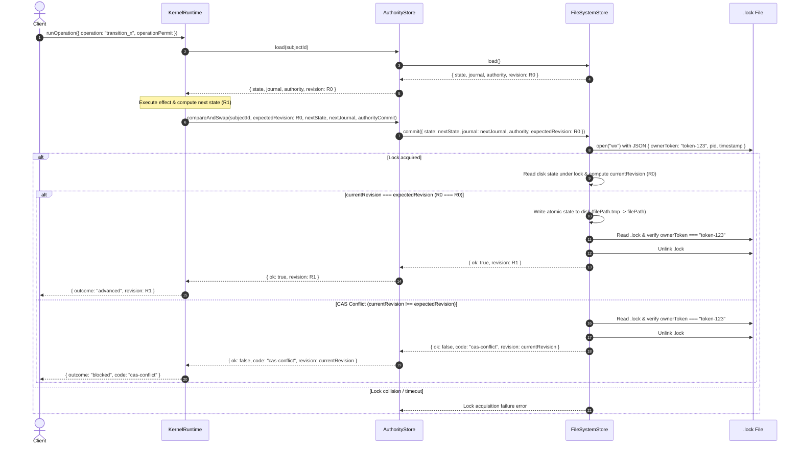

# Design: Close Authority Surface and Real Backend CAS

## Overview

This design addresses critical security vulnerabilities identified in the v2.40.6 release (K3 NO-GO decision):
1. **Public Permit Minting Surface Exposure**: Public production exports exposed direct permit minting and un-scoped operation execution functions (`_internalCreateIssuer`, `mintOperationPermit`, `issueOperationPermit`, `isPermitAuthorityIssuer`, `runKernelOperation`).
2. **CAS Backdoor & Omitted Verification**: `AuthorityStore.compareAndSwap` omitted `expectedRevision` when calling `entry.inner.commit(...)`, and `FileSystemStore.commit(...)` did not enforce `expectedRevision === currentRevision` under file lock.
3. **Silent State Re-initialization**: `FileSystemStore.load()` silently initialized a blank state on double `ENOENT` (missing primary and `.bak` files), creating state reset risk on corruptions or path mismatches.
4. **Unsafe Lockfile Teardown**: `withFileLock` unlinked `.lock` files unconditionally in `finally`, allowing concurrent processes to delete active lock files owned by other processes.

---

## 1. Key Architectural Decisions

### Decision 1: Complete Public Surface Closure & `createKernelRuntime` Entrypoint

- **Rationale**: Direct permit minting methods and `runKernelOperation` allow callers to bypass the kernel runtime's transition selection and permit issuance rules.
- **Specification**:
  - `scripts/lib/lifecycle-kernel/index.js` exports **only** `createKernelRuntime(options)` for production execution.
  - `_internalCreateIssuer`, `mintOperationPermit`, `issueOperationPermit`, `isPermitAuthorityIssuer`, and `runKernelOperation` are unexported from `lifecycle-kernel/index.js` and `permits.js`.
  - Direct permit minting helper utilities required for unit testing are isolated in `scripts/lib/test-support/permit-test-helpers.js`. Production code MUST NOT import from `test-support`.

### Decision 2: Backend CAS `expectedRevision` Propagation

- **Rationale**: `AuthorityStore` must propagate the current head revision to the inner persistence backend (`entry.inner.commit`) so backend implementations can perform atomic optimistic concurrency checks.
- **Specification**:
  - In `AuthorityStore.compareAndSwap`, both the normal CAS commit path and the convergent heal path MUST include `expectedRevision: currentRevision` in the options passed to `entry.inner.commit(...)`.

### Decision 3: `FileSystemStore` Lockfile Owner Tokens & Concurrency Verification

- **Rationale**: File-backed CAS commits must be atomic and race-free across process boundaries without lockfile collisions or stale lock overrides deleting active locks.
- **Specification**:
  - `withFileLock` generates a unique `ownerToken = randomUUID()` for each invocation and writes `{ ownerToken, pid: process.pid, timestamp: Date.now() }` as a JSON string into `.lock`.
  - In `finally`, `withFileLock` reads `.lock` and unlinks it **only** if the file exists and contains a matching `ownerToken`.
  - `FileSystemStore.commit(...)` reads the current file record from disk under `.lock`, computes `currentRevision`, and checks `expectedRevision === currentRevision`. If mismatched, it returns `{ ok: false, code: "cas-conflict", revision: currentRevision }` without mutating disk files.

### Decision 4: Fail-Closed `FileSystemStore.load()`

- **Rationale**: Missing state files could indicate storage failure or misconfiguration. Silently initializing default state causes silent data loss.
- **Specification**:
  - `createFileSystemStore` accepts `initializeIfMissing: boolean` defaulting to `false`.
  - When `load()` encounters `ENOENT` for both `filePath` and `filePath + ".bak"`, it MUST throw/return an error with code `authority-head-not-found` unless `initializeIfMissing === true`.

---

## 2. Sequence Diagram

---

## 3. Detailed File Change Specifications

### `scripts/lib/lifecycle-kernel/permits.js`
- **Changes**:
  - Do NOT export `_internalCreateIssuer`, `mintOperationPermit`, `issueOperationPermit`, `isPermitAuthorityIssuer` from `module.exports`.
  - Maintain internal implementations (`createPermitAuthorityIssuer`, `mintOperationPermit`, `issueOperationPermit`, `isPermitAuthorityIssuer`) for use within kernel runtime and test support modules.

### `scripts/lib/lifecycle-kernel/index.js`
- **Changes**:
  - Unexport `runKernelOperation`, `isPermitAuthorityIssuer`, `issueOperationPermit`, `createPermitLedger`.
  - Export `createKernelRuntime` as the primary production entrypoint.
  - Keep `digestLifecycleState`, `selectTransitions`, `nextTransition`, `KERNEL_VERSION`, `interruptError`, `DEFAULT_SUBJECT_ID` exported as needed for state inspection and transition queries.

### `scripts/lib/authority-store/index.js`
- **Changes**:
  - In `compareAndSwapLocked(entry, expectedRevision, nextState, nextJournal, midOpTicket, authorityCommit)`:
    - In normal commit path (`entry.inner.commit`): pass `expectedRevision: currentRevision` (or `expectedRevision: loadedRevision`) in options object.
    - In convergent heal commit path (`entry.inner.commit`): pass `expectedRevision: currentRevision` in options object.

### `scripts/lib/filesystem-store.js`
- **Changes**:
  - `withFileLock(filePath, fn, options)`:
    - Generate `ownerToken = randomUUID()`.
    - Write JSON payload `JSON.stringify({ ownerToken, pid: process.pid, timestamp: Date.now() })` to `.lock`.
    - In `finally` block, read `lockPath`. Parse JSON (or match string) to check if `lockData.ownerToken === ownerToken`. Unlink only on match.
  - `createFileSystemStore(options)`:
    - Parse `initializeIfMissing = options.initializeIfMissing ?? false`.
    - In `load()`: If primary file and `.bak` file both yield `ENOENT`:
      - If `initializeIfMissing === true`: return `defaultRecord()`.
      - If `initializeIfMissing === false`: throw an error with `code = "authority-head-not-found"`.
    - In `commit({ state, journal, authority, budgets, expectedRevision })`:
      - Read disk state inside `withFileLock`.
      - Calculate `currentRevision = computeRevision(...)`.
      - If `expectedRevision !== undefined && expectedRevision !== null && expectedRevision !== currentRevision`:
        - Return `{ ok: false, code: "cas-conflict", revision: currentRevision }`.

### `scripts/lib/test-support/permit-test-helpers.js` (New File)
- **Changes**:
  - Export test-only helpers:
    - `createTestPermitIssuer()`: returns internal permit authority issuer.
    - `mintTestPermit(options)`: helper for minting permits directly in unit tests.
    - `issueTestPermit(options)`: helper for issuing permits directly in unit tests.

---

## 4. Test Plan & Concurrent Race Verification

### Export Surface Non-Leakage Tests
- Verify `require("./scripts/lib/lifecycle-kernel")` does NOT export:
  - `_internalCreateIssuer`
  - `mintOperationPermit`
  - `issueOperationPermit`
  - `isPermitAuthorityIssuer`
  - `runKernelOperation`

### Concurrent Race Test
- Construct 2 separate `FileSystemStore` instances pointing to the same disk file path.
- Initialize file with revision R0.
- Both instances call `load()` and get R0.
- Using a `Promise.all` with a synchronization barrier/latch:
  - Instance 1 commits next state with `expectedRevision: R0`.
  - Instance 2 commits next state with `expectedRevision: R0`.
- Verify:
  - Exactly 1 commit returns `{ ok: true, revision: R1 }`.
  - Exactly 1 commit returns `{ ok: false, code: "cas-conflict", revision: R1 }`.

### Fail-Closed Missing File Test
- Delete primary file and `.bak` file.
- Call `FileSystemStore.load()` with default options (`initializeIfMissing: false`).
- Assert call throws or returns error with `code === "authority-head-not-found"`.
- Initialize `FileSystemStore` with `initializeIfMissing: true` and call `load()`.
- Assert call returns default initial record.

### Lockfile Safety Tests
- Test lockfile teardown with matching `ownerToken`: verify `.lock` is unlinked.
- Test lockfile teardown with altered `ownerToken`: simulate another process overwriting/recreating `.lock`, verify original process cleanup does NOT delete the lockfile.
- Test stale lock timeout: verify locks older than `staleTimeout` are safely cleaned up.
