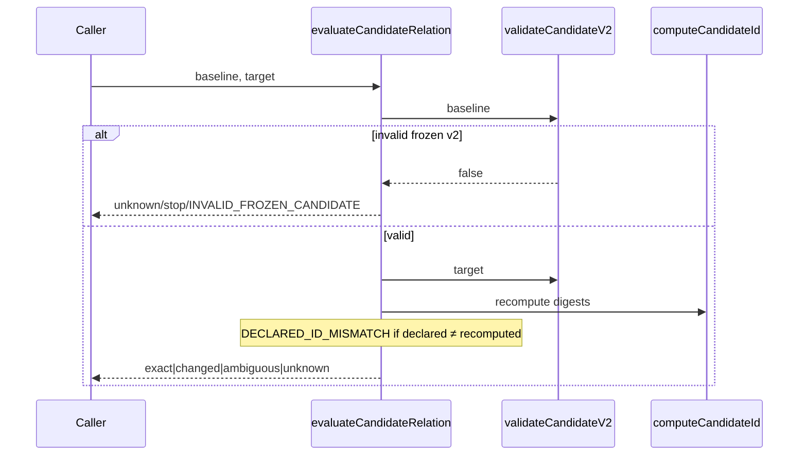

# Design: K3 Identities Boundary Closure

## Technical Approach

Close residual fail-open gaps in `scripts/lib/execution-identities/` and `schemas/kernel/` only (`design-after-spec`). Map every CRITICAL/HIGH MUST to concrete code: (1) freeze gate + `validateCandidateV2` before relation eval; (2) positive `EXPECTED_KINDS`; (3) cryptographic binding recompute with new `validateWorkOrderBinding(sourceSnapshot, workOrder)` signature; (4) relocate/register v2 schemas + `$id`; (5) restore K1 v1 **files + pins** from `02e97a5` (not pin-only retarget); (6) strict `compute*` throws; (7) dual-domain WorkOrder digests. Apply Strict TDD with ~10–15 adversarial tests targeting gates.

Evidence of current gaps (read-verified): `evaluateCandidateRelation` has no freeze gate; `validateIdentityKind` treats absent `kind` as success for identity surfaces; bindings do string checks only and `validateWorkOrderBinding` takes one arg; `compute*` uses `|| []` / default `exit_code: 0`; schemas live under wrong `candidate-v2/` / `work-order-v2/` with `$id` `…/candidate-v2/v2`; K1 pins match **drifted** v1 files (`7cf47e0a…` / `33cf07ac…`) while `02e97a5` pins are `752c7a70…` / `a8204e0f…`.

## Architecture Decisions

### Decision: Canonical v2 path + registry keys (ADR-001)

**Choice**: Relocate schemas to `schemas/kernel/candidate/v2.schema.json` and `schemas/kernel/work-order/v2.schema.json`; set `$id` to `ospec://schemas/kernel/candidate/v2` and `ospec://schemas/kernel/work-order/v2`; register manifest/contract-claims under keys `candidate-v2` / `work-order-v2` pointing at those paths; delete wrong `*-v2/` trees; move fixtures under `candidate/fixtures/{valid,invalid}/` and `work-order/fixtures/…` with `v2-` prefix; update `K21_FAMILY_PREFIXES` to exclude the new v2 paths (not the old dirs).
**Alternatives considered**: Keep filesystem `candidate-v2/`; overwrite v1 entries in manifest.
**Rationale**: Matches prior remediation intent and `loadSchemaById` lookup-by-`$id`; keeps v1 manifest entry immutable for K1.

### Decision: Crypto binding signatures + full recompute (ADR-002)

**Choice**: Change to `validateWorkOrderBinding(sourceSnapshot, workOrder)` and keep `validateWorkResultBinding(workOrder, workResult)`; both MUST recompute digests and compare to declared IDs (fail closed on mismatch). String equality alone is insufficient.
**Alternatives considered**: Keep one-arg binding; add optional recompute flag.
**Rationale**: Spec REQ-003; spoofed declared IDs with mutated payloads must fail.

### Decision: K1 restore from git `02e97a5` (ADR-003)

**Choice**: Restore `candidate/v1.schema.json` and `work-order/v1.schema.json` bytes from commit `02e97a5b49aa06e38c493d0221b2bda6ed3e062e`, then set those two `K1_SCHEMA_BASELINE` digests to the `02e97a5`-era pin values. Do **not** retarget pins to drifted content. Update `manifest.json` / `contract-claims.json` pins only after intentional v2 registration (separate from v1 restore).
**Alternatives considered**: Pin-only retarget (current NO-GO); restore entire kernel tree from `02e97a5`.
**Rationale**: Spec REQ-014; verify must not claim intact pins on drift.

### Decision: Dual-domain WorkOrder digests (ADR-004)

**Choice**: `computeWorkOrderId` dispatches domain from `kind` / `schema_version`: `work-order/v2` → domain `work-order/v2`; otherwise `work-order/v1`. Optionally expose internal `computeWorkOrderV1Id` / `computeWorkOrderV2Id` helpers. Candidate digest domain stays `candidate/v1` (payload of frozen fields; record still `kind: candidate/v2`).
**Alternatives considered**: Always `work-order/v2`; rename Candidate domain to `candidate/v2`.
**Rationale**: Spec REQ-009 + assumption `sdd-spec-001`; avoids silent cross-version aliasing.

### Decision: Freeze gate + positive kinds (ADR-005)

**Choice**: Add `validateCandidateV2(candidate) → boolean` using `validateInstance` against the canonical Candidate v2 schema (lazy-cached). `evaluateCandidateRelation` runs freeze gate first (`kind === "candidate/v2"`, `schema_version === 2`, `validateCandidateV2`); on failure return `{ relation: "unknown", action: "stop", reason_code: "INVALID_FROZEN_CANDIDATE" }` without digest compare. Replace `validateIdentityKind` blacklist/optional-kind with closed `EXPECTED_KINDS` table; missing/incompatible `kind` → fail closed. Attestation/Delivery kinds: `candidate-evaluation-attestation/v1`, `delivery-authorization/v1` (K8/K10 schema publication still out of scope).
**Alternatives considered**: Structural-only validator without schema; keep optional kind.
**Rationale**: Spec REQ-005/008; single schema source of truth; closes SourceSnapshot+`attestation_id` disguise.

## Data Flow

```
SourceSnapshot ──computeSourceSnapshotId──► snapshot_id
        │
        ▼
WorkOrder (kind work-order/v1|v2)
        │ computeWorkOrderId ──domain──► work-order/v1 OR work-order/v2
        ▼
validateWorkOrderBinding(sourceSnapshot, workOrder)
  recompute both IDs ≟ declared
        │
        ▼
WorkResult ──validateWorkResultBinding(workOrder, workResult)
  recompute work_order_id + work_result_id ≟ declared
        │
        ▼
freezeCandidate ──► Candidate v2 ──validateCandidateV2 MUST true
        │
        ▼
evaluateCandidateRelation
  [gate INVALID_FROZEN_CANDIDATE] → then DECLARED_ID_MISMATCH → relation
```

Sequence (freeze gate):



## File Changes

| File | Action | Description |
|------|--------|-------------|
| `schemas/kernel/candidate/v2.schema.json` | Create (relocate) | From `candidate-v2/`; fix `$id`; add `repository_id` to `required` |
| `schemas/kernel/work-order/v2.schema.json` | Create (relocate) | From `work-order-v2/`; fix `$id` |
| `schemas/kernel/candidate-v2/**` | Delete | Wrong publication layout |
| `schemas/kernel/work-order-v2/**` | Delete | Wrong publication layout |
| `schemas/kernel/candidate/fixtures/**/v2-*.json` | Move | Fixtures from old tree |
| `schemas/kernel/work-order/fixtures/**/v2-*.json` | Move | Fixtures from old tree |
| `schemas/kernel/candidate/v1.schema.json` | Restore | Bytes from `02e97a5` |
| `schemas/kernel/work-order/v1.schema.json` | Restore | Bytes from `02e97a5` |
| `schemas/kernel/manifest.json` | Modify | Register `candidate-v2` / `work-order-v2` families |
| `schemas/kernel/contract-claims.json` | Modify | Register v2 claim surfaces (`kind` required) |
| `scripts/lib/lifecycle-kernel/k1-compat.js` | Modify | Restore two v1 pins; retarget exclusion prefixes; update manifest/claims pins after registry edit |
| `scripts/lib/execution-identities/index.js` | Modify | All runtime closures |
| `scripts/lib/execution-identities/index.test.js` | Modify | ~10–15 adversarial + migrate binding callers |
| `scripts/lib/k3-schema-fixtures.test.js` | Modify | Paths/`$id` assertions |

## Interfaces / Contracts

```javascript
const EXPECTED_KINDS = Object.freeze({
  SourceSnapshot: Object.freeze(["source-snapshot/v1"]),
  WorkOrder: Object.freeze(["work-order/v1", "work-order/v2"]),
  WorkResult: Object.freeze(["work-result/v1"]),
  Candidate: Object.freeze(["candidate/v1", "candidate/v2"]),
  EvaluationAttestation: Object.freeze(["candidate-evaluation-attestation/v1"]),
  CandidateEvaluationAttestation: Object.freeze(["candidate-evaluation-attestation/v1"]),
  DeliveryAuthorization: Object.freeze(["delivery-authorization/v1"]),
});

function validateCandidateV2(candidate) // → boolean (schema via validateInstance)
function validateWorkOrderBinding(sourceSnapshot, workOrder) // → { ok, reason_code?, error? }
function validateWorkResultBinding(workOrder, workResult)     // → { ok, reason_code?, error? }
function computeWorkOrderId(workOrder) // domain from kind/schema_version
// Invariant: validateCandidateV2(freezeCandidate(validInput)) === true
// Strict: invalid arrays/types throw; no || []; WorkResult no silent field defaults
```

Binding reason codes (keep existing where possible): `SNAPSHOT_MISMATCH`, `WORK_ORDER_MISMATCH`, `SOURCE_SNAPSHOT_MISMATCH`, plus `DECLARED_ID_MISMATCH` / `DIGEST_MISMATCH` when recompute fails.

## Testing Strategy (Strict TDD)

| Layer | What | Approach |
|-------|------|----------|
| Unit adversarial | Gates, not rehash demos | RED first in `index.test.js` (~10–15) |
| Unit schema | Path/`$id`/fixtures | `k3-schema-fixtures.test.js` |
| Integration pin | K1 restore integrity | `assertK1SchemasUnchanged` + digest equality vs `02e97a5` pins for the two v1 files |

### Adversarial plan (~12 cases)

1. Non-frozen / missing `kind` → `INVALID_FROZEN_CANDIDATE` (no relation compute)
2. Hand-built object with `kind: candidate/v2` but schema-invalid → same gate
3. Missing `kind` on attestation surface → fail closed
4. SourceSnapshot + `attestation_id` disguise → fail closed
5. Compatible `EXPECTED_KINDS` kind → pass
6. Spoofed binding: declared IDs string-equal, mutated payload → binding fail
7. `validateWorkOrderBinding` arity/migration: requires `sourceSnapshot`
8. `dependencies: null` / non-array → `computeWorkOrderId` throws (no `[]`)
9. Missing WorkResult required field → throws (no default `exit_code`)
10. `freezeCandidate` empty `repository_id` rejected; `intended_untracked_digest` never `""`
11. Invariant `validateCandidateV2(freezeCandidate(x)) === true`
12. Same WorkOrder payload under v1 vs v2 domains → distinct digests; v2 domain string `work-order/v2`
13. (schema) Wrong `candidate-v2/` path not authoritative; canonical path + `$id` resolve
14. (K1) Pin-only retarget scenario documented as non-compliant; restored files match `02e97a5` digests

Preserve existing GO tests (`DECLARED_ID_MISMATCH`, deps/ownership/evidence).

## Migration / Rollout

- **Callers of `validateWorkOrderBinding`**: update to pass `(sourceSnapshot, workOrder)`; only in-repo consumer today is `index.test.js`.
- **Digest consumers**: WorkOrder v2 digests change domain → recompute stored IDs; v1 callers unchanged if `kind`/`schema_version` stay v1.
- **Schema loaders**: replace any `schemas/kernel/candidate-v2/…` path with `candidate/v2.schema.json`; `$id` consumers must use `ospec://schemas/kernel/candidate/v2`.
- **K1**: restore procedure is `git show 02e97a5:…` for the two v1 files + pin restore for those keys only.
- Feature branch before apply: `fix/k3-identities-boundary-closure` (advisory). Delivery `exception-ok` already approved. No data migration.

## Open Questions

- None blocking. Attestation kind string constants are provisional until K8 publishes schemas (assumption `sdd-design-001`).
