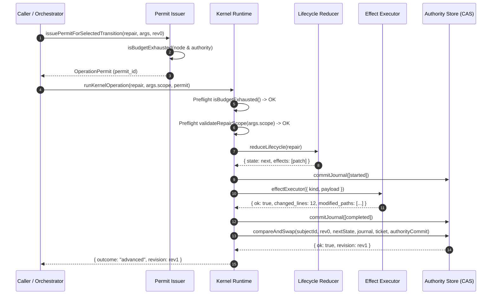
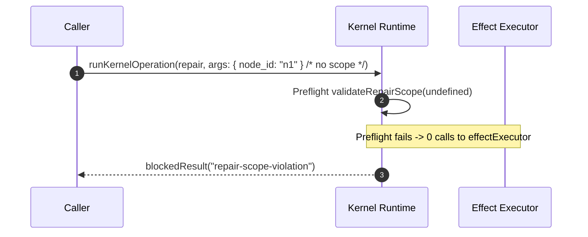
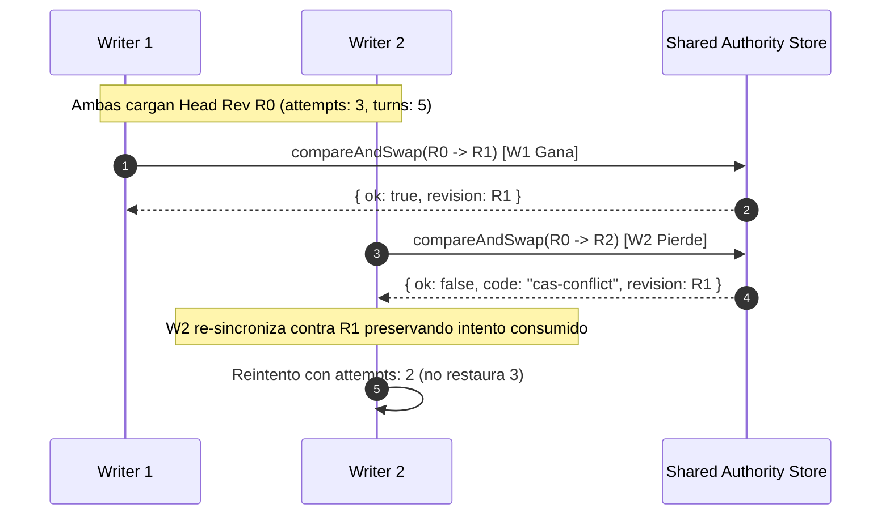

# Design: K5 Authoritative Enforcement and CAS Remediation

## Technical Approach

Este diseño técnico resuelve los 5 blockers autoritativos detectados en la arquitectura de K5 (v2.45.8) para consolidar la versión `2.45.9`:
1. **Transiciones canónicas y taxonomía armonizada**: En `transition-selector.js`, emitir explícitamente `{ kind: "execute", operation: "repair" }` ante `code_defect` (con intentos restantes) sin degradarlo a `recover`, alinear `kind: "escalate"` con `operation: "escalate"` sin sustituirlo por `decide`, y permitir en `reducer.js` y `index.js` que `escalate` se consolide en el Authority Store vía CAS como estado terminal sin abortos prematuros.
2. **Preflight exhaustivo de presupuestos**: Evaluar todas las 6 dimensiones de nodo (`turns`, `patches`, `commands`, `wall_time_minutes`, `changed_lines`, `allowed_paths`) y las 4 dimensiones de autoridad (`effect_attempts`, `authority_mutations`, `evidence_runs`, `review_sweeps`) mediante `isBudgetExhausted()` en preflight dentro de `transition-selector.js`, emisión de permisos en `permits.js`, y `runKernelOperation` en `index.js` antes de despachar a `effectExecutor` (garantizando 0 llamadas a efectos ante agotamiento).
3. **Validación obligatoria fail-closed de `args.scope` en repair**: Requerir `args.scope` no nulo en preflight de `runKernelOperation` para `operation: "repair"`. Si falta o es inválido, abortar fail-closed con `repair-scope-violation` y 0 invocaciones a `effectExecutor`, eliminando fallbacks muertos hacia payloads históricos.
4. **Contabilidad zero-delta dual con evento durable**: Cuando un paso de mutación no produce avance semántico, decrementar en simultáneo `node.budget.turns` y `state.authority_budget.effect_attempts`, persistiendo el registro durable `zero-delta-attempt` en el journal antes del commit CAS.
5. **Preservación presupuestaria ante conflicto CAS (Monotonicidad multi-writer)**: Garantizar que cuando un writer ejecuta efectos y sufre un conflicto CAS, el presupuesto consumido por los efectos ejecutados no sea restablecido en la reconciliación o reintento sobre la nueva revisión head, transformando `inv-k5-budget-monotonicity` en una prueba concurrente de 2 writers reales.

---

## Architecture Decisions

| Opción | Trade-off | Decisión |
|---|---|---|
| **D1: Emisión de repair vs recover para code_defect** | `recover` generaliza la recuperación pero oculta la semántica de parcheo de código | Emitir `{ kind: "execute", operation: "repair" }` canónico para `code_defect` manteniendo `recover` sólo para fallos sin descriptor causal específico. |
| **D2: Preflight fail-closed vs post-hoc check de presupuesto** | Comprobar presupuesto post-ejecución ahorra código pero permite ejecutar efectos sin cuota | Preflight estricto en selector, emisor de permisos y `runKernelOperation` previo a `effectExecutor` con 0 llamadas al executor si está agotado. |
| **D3: args.scope obligatorio vs fallback en payload histórico** | El fallback permite clientes legacy pero introduce mutaciones ambiguas y no acotadas | `args.scope` obligatorio y estricto en preflight fail-closed; rechazo inmediato con 0 llamadas a `effectExecutor` si no se declara. |
| **D4: Deducción dual zero-delta vs deducción sólo en nodo** | Descontar solo en nodo permite que la autoridad reintente indefinidamente mutaciones vacías | Descontar en nodo (`turns`) y en autoridad (`effect_attempts`) simultáneamente, persistiendo evento durable `zero-delta-attempt` en el journal. |
| **D5: Monotonicidad multi-writer en conflicto CAS** | Resetear presupuestos en conflicto CAS falsea la cuota real consumida por efectos ejecutados | Preservar el decremento de intentos y turnos consumidos tras perder el CAS, comprobado en test concurrente real con 2 writers. |

### Decision: Transiciones Canónicas y Armonización Taxonómica

**Choice**: Emitir `{ kind: "execute", operation: "repair" }` ante `code_defect` y `{ kind: "escalate", operation: "escalate" }` cuando se requiere escalación; consolidar `escalate` en CAS como estado terminal.
**Alternatives considered**: Degradación implícita a `operation: "recover"` o sustitución silenciosa de `escalate` por `decide`.
**Rationale**: Claridad semántica en la auditoría del ciclo de vida y alineación con los contratos formales de recuperación.

### Decision: Preflight Exhaustivo de Presupuestos de Nodo y Autoridad

**Choice**: Ejecutar `isBudgetExhausted()` en preflight antes de emitir permisos y antes de invocar `effectExecutor`.
**Alternatives considered**: Validación perezosa durante la mutación en reducer o post-efecto.
**Rationale**: Garantiza que no se consuman recursos externos ni se ejecuten efectos si el nodo o la autoridad carecen de presupuesto.

### Decision: Scope Obligatorio en Repair con 0 Executor Calls

**Choice**: `args.scope` obligatorio en `operation: "repair"` con validación fail-closed previa a la ejecución de efectos.
**Alternatives considered**: Inferencia de scope desde `effectRecords[0]?.payload?.scope`.
**Rationale**: Evita la ejecución ciega de efectos y elimina superficies de ataque por fallbacks no deterministas.

### Decision: Contabilidad Dual Zero-Delta con Evento Durable

**Choice**: Descontar `node.budget.turns` y `authority_budget.effect_attempts` y persistir `zero-delta-attempt` en el journal durable antes del commit CAS.
**Alternatives considered**: Decremento exclusivo de `turns` en memoria sin persistencia en journal.
**Rationale**: Cumple con la invariante `inv-k5-zero-delta-consumption` y evita bucles infinitos de no-avance.

### Decision: Preservación de Presupuesto en Conflicto CAS

**Choice**: Mantener el consumo de presupuestos de efectos ejecutados al perder una carrera CAS y re-sincronizar contra el nuevo head.
**Alternatives considered**: Restaurar la cuota inicial tras conflicto CAS.
**Rationale**: Mantiene la monotonicidad estricta y previene evasión de límites en escenarios multi-writer.

---

## Sequence Diagrams

### 1. Preflight y Ejecución Canónica de Repair con Scope Válido



### 2. Preflight Fail-Closed ante Scope Inválido o Presupuesto Agotado



### 3. Conflicto CAS Multi-Writer y Preservación de Monotonicidad



---

## Data Flow

```
+-----------------------------------------------------------------------------------+
| 1. Selector / Transition Routing                                                  |
|    - Input: State { nodes, authority_budget, failures }                           |
|    - Eval: isBudgetExhausted(node.budget) & isBudgetExhausted(authority_budget)   |
|    - Causal Resolver: code_defect -> emit { kind: "execute", operation: "repair" }|
|    - Escalation: emit { kind: "escalate", operation: "escalate" }                 |
+-----------------------------------------+-----------------------------------------+
                                          |
                                          v
+-----------------------------------------------------------------------------------+
| 2. Controlled Permit Issuance                                                     |
|    - Input: TransitionOffer + Decision/Rule + expected_revision                   |
|    - Gate: isBudgetExhausted() check fail-closed                                  |
|    - Output: OperationPermit bound to expected_revision                           |
+-----------------------------------------+-----------------------------------------+
                                          |
                                          v
+-----------------------------------------------------------------------------------+
| 3. Runtime Preflight Execution (runKernelOperation)                               |
|    - Step 3.1: authorizeOperationWithPermit()                                     |
|    - Step 3.2: isBudgetExhausted() preflight (0 calls to executor if exhausted)   |
|    - Step 3.3: Mandatory args.scope preflight on repair (0 calls if missing)      |
+-----------------------------------------+-----------------------------------------+
                                          |
                                          v
+-----------------------------------------------------------------------------------+
| 4. Effect Execution & Post-Effect Accounting                                      |
|    - Journal durability barrier before & after executor invocation                |
|    - Zero-delta check: if zero progress, decrement turns + effect_attempts        |
|    - Record durable zero-delta-attempt in journal                                 |
+-----------------------------------------+-----------------------------------------+
                                          |
                                          v
+-----------------------------------------------------------------------------------+
| 5. Store CAS Commit & Multi-Writer Monotonicity                                   |
|    - Commit state, journal & authority bag via compareAndSwap                     |
|    - On CAS conflict: return current revision and retain consumed budget delta    |
|    - Escalate operation commits terminal status via CAS without premature abort   |
+-----------------------------------------------------------------------------------+
```

---

## Exact Component Interfaces

### 1. `transition-selector.js`

```javascript
/**
 * @param {Object} state - Estado del ciclo de vida
 * @returns {Array<TransitionOffer>} Lista de transiciones ordenadas determinísticamente
 */
function selectTransitions(state);

/**
 * Mapeo de transiciones canónicas:
 * - category === "code_defect" & attempts > 0 -> { kind: "execute", operation: "repair", arguments: { node_id } }
 * - category === "ambiguous_effect" -> [{ kind: "escalate", operation: "escalate" }, { kind: "stop", operation: "stop" }]
 * - category === "cas_conflict" -> [{ kind: "decide", operation: "replan" }, ...]
 * - isBudgetExhausted(authority_budget) -> prunes all execute transitions -> [{ kind: "escalate", operation: "escalate" }, { kind: "stop", operation: "stop" }]
 */
```

### 2. `failure-recovery.js`

```javascript
/**
 * Valida que el repair scope sea un objeto no vacío con arrays requeridos y sin mutaciones fuera de límite.
 * @param {Object} params
 * @param {Object} params.scope - { node_ids: string[], allowed_paths: string[], finding_ids: string[] }
 * @param {string} [params.targetNodeId]
 * @param {string[]} [params.modifiedPaths]
 * @param {string[]} [params.resolvedFindingIds]
 * @returns {{ ok: boolean, violations: string[] }}
 */
function validateRepairScope({ scope, targetNodeId, modifiedPaths, resolvedFindingIds });
```

### 3. `execution-budgets.js`

```javascript
/**
 * Evalúa las 6 dimensiones de nodo y las 4 de autoridad de forma unificada.
 * @param {Object} budget
 * @param {Object} consumed
 * @param {Object} options - { isNode?: boolean, isAuthority?: boolean, modifiedPaths?: string[] }
 * @returns {{ ok: boolean, exhausted: boolean, dimension?: string, code?: string, remaining: Object, violations: string[] }}
 */
function isBudgetExhausted(budget, consumed, options);

/**
 * Decrementa monotónicamente las dimensiones de presupuesto sin underflow negativo.
 * @param {Object} budget
 * @param {Object} delta - { turns?: number, effect_attempts?: number, ... }
 * @returns {Object} newBudget
 */
function decrementBudgetMonotonic(budget, delta);
```

### 4. `lifecycle-kernel/index.js` (runKernelOperation)

```javascript
async function runKernelOperation(input = {
  operation,
  arguments: args,
  store,
  effectExecutor,
  permitLedger,
  operationPermit,
  // ...
})
```
*Preflight Rules*:
- Si `isBudgetExhausted()` es `exhausted: true`, retorna `blockedResult(state, journal, "budget-exhausted")` inmediatamente sin llamar a `effectExecutor`.
- Si `operation === "repair"` y `!args.scope` o `validateRepairScope(...)` falla, retorna `blockedResult(state, journal, "repair-scope-violation")` inmediatamente sin llamar a `effectExecutor`.
- Si `operation === "escalate"`, procesa la reducción a estado terminal y persiste vía `compareAndSwap` al Authority Store.

---

## Security & Failure Boundaries

1. **Aislamiento de Ejecución de Efectos**: Ningún efecto es despachado a `effectExecutor` si los presupuestos están agotados o si el `scope` de `repair` no ha sido validado en preflight.
2. **Inmutabilidad de Permisos y Single-Use**: Los permisos son emitidos exclusivamente por el issuer del runtime (`createPermitAuthorityIssuer`), vinculados a `expected_revision`, y consumidos atómicamente en el bag de autoridad del CAS.
3. **Fail-Closed en Transiciones**: Cualquier operación o recuperación no permitida por la matriz de causalidad falla cerrado (`UNALLOWLISTED_RECOVERY_OPERATION` o `unauthorized`).
4. **Preservación Monotónica de Cuotas**: Los intentos consumidos por efectos ejecutados se registran de manera durable antes de la resolución del CAS, impidiendo reabastecimiento en carreras multi-writer.

---

## File Change Inventory

| Archivo | Acción | Descripción |
|---|---|---|
| `scripts/lib/lifecycle-kernel/transition-selector.js` | Modificar | Emisión canónica de `repair` para `code_defect`, emisión de `escalate` armonizado (`kind: "escalate"`), y preflight de `state.authority_budget`. |
| `scripts/lib/lifecycle-kernel/index.js` | Modificar | Preflight de presupuesto previo a `effectExecutor`, guard obligatorio de `args.scope` en repair (0 llamadas a executor), eliminación de fallback en payload histórico, contabilidad dual zero-delta con evento durable en journal, y consolidación CAS de `escalate`. |
| `scripts/lib/lifecycle-kernel/permits.js` | Modificar | Preflight de presupuestos de nodo y autoridad en la validación y emisión de permisos. |
| `scripts/lib/lifecycle-kernel/internal/permit-authority.js` | Modificar | Verificación de cuotas disponibles antes de registrar decisiones o emitir `OperationPermit`. |
| `scripts/lib/lifecycle-kernel/reducer.js` | Modificar | Manejo consolidado de `repair` y `escalate` conduciendo a estados terminales válidos en CAS. |
| `scripts/lib/failure-recovery.js` | Modificar | Matriz de transiciones con distinción estricta `repair` y validación fail-closed de repair scope. |
| `scripts/lib/execution-budgets.js` | Modificar | Evaluación integral de 6 dimensiones de nodo y 4 de autoridad en `isBudgetExhausted()`. |
| `scripts/lib/lifecycle-model.js` | Modificar | Implementación concurrente de 2 writers en `inv-k5-budget-monotonicity` y comprobación dual en `inv-k5-zero-delta-consumption`. |
| `scripts/lib/k5-lifecycle-model.test.js` | Modificar | Test cases actualizados verificando los 5 blockers autoritativos. |
| `package.json` | Modificar | Bump de versión a `2.45.9`. |
| `openspec/config.yaml` | Modificar | Bump de versión a `2.45.9`. |

---

## Testing Strategy

| Capa | Qué Probar | Enfoque |
|---|---|---|
| **Unit** | `transition-selector`: emisión de `repair` para `code_defect`, `escalate` con `kind: "escalate"`, y poda ante `authority_budget` agotado | Test unitario con estados mockeados y diferentes categorías de fallo causal. |
| **Unit** | `validateRepairScope`: validación fail-closed ante scope ausente, paths fuera de glob, o findings no declarados | Test unitario exhaustivo con inputs válidos e inválidos. |
| **Unit** | `isBudgetExhausted`: evaluación de las 6 dimensiones de nodo y las 4 de autoridad | Verificación con cuotas en 0, excedidas y válidas. |
| **Integration** | `runKernelOperation`: 0 llamadas a `effectExecutor` ante falta de scope en `repair` o presupuesto agotado | Espía (`mock.fn()`) sobre `effectExecutor` comprobando `callCount === 0`. |
| **Integration** | Zero-delta accounting: deducción dual de `turns` y `effect_attempts`, con presencia del evento durable `zero-delta-attempt` en el journal y estado post-CAS | Ejecutar mutación sin cambios y verificar journal persistido y estado. |
| **Integration / E2E** | Concurrencia CAS: 2 writers compitiendo por la misma revisión head | Prueba con 2 instancias de runtime compartiendo store; verificar que el writer perdedor retiene el presupuesto consumido al reintentar contra el nuevo head. |
| **Model Conformance** | Invariantes K5 (`inv-k5-budget-monotonicity`, `inv-k5-zero-delta-consumption`, etc.) | Ejecución de suite `k5-lifecycle-model.test.js` y `runAllInvariantCheckers()`. |

---

## Migration / Rollout

No se requiere migración de esquema de base de datos persistente externa. El cambio preserva retrocompatibilidad en interfaces públicas del kernel mientras endurece las verificaciones autoritativas internas en memoria y almacén CAS. Bump de versión a `2.45.9`.

---

## Open Questions

Ninguna. Todas las decisiones arquitectónicas para los 5 blockers han sido resueltas en los ADRs correspondientes.
