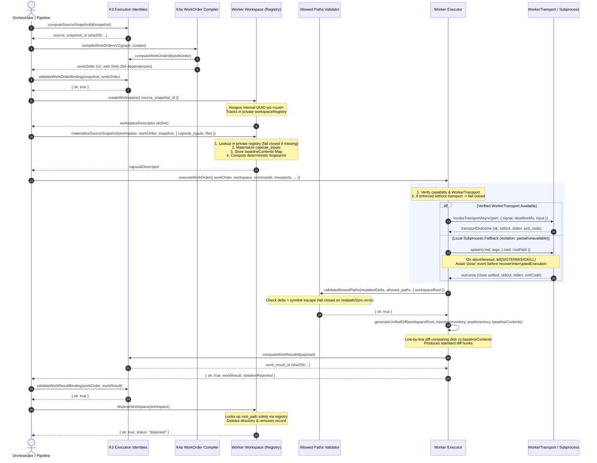

# Design: k6a-runtime-boundary-closure

## Technical Approach

The `k6a-runtime-boundary-closure` change hardens and seals the execution runtime boundaries across `worker-isolation`, `allowed-paths-validator`, `host-contract`, and `contract-lint`. It eliminates 11 critical containment and isolation defects identified during baseline evaluation, ensuring fail-closed runtime safety, authentic unified diff generation, strict `WorkerTransport` capability enforcement, and clean composition across the K3 -> K4a -> K6a -> K3 pipeline.

The design operates under the `design-after-spec` paradigm, directly mapping to the requirements defined in `specs/worker-isolation/spec.md` (`REQ-worker-isolation-001` through `008`) and `specs/contract-lint/spec.md` (`REQ-contract-lint-018`).

### Key Architectural Pillars

1. **Deterministic Baseline Content & Authentic Diff Generation (`REQ-worker-isolation-002`, `REQ-worker-isolation-005`)**:
   During `materializeSourceSnapshot`, normalized file contents are retained in the internal workspace registry record (`record.baselineContents`). `generateUnifiedDiff` performs context-aware line-by-line diffing against post-execution files on disk, producing valid unified diff hunks (`--- a/{path}`, `+++ b/{path}`, `@@ -l,s +l,s @@`) for modified files, `--- /dev/null / +++ b/{path}` for created files, and `--- a/{path} / +++ /dev/null` for deleted files, eliminating synthetic `-old` / `+new` mock strings.

2. **Verified WorkerTransport & Fail-Closed Isolation State (`REQ-worker-isolation-008`)**:
   Reporting `isolationReported = "enforced"` strictly requires a verified active `WorkerTransport` port coupled to host sandboxing proof. If `isolationCapability: "enforced"` is declared or requested without an active verified `WorkerTransport`, `executeWorkOrder` fails closed. Fallback local `spawn()` execution without sandboxed transport is constrained to `isolationReported: "partial"` or `"unavailable"` and will never report `enforced`.

3. **Subprocess Concurrency & Settlement Barrier (`REQ-worker-isolation-004`, `REQ-worker-isolation-006`)**:
   Corrects the call signature of `invokeTransportAsync(workerTransport, { signal, deadlineMs, input })` to the canonical 2-argument shape and preserves execution telemetry (`stdout`, `stderr`, `exit_code`) across `normalizeTransportOutcome`. For local subprocess fallback, implements an explicit synchronization barrier awaiting the child process `'close'` event and stream settlement before invoking `recoverInterruptedExecution`, eliminating race conditions and lingering background writes.

4. **Encapsulated Workspace Registry & Fail-Closed Materialization (`REQ-worker-isolation-001`, `REQ-worker-isolation-002`)**:
   `createWorkspace` generates `workspace_id` exclusively using internal UUIDs (`ws-${crypto.randomUUID()}`), ignoring any caller-supplied `workspace_id` options. The workspace registry is encapsulated and private. `materializeSourceSnapshot` resolves workspaces solely from the private registry and fails closed (throws immediately) if the descriptor is unrecorded, eliminating fallback access to `descriptor.root_path`. `disposeWorkspace` removes only directories tracked in the registry.

5. **Fail-Closed Symlink Validation & Legacy Pathway Purge (`REQ-worker-isolation-003`, `REQ-contract-lint-018`)**:
   `checkSymlinkEscape` in `allowed-paths-validator.js` catches filesystem exceptions and `fs.realpathSync` errors, treating them fail-closed as containment violations (`violation_type: "symlink_escape"`). All legacy fallback pathways accepting file paths in `dependencies` or synthetic `.files` on `SourceSnapshot v1` are purged. The `k6a-canonical-contracts` checker is extended to audit JS source files and fixtures against non-canonical contract usage.

6. **Canonical Composition Pipeline K3 -> K4a -> K6a -> K3 (`REQ-worker-isolation-005`, `REQ-contract-lint-018`)**:
   Full vertical integration is verified from cryptographic `SourceSnapshotId` (K3), DAG `WorkOrder v2` compilation (K4a), workspace isolation and execution (K6a), to cryptographic `WorkResultBinding` validation (K3).

---

## Architecture Decisions

| Decision | Chosen Option | Trade-off / Rejected Alternative | Rationale |
|---|---|---|---|
| **ADR-001: Baseline Diffing** | Retain normalized baseline contents in workspace record for line-by-line unified diff | Disk-based temporary clone / external git CLI | Avoids heavy I/O and external CLI dependencies; produces authentic applicable hunks |
| **ADR-002: Transport Enforcement** | Require verified `WorkerTransport` port for `enforced`; fail closed if missing | Allow local `spawn()` to report `enforced` on proof | Local subprocess execution has no sandbox isolation; reporting `enforced` would be false |
| **ADR-003: Subprocess Sync** | Await child process `'close'` event before recovery; 2-arg `invokeTransportAsync` | Immediate kill without barrier; 3-arg invocation | Prevents race condition with zombie writes; aligns with canonical transport contract |
| **ADR-004: Registry Encapsulation** | Internal UUIDs only; fail-closed `materializeSourceSnapshot` if unregistered | Allow caller `workspace_id`; fallback to `descriptor.root_path` | Prevents directory hijacking, collision, or unauthenticated path manipulation |
| **ADR-005: Symlink Fail-Closed** | Fail closed on `realpathSync` errors; purge legacy `.files` fallbacks | Swallowing errors as non-escapes; keep legacy `.files` | Unresolvable symlink errors must never grant write access; enforces K3/K4a canonical schemas |
| **ADR-006: E2E Composition** | Full K3 -> K4a -> K6a -> K3 integration test suite | Isolated per-module tests only | Guarantees zero contract drift across identity, graph compilation, and worker execution |

### Detailed ADR References
- [ADR-001: Baseline Content Storage and Authentic Standard Unified Diff Generation](decisions/adr-001.md)
- [ADR-002: Strict Verified WorkerTransport Requirement for Enforced Isolation State](decisions/adr-002.md)
- [ADR-003: Asynchronous Subprocess Synchronization and Close-Event Settlement Barrier](decisions/adr-003.md)
- [ADR-004: Private Immutable Workspace Registry Encapsulation and Fail-Closed Materialization](decisions/adr-004.md)
- [ADR-005: Fail-Closed Symlink Validation on Filesystem Exceptions and Legacy Pathway Elimination](decisions/adr-005.md)
- [ADR-006: Canonical End-to-End Composition Pipeline (K3 -> K4a -> K6a -> K3)](decisions/adr-006.md)

---

## Data Flow



### Boundary Containment Model

```
┌─────────────────────────────────────────────────────────────────────────────┐
│                          ORCHESTRATOR / RUNTIME                             │
│                                                                             │
│  ┌───────────────────────────┐         ┌─────────────────────────────────┐  │
│  │   K3: SourceSnapshot v1   │ ──────→ │      K4a: WorkOrder v2          │  │
│  │   (projection: workspace) │         │ (dependencies: sha256 DAG IDs)  │  │
│  └─────────────┬─────────────┘         └────────────────┬────────────────┘  │
│                │                                        │                   │
│                ▼                                        ▼                   │
│  ┌───────────────────────────────────────────────────────────────────────┐  │
│  │                   K6a WORKER WORKSPACE REGISTRY                       │  │
│  │                                                                       │  │
│  │   • workspace_id: ws-<uuid> (private, unforgeable)                   │  │
│  │   • baselineContents: Map<relPath, utf8Content>                       │  │
│  │   • baselineInventory: Array<{ path, sha256, mode }>                  │  │
│  │   • capsule_inputs: string[] (strict projection manifest)             │  │
│  └──────────────────────────────────┬────────────────────────────────────┘  │
│                                     │                                       │
│                                     ▼                                       │
│  ┌───────────────────────────────────────────────────────────────────────┐  │
│  │                     K6a WORKER EXECUTION ENGINE                       │  │
│  │                                                                       │  │
│  │   Enforcement Gate:                                                   │  │
│  │   • isolationCapability == "enforced" REQUIRES active WorkerTransport │  │
│  │   • Local subprocess fallback reports "partial" / "unavailable"       │  │
│  │                                                                       │  │
│  │   Asynchronous Execution & Barrier:                                   │  │
│  │   • invokeTransportAsync(port, { signal, deadlineMs, input })         │  │
│  │   • Subprocess termination: await 'close' event before recovery       │  │
│  └──────────────────────────────────┬────────────────────────────────────┘  │
│                                     │                                       │
│                                     ▼                                       │
│  ┌───────────────────────────────────────────────────────────────────────┐  │
│  │                   ALLOWED PATHS VALIDATOR (FAIL-CLOSED)               │  │
│  │                                                                       │  │
│  │   • Evaluates mutationDelta (created, modified, deleted)              │  │
│  │   • checkSymlinkEscape: realpathSync errors → containment violation   │  │
│  └──────────────────────────────────┬────────────────────────────────────┘  │
│                                     │                                       │
│                                     ▼                                       │
│  ┌───────────────────────────────────────────────────────────────────────┐  │
│  │                      WORK RESULT ASSEMBLY (K6a / K3)                  │  │
│  │                                                                       │  │
│  │   • generateUnifiedDiff: line-by-line diff vs baselineContents        │  │
│  │   • Zero CandidateId properties (pure WorkResult v1)                  │  │
│  │   • computeWorkResultId(workResult) == work_result_id                 │  │
│  │   • validateWorkResultBinding(workOrder, workResult) == { ok: true }  │  │
│  └───────────────────────────────────────────────────────────────────────┘  │
└─────────────────────────────────────────────────────────────────────────────┘
```

---

## File Changes

| File | Action | Description |
|---|---|---|
| `scripts/lib/worker-workspace.js` | Modify | Enforce internal UUID generation for `workspace_id`; encapsulate private workspace registry; capture and store `baselineContents` map during materialization; fail closed on unrecorded workspaces; remove legacy file path dependency logic. |
| `scripts/lib/worker-executor.js` | Modify | Implement line-by-line standard unified diffing using `baselineContents`; fix `invokeTransportAsync` call signature; require verified `WorkerTransport` for `isolationReported = "enforced"`; await child process `'close'` event before recovery; prevent false enforced reporting. |
| `scripts/lib/allowed-paths-validator.js` | Modify | Make `checkSymlinkEscape` fail closed on `fs.realpathSync` errors or filesystem exceptions, emitting `containment-violation/v1` with `violation_type: "symlink_escape"`. |
| `scripts/lib/host-contract/index.js` | Modify | Preserve execution telemetry fields (`stdout`, `stderr`, `exit_code`) in `normalizeTransportOutcome`. |
| `scripts/lib/contract-checkers/k6a-canonical-contracts.js` | Modify | Extend checker to audit JS source files and test fixtures against synthetic `.files` on `SourceSnapshot v1` and non-SHA-256 dependencies on `WorkOrder v2`. |
| `scripts/k6a-e2e-worker-isolation.test.js` | Modify | Implement canonical composition E2E test suite (K3 -> K4a -> K6a -> K3), update containment and transport isolation tests. |
| `scripts/lib/worker-workspace.test.js` | Modify | Add unit tests for UUID generation, registry encapsulation, fail-closed unrecorded materialization, and baseline content preservation. |
| `scripts/lib/worker-executor.test.js` | Modify | Add unit tests for standard unified diff generation, `WorkerTransport` requirement for `enforced`, 2-arg `invokeTransportAsync`, and close-event recovery synchronization. |
| `scripts/lib/allowed-paths-validator.test.js` | Modify | Add unit tests for fail-closed symlink validation when `realpathSync` encounters filesystem errors. |
| `openspec/changes/k6a-runtime-boundary-closure/decisions/adr-*.md` | Create | Persist ADR-001 through ADR-006 documenting architectural decisions. |

---

## Interfaces / Contracts

### 1. `worker-workspace.js`

```javascript
/**
 * Private in-memory workspace registry record.
 * @typedef {Object} WorkspaceRecord
 * @property {Object} descriptor - workspace-descriptor/v1 payload
 * @property {string} rootPath - Absolute filesystem path of workspace root
 * @property {Array<{ path: string, sha256: string, mode: number }>} baselineInventory
 * @property {Map<string, string>} baselineContents - Map of relative path -> baseline UTF-8 content
 * @property {number} createdAt - Creation timestamp (ms)
 */

/**
 * Creates an isolated workspace directory and returns its descriptor.
 * Always generates internal UUID (options.workspace_id is strictly ignored).
 *
 * @param {Object} [options]
 * @param {string} [options.baseDir] - Base directory for workspace allocations
 * @param {string} [options.source_snapshot_id] - Canonical SourceSnapshotId
 * @returns {Promise<Object>} workspace-descriptor/v1
 */
async function createWorkspace(options = {})

/**
 * Materializes declared capsule inputs into the workspace and computes deterministic fingerprint.
 * FAILS CLOSED (throws) if workspaceDescriptor.workspace_id is not found in private registry.
 * Preserves baseline file contents in workspace record for diff generation.
 *
 * @param {Object} workspaceDescriptor
 * @param {Object} workOrder - Canonical WorkOrder v2 (dependencies must be sha256 DAG IDs)
 * @param {Object} sourceSnapshot - Canonical SourceSnapshot v1
 * @param {Object} [options]
 * @param {string[]} [options.capsule_inputs] - Manifest of relative file paths to project
 * @param {Object|Array} [options.files] - File content map or array (test/mock resolver)
 * @param {Function} [options.resolveFile] - Optional resolver function: (relPath) => Buffer|string
 * @returns {Promise<Object>} capsule-definition/v1 payload
 */
async function materializeSourceSnapshot(workspaceDescriptor, workOrder, sourceSnapshot, options = {})

/**
 * Idempotently cleans up an allocated workspace directory resolved strictly from private registry.
 * Does NOT perform file operations on unregistered paths.
 *
 * @param {Object|string} workspaceDescriptorOrId
 * @returns {Promise<{ ok: boolean, workspace_id: string, status: "disposed" }>}
 */
async function disposeWorkspace(workspaceDescriptorOrId)
```

### 2. `worker-executor.js`

```javascript
/**
 * Generates standard unified diff patch comparing post-execution state against preserved baseline contents.
 *
 * @param {string} workspaceRoot
 * @param {Array} baselineInventory
 * @param {Array} postInventory
 * @param {Map<string, string>} [baselineContents] - Map of relPath -> baseline string content
 * @returns {string} Applicable unified diff patch
 */
function generateUnifiedDiff(workspaceRoot, baselineInventory = [], postInventory = [], baselineContents = new Map())

/**
 * Executes work order commands in isolated workspace.
 * Requires verified WorkerTransport for isolationReported = "enforced"; fails closed if missing.
 * Propagates signal and deadlineMs via 2-arg invokeTransportAsync.
 * Awaits child process 'close' event before triggering interrupted recovery in local spawn fallback.
 *
 * @param {Object} options
 * @param {Object} options.workOrder - Canonical WorkOrder v2
 * @param {Object} options.workspace - Workspace descriptor
 * @param {Array<Object>|Object} [options.commands] - Command descriptors
 * @param {Object} [options.transports] - Host transport ports ({ worker: WorkerTransport })
 * @param {string} [options.isolationCapability] - "enforced" | "partial" | "instructional" | "unavailable"
 * @param {Object} [options.capabilityProof] - Cryptographic capability proof
 * @param {AbortSignal} [options.signal] - Abort signal for cancellation
 * @param {Object} [options.budget] - Execution budget ({ wall_time_ms, commands })
 * @returns {Promise<{ ok: boolean, workResult?: Object, execution_usage?: Object, violation?: Object, interrupted?: boolean, recovery?: Object, isolationReported: string }>}
 */
async function executeWorkOrder(options = {})
```

### 3. `allowed-paths-validator.js`

```javascript
/**
 * Inspects all existing ancestor directories of targetPath to ensure no symlinks escape workspaceRoot.
 * FAILS CLOSED: Returns isEscape = true on any fs.realpathSync error or filesystem exception.
 *
 * @param {string} targetPath
 * @param {string} workspaceRoot
 * @returns {{ isEscape: boolean, offendingPath?: string, error?: string }}
 */
function checkSymlinkEscape(targetPath, workspaceRoot)

/**
 * Validates mutation delta or target paths against allowed paths.
 * Emits containment-violation/v1 if boundary is breached or symlink escapes.
 *
 * @param {string[]|Object} targetPaths - Array of paths or mutation delta object
 * @param {string[]} allowedPaths - Declared allowed path globs
 * @param {Object} [options]
 * @returns {{ ok: boolean, violation?: Object }}
 */
function validateAllowedPaths(targetPaths, allowedPaths, options = {})
```

### 4. `host-contract/index.js`

```javascript
/**
 * Normalizes raw transport outcome, preserving stdout, stderr, and exit_code telemetry.
 *
 * @param {Object} raw
 * @returns {{ ok: boolean, outcome: string, code?: string, value?: any, failure_class?: string, requestId?: string, exit_code?: number, stdout?: string, stderr?: string }}
 */
function normalizeTransportOutcome(raw)
```

---

## Testing Strategy

The test strategy employs strict Test-Driven Development (TDD) with triangulation across unit, integration, and end-to-end boundaries.

```
┌─────────────────────────────────────────────────────────────────────────────┐
│                            TESTING PYRAMID                                  │
│                                                                             │
│                    ┌───────────────────────────────┐                        │
│                    │     E2E Composition Suite     │                        │
│                    │  K3 -> K4a -> K6a -> K3       │                        │
│                    │  (k6a-e2e-worker-isolation)   │                        │
│                    └───────────────┬───────────────┘                        │
│                                    │                                        │
│                    ┌───────────────┴───────────────┐                        │
│                    │     Integration Suites        │                        │
│                    │  Transport, Proof, Boundary   │                        │
│                    └───────────────┬───────────────┘                        │
│                                    │                                        │
│                    ┌───────────────┴───────────────┐                        │
│                    │        Unit Test Triads       │                        │
│                    │  Workspace, Executor, Paths,  │                        │
│                    │  Host-Contract, Contract-Lint │                        │
│                    └───────────────────────────────┘                        │
└─────────────────────────────────────────────────────────────────────────────┘
```

| Layer | Component | Test Target | Verification Method |
|---|---|---|---|
| **Unit** | `worker-workspace.js` | UUID generation, registry encapsulation, fail-closed materialization on unregistered workspace, baseline content preservation | Assert options.workspace_id ignored; unrecorded workspace throws; baselineContents captured in record |
| **Unit** | `worker-executor.js` | Authentic unified diff generation, 2-arg `invokeTransportAsync`, `WorkerTransport` requirement for `enforced`, close-event settlement | Compare generated diff against standard unified diff parser; verify fail-closed without transport |
| **Unit** | `allowed-paths-validator.js` | Fail-closed `checkSymlinkEscape` on `realpathSync` exceptions | Mock throwing `realpathSync` / corrupted ancestor path; assert `isEscape: true` and violation emitted |
| **Unit** | `host-contract/index.js` | Telemetry preservation in `normalizeTransportOutcome` | Assert `stdout`, `stderr`, `exit_code` preserved in normalized object |
| **Unit** | `k6a-canonical-contracts.js` | Rejection of synthetic `.files` and non-SHA-256 dependencies | Pass non-canonical fixtures and JS snippets; assert checker returns offenders |
| **Integration**| `worker-executor.js` + `WorkerTransport` | Signal cancellation, timeout propagation, telemetry logging | Execute with mock `WorkerTransport` handling deadlineMs and AbortSignal |
| **E2E** | Full Composition Pipeline | K3 (`computeSourceSnapshotId`) → K4a (`compileWorkOrdersV2`) → K6a (`createWorkspace` → `materializeSourceSnapshot` → `executeWorkOrder` → `captureWorkResult`) → K3 (`validateWorkResultBinding`) | Execute full flow in temporary environment; assert 100% schema validity and cryptographic binding |

---

## Migration / Rollout

- **Backward Compatibility**:
  - Legacy callers that passed custom `workspace_id` strings will now have internally generated UUIDs assigned.
  - Callers that passed synthetic `.files` on `SourceSnapshot` or file paths in `dependencies` must use canonical `capsule_inputs` and SHA-256 DAG dependency IDs.
- **Migration Steps**:
  1. Apply changes to `scripts/lib/allowed-paths-validator.js`, `scripts/lib/host-contract/index.js`, `scripts/lib/worker-workspace.js`, `scripts/lib/worker-executor.js`, and `scripts/lib/contract-checkers/k6a-canonical-contracts.js`.
  2. Update unit tests in `scripts/lib/*.test.js` to assert new fail-closed invariants and canonical contracts.
  3. Execute `npm test` across all kernel test suites to guarantee zero regression.
- **Rollback Plan**:
  - If regressions occur, revert modified files under `scripts/lib/` and `scripts/` via git checkout to the prior commit.

---

## Open Questions

- None. All 11 boundary defects and requirements have been fully specified and resolved through ADR-001 to ADR-006.
