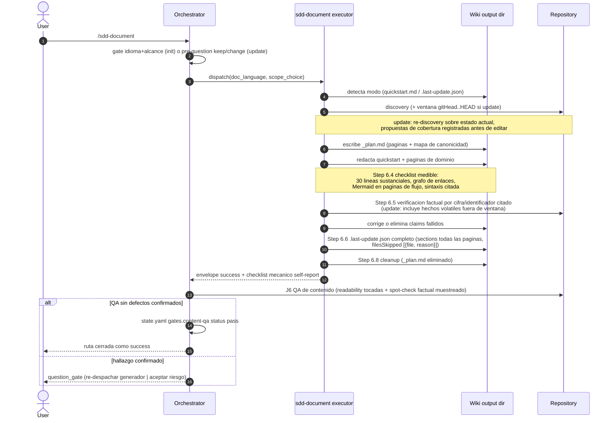

# Design: harden-sdd-document-contract

## Technical Approach

El cambio convierte las propuestas P1–P7 del análisis del 2026-08-22 en mecanismos de
enforcement dentro de dos superficies normativas ya existentes, sin crear superficies nuevas:

1. **`skills/sdd-document/SKILL.md`** (contrato del executor): cinco puntos de inserción que
   cubren P1–P6 y la parte prohibitoria de P7.
2. **`skills/_shared/route-document.md`** (contrato del orquestador): una nueva sección `§7`
   con el procedimiento J6 de QA de contenido orchestrator-owned (P7), hermano de J5.

Cada regla tiene UN único hogar normativo: las obligaciones del generador viven en el SKILL,
las obligaciones de verificación post-run del orquestador viven en el dominio `agents`
(REQ-agents-018) y su procedimiento operativo en el route handler. El SKILL solo recibe la
cláusula prohibitoria correspondiente (no auto-certificación, REQ-sdd-document-022).

### Numeración de pasos en SKILL.md

Los nuevos pasos se insertan entre la redacción de páginas y los metadatos, porque el orden
de ejecución importa: la remediación del checklist puede fusionar páginas (cambia el conjunto
`sections`) y la verificación factual puede corregir cifras; `.last-update.json` debe escribirse
solo después de que ambos concluyan. Se adopta renumeración explícita (no sufijos `6.4a/6.4b`,
que dejan un orden de lectura ambiguo):

| Paso actual | Paso final | Contenido | Requisito |
|---|---|---|---|
| Step 5b | Step 5b (ampliado) | Plan con mapa de canonicidad + propuestas de cobertura en update mode | REQ-007 / P2, P1 |
| Update Mode Behavior | ídem (ampliado) | Re-descubrimiento tras la ventana diff + re-verificación de hechos volátiles | REQ-008 / P1, P5 |
| — | **Step 6.4 (nuevo)** | Measurable Output Checklist | REQ-021 / P4 |
| — | **Step 6.5 (nuevo)** | Factual Verification Pass | REQ-020 / P3 |
| Step 6.4 | **Step 6.6** | `.last-update.json` (esquema completado) | REQ-011 / P6 |
| Step 6.6 | **Step 6.7** | Root agent instruction files | REQ-013 |
| Step 6.5 | **Step 6.8** | Cleanup | REQ-007 |

Ondas de la renumeración (todas internas a archivos ya afectados o de una línea):

- Cross-references internas del propio SKILL.md ("rules of Step 6.6" → "Step 6.7", dos sitios).
- `skills/_shared/route-document.md` §4 punto 2: "Step 6.4 of its SKILL" → "Step 6.6".
- `skills/sdd-document/references/option-d-starlight.md` líneas 65 y 78: referencia textual a
  "Step 6.4" → "Step 6.6" (actualización de referencia de una línea; no está en la tabla
  Affected Areas de la propuesta, se registra aquí como onda de diseño).
- Regex del test `### Step 6\.4:` en `scripts/sdd-document.test.js` → apuntará al bloque JSON
  bajo el nuevo encabezado "Step 6.6".

### Hogar normativo por propuesta

| Propuesta | Mecanismo | Ubicación contractual |
|---|---|---|
| P1 | Re-descubrimiento sobre estado ACTUAL del repo tras calcular la ventana; propuestas de página nueva/fusión registradas en `_plan.md` antes de editar páginas existentes; no autoriza reescrituras amplias | SKILL Step 5b + Update Mode Behavior (REQ-008) |
| P2 | Tabla de canonicidad `concepto -> pagina canonica` dentro de `_plan.md`; solapamiento se resuelve ANTES de escribir (una canónica, el resto summary+link) | SKILL Step 5b (REQ-007) |
| P3 | Paso obligatorio de contraste por cifra e identificador citado, con registro de outcome por claim durante la ejecución (nunca en la salida publicada); claim fallido = corregir o eliminar | SKILL nuevo Step 6.5 (REQ-020) |
| P4 | Checklist medible con umbrales fijos y canal de justificación explícita en el envelope | SKILL nuevo Step 6.4 (REQ-021) |
| P5 | Re-verificación de hechos volátiles en CADA update, fuera de la ventana incluida; en update no-op reduce el alcance del paso de verificación factual a solo hechos volátiles | SKILL Update Mode Behavior + Step 6.5 (REQ-008) |
| P6 | `sections` = TODAS las páginas existentes tras el run; `filesSkipped` = lista `{file, reason}` | SKILL Step 6.6 (REQ-011) |
| P7 | QA de contenido orchestrator-owned: readability sobre páginas tocadas + spot-check factual muestreado; revisor distinto del dispatch generador; registro `gates.content-qa` en `state.yaml`; gate de dos opciones ante hallazgo confirmado | route-document §7 nuevo + agents REQ-agents-018; cláusula de no-auto-certificación en SKILL (REQ-022) |

## Execution Flow



## Decisions

| Decision | Chosen Option | Trade-off / Rejected Alternative | Rationale |
|---|---|---|---|
| **ADR-001: Ejecutor del QA de contenido P7** | Pass inline orchestrator-owned documentado en route-document §7 (J6), mismo patrón que J5 | Sub-agente revisor dedicado / reutilizar el skill review-change (lineage 4R) | Sin superficie de registro nueva; el orquestador es estructuralmente distinto del dispatch generador; precedente REQ-agents-006 |
| **ADR-002: Automatización del checklist P4/P6** | Dos capas en `scripts/sdd-document.test.js`: L1 contrato estático sobre la prosa + L2 especificación ejecutable (helpers puros in-test sobre mini-wikis tmp) | Librería runtime `scripts/lib/document-checklist.js` / escenario golden eval nuevo | El executor es un LLM siguiendo prosa: nada en producción invocaría la librería; los evals live son manuales y estructurales, no miden prosa |

### Detailed ADR References

- [ADR-001: QA de contenido post-run como pass inline orchestrator-owned (J6)](decisions/adr-001.md)
- [ADR-002: Automatización del checklist P4/P6 como contrato estático más especificación ejecutable in-test](decisions/adr-002.md)

Decisiones menores NO elevadas a ADR (registradas aquí por trazabilidad):

- **Renumeración vs sufijos**: se renumera (tabla superior) para mantener monotonicidad de
  lectura; el ripple está enumerado y acotado.
- **Registro de outcomes de verificación factual**: se registra en la bitácora de trabajo del
  run (transcripciones/herramientas), nunca en artefacto persistido nuevo ni en las páginas;
  coherente con el rollback plan ("sin formato persistido nuevo"). Solo los fallos que exigieron
  corrección se resumen en `risks` del envelope.
- **No-op en update mode**: cuando no hay drift y ningún hecho volátil derivó, el run reporta
  no-op sin tocar páginas wiki, pero refresca SOLO `gitHead` y `updatedAt` en
  `.last-update.json` (avanza la ventana; el metadata no es una página wiki). Si un hecho
  volátil derivó, el run degrada a edición quirúrgica normal.

## File Changes

| File | Action | Description |
|---|---|---|
| `skills/sdd-document/SKILL.md` | Modify | Steps 5b (mapa de canonicidad + cobertura en update), Update Mode Behavior (re-descubrimiento + hechos volátiles), nuevos Steps 6.4/6.5 (checklist, verificación factual), Step 6.6 (metadata completa), renumeración 6.7/6.8, cláusula de no-auto-certificación en Step 7 |
| `skills/_shared/route-document.md` | Modify | Nueva §7 "J6 — orchestrator-owned post-run content QA"; fix de cross-ref "Step 6.4"→"Step 6.6" en §4 |
| `skills/sdd-document/references/option-d-starlight.md` | Modify | Dos referencias textuales "Step 6.4"→"Step 6.6" (onda de renumeración) |
| `scripts/sdd-document.test.js` | Modify | Capa L1 (asserts estáticos sobre nueva prosa contractual) + capa L2 (helpers ejecutables del checklist y del schema de metadata sobre fixtures tmp) |
| `openspec/specs/sdd-document/spec.md`, `openspec/specs/agents/spec.md` | Modify (en archive) | Sync de deltas al archivar (fase archive, no apply) |

## Interfaces / Contracts

### 1. `_plan.md` ampliado (Step 5b)

```markdown
| page | category | evidence | substance | canonical for |
|---|---|---|---|---|
| workflows/route-handlers.md | flow | skills/_shared/*.md | high | route handlers |
```

- `category`: clasificación del dominio descubierta en 6.1 (`flow` marca páginas orientadas a
  flujo/arquitectura). Es el oráculo determinista del check de Mermaid, independiente del
  `doc_language`.
- `canonical for`: columna del mapa de canonicidad; un concepto con contenido primario en más
  de una página planificada bloquea la escritura hasta designar canónica y reducir la otra a
  summary+link.
- Update mode añade una sección `coverage proposals` (páginas nuevas/fusiones propuestas por el
  re-descubrimiento) que debe existir antes de la primera edición de una página existente.

### 2. Semántica determinista del checklist (REQ-021)

Definiciones operativas que la capa L2 de tests fija como especificación ejecutable:

- **Línea sustancial**: línea no vacía, que no sea heading (`^#{1,6} `) y que no pertenezca a la
  sección "Source map". Umbral: >= 30 por página.
- **Grafo de enlaces**: enlace saliente = link relativo interno a otra página del output
  (`./x.md`, `../y/z.md`); entrante = el reciproco desde cualquier otra página (quickstart
  incluido). Se excluyen links externos http(s), anclas y auto-links. Umbral: >= 1 saliente Y
  >= 1 entrante por página.
- **Mermaid en páginas de flujo**: toda página marcada `category: flow` en `_plan.md` debe
  contener >= 1 bloque cercado de mermaid no vacío.
- **Sintaxis Mermaid (heurística)**: primera línea efectiva con tipo de diagrama conocido
  (`graph|flowchart|sequenceDiagram|stateDiagram|classDiagram|erDiagram|journey|gantt|pie|mindmap`);
  caracteres especiales `[ ] ( ) { } *` en labels FUERA de comillas dobles => inválido. La
  validación profunda de renderizado queda delegada al spot-check del QA (J6).
- **Canal de justificación**: excepciones justificadas viajan en el `json:result-envelope` bajo
  `checklist.justifiedExceptions[]` (`{page, check, reason}`). Los checks mecánicos SÍ se
  auto-reportan; la calidad de contenido NO (ver punto 4).

### 3. `.last-update.json` (Step 6.6, REQ-011)

Cambios sobre el esquema vigente:

- `sections`: lista COMPLETA de páginas existentes en el directorio de salida tras el run
  (incluye páginas heredadas sin cambios). Invariante verificable: `sections` == conjunto real
  de `*.md` recursivos del output dir.
- `stats.filesSkipped`: deja de ser count numérico; pasa a lista de objetos
  `[{ "file": "<ruta>", "reason": "<motivo>" }]`. Los lectores previos que ignoran campos extra
  no se rompen (rollback plan de la propuesta).
- No-op update: solo cambian `updatedAt` y `gitHead`.

### 4. Envelope del generador (Step 7)

```json
{
  "checklist": {
    "results": [
      { "page": "...", "substantiveLines": 42, "outgoingLinks": 3, "incomingLinks": 2, "mermaid": true }
    ],
    "justifiedExceptions": []
  }
}
```

Cláusula REQ-022: el envelope NO debe contener certificación de calidad de contenido
("readability OK", "facts verified" como veredicto final); esa autoridad es del QA
orchestrator-owned. El self-report queda limitado a los checks mecánicos.

### 5. route-document §7 — J6 procedure

- Disparo: tras `status: success` del generador (tras cualquier ciclo blocked/resume), antes de
  cerrar la ruta.
- Alcance readability: TODAS las páginas tocadas por el run (estructura, claridad, duplicación,
  stubs). Alcance spot-check factual: muestra de `max(3, ceil(0.2 * claims))` sobre los
  claims cuantitativos e identificadores publicados, contrastada contra el repo vía
  search/read.
- Veredictos: `pass` | `findings`. Registro obligatorio en `state.yaml`:

```yaml
gates:
  content-qa:
    status: "pass"   # pass | findings
    summary: "<una linea>"
```

- Hallazgo confirmado => halt con `question_gate` de exactamente dos opciones, default
  recomendado: "Re-dispatch the generator to correct the affected pages"; alternativa:
  "Acknowledge and close the route anyway (accepted risk)". El re-despacho es quirúrgico (solo
  páginas afectadas) y va seguido de un nuevo pase J6 sobre esas páginas; cada halt exige
  elección explícita del usuario, lo que acota el bucle sin maquinaria de lineage adicional.
- Fallo del propio chequeo (tools indisponibles) se trata como inconcluso => mismo gate con
  executive_summary explicando la inconclusión (estilo J5 paso 3).
- Sin registro `gates.content-qa` para el run => la ruta no cierra como success (scenario 4 del
  delta agents).

## Testing Strategy

Tres capas, alineadas con los precedentes del repo (tests estáticos de contrato +
fixtures eval live manuales):

| Layer | Objetivo | Mecanismo |
|---|---|---|
| L1 — contrato estático | La prosa contractual existe y es completa | Asserts `includes`/regex sobre SKILL.md y route-document.md, estilo existente del archivo (precedentes: tests de batched gate y de §3 rel-3): umbrales 30 líneas/in-out links, sección checklist, paso de verificación factual entre escritura y cleanup, esquema completo de metadata (incluye `filesSkipped` con identidad+reason), cláusula de no-auto-certificación, presencia de §7 J6 con `gates.content-qa`, gate de dos opciones con label default, requisito de revisor distinto |
| L2 — especificación ejecutable | Los umbrales tienen semántica exacta y reproducible | Helpers puros DENTRO de `scripts/sdd-document.test.js` (sin módulo runtime nuevo, ADR-002): conteo de líneas sustanciales, grafo de enlaces, detección+heurística Mermaid, validación de schema `.last-update.json` (sections == set real de *.md; filesSkipped objetos). Se ejercitan sobre mini-wikis construidos en tmpdir (`tmpOut` ya existe): wiki válida (pass), página thin (<30), huérfana sin entrantes, flujo sin diagrama, mermaid con label sin citar, metadata incompleta (sections parcial, filesSkipped numérico). Cada variante violadora assertion-falla |
| L3 — evals live (existente) | Comportamiento end-to-end del orquestador | SIN escenarios nuevos en este cambio: los 7 golden scenarios permanecen intactos (los fixtures `document-*` no cambian de forma; `fileTreeUnchanged` sigue válido). La verificación conductual de J6 queda como limitación documentada (mismo tratamiento que J5 hoy); escenario golden dedicado = deuda futura |

Mapeo requisito → verificación:

- REQ-007/-008/-011, -020/-021/-022 → L1 (prosa) + L2 (semántica de umbrales y schema).
- REQ-agents-018 → L1 (procedimiento J6, registro, gate) ; L3 diferida.
- Success criteria "npm test en verde" → suite completa tras apply.

## Migration / Rollout

- Todo es aditivo/sustitutivo sobre prosa contractual y tests: sin migración de datos ni
  formatos persistidos nuevos. `.last-update.json` cambia la forma de `filesSkipped`
  (count → lista) pero lectores previos toleran la diferencia.
- `dist/` se regenera con el pipeline de build/configure existente durante apply (nunca a mano).
- Rollback: `git revert` de los commits del change y `npm test`. Sin pasos intermedios.

## Risks

| Risk | Likelihood | Mitigation |
|---|---|---|
| Renumeración rompe forks o referencias no detectadas | Low | Ripple enumerado en este documento; grep de "Step 6.x" en apply como checklist |
| Heurística Mermaid deja pasar bloques inválidos | Medium | Delegación explícita del render-check al spot-check J6; limitación documentada |
| J6 en contexto del orquestador arrastra sesgo del run | Medium | Aceptado por precedente J5; summary obligatorio en state.yaml hace auditable el veredicto |
| Coste de re-verificar hechos volátiles en wikis grandes | Medium | Alcance limitado a cifras/identificadores efectivamente citados en páginas tocadas + volátiles mapeados |
| Falsos positivos del grafo de enlaces | Low | Canal de justificación explícita en envelope (checklist.justifiedExceptions) |

## Open Questions

- None. Las decisiones significativas quedan capturadas en ADR-001 y ADR-002; las menores, en
  la sección Decisions de este documento.
