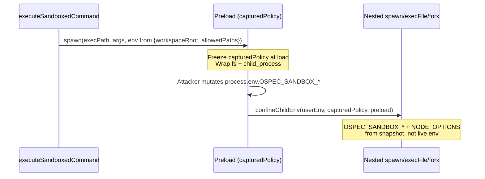

# Design: K6a Isolation Frontier Hardening

## Technical Approach

Close three P0s and REQ-008 drift on the v2.47.1 software sandbox. K6a executes primitives; K4b stays out. `isolationReported=enforced` remains a **software-boundary** claim (architecture-001), not an OS jail.

1. **Immutable captured policy (P0-1):** preload freezes `{workspaceRoot, allowedPaths}` at load. `confineChildEnv` rebuilds child `OSPEC_SANDBOX_*` and `NODE_OPTIONS` from that snapshot, never live `process.env`.
2. **Exhaustive mutating fs wrap (P0-2):** wrap remaining Node 22 mutating APIs (`mkdtemp*`, `chmod*`, `chown*`, `utimes*`, `lutimes*`, `mkdtempDisposable*` and equivalent styles). Wrapper fail-closed is the containment check; post-flight inventory is not sole authority.
3. **Transport-bound WorkerIsolation (P0-3 / P1):** proof, three-way probe, and commands share the executing `WorkerTransport` `port_id` / fingerprint. Isolation is a capability **on** that port, not a sixth required port. Vacuous `{blocked:true}` cannot authorize `enforced`.
4. **REQ-008:** commands without `enforced` fail closed. Non-command primitives may still use the software boundary without claiming `enforced`.

v2.47.1 `env:{}` / `NODE_OPTIONS` inheritance and `realpath(process.execPath)` guards stay untouched.

## Architecture Decisions

| Decision | Chosen | Rejected | Rationale |
|---|---|---|---|
| ADR-001 Captured policy | Closure snapshot; `confineChildEnv` reconstructs `OSPEC_SANDBOX_*` + `NODE_OPTIONS` from it | Re-read live `process.env` at each spawn | Live env is attacker-writable after preload; snapshot is the policy authority |
| ADR-002 Live identity | `expectedPortId` + `expectedFingerprint` on `verifyCapabilityProof`; identity also in hashed semantic evidence | New required CapabilityProof document field | Confirmed sdd-spec-001; schema stays `capability-proof/v1` |
| ADR-003 Commands fail-closed | Refuse command lists unless `isolationReported=enforced` | Documented local-subprocess fallback for `partial`/`unavailable` | Aligns spec with current executor; fallback was the REQ-008 drift |
| Capability on port | Probe + commands invoke `WorkerTransport` only; `WorkerIsolation` is a capability id | Keep `claude-worker-isolation` as a sixth port | Host contract still requires exactly five transports; WorkerTransport stays policy-free |

### Decision: Immutable captured sandbox policy

**Choice**: Preload captures `{workspaceRoot, allowedPaths}` once (`Object.freeze`). Nested `spawn` / `execFile` / `fork` call `confineChildEnv(userEnv, capturedPolicy, preloadPath)`.
**Alternatives considered**: Keep copying `OSPEC_SANDBOX_*` from live `process.env` (status quo); re-parse env on every wrap.
**Rationale**: P0-1 RED mutates `OSPEC_SANDBOX_*` then spawns; only a closure snapshot keeps the child on original `allowed_paths`. See [ADR-001](decisions/adr-001.md).

### Decision: Live-identity binding, no schema field

**Choice**: For `capabilityId === "WorkerIsolation"`, `verifyCapabilityProof` requires `expectedPortId` and `expectedFingerprint`. Semantic evidence carries the same pair (already hashed into `evidence_digest`). Proof document required fields unchanged.
**Alternatives considered**: Add `port_id`/`fingerprint` as required proof fields; treat WorkerIsolation as its own port identity.
**Rationale**: Missing expected input → `expected-field-missing` with path. F vs G → fail closed because executing identity does not match hashed evidence. See [ADR-002](decisions/adr-002.md).

### Decision: Fail-closed commands vs fallback

**Choice**: `ExecuteWorkOrder` refuses any command list unless `isolationReported === "enforced"`. Workspace create/dispose, materialize, path validation, and result capture MAY run under software boundary without claiming `enforced`.
**Alternatives considered**: Keep documented command fallback for `partial`/`instructional`/`unavailable`.
**Rationale**: Runtime already refuses unisolated subprocess; the spec still described fallback. Closing the drift is REQ-008. See [ADR-003](decisions/adr-003.md).

### Decision: WorkerIsolation is capability-on-WorkerTransport

**Choice**: Remove the extra `WorkerIsolation` port from `buildTransports`. Isolation probe and command dispatch both `invokeTransportAsync(WorkerTransport, …)`. `REQUIRED_TRANSPORTS` stays five. Absence of an `enforced` WorkerIsolation claim is honest `partial`/`instructional`/`unavailable`, not `missing-transport-port`.
**Alternatives considered**: Keep `claude-worker-isolation` as a non-required sixth port.
**Rationale**: A separate port lets probe and commands diverge (P0-3). Policy stays in preload/primitive, not on the port (`isolation_policy` still rejected).

## Data Flow

### Captured policy (nested child)



### Probe + ExecuteWorkOrder bind

```mermaid
sequenceDiagram
    participant Adapter as claude adapter
    participant WT as WorkerTransport F
    participant Proof as verifyCapabilityProof
    participant Exec as ExecuteWorkOrder

    Adapter->>WT: isolation probe (three attempted writes)
    WT-->>Adapter: child ran writes; host observes PASS/BLOCKED/BLOCKED
    Adapter->>Proof: WorkerIsolation + expectedPortId/Fingerprint of F
    Proof-->>Adapter: ok iff evidence identity equals F
    Exec->>Proof: same expected identity as executing WT
    alt executing G ≠ F
        Proof-->>Exec: fail closed, not enforced
    else same F
        Exec->>WT: commands via executeSandboxedCommand
        WT-->>Exec: isolationReported=enforced
    end
```

`enforced` without a matching `WorkerTransport`, or commands via unconfined `spawnSync`, is refused.

## MUST scenario allocation

Every change-local MUST scenario maps to a component / file / mechanism.

| Spec scenario | Component | File | Mechanism |
|---|---|---|---|
| Mutated `OSPEC_SANDBOX_*` does not expand child `allowed_paths` | Preload + confine | `worker-sandbox-preload.js`, `worker-sandbox-confine.js` | Snapshot → `confineChildEnv`; RED mutates env then `spawn`/`execFile`/`fork` |
| Closed inheritance and execPath guards stay green | Confine (unchanged contract) | `worker-sandbox-confine.js`, `worker-sandbox.test.js` | Keep `NODE_OPTIONS` overwrite + `realpath(process.execPath)` |
| Undeclared mutating fs API fails closed at wrapper | Preload wraps | `worker-sandbox-preload.js` | `assertWriteAllowed` before `mkdtemp*`/`chmod*`/`chown*`/`utimes*`/`lutimes*`/`mkdtempDisposable*` |
| Allowed mutating fs API succeeds inside captured paths | Same wraps | `worker-sandbox-preload.js` | Call original after allow; post-flight still runs |
| Probe records PASS/BLOCKED/BLOCKED on executing transport | Isolation probe | `worker-sandbox.js`, `host-adapters/claude.js` | Three real writes through `WorkerTransport`; host `existsSync` |
| Vacuous blocked flag does not authorize enforced | Probe + executor | `worker-sandbox.js`, `worker-executor.js`, `claude.js` | Require `attempted:true` per op; `{blocked:true}` alone is not evidence |
| Matching executing transport may report enforced | Executor + adapter | `worker-executor.js`, `claude.js` | Same `port_id`/`fingerprint` for proof, probe, commands; confined path only |
| Different transport invalidates enforced | Executor + proof | `worker-executor.js`, `capability-proof/index.js` | Expected identity G vs evidence F → fail closed |
| Enforced with sandbox and matching WorkerTransport | Executor | `worker-executor.js` | Existing success path + identity bind |
| Enforced without WorkerTransport fails closed | Executor | `worker-executor.js` | Keep fail-closed; no local spawn claiming `enforced` |
| Partial/instructional/unavailable refuses commands | Executor | `worker-executor.js` | Command list + not `enforced` → refuse |
| Non-command primitives may use software boundary | Executor + workspace | `worker-executor.js`, `worker-workspace.js` | No command list → MAY complete; never record `enforced` |
| Matching executing transport live identity verifies | Proof | `capability-proof/index.js` | WorkerIsolation expected inputs + evidence identity |
| Different transport invalidates enforced (proof) | Proof | `capability-proof/index.js` | Identity mismatch fail-closed |
| Missing executing transport identity fails closed | Proof | `capability-proof/index.js` | Omit `expectedPortId` or `expectedFingerprint` → `expected-field-missing` + path |
| Five transports remain the required port set | Host contract + adapter | `host-contract/index.js`, `claude.js` | `REQUIRED_TRANSPORTS` unchanged; no isolation port in `buildTransports` |
| WorkerIsolation is not a missing-port failure | Host contract + adapter | `host-contract/index.js`, `claude.js` | Missing `enforced` claim → capability state, not `missing-transport-port` |
| WorkerTransport still rejects embedded isolation policy | Host contract | `host-contract/index.js` | Existing `isolation_policy` reject |
| Probe and commands share one WorkerTransport fingerprint | Adapter | `claude.js` | Probe `executeWorkerIsolationProbe(WorkerTransport)`; commands same port |
| Mismatched or unconfined path cannot mark enforced | Adapter + E2E | `claude.js`, `k6a-e2e-worker-isolation.test.js` | No `enforced` if probe/commands diverge or use unconfined `spawnSync` |
| Three-way live probe required for WorkerIsolation enforced | Adapter | `claude.js` | Host-observed PASS/BLOCKED/BLOCKED; fixture-only digest refused |
| Deferred invariant cannot satisfy K2.1 gate | Lifecycle model | `lifecycle-model.js` | Existing deferred list (`def-*` only) |
| CAS/permit invariants are not deferred | Lifecycle model | `lifecycle-model.js` | Keep K2.1 checkers out of deferred |
| K2a host invariants are not deferred | Lifecycle model | `lifecycle-model.js` | Unchanged |
| K4a graph/replay invariants are not deferred | Lifecycle model | `lifecycle-model.js` | Unchanged |
| K5 budget/recovery invariants are not deferred | Lifecycle model | `lifecycle-model.js` | Unchanged |
| K6a isolation/containment invariants are not deferred | Lifecycle model | `lifecycle-model.js` | Ten K6a ids must appear in `K6A_EXECUTABLE_INVARIANTS`, none in deferred |
| Every K6a invariant has an executable checker | Lifecycle model | `lifecycle-model.js` | Four new checkers + rewrite fallback checker |
| Model proves containment fail-closed | Checker | `lifecycle-model.js` | Existing `inv-k6a-containment-fail-closed` |
| Model proves interrupted telemetry | Checker | `lifecycle-model.js` | Existing `inv-k6a-interrupted-recovery-preservation` |
| Model proves commands without enforced fail closed | Checker | `lifecycle-model.js` | Rewrite `inv-k6a-host-isolation-fallback` (keep id; new semantics) |
| Model proves captured policy immutable | Checker | `lifecycle-model.js` | New `inv-k6a-sandbox-policy-immutability` |
| Model proves transport binding | Checker | `lifecycle-model.js` | New `inv-k6a-transport-binding` |
| Model proves three-way probe is real | Checker | `lifecycle-model.js` | New `inv-k6a-real-containment-probe` |
| Model proves mutating fs wrap exhaustive | Checker | `lifecycle-model.js` | New `inv-k6a-mutating-fs-surface` |

## File Changes

| File | Action | Description |
|---|---|---|
| `scripts/lib/worker-sandbox-confine.js` | Modify | `confineChildEnv(userEnv, capturedPolicy, preloadPath)` reconstructs `OSPEC_SANDBOX_*` + `NODE_OPTIONS` from snapshot |
| `scripts/lib/worker-sandbox-preload.js` | Modify | Freeze captured policy; pass snapshot into confine; wrap remaining mutating fs families |
| `scripts/lib/worker-sandbox.js` | Modify | Isolation probe attempts all three writes through `executeSandboxedCommand`; drop vacuous `{blocked:true}` |
| `scripts/lib/capability-proof/index.js` | Modify | WorkerIsolation live-identity expected inputs; new reason `transport-identity-mismatch` |
| `scripts/lib/host-contract/index.js` | Modify | Forward `expectedPortId` / `expectedFingerprint` in `resolveCapabilityState` |
| `scripts/lib/worker-executor.js` | Modify | Bind WorkerIsolation verify to executing `WorkerTransport` identity; refuse unconfined command path when `enforced` |
| `scripts/lib/host-adapters/claude.js` | Modify | Drop isolation port; probe via `WorkerTransport`; stamp `fingerprint`; include identity in isolation evidence |
| `scripts/lib/lifecycle-model.js` | Modify | Ten K6a executables; four new checkers; rewrite fallback checker name/semantics |
| `scripts/lib/worker-sandbox.test.js` | Modify | P0-1 env mutation; Node 22 mutating-surface inventory; real probe attempts |
| `scripts/lib/capability-proof/index.test.js` | Modify | Match / mismatch / missing identity |
| `scripts/lib/host-contract/index.test.js` | Modify | Five ports; isolation not missing-port; policy-free WorkerTransport |
| `scripts/lib/host-adapters/claude.test.js` (or existing adapter tests) | Modify | Shared fingerprint; unconfined path cannot mark `enforced` |
| `scripts/k6a-e2e-worker-isolation.test.js` | Modify | Enforced path uses `executeSandboxedCommand`; same fingerprint as probe; no unconfined `spawnSync` |
| `scripts/lib/lifecycle-model.js` tests / k6a checkers tests | Modify | Register and exercise four new checkers |

No deletions. No Candidate/Repair/compiler surfaces.

## Interfaces / Contracts

`confineChildEnv` captured policy (not live env):

```javascript
function confineChildEnv(userEnv, capturedPolicy, preloadPath) {
  // capturedPolicy = { workspaceRoot: string, allowedPaths: string[] }
  // confined.OSPEC_SANDBOX_WORKSPACE_ROOT = capturedPolicy.workspaceRoot
  // confined.OSPEC_SANDBOX_ALLOWED_PATHS = JSON.stringify(capturedPolicy.allowedPaths)
  // confined.NODE_OPTIONS = `--require "${preloadPath}"`
}
```

WorkerIsolation verify (expected inputs only; proof schema unchanged):

```javascript
verifyCapabilityProof({
  capabilityId: "WorkerIsolation",
  expectedAdapterId, expectedAdapterVersion, expectedHostRuntimeVersion, expectedProbeDigest,
  expectedPortId,       // executing WorkerTransport.port_id
  expectedFingerprint,  // executing WorkerTransport.fingerprint
  proof,                // existing required fields only
  evidence,             // must include transport.port_id + transport.fingerprint (hashed)
})
```

Missing either expected identity field → `{ ok:false, reason_code:"expected-field-missing", path:"/expectedPortId"|"/expectedFingerprint" }`.
Identity ≠ hashed evidence → `{ ok:false, reason_code:"transport-identity-mismatch" }`.

`WorkerTransport.fingerprint` is computed after the WorkerTransport live probe:

```javascript
sha256Fingerprint("worker-transport-live-identity/v1", {
  adapter_id, port_id, probe_digest, // WorkerTransport probe, not isolation
})
```

Mutating fs families to wrap (path-based MUST; fd/FileHandle via fd→path registry, unknown fd fail-closed). Wrap if present: `mkdtemp`, `chmod`/`lchmod`, `chown`/`lchown`, `utimes`/`lutimes`, `mkdtempDisposable`, plus Sync / callback / `fs.promises` / FileHandle equivalents. Tests enumerate `Object.keys(fs)` / `fs.promises` on Node 22 rather than a hard-coded guess.

Isolation probe attempt record:

```javascript
{ id, attempted: true, wrote: boolean }
```

`attempted:false` or omitted `{blocked:true}` MUST NOT yield `enforced`.

## Testing Strategy

Focused TDD (`testing.tdd_mode: focused`). RED before production edits.

| Layer | What to Test | Approach |
|---|---|---|
| Unit | Captured policy vs mutated env; confine reconstructs snapshot; proof identity match/mismatch/missing; wrapping inventory | `worker-sandbox.test.js`, `capability-proof/index.test.js`; spawn/execFile/fork children |
| Unit | Mutating fs undeclared fail-closed; allowed path MAY succeed | Per-API in-sandbox `-e` scripts (`mkdtemp`/`chmod`/`chown`/`utimes`/`lutimes`/`mkdtempDisposable` if present) |
| Integration | Five-port contract; isolation not missing-port; policy-free WorkerTransport; shared fingerprint | `host-contract/index.test.js`, claude adapter tests |
| Integration | ExecuteWorkOrder: F may `enforced`, G invalidates; commands without `enforced` refuse; non-command MAY complete | `worker-executor` tests + E2E isolation cases |
| Model | Ten executable K6a checkers, none deferred | `lifecycle-model.js` invariant run |
| E2E | Enforced commands through `executeSandboxedCommand` on the same fingerprint as the probe | Replace unconfined `spawnSync` in `k6a-e2e-worker-isolation.test.js` |
| Regression | v2.47.1 inheritance + fake-`node` execPath | Existing tests stay green |

## Migration / Rollout

No data migration. Internal API change to `confineChildEnv` second argument. Adapter callers that passed a dedicated WorkerIsolation port must probe `WorkerTransport` instead. Keep invariant id `inv-k6a-host-isolation-fallback` (semantics: refuse commands; do not rename, to avoid deferred-list churn). Delivery: `ask-on-risk`; tasks phase forecasts the 400-line budget.

Rollback: revert implementing PR(s). v2.47.1 closed fixes remain.

## Open Questions

None. architecture-001 (software surface) and sdd-spec-001 (live-identity, no schema field) are already decided.
