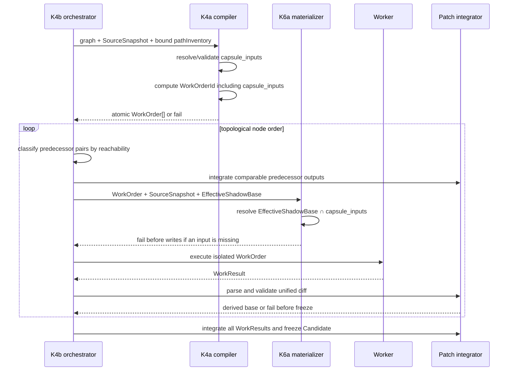
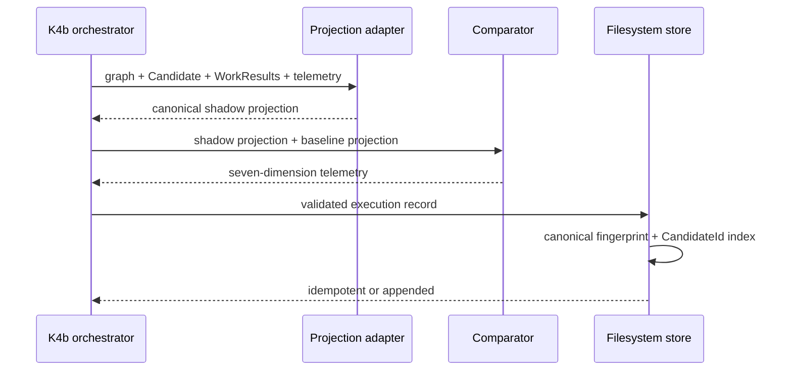

# Design: K4b Integration Invariants Remediation

## Technical Approach

Harden the existing K4a → K4b → K6a path at its current seams rather than introducing another orchestration layer. K4a resolves concrete `capsule_inputs` before identity hashing; K4b carries those WorkOrders unchanged into K6a, derives predecessor state with DAG-aware conflict checks, rejects malformed patches before mutation/freeze, projects comparison inputs from authoritative graph artifacts, and stores execution records under an internal content fingerprint with a CandidateId secondary index.

## Architecture Decisions

### Decision: Derive capsule inputs at K4a from a snapshot-bound inventory

| Option | Trade-off | Decision |
|---|---|---|
| Copy `allowed_paths` | Cannot turn globs into concrete files | Rejected |
| Add file inventory to SourceSnapshot v1 | Changes a frozen identity contract | Rejected |
| Resolve `allowed_paths` against optional compile inventory | Keeps SourceSnapshot v1 frozen; callers with globs must provide inventory | Chosen |

`compileWorkOrdersV2(graph, context)` accepts `context.pathInventory = { source_snapshot_id, paths }`. Its ID must equal `graph.source_snapshot_id`. For each node, concrete `allowed_paths` are retained and glob/directory rules are expanded only against normalized inventory paths using `isPathContained`. The sorted unique result must be non-empty and valid before any WorkOrder is emitted. The orchestrator builds this inventory from `options.files` and binds it to the validated SourceSnapshot. `capsule_inputs` is inserted before `computeWorkOrderId()`.

### Decision: Materialize an exact manifest intersection

K6a treats `workOrder.capsule_inputs` as the sole manifest. Caller overrides (`options.capsule_inputs`, `options.inputs`, or inferred file keys) are removed from this path. With an effective base, K6a first validates its digest, then resolves every declared input from `effectiveBase.files`; any miss aborts before disk writes. Only those resolved entries are written. Without an effective base, the same manifest is resolved from the SourceSnapshot projection inputs. This keeps K6a Repair-agnostic.

### Decision: Compare only incomparable predecessor pairs

The orchestrator passes predecessor entries as `{ node_id, workResult }` plus an ancestor-closure map to `detectPredecessorContextConflicts`. The detector compares hunk ranges only when neither node is in the other's ancestor set. Comparable chain overlaps are therefore legal, while incomparable same-path/context overlaps fail before workspace allocation.

### Decision: Store records by internal canonical fingerprint

The filesystem state becomes:

```js
repair_shadow_executions: {
  records: { [fingerprint]: record },
  by_candidate: { [candidate_id]: [fingerprint] }
}
```

The fingerprint is `sha256Fingerprint("repair-shadow-execution-record/v1", record)` and remains storage metadata, not a kernel identity or lineage member. Existing CandidateId-keyed layouts are not migrated implicitly. Persist validates bindings first, deduplicates an existing identical fingerprint, and atomically appends a new fingerprint to both maps. `loadRepairShadowExecutions(store, candidateId)` returns defensive copies of all indexed records; the singular export remains only as a compatibility alias to the set-returning query.

### Decision: Require canonical graph-derived comparison projections

`buildComparisonProjection({ executionGraph, candidate, workResults, graphTelemetry })` produces all seven dimensions. `steps` is `topologicalSort(executionGraph.nodes).map(node => node.node_id)`; dependencies, obligations, invariants, per-node diffs, Candidate inventory, and clock-stable telemetry use the same topological node order. `compareShadowExecution` accepts only validated projection objects and returns `INVALID_COMPARISON_PROJECTION` instead of falling back to operations, WorkOrderIds, or ad-hoc steps.

## Data Flow





## Interfaces / Contracts

- `parseUnifiedDiffs(text)` returns a structured parse result. Non-empty input is valid only with at least one valid file section and hunk, except an existing-path mode-only section. Invalid/truncated `@@`, header-only create/delete, and unconsumed malformed content produce `MALFORMED_UNIFIED_DIFF`.
- `context.pathInventory` is optional only when every node can yield concrete non-empty inputs directly. If supplied, its SourceSnapshot binding is mandatory.
- WorkOrder v2 schema requires `capsule_inputs` with `minItems: 1`, `uniqueItems: true`, and concrete relative-path item constraints. WorkOrder v1 and K1 pins remain untouched.
- Store commit remains one CAS operation over both record and secondary-index updates. No fingerprint is added to `repair-shadow-execution/v1`, Candidate, or the four-identity lineage.
- A comparison projection carries an internal `kind: "repair-shadow-comparison-projection/v1"` marker and all seven dimension keys; empty arrays are valid evaluated values, missing keys are invalid.

## File Changes

| File | Action | Description |
|---|---|---|
| `scripts/lib/execution-graph/work-order-compiler.js` | Modify | Resolve snapshot-bound concrete capsule inputs atomically |
| `scripts/lib/execution-identities/index.js` | Modify | Validate and hash v2 `capsule_inputs` |
| `schemas/kernel/work-order/v2.schema.json` | Modify | Require closed concrete `capsule_inputs` |
| `schemas/kernel/work-order/fixtures/{valid,invalid}/*.json` | Modify/Create | Update valid v2 fixtures and add missing/empty/type/glob/traversal/absolute negatives |
| `scripts/lib/worker-workspace.js` | Modify | Remove manifest fallbacks and materialize exact intersections |
| `scripts/lib/repair-shadow/patch-integrator.js` | Modify | Structured fail-closed parsing and reachability-aware conflicts |
| `scripts/lib/repair-shadow/orchestrator.js` | Modify | Bind inventory, predecessor metadata, canonical projections, and 1:N persistence |
| `scripts/lib/repair-shadow/shadow-comparator.js` | Modify | Build/validate canonical projections and compare seven dimensions |
| `scripts/lib/repair-shadow/execution-record-store.js` | Modify | Fingerprint-keyed records plus CandidateId secondary index |
| `scripts/lib/repair-shadow/index.js` | Modify | Export plural audit query/projection adapter as needed |
| `scripts/lib/{kernel-schema-fixtures,worker-workspace}.test.js` | Modify | Schema pin and intersection regressions |
| `scripts/lib/execution-graph/work-order-compiler.test.js` | Modify | Determinism, inventory binding, atomic failure, and ID coverage |
| `scripts/lib/repair-shadow/index.test.js` | Modify | Malformed diff, DAG, store, and comparator regressions |
| `scripts/k4b-repair-shadow-e2e.test.js` | Modify | End-to-end Option A and set-returning audit query |

## MUST Scenario Allocation

| Scenario | Design allocation |
|---|---|
| Header-only create rejected | Parser terminal-state validation; `repair-shadow/index.test.js` |
| Header-only delete rejected | Parser terminal-state validation; `repair-shadow/index.test.js` |
| Non-empty patch without valid files/hunks rejected | Structured parse result; `repair-shadow/index.test.js` |
| Mode-only diff remains valid | Existing-path mode classification and Candidate freeze assertion |
| Ancestor-descendant overlap permitted | Ancestor closure map in `orchestrator.js`; chain regression |
| Incomparable diamond overlap rejected | Pair classifier in `patch-integrator.js`; pre-dispatch diamond regression |
| Later diamond does not contaminate predecessor subset | Per-node predecessor-set filtering; subset regression |
| K4b materializes only the intersection | Unmodified WorkOrder handoff plus manifest resolver; call-spy/inventory test |
| Missing capsule input fails before execution | Pre-write resolver in `worker-workspace.js`; executor-not-called assertion |
| Seven-dimension fixed-baseline match | Projection builder and comparator full-match test |
| Diff discrepancy emits telemetry without halting | Comparator divergence test plus production-surface byte snapshot |
| Strict non-mutation | Read-only projection/comparison and before/after production snapshot |
| Empty values remain evaluated | Required-key validation and empty-array comparator test |
| Steps use topological node_id | `topologicalSort` projection and differing-operation regression |
| Non-graph projection rejected | Projection marker/shape validator and `INVALID_COMPARISON_PROJECTION` test |
| Successful run persists required bindings | Record validator/store integration test |
| Record is retrievable for audit | Candidate secondary-index query test |
| Incomplete bindings fail without promotion | Pre-commit binding validation and promotion assertion |
| One Candidate persists N records | Two-payload store test and complete-set query |
| Byte-identical persist is idempotent | Existing-fingerprint branch and record-count assertion |
| Fingerprint is not a fifth identity | Four-slot lineage assertion and schema/record-shape negative assertion |
| Identical graphs emit identical capsule inputs | Deterministic resolver double-compile test |
| Emitted WorkOrder validates | Post-emission schema validation and compiler test |
| Empty/glob capsule inputs fail atomically | Pre-build validation and zero-output/error-code tests |
| WorkOrderId includes capsule inputs | `execution-identities/index.js` canonical payload differential test |
| Canonical snapshot materialization | WorkOrder-only manifest selection and workspace inventory test |
| Deterministic capsule fingerprint | Sorted manifest/file digest test across workspaces |
| Unrecorded workspace fails closed | Existing private-registry guard regression |
| Baseline content preserved | Selected-input baseline map assertion |
| Derived map is intersected | Effective-base lookup by manifest only; extraneous-path assertion |
| Missing derived input fails closed | Resolve-all-before-write test |
| Valid v2 capsule inputs pass | Updated valid fixtures and fixture-family validation |
| Missing/empty capsule inputs fail | Required/minItems fixtures |
| Glob/traversal/absolute items fail | Pattern-negative fixtures |
| WorkOrder v1 and K1 remain frozen | Existing `K1_SCHEMA_BASELINE` digest assertions |

## Testing Strategy

Focused TDD uses the existing Node test runner. Run changed files first:

```text
node --test scripts/lib/execution-graph/work-order-compiler.test.js
node --test scripts/lib/kernel-schema-fixtures.test.js
node --test scripts/lib/worker-workspace.test.js
node --test scripts/lib/repair-shadow/index.test.js
node --test scripts/k4b-repair-shadow-e2e.test.js
```

Then run `npm test`. Fault assertions must verify no WorkOrders on compiler failure, no files/worker dispatch on capsule failure, and no Candidate freeze on malformed/conflicting patches.

## Migration / Rollout

Ship schema, identity hashing, compiler, materializer, orchestrator, store, comparator, fixtures, and tests together in v2.48.2. Update every v2 WorkOrder fixture/caller with concrete inputs. Do not migrate legacy CandidateId-keyed execution records; reject that layout fail-closed and start the new index only in a clean store. Rollback is atomic across these files because older WorkOrderIds do not remain compatible after `capsule_inputs` joins the canonical payload.

## Open Questions

None.
