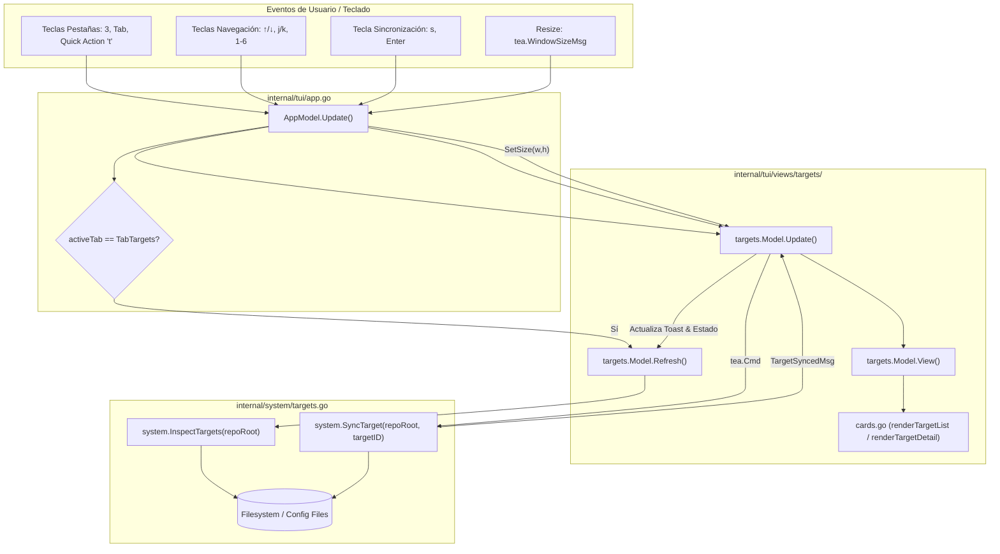

# Design: TUI Targets Manager & Declarative Sync (Milestone 5)

## Technical Approach

El objetivo de este cambio es materializar la tercera pestaña interactiva (**TabTargets / Pestaña 3**) de la TUI de `ospec`, proporcionando inspección diagnóstica profunda, auditoría de rutas/capacidades y sincronización declarativa para los 6 targets AI soportados (*Claude Code*, *Antigravity*, *VS Code / Copilot*, *Codex*, *OpenCode*, *Cursor*).

La estrategia técnica se divide en tres capas desacopladas:
1. **Motor de Dominio e Inspección (`internal/system/targets.go`)**:
   - Centraliza la definición canónica de targets, jerarquía de 4 estados (`Active`, `Configured`, `Detected`, `Inactive`), verificación no destructiva de rutas de configuración, matriz de capacidades nativas y sincronizador declarativo atómico.
   - Provee una API pura y testeable (`InspectTargets`, `InspectTarget`, `SyncTarget`) sin dependencias de interfaces de usuario.
2. **Capa Visual Elm en Bubble Tea (`internal/tui/views/targets/`)**:
   - `types.go`: Define tipos de vista, constantes, badges estilizados y mensajes Bubble Tea (`TargetSelectedMsg`, `TargetSyncedMsg`).
   - `cards.go`: Funciones puras de renderizado con Lip Gloss para la lista maestra de targets, tarjetas de diagnóstico detallado (cabecera con badge, rutas encontradas vs faltantes, matriz de capacidades) y barra de atajos.
   - `targets.go`: Modelo Elm (`Model`), ciclo de vida (`Init`, `Update`, `View`, `SetSize`, `Refresh`), soporte completo de navegación (`↑/↓/j/k`, `1-6`, `Home/End`) y despacho asíncrono no bloqueante de sincronización (`s` / `Enter`).
3. **Integración en el Shell Raíz (`internal/tui/app.go`)**:
   - Conexión de `TabTargets` en `AppModel`, gestión del ciclo de eventos para la pestaña 3, propagación de dimensiones de terminal (`tea.WindowSizeMsg`), atajos directos (`'3'`, `'tab'`, `'shift+tab'`) y soporte para el evento `SwitchTabMsg` desde Dashboard.

---

## Architecture Decisions

| Decisión | Opción Elegida | Alternativas Evaluadas | Compensación / Razón Principal |
|---|---|---|---|
| **ADR-001**: Motor de Inspección | Paquete headless `internal/system/targets.go` | (A) Detección en `views/dashboard`<br>(B) Lógica en `views/targets` | Desacopla la lógica de auditoría del sistema de la vista TUI, permitiendo reutilización y tests unitarios sin Lip Gloss. |
| **ADR-002**: Layout Visual | Split Master-Detail responsivo ($\ge 96$ col) / Stacked ($< 96$ col) | (A) Ventanas modales emergentes<br>(B) Subpantallas multinivel | Visibilidad simultánea inmediata de lista y diagnóstico profundo sin fricción de navegación. |
| **ADR-003**: Sincronización Declarativa | Scaffolding seguro y atómico en Go con `tea.Cmd` | (A) Invocación de `node scripts/configure/cli.js`<br>(B) Sobrescritura destructiva | Evita dependencias de runtime externas en el binario Go y elimina bloqueos del event loop de la TUI. |

### Decision: Desacoplamiento del motor de inspección de targets en internal/system/targets.go

**Choice**: Extraer y formalizar la lógica de inspección, diagnóstico de capacidades y sincronización declarativa en `internal/system/targets.go` como paquete de dominio independiente.
**Alternatives considered**:
- Mantener la detección dentro de `views/dashboard/detector.go` y referenciarla desde `views/targets`: rechazada por acoplamiento indebido entre vistas.
- Embeber la lógica directamente en `views/targets`: rechazada porque duplicaría código y complicaría tests aislados.
**Rationale**: Centralizar las estructuras de datos (`TargetSpec`, `TargetStatusKind`, `CapabilityMatrix`) en un paquete de bajo nivel permite al Dashboard y a Targets Manager compartir una única fuente de verdad y deja abierto el camino para futuros comandos CLI (`ospec targets inspect`).

### Decision: Arquitectura de panel dividido (Split Master-Detail) responsiva en Bubbletea

**Choice**: Implementar un layout Master-Detail que renderiza en dos columnas horizontales (35% lista / 65% detalle) en terminales de ancho $\ge 96$, y cambia automáticamente a apilado vertical con truncado seguro en terminales compactas.
**Alternatives considered**:
- Ventanas modales sobre la lista: rechazada porque bloquea el flujo visual durante la navegación rápida con cursor.
- Navegación multinivel (pantalla lista -> enter -> pantalla detalle): rechazada por requerir pulsaciones extra de teclas.
**Rationale**: Proporciona retroalimentación diagnóstica inmediata en cada movimiento del cursor (`↑/↓`, `j/k`, `1`-`6`) y garantiza compatibilidad con cualquier tamaño de terminal sin roturas ANSI.

### Decision: Sincronización declarativa segura sin invasión de runtime externo

**Choice**: Ejecutar la sincronización declarativa mediante materialización segura de archivos y directorios base desde Go, despachada como un comando asíncrono Bubble Tea (`tea.Cmd`) que emite `TargetSyncedMsg` y muestra un toast visual de resultado.
**Alternatives considered**:
- Invocar el compilador TypeScript/Node (`node scripts/configure/cli.js`): rechazada para mantener la TUI autocontenida en Go sin requerir Node.js en tiempo de ejecución.
- Sobrescritura forzada e indiscriminada: rechazada para no alterar directivas o archivos personalizados del desarrollador.
**Rationale**: Garantiza ejecución instantánea y no bloqueante, previene bloqueos en la interfaz y ofrece retroalimentación visual clara.

---

## Data Flow



### Flujo de Navegación y Sincronización (ASCII)

```
[Usuario] ──(1-6 / ↑↓ / jk)──> [AppModel] ──> [targets.Model]
                                                     │
                                                     ▼
                                        [system.InspectTargets] ──> [FS Probe]
                                                     │
                                                     ▼
                                        [Render Master-Detail] <── [Theme/Cards]

[Usuario] ──(s / Enter)──> [targets.Model] ──(tea.Cmd)──> [system.SyncTarget]
                                                                  │
                                                                  ▼
                                                      [Materializa Config en FS]
                                                                  │
                                                                  ▼
                                                       [TargetSyncedMsg]
                                                                  │
                                                                  ▼
                                                      [Toast + Auto-Refresh]
```

---

## File Changes

| Archivo | Acción | Descripción |
|---|---|---|
| `internal/system/targets.go` | Create | Motor de dominio: tipos `TargetSpec`, `TargetStatusKind`, matriz de capacidades, `InspectTargets`, `InspectTarget`, `SyncTarget`. |
| `internal/system/targets_test.go` | Create | Tests unitarios: detección jerárquica de 4 estados, inspección de rutas, matriz de capacidades y sincronización declarativa. |
| `internal/tui/views/targets/types.go` | Create | Tipos de vista, badges Lip Gloss (`StatusBadge`), mensajes Bubble Tea (`TargetSelectedMsg`, `TargetSyncedMsg`). |
| `internal/tui/views/targets/cards.go` | Create | Renderizado Lip Gloss modular: lista master, panel de detalle, matriz de capacidades, rutas detectadas y barra de atajos. |
| `internal/tui/views/targets/targets.go` | Create | Modelo Elm `targets.Model`: ciclo de vida, navegación por teclado, responsive split/stacked layout y toasts. |
| `internal/tui/views/targets/targets_test.go` | Create | Tests unitarios y de interfaz: navegación de cursor, salto numérico, límites de selección, renderizado responsivo y sincronización. |
| `internal/tui/app.go` | Modify | Enlace de `targets.Model` en `AppModel`, gestión de pestaña `TabTargets` (ID 2), reenvío de mensajes y renderizado. |
| `internal/tui/app_test.go` | Modify | Tests de integración: alternancia a Tab 3 con `'3'` y `'tab'`, atajo `'t'` desde Dashboard y persistencia de estado. |
| `internal/tui/views/dashboard/detector.go` | Modify | Reutilización de `internal/system` para unificar la detección de targets en todo el proyecto. |

---

## Interfaces / Contracts

### 1. Dominio e Inspección (`internal/system/targets.go`)

```go
package system

type TargetStatusKind string

const (
	StatusActive     TargetStatusKind = "Active"
	StatusConfigured TargetStatusKind = "Configured"
	StatusDetected   TargetStatusKind = "Detected"
	StatusInactive   TargetStatusKind = "Inactive"
)

type ConfigFileCheck struct {
	Path   string `json:"path"`
	Exists bool   `json:"exists"`
}

type CapabilityMatrix struct {
	Subagents       bool `json:"subagents"`
	Parallelism     bool `json:"parallelism"`
	Hooks           bool `json:"hooks"`
	BackgroundTasks bool `json:"background_tasks"`
	MCP             bool `json:"mcp"`
	DynamicTools    bool `json:"dynamic_tools"`
}

type TargetSpec struct {
	ID           string            `json:"id"`
	DisplayName  string            `json:"display_name"`
	Status       TargetStatusKind  `json:"status"`
	ConfigFiles  []ConfigFileCheck `json:"config_files"`
	Capabilities CapabilityMatrix  `json:"capabilities"`
	Evidence     string            `json:"evidence"`
}

// InspectTargets escanea repoRoot e inspecciona los 6 targets soportados.
func InspectTargets(repoRoot string) []TargetSpec

// InspectTarget inspecciona un target específico por ID.
func InspectTarget(repoRoot string, targetID string) (TargetSpec, error)

// SyncTarget genera o actualiza la configuración declarativa del target.
func SyncTarget(repoRoot string, targetID string) error
```

### 2. Mensajes y Tipos de Vista (`internal/tui/views/targets/types.go`)

```go
package targets

import "github.com/snakeblack/ospec-workflow/internal/system"

// TargetSelectedMsg se emite cuando el usuario cambia el target seleccionado.
type TargetSelectedMsg struct {
	TargetID string
}

// TargetSyncedMsg notifica la finalización de una acción de sincronización.
type TargetSyncedMsg struct {
	TargetID string
	Success  bool
	Message  string
}

// StatusBadge retorna el componente visual con estilo Lip Gloss para el estado.
func StatusBadge(status system.TargetStatusKind) string
```

### 3. Modelo Elm de Targets (`internal/tui/views/targets/targets.go`)

```go
package targets

import (
	tea "github.com/charmbracelet/bubbletea"
	"github.com/snakeblack/ospec-workflow/internal/system"
)

type Model struct {
	repoRoot      string
	targets       []system.TargetSpec
	selectedIdx   int
	width         int
	height        int
	statusMessage string
	isSyncing     bool
}

func New(repoRoot string) Model
func (m Model) Init() tea.Cmd
func (m *Model) SetSize(w, h int)
func (m Model) SelectedIndex() int
func (m Model) SelectedTarget() *system.TargetSpec
func (m Model) Targets() []system.TargetSpec
func (m Model) StatusMessage() string
func (m *Model) Refresh()
func (m *Model) SyncSelectedTarget() tea.Cmd
func (m Model) Update(msg tea.Msg) (Model, tea.Cmd)
func (m Model) View() string
```

### 4. Integración en `AppModel` (`internal/tui/app.go`)

```go
type AppModel struct {
	activeTab TabID
	// ... otros campos
	targets   targets.Model
}

// Conmutación a TabTargets en Update(msg):
// - '3': m.activeTab = TabTargets; m.targets.Refresh()
// - 'tab'/'shift+tab': si pasa a TabTargets, invoca m.targets.Refresh()
// - Delegación de Update cuando activeTab == TabTargets
```

---

## Testing Strategy

| Capa | Qué se Prueba | Enfoque y Aserciones |
|---|---|---|
| **Unit (`internal/system`)** | `InspectTargets` con repos vacíos, repos con archivos de Claude, Antigravity, VSCode, etc. | Crear directorios temporales (`t.TempDir()`), verificar resolución exacta de `StatusConfigured`, `StatusDetected`, `StatusInactive`, rutas `ConfigFiles` y matriz `Capabilities`. |
| **Unit (`internal/system`)** | `SyncTarget` para cada uno de los 6 targets soportados y manejo de errores. | Verificar que `SyncTarget` cree los archivos declarativos correspondientes sin romper archivos preexistentes, y que retorne error ante rutas inválidas o de solo lectura. |
| **Unit / UI (`internal/tui/views/targets`)** | Navegación con teclado (`↑/↓`, `j/k`, `1`-`6`, `Home/End`) y límites de índice. | Enviar `tea.KeyMsg`, verificar que `SelectedIndex()` se actualice y permanezca en `[0, 5]` sin desbordamientos ni panics. |
| **Unit / UI (`internal/tui/views/targets`)** | Layout responsivo y clamps dimensionales. | Enviar `tea.WindowSizeMsg` con anchos de 120 (split) y 80 (stacked), y dimensiones mínimas (30x10), asegurando ausencia de desbordamientos ANSI. |
| **Integration (`internal/tui/app_test.go`)** | Conmutación fluida de pestañas y atajos globales. | Probar transiciones a `TabTargets` vía `'3'`, `'tab'`, `'shift+tab'` y mensaje `SwitchTabMsg` desde Dashboard. Verificar que `View()` renderice el Targets Manager correctamente. |

---

## Migration / Rollout

1. **Compatibilidad hacia atrás**:
   - `internal/tui/views/dashboard/detector.go` se adaptará para consumir `internal/system/targets.go`, manteniendo retrocompatibilidad total con `dashboard.TargetInfo` y evitando cualquier regresión en la Pestaña 1.
2. **Sin migraciones de base de datos ni esquemas destructivos**:
   - `SyncTarget` únicamente crea estructuras declarativas cuando no existen o refresca metadatos de target de manera segura.
3. **Plan de Despliegue**:
   - Fase `sdd-apply`: Implementación TDD estricta (primero tests unitarios en `internal/system/targets_test.go`, luego implementación del motor, vista en `internal/tui/views/targets/` e integración en `internal/tui/app.go`).
   - Verificación con suite completa `go test ./...`.

---

## Open Questions

- Ninguna pregunta abierta. La especificación en `specs/tui-targets-manager/spec.md` define de manera unívoca los 6 targets, estados jerárquicos y atajos de teclado.
