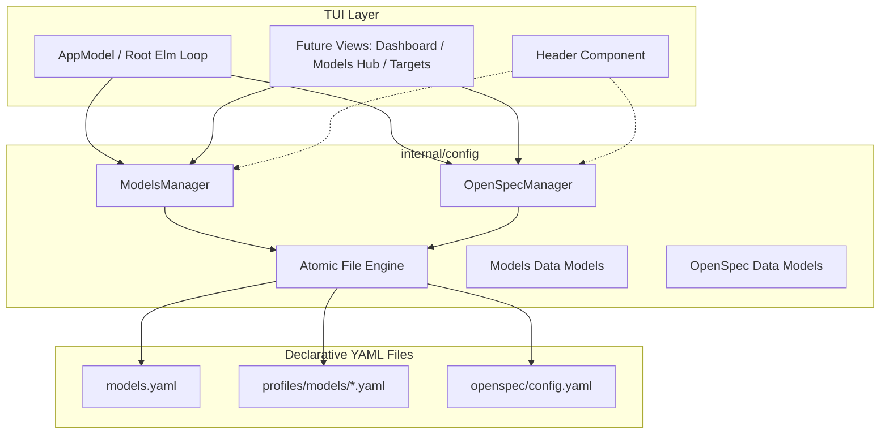

# Design: TUI Declarative Persistence Engine (Option B: yaml.v3)

## 1. Overview and Architecture

The `internal/config` package provides a standalone, declarative configuration engine in Go using `gopkg.in/yaml.v3`. It encapsulates all operations on the project's declarative configuration files:
1. `models.yaml`: Central per-agent tier policy and multi-target model definitions.
2. `profiles/models/*.yaml`: Presets (`cheap.yaml`, `default.yaml`, `premium.yaml`).
3. `openspec/config.yaml`: Core OpenSpec configuration (project metadata, testing runner, baseline status, rules, and routing).



---

## 2. Data Structures and Schemas

### 2.1. Models Configuration (`internal/config/models.go`)

```go
type CodexTierConfig struct {
	Model                string `yaml:"model"`
	ModelReasoningEffort string `yaml:"model_reasoning_effort,omitempty"`
	ModelVerbosity       string `yaml:"model_verbosity,omitempty"`
}

type TierConfig struct {
	Claude   string           `yaml:"claude,omitempty"`
	VSCode   any              `yaml:"vscode,omitempty"` // string or []string
	OpenCode string           `yaml:"opencode,omitempty"`
	Codex    *CodexTierConfig `yaml:"codex,omitempty"`
	Cursor   string           `yaml:"cursor,omitempty"`
	Extra    map[string]any   `yaml:",inline"`
}

type ModelsConfig struct {
	Agents map[string]string     `yaml:"agents"`
	Tiers  map[string]TierConfig `yaml:"tiers"`
}

type ProfileConfig struct {
	Profile     string            `yaml:"profile"`
	Description string            `yaml:"description"`
	Routing     map[string]string `yaml:"routing"`
}
```

### 2.2. OpenSpec Configuration (`internal/config/openspec.go`)

```go
type ProjectConfig struct {
	Name    string `yaml:"name"`
	Version string `yaml:"version"`
	Status  string `yaml:"status"`
}

type TestingLayers struct {
	Unit        bool `yaml:"unit"`
	Integration bool `yaml:"integration"`
	E2E         bool `yaml:"e2e"`
}

type TestingConfig struct {
	TDDMode     string        `yaml:"tdd_mode"`
	Runner      string        `yaml:"runner"`
	TestCommand string        `yaml:"test_command"`
	RawCommand  string        `yaml:"raw_command"`
	Framework   string        `yaml:"framework"`
	Layers      TestingLayers `yaml:"layers"`
}

type BaselineConfig struct {
	Status         string   `yaml:"status"`
	DomainsPending []string `yaml:"domains_pending"`
	DomainsDone    []string `yaml:"domains_done"`
	StaleDomains   []string `yaml:"stale_domains"`
	LastChecked    string   `yaml:"last_checked"`
}

type OpenSpecConfig struct {
	Schema        string         `yaml:"schema"`
	Context       string         `yaml:"context"`
	Project       ProjectConfig  `yaml:"project"`
	ArtifactStore map[string]any `yaml:"artifact_store"`
	Testing       TestingConfig  `yaml:"testing"`
	Baseline      BaselineConfig `yaml:"baseline"`
	Rules         map[string]any `yaml:"rules"`
	Routing       any            `yaml:"routing"`
	Extra         map[string]any `yaml:",inline"`
}
```

---

## 3. Manager Implementations

### 3.1. `ModelsManager` (`internal/config/models_manager.go`)

- `NewModelsManager(repoRoot string) *ModelsManager`
- `LoadModels() (*ModelsConfig, error)`: Reads `models.yaml` from repo root.
- `SaveModels(cfg *ModelsConfig) error`: Persists via atomic rename.
- `GetAgentTier(agent string) (string, error)`: Returns mapped tier, falls back to `_default`.
- `SetAgentTier(agent string, tier string) error`: Mutates mapped tier.
- `ApplyPreset(preset string) error`: Applies predefined agent tier maps (`cheap`, `default`, `premium`) and saves.
- `GetActivePreset() (string, error)`: Compares agent tier table with presets, returning `"cheap"`, `"default"`, `"premium"`, or `"custom"`.

### 3.2. `OpenSpecManager` (`internal/config/openspec_manager.go`)

- `NewOpenSpecManager(repoRoot string) *OpenSpecManager`
- `LoadConfig() (*OpenSpecConfig, error)`: Reads `openspec/config.yaml`.
- `SaveConfig(cfg *OpenSpecConfig) error`: Persists via atomic rename.
- `GetProjectVersion() (string, error)`: Quick accessor for `project.version`.
- `GetProjectName() (string, error)`: Quick accessor for `project.name`.

### 3.3. Atomic File Engine (`internal/config/atomic.go`)

```go
func AtomicWriteYAML(filePath string, data any, perm os.FileMode) error {
	dir := filepath.Dir(filePath)
	tempFile, err := os.CreateTemp(dir, fmt.Sprintf(".%s.*.tmp", filepath.Base(filePath)))
	if err != nil {
		return err
	}
	tempPath := tempFile.Name()
	defer os.Remove(tempPath)

	encoder := yaml.NewEncoder(tempFile)
	encoder.SetIndent(2)
	if err := encoder.Encode(data); err != nil {
		tempFile.Close()
		return err
	}
	if err := encoder.Close(); err != nil {
		tempFile.Close()
		return err
	}
	if err := tempFile.Sync(); err != nil {
		tempFile.Close()
		return err
	}
	if err := tempFile.Close(); err != nil {
		return err
	}

	if err := os.Chmod(tempPath, perm); err != nil {
		return err
	}
	return os.Rename(tempPath, filePath)
}
```

---

## 4. Integration with TUI Visual Shell

In `internal/tui/app.go`:
1. `NewAppModel()` or `Init()` resolves the Git repo root or uses `.` (current working directory).
2. Initializes `OpenSpecManager` and `ModelsManager`.
3. Loads project version (e.g. `v2.57.0`) and active preset (e.g. `Default` or `Cheap`).
4. Updates `header.Model` with dynamic, real data instead of static placeholders.

---

## 5. Testing Strategy

1. **Unit Tests:**
   - Test loading and unmarshaling real repository `models.yaml`, `profiles/models/*.yaml`, and `openspec/config.yaml`.
   - Test fallback resolution for `GetAgentTier` on unregistered agents.
   - Test `ApplyPreset` on all 3 presets (`cheap`, `default`, `premium`).
   - Test active preset detection heuristics.
2. **Round-Trip Tests:**
   - Unmarshal -> Marshal -> Unmarshal to assert zero loss of structural keys, inline maps, Codex properties, and VSCode string arrays.
3. **Atomic Safety Tests:**
   - Test error handling when writing to read-only paths.
   - Test temp file cleanup on failed encode.
4. **Harness Isolation:**
   - Run `go test ./...` and `npm test`.
