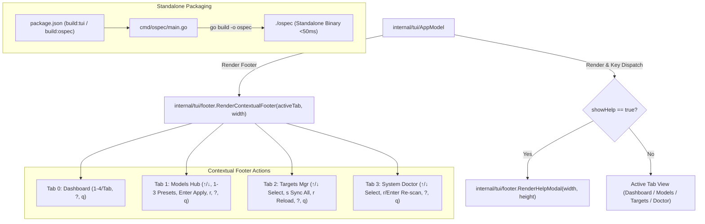
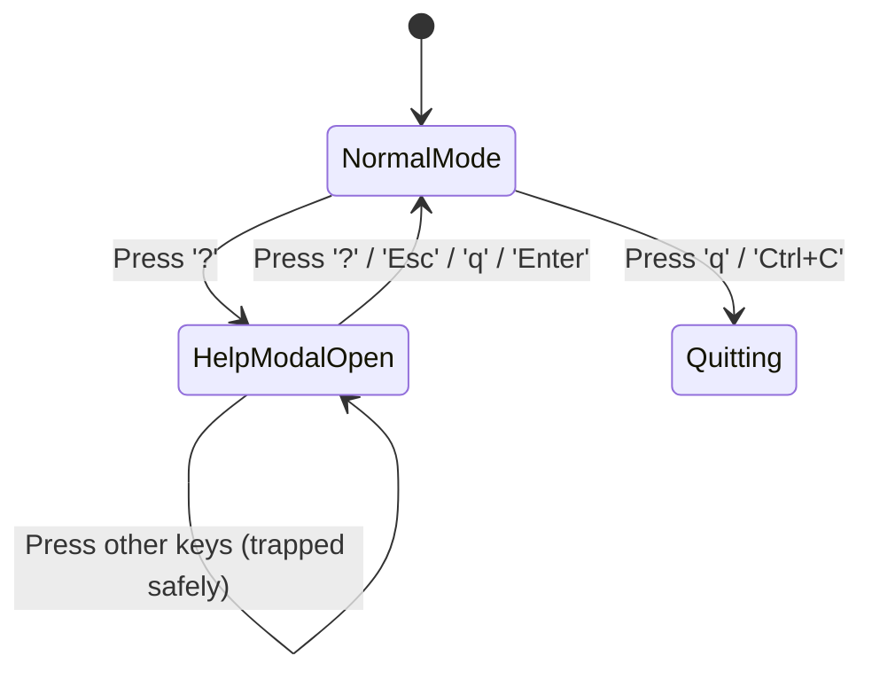

# Design: TUI Footer, Contextual Shortcuts, Help Modal & Binary Release

## Architectural Overview

Este diseño formaliza la arquitectura del Hito 7 de la TUI de `ospec`, cerrando el roadmap con:
1. Un componente de pie de página desacoplado y contextual (`internal/tui/footer/footer.go`).
2. Un modal interactivo de ayuda con intercepción segura de eventos (`internal/tui/footer/help.go`).
3. Integración en el modelo raíz `AppModel` (`internal/tui/app.go`).
4. Pipeline de compilación y empaquetado del binario standalone `ospec`.
5. Verificación de no-regresión integral del arnés.

## Architecture Decision Records (ADRs)

### ADR-015: Arquitectura del Componente Footer Contextual en `internal/tui/footer`

- **Contexto**: Anteriormente, el footer de la aplicación se renderizaba a través de `theme.RenderFooter`, el cual contenía únicamente atajos estáticos globales (`1-4/Tab Switch Tab • ? Help • q Quit`). A medida que se incorporaron las vistas de *Models Hub* (selección de presets `1-3`, `Enter`), *Targets Manager* (sincronización `s`, recarga `r`) y *System Doctor* (re-escaneo `r`/`Enter`), los usuarios requieren visibilidad inmediata de las operaciones disponibles en la vista actual sin tener que memorizarlas.
- **Decisión**: Crear el paquete `internal/tui/footer` exponiendo `RenderContextualFooter(activeTab int, width int) string`. Este componente analiza la pestaña activa y genera la lista de atajos correspondiente con estilo Lip Gloss de alto contraste. Para terminales con ancho $< 80$ columnas, implementa una variante compacta que evita desbordamientos o saltos de línea no deseados.
- **Consecuencias**:
  - *Positivas*: Mayor ergonomía, descubrimiento contextual de acciones, cero impacto en la lógica de las vistas hijas.
  - *Mitigaciones*: Mantener desacoplamiento total: el footer recibe únicamente el índice de pestaña y las dimensiones, sin depender de los estados internos de las vistas.

---

### ADR-016: Modal de Ayuda Interactivo y Mecanismo de Key-Trapping Seguro

- **Contexto**: Los usuarios necesitan una guía de referencia rápida accesible en cualquier momento pulsando `?`. Dicha ayuda no debe alterar el estado actual de la vista subyacente (p. ej. no debe resetear cursores de selección ni aplicar cambios no deseados si el usuario presiona teclas mientras visualiza la ayuda).
- **Decisión**: Implementar el modal de ayuda en `internal/tui/footer/help.go` con `RenderHelpModal(width, height int) string`. En `AppModel`, el estado `showHelp bool` controla el renderizado y el ruteo de eventos. Cuando `showHelp == true`:
  - `Update` intercepta todas las teclas: `?`, `esc`, `q`, `Enter` desactivan `showHelp = false` y regresan a la vista anterior.
  - Las demás teclas son absorbidas como `tea.Cmd(nil)` para evitar efectos colaterales en la vista subyacente.
  - `View` renderiza una tarjeta modal Lip Gloss centrada y dimensionada con padding defensivo.
- **Consecuencias**:
  - *Positivas*: Experiencia de usuario inmersiva, ayuda accesible en cualquier pantalla, prevención de pulsaciones accidentales.
  - *Mitigaciones*: El modal calcula dimensiones relativas (`min(width-6, 84)`) para asegurar legibilidad en cualquier tamaño de terminal.

---

### ADR-017: Pipeline de Compilación del Binario Standalone y Criterios de Aceptación Globales

- **Contexto**: El Hito 7 concluye el roadmap de la TUI de `ospec`. Es imprescindible disponer de comandos directos para empaquetar el binario standalone `./ospec`, certificar que arranca instantáneamente (<50ms) y que todas las suites de pruebas del arnés Node.js y Go pasan al 100%.
- **Decisión**:
  - Añadir en `package.json` los scripts `"build:tui": "go build -o ospec ./cmd/ospec"` y `"build:ospec": "go build -o ospec ./cmd/ospec"`.
  - Probar la compilación y ejecución de `./ospec` verificando la ausencia de dependencias externas en tiempo de ejecución.
  - Ejecutar la suite completa de Go (`go test -race ./...`) y la suite completa de Node.js (`npm test` con 51 suites y 662 tests).
  - Actualizar `docs/tui/roadmap.md` marcando el Hito 7 como completado.
- **Consecuencias**:
  - *Positivas*: Distribución simplificada de la herramienta de línea de comandos, garantía total de no-regresión en la base de código.

## Component Specifications

### `internal/tui/footer/footer.go`
- `RenderContextualFooter(activeTab int, width int) string`: Renderiza la barra inferior con atajos adaptados por pestaña:
  - Tab 0: `[1-4/Tab] Vistas • [?] Ayuda • [q] Salir`
  - Tab 1: `[1-4/Tab] Vistas • [↑/↓] Navegar • [1-3] Perfil • [Enter] Aplicar • [?] Ayuda • [q] Salir`
  - Tab 2: `[1-4/Tab] Vistas • [↑/↓] Seleccionar • [s] Sincronizar • [r] Recargar • [?] Ayuda • [q] Salir`
  - Tab 3: `[1-4/Tab] Vistas • [↑/↓] Chequeos • [r/Enter] Re-escanear • [?] Ayuda • [q] Salir`
  - Formato compacto para anchos $< 80$.

### `internal/tui/footer/help.go`
- `RenderHelpModal(width, height int) string`: Renderiza el cuadro de diálogo de ayuda estructurado:
  - Título y subtítulo con tema `ColorPrimary` y `ColorAccent`.
  - Tabla de atajos globales y navegación general.
  - Tabla de atajos específicos para Dashboard, Models Hub, Targets Manager y System Doctor.
  - Resumen de persistencia declarativa y seguridad atómica.
  - Mensaje de pie de modal para cierre rápido (`[?], [Esc], [q] o [Enter]`).

### `internal/tui/app.go` (Modificaciones)
- Campo `showHelp bool` en `AppModel`.
- Getter `ShowHelp() bool`.
- Manejo de tecla `?` en `Update` para toggle de ayuda.
- Manejo de `esc`, `q`, `Enter`, `?` cuando `showHelp == true` para cerrar la ayuda.
- Delegación del footer a `footer.RenderContextualFooter(int(m.activeTab), m.width)`.
- Sustitución/overlay del cuerpo en `View()` cuando `showHelp == true` mediante `footer.RenderHelpModal(m.width, m.height)`.

## Data Flow & State Transitions

