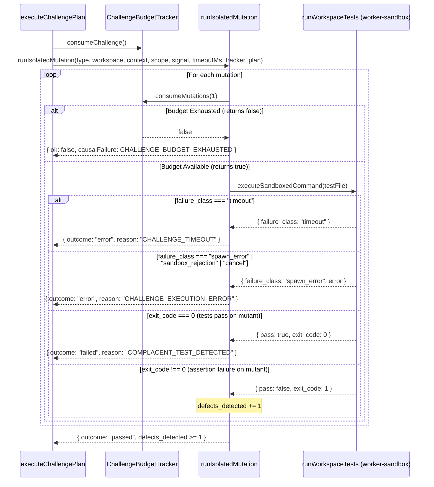

# Design: K6c Budget and Execution Fail-Closed Remediation

## Technical Approach

Remediate two fail-closed integrity gaps in adversarial challenge execution (`scripts/lib/adversarial-challenges/runner.js` and `scripts/lib/worker-sandbox.js`):
1. **Monotonic Mutation Budget Enforcement**: Propagate `tracker` (`createChallengeBudgetTracker`) and `plan` into `runIsolatedMutation`. Prior to evaluating each candidate mutation in `focal-mutation`, invoke `tracker.consumeMutations(1)`. If consumption returns `false`, halt execution immediately and return a typed causal failure descriptor (`causal-failure/v1`) with category `validation_gap`, reason `CHALLENGE_BUDGET_EXHAUSTED`, and exhausted dimension `mutation_budget` without blind retries or unbudgeted evaluations.
2. **Fail-Closed Infrastructure vs Assertion Error Separation**: Explicitly assign `failure_class: "spawn_error"` on process spawn errors or unhandled child process exceptions in `worker-sandbox.js`. In `runner.js` (`runWorkspaceTests` and `runIsolatedMutation`), evaluate `run.failure_class` and execution errors before evaluating exit codes: map `missing_tests` to `MISSING_TESTS`, `timeout` to `CHALLENGE_TIMEOUT`, and `spawn_error`/`sandbox_rejection`/`cancel`/tooling exceptions to `CHALLENGE_EXECUTION_ERROR` with `outcome: "error"`. Ensure `defects_detected` is strictly incremented only when tests fail from assertion failures (`exit_code !== 0` with no infrastructure error) against applied mutations or reverts.

Covers requirements `REQ-adversarial-challenges-003` and `REQ-adversarial-challenges-004`.

## Architecture Decisions

| Decision | Options | Choice | Tradeoff |
| --- | --- | --- | --- |
| Mutation budget enforcement | Pre-deduct upfront; post-execution check; inline step-by-step | **Inline step-by-step** via `tracker.consumeMutations(1)` | Immediate halt on limit; requires passing `tracker` and `plan` to `runIsolatedMutation`. [ADR-001](decisions/adr-001.md) |
| Tooling error classification | Parse stderr text; treat as test pass; explicit `failure_class` | **Explicit `failure_class`** (`spawn_error`, `timeout`, `sandbox_rejection`, `cancel`) | Clean fail-closed classification; eliminates false-positive passes from tooling crashes. [ADR-002](decisions/adr-002.md) |

### Decision: Inline Monotonic Mutation Budget Consumption

**Choice**: Deduct 1 mutation unit before evaluating each mutation in `runIsolatedMutation` via `tracker.consumeMutations(1)`. If exhausted, halt and return `tracker.buildExhaustionFailure({ candidateId, planId, dimension: "mutation_budget" })`.
**Alternatives considered**: Upfront batch deduction; post-execution verification; returning `outcome: "failed"`.
**Rationale**: Guarantees bounded execution and deterministic emission of `causal-failure/v1` without executing unbudgeted mutations or blind retries. [ADR-001](decisions/adr-001.md).

### Decision: Fail-Closed Sandbox Infrastructure Error Classification and Runner Gating

**Choice**: In `worker-sandbox.js`, tag `child.on("error")` and spawn exceptions with `failure_class: "spawn_error"`. In `runner.js`, route `timeout` to `CHALLENGE_TIMEOUT` and all other tooling failures to `CHALLENGE_EXECUTION_ERROR` (`outcome: "error"`), never incrementing `defects_detected`.
**Alternatives considered**: Heuristic stderr matching; mapping crashes to `COMPLACENT_TEST_DETECTED`.
**Rationale**: Distinguishes test assertion failures (valid defect detection) from environmental tooling failures (execution error). [ADR-002](decisions/adr-002.md).

## Data Flow



## File Changes

| File | Action | Description |
| --- | --- | --- |
| `scripts/lib/worker-sandbox.js` | Modify | Assign `failure_class: "spawn_error"` on `child.on("error")` and synchronous spawn `catch` blocks. |
| `scripts/lib/adversarial-challenges/runner.js` | Modify | Pass `tracker` and `plan` to `runIsolatedMutation`; invoke `tracker.consumeMutations(1)` per mutation loop; strictly gate `run.failure_class` and runtime errors as `outcome: "error"` (`CHALLENGE_EXECUTION_ERROR` / `CHALLENGE_TIMEOUT`) without incrementing `defects_detected`. |
| `scripts/lib/adversarial-challenges/runner.test.js` | Modify | Add negative and regression unit tests for `mutation_budget` exhaustion, spawn errors, and timeout handling. |
| `scripts/lib/worker-sandbox.test.js` | Modify | Add unit tests verifying `failure_class: "spawn_error"` on spawn errors. |

## Interfaces / Contracts

```javascript
// scripts/lib/worker-sandbox.js: executeSandboxedCommand return contract
/**
 * @returns {Promise<{
 *   ok: boolean,
 *   exit_code: number,
 *   stdout: string,
 *   stderr: string,
 *   failure_class?: "sandbox_rejection" | "cancel" | "timeout" | "spawn_error",
 *   error?: string
 * }>}
 */
async function executeSandboxedCommand(options = {})

// scripts/lib/adversarial-challenges/runner.js: runIsolatedMutation signature
async function runIsolatedMutation(type, workspace, context, scope, signal, timeoutMs, tracker, plan)

// Causal failure contract on budget exhaustion (from tracker.buildExhaustionFailure)
{
  schema_version: 1,
  failure_id: string,
  category: "validation_gap",
  code: "CHALLENGE_BUDGET_EXHAUSTED",
  priority: 4,
  blocking_fingerprint: "challenge-budget:${plan_id}:mutation_budget",
  details: {
    candidate_id: string,
    plan_id: string,
    exhausted_dimension: "mutation_budget"
  }
}
```

## Requirement / Scenario Allocation

| Requirement / Scenario | Allocation |
| --- | --- |
| `REQ-adversarial-challenges-003`: Monotonic budget consumption during challenge execution | `runner.js` calls `tracker.consumeChallenge()` before each challenge and `tracker.consumeMutations(1)` before each mutation; verified in `runner.test.js`. |
| `REQ-adversarial-challenges-003`: Mutation budget exhaustion halts focal mutation and emits causal failure | `runner.js` halts loop on `!consumeMutations(1)` and returns `tracker.buildExhaustionFailure(...)`; verified in `runner.test.js`. |
| `REQ-adversarial-challenges-003`: Budget exhaustion triggers causal failure transition without blind restart | `executeChallengePlan` returns causal failure directly without retrying; verified in `runner.test.js`. |
| `REQ-adversarial-challenges-004`: Focal mutation detects seeded defect and challenge passes | `runner.js` increments `defects_detected` on pure assertion failures (`exitCode !== 0` without `failure_class`); verified in `runner.test.js`. |
| `REQ-adversarial-challenges-004`: Complacent test suite passes on seeded defect and challenge fails | `runner.js` emits `outcome: "failed"` with `COMPLACENT_TEST_DETECTED` on `exitCode === 0`; verified in `runner.test.js`. |
| `REQ-adversarial-challenges-004`: Test inspection detects tautological assertion | `mutator.js` + `runIsolatedMutation` (`test-inspection`) emits `outcome: "failed"` with `TAUTOLOGICAL_TEST_DETECTED`; verified in `runner.test.js`. |
| `REQ-adversarial-challenges-004`: Missing capability or deadline expiry fails closed | `runner.js` enforces capabilities and wall-clock deadline, emitting `CHALLENGE_TIMEOUT`; verified in `runner.test.js`. |
| `REQ-adversarial-challenges-004`: Foreign scope or candidate mutation is rejected | `diff-scope.js` + `candidateIdentityIntact`; verified in `runner.test.js`. |
| `REQ-adversarial-challenges-004`: Missing tests fail closed without a passed outcome | `runWorkspaceTests` returns `failure_class: "missing_tests"`, `runner.js` emits `outcome: "error"` `MISSING_TESTS`; verified in `runner.test.js`. |
| `REQ-adversarial-challenges-004`: Zero mutations or no-op revert/mutation fail closed | `runner.js` emits `outcome: "error"` `NO_MUTATION_APPLIED` / `CHALLENGE_NOOP`; verified in `runner.test.js`. |
| `REQ-adversarial-challenges-004`: Spawn error or infrastructure failure emits error and never increments defects | `worker-sandbox.js` assigns `failure_class: "spawn_error"`, `runner.js` emits `outcome: "error"` `CHALLENGE_EXECUTION_ERROR` without incrementing `defects_detected`; verified in `runner.test.js` and `worker-sandbox.test.js`. |
| `REQ-adversarial-challenges-004`: Timeout or sandbox rejection emits error outcome without passed result | `runner.js` maps `timeout` to `CHALLENGE_TIMEOUT` and `sandbox_rejection` to `CHALLENGE_EXECUTION_ERROR` with `outcome: "error"`; verified in `runner.test.js`. |

## Testing Strategy

| Layer | What to Test | Approach |
| --- | --- | --- |
| Unit (`worker-sandbox.test.js`) | Explicit `failure_class: "spawn_error"` on invalid executable or process launch failure | Test `executeSandboxedCommand` with invalid binary and verify `failure_class === "spawn_error"`. |
| Unit (`runner.test.js`) | Monotonic `mutation_budget` decrement and immediate `CHALLENGE_BUDGET_EXHAUSTED` causal failure | Execute focal-mutation with `mutation_budget: 0` or insufficient budget; verify execution halts and returns typed causal failure. |
| Adversarial / Negative (`runner.test.js`) | Spawn error during focal-mutation does not increment `defects_detected` or pass | Mock or inject spawn error / sandbox failure; verify result is `outcome: "error"` (`CHALLENGE_EXECUTION_ERROR`) and `defects_detected === 0`. |
| Adversarial / Negative (`runner.test.js`) | Command timeout during test execution results in `CHALLENGE_TIMEOUT` | Test command timeout in workspace tests; verify `outcome: "error"` with `CHALLENGE_TIMEOUT`. |

## Migration / Rollout

No database or persistent schema migration required. Changes are internal to `worker-sandbox.js` and `runner.js`. Rollback is atomic via Git revert.

## Open Questions

None.
