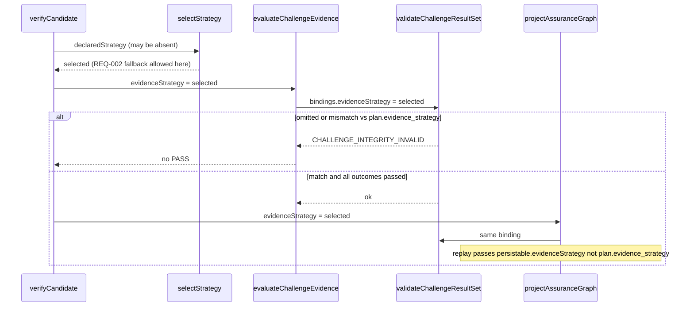
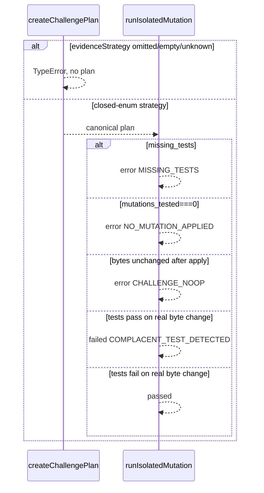

# Design: K6c Fail-Closed Integrity

## Technical Approach

Surgical follow-up to archived `k6c-integrity-remediation`. The integrity gate compares `bindings.evidenceStrategy` to `plan.evidence_strategy` only when the binding is truthy; `verifyCandidate` computes `selectStrategy(...)` and never passes it. Thread that selected value into the gate, reject unknown planner strategies without emitting a plan, fail-close runner no-evidence paths as `outcome: "error"`, and validate published schemas as Draft 2020-12 metaschema instances via the in-house interpreter. Catalog, selection tables, isolation, and REQ-002 fallback stay untouched. Covers REQ-independent-verification-010, REQ-adversarial-challenges-002/004, REQ-assurance-graph-009, REQ-kernel-contract-schemas-029.

## Architecture Decisions

| Decision | Options | Choice | Tradeoff |
| --- | --- | --- | --- |
| Planner reject observable | TypeError for all; `{ok:false, reason_code}`; mix TypeError + reason_code | **TypeError** for omitted, empty, and unknown non-empty | One catch path; missing vs unknown only in the message. [ADR-001](decisions/adr-001.md) |
| Runner no-evidence outcome | `failed`+COMPLACENT; `error`+`CHALLENGE_EXECUTION_ERROR`; `error`+dedicated reason | **`outcome: "error"`** with `MISSING_TESTS`, `NO_MUTATION_APPLIED`, `CHALLENGE_NOOP` | Distinct diagnosis; never invert COMPLACENT. [ADR-002](decisions/adr-002.md) |
| Integrity strategy binding | Keep truthy skip; require on result-set evaluation; require even for `validateChallengePlan({})` | **Require non-empty equality** on result-set and when any evaluation binding is present | Identity-only schema checks stay optional. Never self-compare `plan.evidence_strategy`. [ADR-003](decisions/adr-003.md) |
| Metaschema engine | New Ajv; URI-only `$schema`; in-house `uniqueItems` subset | **Local subset + recursive `required` uniqueItems**; no new dependency | Official remote metaschema uses `$dynamicRef`/`allOf` the interpreter ignores. [ADR-004](decisions/adr-004.md) |

`selectStrategy` unknown declared strings remain REQ-002 fallback. Do not modify `strategy-policy.js`.

### Decision: TypeError is the single planner reject observable

**Choice**: `TypeError` for omitted, empty/non-string, and unknown `evidenceStrategy` (`requires` vs `rejects unknown` messages; `strict-tdd` remains a valid key).
**Alternatives considered**: `{ok, reason_code}` envelope; mixed observables.
**Rationale**: Matches existing required-field errors. Spec only forbids emitting a plan. [ADR-001](decisions/adr-001.md).

### Decision: Runner no-evidence paths emit `outcome: "error"`, never COMPLACENT

**Choice**: `MISSING_TESTS` / `NO_MUTATION_APPLIED` / `CHALLENGE_NOOP` as `outcome: "error"`. COMPLACENT stays only for tests that pass against a real byte change.
**Alternatives considered**: COMPLACENT for missing tests; reuse `CHALLENGE_EXECUTION_ERROR`.
**Rationale**: Missing tests and no-ops never seeded a defect. [ADR-002](decisions/adr-002.md).

### Decision: Evaluation requires `bindings.evidenceStrategy`

**Choice**: `assertEvidenceStrategyBinding` on every result-set and on `validateChallengePlan` when any evaluation key is present. Callers pass `verifyCandidate().strategy`. Projector/replay map failures to `GRAPH_DIVERGENCE`. Identity-only `validateChallengePlan(plan)` stays optional.
**Alternatives considered**: Truthy skip; require the field with empty bindings.
**Rationale**: Omitted binding is the match-all hole; self-comparing `plan.evidence_strategy` would hide it. [ADR-003](decisions/adr-003.md).

### Decision: Draft 2020-12 metaschema via the existing interpreter

**Choice**: `validateSchemaDocument` walks every `required` array with `uniqueItems`. K1 checker invokes it. Fix `challenge-result` duplicate `node_id`; uniqueness-only elsewhere if the walk fails. No Ajv.
**Alternatives considered**: Ajv 8; URI-only check.
**Rationale**: Official meta uses keywords this interpreter ignores; `uniqueItems` is the specified fail-closed rule. [ADR-004](decisions/adr-004.md).

## Data Flow





Verifier fallback vs planner reject: `selectStrategy(undefined|"not-a-strategy")` still returns `strict-tdd`. `createChallengePlan` with those values throws. Planner never performs REQ-002 fallback.

## File Changes

| File | Action | Description |
| --- | --- | --- |
| `scripts/lib/adversarial-challenges/planner.js` | Modify | TypeError instead of `strict-tdd` coercion. |
| `scripts/lib/adversarial-challenges/integrity.js` | Modify | Require evaluation strategy binding. |
| `scripts/lib/adversarial-challenges/runner.js` | Modify | Error reasons + pre/post byte compare. |
| `scripts/lib/independent-verifier/challenge-evidence.js` | Modify | Pass `opts.evidenceStrategy`. |
| `scripts/lib/independent-verifier/index.js` | Modify | Thread `strategy` into eval and projection. |
| `scripts/lib/assurance-graph/projector.js` | Modify | Pass `input.evidenceStrategy`. |
| `scripts/lib/assurance-graph/index.js` | Modify | Replay with `persistable.evidenceStrategy`. |
| `scripts/lib/kernel-schema-validator.js` | Modify | Add `validateSchemaDocument`. |
| `scripts/lib/contract-checkers/k1-schema-compat.js` | Modify | Metaschema check on published families. |
| `schemas/kernel/challenge-result/v1.schema.json` | Modify | Unique `node_id` in `required`. |
| `schemas/kernel/contract-claims.json` | Modify | Unique `challenge-result.required_fields`. |
| `scripts/lib/adversarial-challenges/{planner,runner,integrity}.test.js` | Modify | TypeError / error-outcome / binding negatives. |
| `scripts/lib/independent-verifier/index.test.js` | Modify | `feature` + canonical `bug` plan → `CHALLENGE_INTEGRITY_INVALID`. |
| `scripts/lib/assurance-graph/index.test.js` | Modify | Same pair → `GRAPH_DIVERGENCE`; replay `verified.strategy`. |
| `scripts/lib/{k6c-schema-fixtures,kernel-schema-validator}.test.js` | Modify | Unique `required`; duplicate-required fixture schema. |
| `scripts/lib/independent-verifier/strategy-policy.js` | None | REQ-002 fallback stays. |

## Interfaces / Contracts

```javascript
createChallengePlan({ candidateId, nodeId, policySnapshotId, evidenceStrategy })
// TypeError if omitted, empty, non-string, or not in STRATEGY_CHALLENGE_SELECTION

assertEvidenceStrategyBinding(bindings, plan)
// CHALLENGE_INTEGRITY_INVALID unless non-empty string === plan.evidence_strategy

evaluateChallengeEvidence(input, bound, { required, evidenceStrategy })
projectAssuranceGraph({ …, evidenceStrategy })
replayAssuranceGraph({ …, evidenceStrategy }) // === verifyCandidate().strategy

// runner details.reason (outcome "error"):
//   MISSING_TESTS | NO_MUTATION_APPLIED | CHALLENGE_NOOP
```

No-op: snapshot isolated file bytes before `revertSourcePatch` / `applyFocalMutation`; equal post-apply → `CHALLENGE_NOOP`. Count `mutations_tested` only for byte-changing mutations; stay at 0 → `NO_MUTATION_APPLIED`. Handle `failure_class === "missing_tests"` before the pass/fail branch so revert no longer maps “no tests” to `passed`.

## Requirement / Scenario Allocation

| Requirement and MUST scenarios | Allocation |
| --- | --- |
| REQ-010 success / failed COMPLACENT / missing strategy minimums / missing-duplicate-foreign set | Existing `challenge-evidence.js` + `index.js`; thread `strategy` only. |
| REQ-010 selected strategy mismatch (`feature` vs canonical `bug` plan) | `index.js` → `evaluateChallengeEvidence` → `assertEvidenceStrategyBinding`; `index.test.js`. |
| REQ-002 proportional bug/refactor/migration; identical inputs; changed node/policy identity | Unchanged selection table + `planner.test.js`. |
| REQ-002 unknown/omitted/empty planner strategy | `createChallengePlan` TypeError; `planner.test.js`. |
| REQ-004 focal pass, COMPLACENT, tautology, capability/timeout, foreign scope | Unchanged runner paths. |
| REQ-004 missing tests | `runIsolatedMutation` + `runner.test.js` workspace without `*.test.js`. |
| REQ-004 `mutations_tested===0` / no-op revert or mutation | Pre/post byte compare + empty `context.mutations`; `runner.test.js`. |
| REQ-009 reproducible project/replay; duplicate/foreign; mandatory plan absent | Existing projector/replay; add `evidenceStrategy` to K6c input/persistable. |
| REQ-009 wrong-strategy canonical plan | Gate with selected strategy; `GRAPH_DIVERGENCE`; no graph. |
| REQ-029 valid/invalid plan/result, cross-family, cross-bound pair, manifest/claims | `k6c-schema-fixtures.test.js`; unique claims list. |
| REQ-029 unique `required`; duplicate `required` fails metaschema; published schemas pass | Schema fix + `validateSchemaDocument` + K1 checker + validator/k6c tests. Fixture schema must not live under `fixtures/invalid/` (those are payload instances). |

## Testing Strategy

| Layer | What to Test | Approach |
| --- | --- | --- |
| Unit | Planner TypeError matrix; binding required vs identity-only; uniqueItems on `required` | Node `--test`; `"not-a-strategy"` must not emit a `strict-tdd` plan. |
| Integration | `feature`+`bug` plan; projector/replay same pair; missing tests; empty mutations; no-op revert | Existing harnesses; `CHALLENGE_INTEGRITY_INVALID` / `GRAPH_DIVERGENCE` / `outcome!=="passed"`. |
| Contract | Published families vs `validateSchemaDocument`; K1/K6b byte pins | `k1-schema-compat` + `assertK1SchemasUnchanged`. |

## Migration / Rollout

Atomic PR: runtime, schemas, claims, tests. Omitted strategy bindings now fail closed. `required` uniqueness does not change payload shape or IDs. `evidence/v2`, `verification/v2`, K1 schema bytes, and `K1_SCHEMA_BASELINE` stay byte-identical. K6d remains blocked until terminal verify accepts the negatives. No feature flag. Rollback reverts the PR atomically.

## Open Questions

None.
