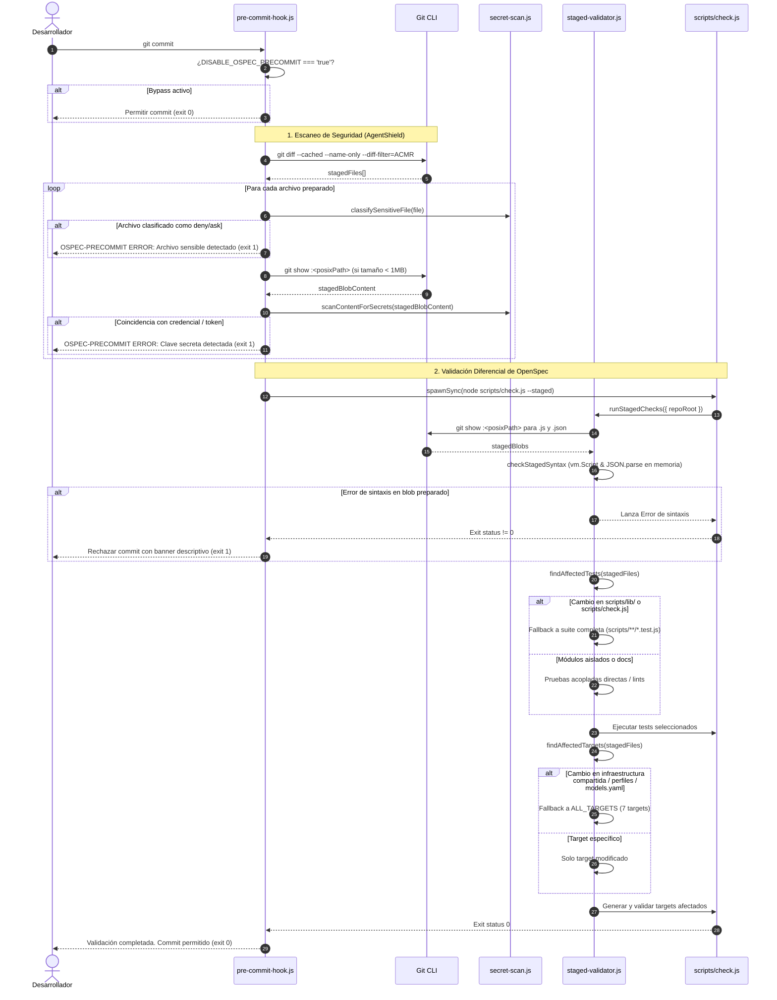

# Design: Remediación del Hook Pre-commit Diferencial

## Technical Approach

Este diseño remedia las fallas críticas de corrección e invalidación identificadas en el hook pre-commit diferencial (v2.60.0). La solución desacopla de manera estricta la validación del árbol de trabajo (`working tree`), anclando todas las comprobaciones sintácticas y de seguridad directamente en los blobs preparados en el índice de Git (`git show :<path>`).

El enfoque aborda cuatro pilares técnicos:
1. **Inspección de Git Index (`git show :<path>`)**: Se introduce la función utilitaria `getStagedContent(repoRoot, relativePath, deps)` en `scripts/hooks/lib/staged-validator.js`, utilizada tanto para la validación sintáctica en memoria (`checkStagedSyntax`) como para el escaneo preventivo de secretos en `scripts/hooks/pre-commit-hook.js`. Se aplica normalización de rutas POSIX obligatoria (`relativePath.replace(/\\/g, "/")`) para garantizar compatibilidad multiplataforma (Windows y Unix) y ejecución sin subshell (`shell: false`).
2. **Invalidación conservadora de targets (`findAffectedTargets`)**: Ante modificaciones en archivos de infraestructura compartida de targets (`scripts/configure/{cli,install-engine,install-target,validate-phase}.js`, `scripts/lib/target-profiles/*.js`, `scripts/lib/target-transform.js` o `models.yaml`), el sistema retorna la lista exhaustiva de todos los targets soportados (`ALL_TARGETS`). Si solo se alteran validadores o instaladores específicos de un target, se ejecuta únicamente dicho target.
3. **Fallback seguro de pruebas a la suite completa (`findAffectedTests`)**: Ante cambios en módulos compartidos del arnés (`scripts/lib/**` fuera de `scripts/lib/contract-checkers/`) o en el orquestador principal `scripts/check.js`, el sistema retorna el patrón de la suite completa de Node (`["scripts/**/*.test.js"]`), impidiendo regresiones por dependencias indirectas.
4. **Verificación mediante repositorios Git efímeros**: Se crea una suite de pruebas de integración (`scripts/hooks/lib/staged-validator.integration.test.js`) que inicializa repositorios Git reales en directorios temporales para validar rigurosamente los casos de staging parcial (staged roto con working tree limpio, staged limpio con working tree roto, y detección de secretos staged).

Mapeo con especificaciones:
- Satisface todos los requisitos modificados y añadidos en `openspec/specs/git-precommit-hook/spec.md` (`REQ-git-precommit-hook-001`, `REQ-git-precommit-hook-002`, `REQ-git-precommit-hook-003`).
- Satisface el requisito añadido en `openspec/specs/agent-shield-security/spec.md` (`REQ-agent-shield-security-001`) y el bypass correspondiente.

---

## Architecture Decisions

### Decision: Lectura de blobs desde Git index mediante `git show :<path>` con normalización POSIX

**Choice**: Extraer el contenido de los archivos preparados directamente desde el índice de Git mediante el comando `git show :<path>` utilizando `spawnSync` con `shell: false`, codificación UTF-8 y normalización de separadores de ruta a formato POSIX (`/`).

| Opción | Trade-off | Veredicto |
|--------|-----------|-----------|
| `git show :<path>` en memoria con normalización POSIX | Operación ultrarrápida (<5ms), sin I/O de disco temporal ni alteración del working tree; requiere normalizar separadores a `/` en Windows. | **Elegida** |
| `git checkout-index` a directorio temporal | Crea copias físicas en disco; I/O innecesario y requiere limpieza de temporales con riesgo de residuos. | Rechazada |
| `git stash --keep-index` / `stash pop` | Riesgo crítico de pérdida de datos o conflictos al desaplicar el stash si el commit se cancela o aborta abruptamente. | Rechazada |
| `fs.readFileSync` desde el working tree (estado actual) | Falla fundamental de corrección: valida lo que está en disco y no lo que realmente se confirmará en el commit. | Rechazada |

**Rationale**: `git show :<path>` es la forma canónica provista por Git para consultar el objeto blob del staging area sin alterar los archivos de trabajo del usuario. En sistemas Windows, Git CLI rechaza o malinterpreta sintaxis con backslashes (`:\scripts\app.js`), por lo que convertir a rutas relativas normalizadas POSIX garantiza portabilidad absoluta.

---

### Decision: Matriz conservadora de invalidación de targets con fallback a `ALL_TARGETS`

**Choice**: Implementar una lista de targets exhaustiva (`ALL_TARGETS = ["claude", "vscode", "github-copilot", "opencode", "codex", "cursor", "antigravity"]`) y activar la regeneración y validación de todos los targets si los archivos preparados modifican generadores compartidos (`scripts/configure/{cli,install-engine,install-target,validate-phase}.js`), perfiles de configuración (`scripts/lib/target-profiles/*.js`), el transformador de targets (`scripts/lib/target-transform.js`) o las definiciones de modelos (`models.yaml`).

| Opción | Trade-off | Veredicto |
|--------|-----------|-----------|
| Detección conservadora con fallback a `ALL_TARGETS` | Máxima confiabilidad: cambios en la infraestructura común siempre validan los 7 targets; cambios aislados preservan velocidad. | **Elegida** |
| Regenerar siempre todos los targets en cualquier commit | Aumenta el tiempo de ejecución a 8-15s en cada commit, degradando la experiencia en commits triviales. | Rechazada |
| Análisis estático de grafo de dependencias (AST) | Introduce alta complejidad, parsing de AST y fragilidad ante dependencias dinámicas sin dependencias de terceros. | Rechazada |
| Heurística optimista (estado previo) | Falsos negativos críticos: cambios en perfiles o CLI no validan targets y generan roturas silenciosas en `dist/`. | Rechazada |

**Rationale**: Los generadores y perfiles compartidos son el núcleo del sistema de compilación multi-target. Un error en un perfil o en el transformador común invalida potencialmente todos los targets. La regla conservadora asegura que ningún cambio en la infraestructura pase desapercibido, manteniendo la agilidad para cambios locales a un solo target.

---

### Decision: Fallback a suite de pruebas completa de Node ante cambios en infraestructura central

**Choice**: Si los archivos preparados contienen modificaciones en `scripts/check.js` o en cualquier archivo de `scripts/lib/` que no sea un verificador aislado en `scripts/lib/contract-checkers/`, `findAffectedTests` debe retornar el patrón de la suite completa de Node (`["scripts/**/*.test.js"]`).

| Opción | Trade-off | Veredicto |
|--------|-----------|-----------|
| Fallback a `scripts/**/*.test.js` para `scripts/lib/` y `check.js` | Cobertura total de regresiones en componentes compartidos; la suite completa nativa de Node tarda ~2-3 segundos. | **Elegida** |
| Ejecutar únicamente el test directo del módulo modificado | No detecta si un cambio en una utilidad compartida rompe consumidores en `scripts/hooks/` o `scripts/configure/`. | Rechazada |
| Mapeo exhaustivo estático de dependencias archivo por archivo | Requiere mantenimiento manual constante o herramientas de import-tracking complejas en runtime CommonJS sin dependencias externas. | Rechazada |

**Rationale**: `scripts/lib/` y `scripts/check.js` representan la infraestructura compartida que da soporte a todo el arnés. Los cambios en estos módulos son de alto impacto pero poco frecuentes en el flujo diario. Ejecutar la suite completa cuando se tocan garantiza tolerancia cero a regresiones indirectas.

---

### Decision: Estrategia de pruebas de integración con repositorios Git efímeros

**Choice**: Implementar un archivo de pruebas dedicado (`scripts/hooks/lib/staged-validator.integration.test.js`) que cree repositorios Git temporales en memoria/disco efímero (`fs.mkdtempSync`), configure el entorno (`git init`, `git config`), prepare archivos reales con `git add` y valide el comportamiento ante desacoples entre index y working tree.

| Opción | Trade-off | Veredicto |
|--------|-----------|-----------|
| Repositorios Git efímeros (`fs.mkdtempSync` + `git init`) | Prueba la integración real con Git CLI y el sistema de archivos del sistema operativo; limpieza garantizada con `fs.rmSync`. | **Elegida** |
| Mocks exclusivos de `child_process.spawnSync` | No valida el comportamiento real de `git show`, parsing de diffs ni problemas de rutas en Windows/Linux. | Rechazada |
| Ejecutar sobre el repositorio local del proyecto | Riesgo inaceptable de ensuciar o corromper el árbol de trabajo y el stage del desarrollador. | Rechazada |

**Rationale**: Los errores que motivaron esta remediación ocurrieron justamente porque los mocks de testing ocultaban la discrepancia entre el stage de Git y el filesystem. Las pruebas de integración en repositorios efímeros reproducen con precisión matemática los escenarios de staging parcial sin ningún riesgo para el entorno del usuario.

---

## Data Flow

### 1. Flujo de Ejecución del Hook Pre-Commit



---

## File Changes

| File | Action | Description |
|------|--------|-------------|
| `scripts/hooks/lib/staged-validator.js` | Modify | Incorpora `getStagedContent(repoRoot, relativePath, deps)` con normalización POSIX y `git show :<path>`. Modifica `checkStagedSyntax` para usar `getStagedContent`. Actualiza `findAffectedTargets` con constante `ALL_TARGETS` y detección de infraestructura compartida. Actualiza `findAffectedTests` con fallback a suite completa de Node para `scripts/lib/` y `check.js`. Exporta `ALL_TARGETS` y `getStagedContent`. |
| `scripts/hooks/pre-commit-hook.js` | Modify | Actualiza el escaneo de secretos para extraer el contenido preparado usando `git show :<path>` (con `getStagedContent` o spawnSync POSIX normalizado) en lugar de `fs.readFileSync(absPath)`. |
| `scripts/hooks/lib/staged-validator.test.js` | Modify | Añade pruebas unitarias para `getStagedContent`, validación de sintaxis sobre blobs del índice, fallback `ALL_TARGETS` ante cambios en generadores/perfiles/transformador/models.yaml, y fallback a suite completa de tests para `scripts/lib/` y `check.js`. |
| `scripts/hooks/pre-commit-hook.test.js` | Modify | Actualiza y expande pruebas unitarias para validar detección de secretos sobre blobs preparados en Git index, asegurando que secretos en el working tree sin preparar no bloqueen el commit y secretos preparados sí lo bloqueen. |
| `scripts/hooks/lib/staged-validator.integration.test.js` | Create | Pruebas de integración automatizadas sobre repositorios Git efímeros en carpetas temporales (`git init`), cubriendo escenarios de staging parcial sintáctico y de secretos. |
| `openspec/changes/fast-precommit-remediation/decisions/adr-001.md` | Create | ADR formal: Lectura de blobs desde Git index mediante `git show :<path>` con normalización POSIX. |
| `openspec/changes/fast-precommit-remediation/decisions/adr-002.md` | Create | ADR formal: Matriz conservadora de invalidación de targets con fallback a `ALL_TARGETS`. |
| `openspec/changes/fast-precommit-remediation/decisions/adr-003.md` | Create | ADR formal: Fallback a suite de pruebas completa de Node ante cambios en infraestructura central. |
| `openspec/changes/fast-precommit-remediation/decisions/adr-004.md` | Create | ADR formal: Estrategia de pruebas de integración con repositorios Git efímeros. |

---

## Interfaces / Contracts

### 1. `getStagedContent(repoRoot, relativePath, deps)`

Función utilitaria exportada en `scripts/hooks/lib/staged-validator.js`:

```javascript
/**
 * Extrae el contenido de un archivo preparado en el índice de Git mediante `git show :<path>`.
 * Normaliza la ruta relativa a formato POSIX con '/' para compatibilidad multiplataforma.
 *
 * @param {string} repoRoot - Ruta absoluta de la raíz del repositorio.
 * @param {string} relativePath - Ruta relativa del archivo dentro del repositorio.
 * @param {object} [deps] - Inyección de dependencias para testing (spawnSync).
 * @returns {string|null} - Contenido UTF-8 del blob en el índice, o null si falla la lectura.
 */
function getStagedContent(repoRoot, relativePath, deps = {}) {
  const spawn = deps.spawnSync || spawnSync;
  const posixPath = relativePath.replace(/\\/g, "/");
  try {
    const res = spawn("git", ["show", `:${posixPath}`], {
      cwd: repoRoot,
      encoding: "utf8",
      shell: false,
      maxBuffer: 10 * 1024 * 1024,
    });
    if (res.error || res.status !== 0) {
      return null;
    }
    return res.stdout;
  } catch {
    return null;
  }
}
```

### 2. Definición y Detección de `ALL_TARGETS`

```javascript
const ALL_TARGETS = [
  "claude",
  "vscode",
  "github-copilot",
  "opencode",
  "codex",
  "cursor",
  "antigravity",
];

const SHARED_TARGET_INFRASTRUCTURE = [
  "scripts/configure/cli.js",
  "scripts/configure/install-engine.js",
  "scripts/configure/install-target.js",
  "scripts/configure/validate-phase.js",
  "scripts/lib/target-transform.js",
  "models.yaml",
];

function isSharedTargetInfra(normalizedPath) {
  if (SHARED_TARGET_INFRASTRUCTURE.includes(normalizedPath)) return true;
  if (normalizedPath.startsWith("scripts/lib/target-profiles/")) return true;
  return false;
}
```

### 3. Matriz de Pruebas Afectadas (`findAffectedTests`)

```javascript
function isCoreInfraFile(normalizedPath) {
  if (normalizedPath === "scripts/check.js") return true;
  if (
    normalizedPath.startsWith("scripts/lib/") &&
    !normalizedPath.startsWith("scripts/lib/contract-checkers/")
  ) {
    return true;
  }
  return false;
}
// Si algún archivo preparado cumple isCoreInfraFile:
// retorna ["scripts/**/*.test.js"] inmediatamente.
```

### 4. Ciclo de Vida de Repositorios Git Efímeros en Pruebas de Integración

```javascript
// scripts/hooks/lib/staged-validator.integration.test.js
function setupEphemeralRepo() {
  const tmpDir = fs.mkdtempSync(path.join(os.tmpdir(), "ospec-precommit-test-"));
  spawnSync("git", ["init"], { cwd: tmpDir });
  spawnSync("git", ["config", "user.name", "Test User"], { cwd: tmpDir });
  spawnSync("git", ["config", "user.email", "test@example.com"], { cwd: tmpDir });
  spawnSync("git", ["config", "commit.gpgsign", "false"], { cwd: tmpDir });
  return tmpDir;
}

function cleanupEphemeralRepo(tmpDir) {
  fs.rmSync(tmpDir, { recursive: true, force: true });
}
```

---

## Testing Strategy

Se sigue la disciplina de `strict_tdd: true` utilizando el test runner nativo de Node.js (`node --test`).

| Capa | Qué se prueba | Enfoque |
|------|--------------|---------|
| **Unit** (`staged-validator.test.js`) | - `getStagedContent`: extracción correcta con normalización POSIX y manejo de errores.<br>- `checkStagedSyntax`: validación sobre contenido retornado por `getStagedContent`.<br>- `findAffectedTargets`: target individual vs fallback a `ALL_TARGETS` ante modificaciones en `cli.js`, perfiles, transformador y `models.yaml`.<br>- `findAffectedTests`: test aislado vs fallback completo a `scripts/**/*.test.js` para cambios en `scripts/lib/` o `check.js`. | Pruebas unitarias en memoria inyectando dependencias simuladas (`deps.spawnSync`, `deps.fs`). |
| **Unit** (`pre-commit-hook.test.js`) | - Escaneo de secretos en blobs de Git index.<br>- Secreto staged detectado cuando el working tree está limpio.<br>- Secreto unstaged en working tree ignorado cuando el index está limpio.<br>- Bypass con `DISABLE_AGENT_SHIELD=true`. | Mocks de `child_process.spawnSync` para simular respuestas de `git show :<path>`. |
| **Integration** (`staged-validator.integration.test.js`) | - Creación de repositorio temporal con `git init`.<br>- Escenario 1: Archivo JS con sintaxis rota staged (`git add`), working tree corregido -> fallo y rechazo.<br>- Escenario 2: Archivo JS con sintaxis válida staged, working tree roto sin preparar -> validación exitosa.<br>- Escenario 3: Archivo con secreto staged, working tree limpio -> detección y bloqueo.<br>- Escenario 4: Archivo limpio staged, secreto en working tree -> permitido. | Ejecución de comandos reales contra la CLI de Git del sistema y validación de código de salida. |
| **Workspace E2E** | Suite completa del arnés (`npm test` y `node scripts/check.js`). | Ejecución monolítica sin errores para verificar regresiones generales. |

---

## Migration / Rollout

- **Compatibilidad**: La remediación es 100% retrocompatible con la configuración existente. No requiere migración de esquemas ni alteración de contratos de configuración en `openspec/config.yaml`.
- **Despliegue**: Modificación directa en el código fuente del arnés (`scripts/hooks/`). No requiere reinstalación de ganchos Git (`setup-git-hooks.js`) ya que el hook de shell continúa invocando `scripts/hooks/pre-commit-hook.js`.
- **Mecanismos de Emergencia / Rollback**:
  - En caso de emergencias durante un commit:
    - Variable de entorno de bypass total: `DISABLE_OSPEC_PRECOMMIT=true git commit ...`
    - Bypass de Git nativo: `git commit --no-verify`
    - Bypass de seguridad: `DISABLE_AGENT_SHIELD=true git commit ...`
  - En caso de revertir el cambio completo: `git revert` al commit inmediatamente anterior.

---

## Open Questions

- [x] ¿Cómo garantizar que `git show :<path>` funcione en Windows? -> Resuelto: Las rutas relativas a la raíz del repositorio se normalizan reemplazando cualquier backslash (`\`) por slash POSIX (`/`).
- [x] ¿Cómo manejar el escaneo de secretos sin sobrecargar Git con archivos grandes? -> Resuelto: Se verifica el nombre del archivo primero (`classifySensitiveFile`), y para archivos no sensibles se limita la lectura a archivos con tamaño menor a 1MB (`MAX_SCAN_SIZE_BYTES`), respetando un `maxBuffer` de 10MB en `spawnSync`.
- [x] ¿Existen preguntas bloqueantes abiertas? -> Ninguna. Todas las interfaces y escenarios están especificados exhaustivamente.
