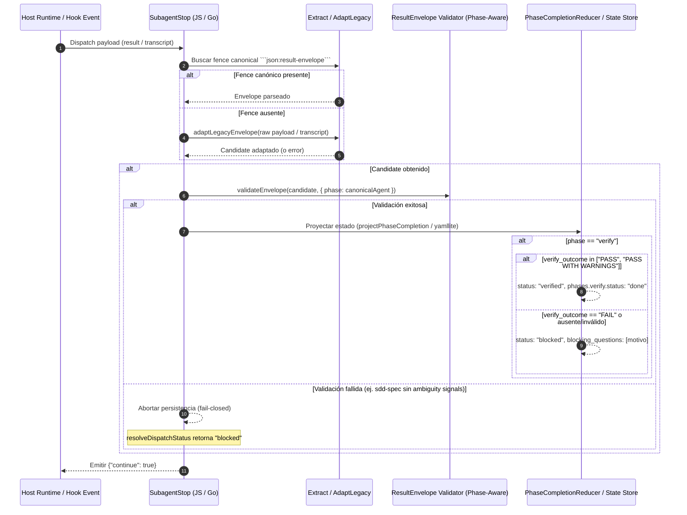

# Design: Remediate CX1 Envelope Projection Findings

## Technical Approach

Este diseño remedia quirúrgicamente los tres hallazgos contractuales detectados en v2.67.0 relativos al slice CX1 de proyección mecánica de envelopes:
1. **Fallback Legacy en `SubagentStop`**: Conectar `adaptLegacyEnvelope` en `persistResultEnvelope` y `resolveDispatchStatus` (tanto en JavaScript como en Go) cuando un subagente o transcript no emite el fence `json:result-envelope` canónico. La validación phase-aware preserva el comportamiento fail-closed ante envelopes de `sdd-spec` con `status: "success"` que carezcan de señales de ambigüedad.
2. **Contrato Canónico de `verify_outcome` y Gating en Reducer**: Incorporar la propiedad opcional `verify_outcome` (`PASS`, `PASS WITH WARNINGS`, `FAIL`) en el esquema `result-envelope/v1`, actualizar `skills/sdd-verify/SKILL.md` para exigirla obligatoriamente, y condicionar la marcación de `status: "verified"` en `PhaseCompletionReducer` a la presencia explícita de un veredicto positivo (`PASS` o `PASS WITH WARNINGS`), proyectando `status: "blocked"` ante `FAIL`, omisión o valor inválido.
3. **Paridad Estricta Schema y Validadores (JS y Go)**: Alinear `schemas/kernel/result-envelope/v1/envelope.schema.json`, `scripts/lib/result-envelope.js` e `internal/resultenvelope/resultenvelope.go` para validar estrictamente tipos de elementos en arrays (`artifacts` y `risks` como strings), enum cerrado de `skill_resolution`, estructura interna de `question_gate`, verificación de `schema_version == 1` en Go y orden determinista de mensajes de error.

## Architecture Decisions

### Decision: Conexión de Fallback Legacy en SubagentStop preservando Fail-Closed en sdd-spec

| Opción | Trade-off | Decisión |
|---|---|---|
| A. Ignorar resultados sin fence canónico | Rompe compatibilidad con modelos o subagentes que emiten prosa estructurada legacy o JSON sin info-string | Rechazada |
| B. Aceptar cualquier texto sin validación | Rompe la integridad del pipeline; falsos positivos en fases de contrato | Rechazada |
| **C. Delegar a `adaptLegacyEnvelope` y validar con phase-awareness** | Normaliza formatos legacy pero rechaza fail-closed envelopes inválidos de `sdd-spec` | **Aceptada** |

- **Choice**: Delegar a `adaptLegacyEnvelope` (en JS y Go) en `persistResultEnvelope` y `resolveDispatchStatus` ante la ausencia de fence canónico, aplicando validación phase-aware (`canonicalAgent`) previa a la proyección o resolución de estado.
- **Alternatives considered**: Descartar soporte legacy (rompe ejecuciones de subagentes en ciertos hosts); o aceptar status legacy sin validar ambiguity signals de `sdd-spec` (invalida el invariante de ambigüedad).
- **Rationale**: Garantiza continuidad operativa con subagentes legacy o respuestas en prosa mientras mantiene la garantía de seguridad fail-closed ante especificaciones no validadas.
- **Evidence and consequences**: `specs/hooks/spec.md` (#REQ-hooks-015). Requiere portar `adaptLegacyEnvelope` a Go en `internal/resultenvelope` e integrarlo en `internal/hooks/subagentstop.go`.

### Decision: Contrato Canónico de verify_outcome y Gating Positivo en PhaseCompletionReducer

| Opción | Trade-off | Decisión |
|---|---|---|
| A. Proyectar `verified` ante cualquier `status: "success"` salvo `FAIL` explícito | Proyecta `verified` cuando `verify_outcome` se omite o es inválido | Rechazada |
| B. Bloquear el reducer si el envelope exterior no es `success` | No permite registrar auditoría de verificación fallida | Rechazada |
| **C. Exigir veredicto explícito positivo (`PASS` o `PASS WITH WARNINGS`) para `verified`** | Si `verify_outcome` es `FAIL`, ausente o inválido, proyecta `blocked` registrando el fallo | **Aceptada** |

- **Choice**: Añadir `verify_outcome: ["PASS", "PASS WITH WARNINGS", "FAIL"]` a `result-envelope/v1`, exigir su emisión en `sdd-verify`, y hacer que `PhaseCompletionReducer` requiera explícitamente `PASS` o `PASS WITH WARNINGS` para avanzar `status` a `"verified"`. Cualquier otro caso (`FAIL`, omisión, o valor desconocido) proyecta `status: "blocked"` con `blocking_questions`.
- **Alternatives considered**: Mantener deducción heurística o proyectar `verified` por defecto en éxito del envelope (rechazada porque envelopes sin veredicto verificable no garantizan conformidad de spec).
- **Rationale**: Garantiza que un cambio sólo se certifique como `verified` si la verificación ejecutada emite explícitamente un veredicto positivo comprobable.
- **Evidence and consequences**: `specs/lifecycle-kernel-runtime/spec.md` (#REQ-lifecycle-kernel-028) y `specs/skills/spec.md` (#REQ-skills-018). Previene falsos positivos en pipelines automatizados.

### Decision: Paridad Estricta de Esquemas y Validadores entre JSON Schema v1, JS y Go

| Opción | Trade-off | Decisión |
|---|---|---|
| A. Validadores parciales dependientes de duck-typing en JS y Go | Inconsistencias de validación cross-runtime y drift de esquema | Rechazada |
| B. Usar librería JSON Schema pesada en Go | Introduce dependencias externas innecesarias en un paquete zero-dependencies | Rechazada |
| **C. Paridad canónica estricta byte-for-byte y tipo-por-tipo en JS y Go nativo** | Mantiene zero-dependencies y asegura idénticos mensajes y rechazos | **Aceptada** |

- **Choice**: Validar elementos de `artifacts` y `risks` como `string`, restringir `skill_resolution` al enum cerrado `["injected", "fallback-registry", "fallback-path", "none"]`, validar estructura interna de `question_gate`, comprobar `schema_version == 1` en Go, y agregar `verify_outcome` en `envelope.schema.json` y en ambos validadores.
- **Alternatives considered**: Permitir tipos flexibles en arrays o enums abiertos (rechazado: permite corrupción de estado).
- **Rationale**: Mantiene el contrato determinista entre la especificación declarativa JSON Schema y las dos implementaciones runtime (Node.js y Go).
- **Evidence and consequences**: `specs/kernel-contract-schemas/spec.md` (#REQ-kernel-contract-schemas-031). Mantiene alineadas las suites de tests en JS y Go.

## Data Flow

### Flujo de Extracción, Adaptación y Proyección en SubagentStop



## File Changes

| File | Action | Description |
|------|--------|-------------|
| `schemas/kernel/result-envelope/v1/envelope.schema.json` | Modify | Añadir propiedad opcional `verify_outcome` con enum `["PASS", "PASS WITH WARNINGS", "FAIL"]`. |
| `schemas/kernel/contract-claims.json` | Modify | Registrar `verify_outcome` en enum_values de la familia `result-envelope`. |
| `schemas/kernel/result-envelope/v1/fixtures/valid-v1.json` | Modify | Incluir `verify_outcome` de ejemplo en fixtures válidos. |
| `schemas/kernel/result-envelope/v1/fixtures/valid/verify-pass-v1.json` | Create | Fixture válido para verify outcome PASS. |
| `schemas/kernel/result-envelope/v1/fixtures/invalid/verify-outcome-invalid.json` | Create | Fixture inválido con valor de `verify_outcome` fuera de enum. |
| `schemas/kernel/result-envelope/v1/fixtures/invalid/non-string-artifacts.json` | Create | Fixture inválido con elemento no-string en `artifacts`. |
| `schemas/kernel/result-envelope/v1/fixtures/invalid/invalid-skill-resolution.json` | Create | Fixture inválido con valor de `skill_resolution` fuera de enum. |
| `schemas/kernel/result-envelope/v1/fixtures/invalid/malformed-question-gate.json` | Create | Fixture inválido con estructura defectuosa en `question_gate`. |
| `scripts/lib/result-envelope.js` | Modify | Validar elementos string en `artifacts`/`risks`, enum `skill_resolution`, enum `verify_outcome` y validación de `question_gate`. |
| `internal/resultenvelope/resultenvelope.go` | Modify | Implementar `AdaptLegacyEnvelope`, validar `schema_version == 1`, arrays con items string, enums de `skill_resolution` y `verify_outcome`, y estructura de `question_gate`. |
| `scripts/lib/lifecycle-kernel/phase-completion-reducer.js` | Modify | Requerir explícitamente `verify_outcome` positivo (`PASS` o `PASS WITH WARNINGS`) para proyectar `verified`; proyectar `blocked` ante `FAIL`, omisión o invalidez. |
| `scripts/hooks/subagent-stop.js` | Modify | Conectar fallback a `adaptLegacyEnvelope` con raw payload/transcript en `persistResultEnvelope` y `resolveDispatchStatus`, manteniendo fail-closed para `sdd-spec`. |
| `internal/hooks/subagentstop.go` | Modify | Conectar fallback a `AdaptLegacyEnvelope` en Go en `persistResultEnvelope` y `resolveDispatchStatus`, manteniendo fail-closed para `sdd-spec`. |
| `skills/sdd-verify/SKILL.md` | Modify | Mandatar emisión estricta de `verify_outcome` en el bloque de envelope de salida. |
| `scripts/lib/result-envelope.test.js` | Modify | Añadir pruebas unitarias para `verify_outcome`, tipos en arrays, enum `skill_resolution` y estructura de `question_gate`. |
| `scripts/lib/result-envelope-schema-fixtures.test.js` | Modify | Validar fixtures nuevos y actualizados contra el schema v1. |
| `scripts/lib/lifecycle-kernel/phase-completion-reducer.test.js` | Modify | Añadir pruebas para verify_outcome ausente/inválido (bloqueado) vs positivo (verified). |
| `scripts/hooks/subagent-stop.test.js` | Modify | Tests de integración para delegación a `adaptLegacyEnvelope` sin fence canónico y fail-closed de `sdd-spec`. |
| `internal/resultenvelope/resultenvelope_test.go` | Modify | Pruebas de paridad Go para `AdaptLegacyEnvelope`, `schema_version == 1`, arrays, enums y `question_gate`. |
| `internal/hooks/subagentstop_test.go` | Modify | Pruebas en Go para fallback legacy y fail-closed en `sdd-spec`. |

## Interfaces / Contracts

### 1. `result-envelope/v1` Schema Extension (`envelope.schema.json`)

```json
{
  "properties": {
    "verify_outcome": {
      "type": "string",
      "enum": [
        "PASS",
        "PASS WITH WARNINGS",
        "FAIL"
      ]
    }
  }
}
```

### 2. Contrato de Validación de `question_gate` (JS y Go)

```typescript
interface QuestionGateOption {
  label: string;
  description?: string;
  recommended?: boolean;
}

interface QuestionGateItem {
  header: string;
  question: string;
  options: QuestionGateOption[];
  multiSelect?: boolean;
  allowFreeformInput?: boolean;
}

interface QuestionGate {
  reason: string;
  questions: QuestionGateItem[];
}
```

### 3. Reductor de Fase de Verificación (`phase-completion-reducer.js`)

```javascript
const POSITIVE_VERIFY_OUTCOMES = new Set(["PASS", "PASS WITH WARNINGS"]);

function isPositiveVerifyOutcome(envelope) {
  const raw = envelope?.verify_outcome;
  return typeof raw === "string" && POSITIVE_VERIFY_OUTCOMES.has(raw.trim().toUpperCase());
}

// En phase === "verify":
if (!isPositiveVerifyOutcome(envelope)) {
  nextState.status = "blocked";
  nextState.blocking_questions = [
    envelope.executive_summary ||
    (envelope.verify_outcome ? `Verification verdict: ${envelope.verify_outcome}` : "Verification verdict FAIL, omitted, or invalid")
  ];
  effects.push({ kind: "persist-state", payload: { phase, status: "blocked" } });
  return { ok: true, state: nextState, effects, events, outcome: "blocked", code: "verification_failed" };
} else {
  nextState.status = "verified";
}
```

### 4. Adapter Legacy en Go (`internal/resultenvelope/resultenvelope.go`)

```go
// AdaptLegacyEnvelope normalizes unversioned JSON fences, legacy field names,
// or prose envelopes into a canonical result-envelope/v1 payload. Never panics.
func AdaptLegacyEnvelope(rawInput any) (map[string]any, bool, []string)
```

## Testing Strategy

| Requirement / quality concern | Trigger and conditions | Expected response | Verification |
|---|---|---|---|
| Fallback legacy en `SubagentStop` (JS) | Subagente `sdd-design` emite texto o transcript sin fence canónico | `adaptLegacyEnvelope` normaliza payload y `PhaseCompletionReducer` proyecta `state.yaml` | `scripts/hooks/subagent-stop.test.js` |
| Fail-closed en `sdd-spec` legacy (JS) | Subagente `sdd-spec` emite prosa legacy con `status: success` sin señales de ambigüedad | Rechazo fail-closed: persistencia cancelada y `resolveDispatchStatus` retorna `"blocked"` | `scripts/hooks/subagent-stop.test.js` |
| Fallback legacy en `SubagentStop` (Go) | Subagente sin fence procesado en Go | `AdaptLegacyEnvelope` normaliza y persiste en `state.yaml` | `internal/hooks/subagentstop_test.go` |
| Fail-closed en `sdd-spec` legacy (Go) | `sdd-spec` en Go sin señales de ambigüedad | Rechazo fail-closed y `resolveDispatchStatus` retorna `"blocked"` | `internal/hooks/subagentstop_test.go` |
| Reducer verify positivo | Envelope de `verify` con `verify_outcome: "PASS"` o `"PASS WITH WARNINGS"` | `phases.verify.status: "done"`, `status: "verified"`, `outcome: "advanced"` | `scripts/lib/lifecycle-kernel/phase-completion-reducer.test.js` |
| Reducer verify negativo u omitido | Envelope de `verify` con `verify_outcome: "FAIL"`, omitido o `"UNKNOWN"` | `status: "blocked"`, `blocking_questions` pobladas, `outcome: "blocked"` | `scripts/lib/lifecycle-kernel/phase-completion-reducer.test.js` |
| Paridad de tipos en arrays (JS/Go) | Envelope con elementos numéricos u objetos en `artifacts` o `risks` | Validación falla determinísticamente en JS y Go indicando el tipo inválido | `result-envelope.test.js` y `resultenvelope_test.go` |
| Paridad de enum `skill_resolution` | Envelope con `skill_resolution: "custom"` | Validación falla indicando los valores permitidos del enum | `result-envelope.test.js` y `resultenvelope_test.go` |
| Paridad de `question_gate` | Envelope `blocked` con `question_gate` sin `reason` o sin `header` en preguntas | Validación falla estructuralmente en JS y Go | `result-envelope.test.js` y `resultenvelope_test.go` |
| `schema_version == 1` en Go | Envelope en Go sin `schema_version` o con `schema_version: 2` | Validación falla cerrado citando `schema_version` | `internal/resultenvelope/resultenvelope_test.go` |
| Conformidad de JSON Schema v1 | Fixtures válidos e inválidos pasados por `validateInstance` | Todos los fixtures válidos pasan y los inválidos son rechazados con path exacto | `scripts/lib/result-envelope-schema-fixtures.test.js` |

## Migration / Rollout

No migration required. El cambio es estrictamente aditivo y retrocompatible a nivel de esquema (nuevos campos opcionales, validación estricta de campos existentes que ya se especificaban normativamente en §D). Rollback mediante `git revert` sin efectos secundarios destructivos.

## Open Questions

None. Todos los aspectos técnicos, interfaces y contratos han sido resueltos y alineados con las especificaciones delta.
