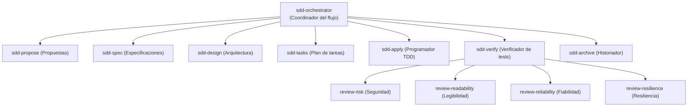

# Agentes y Habilidades (Skills)

> **En pocas palabras:** En `ospec-workflow`, un **Agente** es el rol profesional que asume la IA (como un arquitecto de software o un auditor de seguridad), y una **Skill** es el manual de instrucciones exacto que le enseña paso a paso cómo realizar su trabajo con excelencia.

---

## Estructura de Roles Especializados

En lugar de tener una sola IA que intente hacerlo todo, el sistema divide el trabajo entre agentes con responsabilidades muy claras:

---

## Catálogo de Agentes Principales

| Agente | Rol y Responsabilidad |
|---|---|
| **`sdd-orchestrator`** | El director de orquesta. Evalúa la solicitud, elige la ruta y delega en el especialista correspondiente. |
| **`sdd-propose`** | Redacta la propuesta inicial con el objetivo, alcance y análisis de riesgos. |
| **`sdd-spec`** | Define los requerimientos y escenarios de prueba utilizando el estándar OpenSpec. |
| **`sdd-design`** | Diseña la arquitectura técnica, estructuras de datos y estrategia de archivos. |
| **`sdd-tasks`** | Desglosa la solución en tareas concretas y estima el impacto en líneas de código. |
| **`sdd-apply`** | Implementa el código siguiendo estrictamente TDD (primero el test que falla, luego el código). |
| **`sdd-verify`** | Ejecuta las pruebas en consola real y audita que la evidencia sea sólida y sin trampas. |
| **`sdd-archive`** | Registra el cambio terminado en el historial de archivo inmutable de la empresa. |

---

## Las Habilidades (*Skills*): Procedimientos Paso a Paso

Cada agente cuenta con un documento `SKILL.md` que define su procedimiento operativo estándar. Existen 4 tipos de habilidades en el repositorio:

1. **Habilidades de Fase SDD (`skills/sdd-*`):** El procedimiento formal para cada una de las etapas de desarrollo.
2. **Protocolo Compartido (`skills/_shared/`):** Reglas universales para todos los agentes (formato de respuesta, memoria operativa y estilo de comunicación).
3. **Habilidades de Stack Tecnológico (`skills/stack-*`):** Buenas prácticas específicas para React, Go, Python, Spring Boot, Astro Starlight, Angular, etc.
4. **Habilidades de Utilidad (`skills/chained-pr`, `skills/branch-pr`, etc.):** Herramientas para dividir Pull Requests grandes, crear ramas o generar notas de versión.

---

## Registro Ultrarrápido en Caché

Para que los asistentes no pierdan tiempo buscando archivos en el disco, el sistema compila todo el catálogo de habilidades en un archivo JSON indexado (`.ospec/cache/skill-registry.cache.json`). Al iniciar la sesión, los agentes acceden a sus instrucciones en milisegundos.
