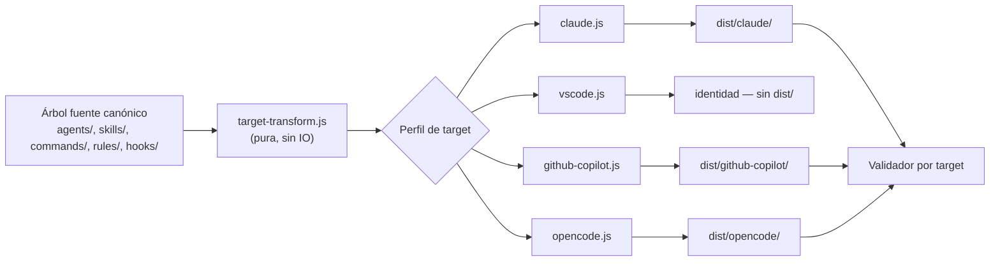

# Arquitectura y generador multi-target

Este dominio cubre cómo `ospec-workflow` se distribuye a cuatro herramientas de
chat/IDE distintas (`claude`, `vscode`, `github-copilot`, `opencode`) a partir
de **un único árbol fuente canónico**, sin duplicar contenido a mano ni
mantener cuatro repositorios sincronizados manualmente.

## El árbol canónico y por qué existe un generador

El origen canónico está en **formato VS Code** y se carga tal cual — VS Code
no necesita transformación. Los otros tres targets requieren layouts, nombres
de archivo, esquemas de manifiesto y convenciones de herramientas distintos
(por ejemplo, Claude Code espera `.claude-plugin/`, agentes con extensión
`.agent.md` y el orquestador expuesto como *skill*; GitHub Copilot espera
`.github/agents/*.agent.md` con `target: github-copilot` y herramientas
`vscode/askQuestions` reescritas a `ask_user`; opencode espera `.opencode/`
con `tools:` como mapa y modelos en formato `provider/model`).

En vez de mantener cuatro copias del contenido, el generador (`scripts/configure/cli.js`)
lee el árbol fuente una sola vez y produce cada distribución en `dist/<target>/`.

## Flujo principal



1. `scripts/configure/cli.js` (capa de IO) carga el árbol fuente, invoca la
   transformación pura y escribe la salida.
2. `scripts/lib/target-transform.js` reestructura archivos según el
   `target-profile` seleccionado (`scripts/lib/target-profiles/{claude,vscode,github-copilot,opencode,opencode-plugin}.js`).
3. `scripts/lib/frontmatter.js` parsea y serializa el frontmatter YAML-lite de
   cada archivo (`.agent.md`, `SKILL.md`, `.prompt.md`).
4. `scripts/lib/model-resolver.js` resuelve el tier de modelo (`default`,
   `cheap`, `premium`) declarado en `models.yaml` al formato nativo del target.
5. Cada árbol generado se valida: `claude plugin validate --strict` para
   Claude, `scripts/configure/validate-github-copilot.js` y
   `scripts/configure/validate-opencode.js` para los otros dos, contra
   fixtures golden.

## Detalles técnicos

| Target | Salida | Transformaciones clave |
| --- | --- | --- |
| `vscode` | Identidad — sin `dist/` | Ninguna; es el formato canónico. |
| `claude` | `dist/claude/` (vía `.claude-plugin`) | Renombra archivos, reestructura el manifiesto, sustituye herramientas context-aware, reescribe variables de comando, incorpora `rules/`, emite el orquestador como skill. |
| `github-copilot` | `dist/github-copilot/` | Agentes → `.github/agents/*.agent.md`; comandos → `.github/prompts/*.prompt.md`; reglas → `.github/instructions/*.instructions.md` (`applyTo: "**"`); hooks → `.github/hooks/hooks.json` (schema Copilot). |
| `opencode` | `dist/opencode/` | Agentes → `.opencode/agents/*.md` (`mode: primary\|subagent`, `tools:` mapa, modelo `provider/model`); comandos → `.opencode/commands/*.md`; reglas referenciadas en `opencode.json`; hooks puenteados vía plugin JS `.opencode/plugins/ospec.js` (opencode no tiene hooks de shell nativos). |

Cada árbol generado es **autocontenido**: el generador sigue los `require`
desde los hooks e incluye su runtime (`scripts/hooks/` + dependencias de
`scripts/lib/`), sin arrastrar tests ni el propio generador.

```powershell
node scripts/configure/cli.js --target claude          --out dist/claude
node scripts/configure/cli.js --target github-copilot  --out dist/github-copilot
node scripts/configure/cli.js --target opencode         --out dist/opencode
```

### Instalación por target

Cada target tiene un mecanismo de distribución distinto (ver
`openspec/specs/install/spec.md`):

- **Claude Code**: `npm run setup:claude` compila, valida estrictamente e
  instala como plugin persistente; `npm run reload:claude` reconstruye rápido
  en desarrollo.
- **GitHub Copilot CLI**: `npm run setup:copilot` copia agentes/instrucciones/
  comandos a `~/.copilot/` globalmente.
- **opencode**: `npm run setup:opencode` instala en `~/.config/opencode/` y
  renombra el agente principal a `ospec-workflow` para autocompletado.
- **VS Code**: sin instalador — se añade la raíz del repo clonado a
  `chat.pluginLocations`, o se compila con `npm run setup:vscode` para
  ruteo de modelos.

## Por qué la arquitectura está diseñada así

Separar transformación pura (`target-transform.js`, testeada bajo Strict TDD
sin tocar el sistema de archivos) de la capa de IO (`cli.js`) permite testear
exhaustivamente la lógica de reshape con fixtures en memoria, y mantener el
IO — la parte más propensa a bugs de entorno (rutas Windows/POSIX, permisos)
— aislado y delgado. Los perfiles por target encapsulan el conocimiento
específico de cada herramienta detrás de una interfaz uniforme, así agregar un
quinto target no debería tocar `cli.js` ni los otros perfiles.

## Principales puntos de extensión

- Agregar un target nuevo: crear `scripts/lib/target-profiles/{target}.js` que
  implemente la interfaz de perfil, y un validador dedicado si el target lo
  requiere.
- Agregar un tier de modelo: editar `models.yaml`; `model-resolver.js` ya
  soporta el mapeo.
- Cambiar el layout de un target existente: modificar solo su perfil — nunca
  `target-transform.js` core a menos que el cambio sea genuinamente
  cross-target.

## Cosas a vigilar al editar

- `.plugin.json` (raíz) es el manifiesto canónico; `.claude-plugin/plugin.json`
  es una copia de compatibilidad que además lee el generador. Deben coincidir
  — `scripts/manifest-sync.test.js` lo verifica en CI.
- No editar `dist/` a mano: es completamente generado y se sobrescribe en
  cada build.
- Los perfiles de target son puros (sin IO); si necesitas leer/escribir
  archivos, esa lógica va en `cli.js`, no en el perfil.

## Mapa de fuentes

- `/scripts/configure/cli.js` — `git log`: `343d2d9` (target opencode), `5e8fcfa` (validación multi-OS)
- `/scripts/lib/target-transform.js` — `git log`: `5b84062`, `07e1000`
- `/scripts/lib/target-profiles/`
- `/scripts/lib/frontmatter.js`, `/scripts/lib/model-resolver.js`
- `/scripts/configure/validate-github-copilot.js`, `/scripts/configure/validate-opencode.js`
- `/models.yaml`, `/.plugin.json`, `/.claude-plugin/plugin.json`
- `/openspec/specs/generator/spec.md`, `/openspec/specs/install/spec.md`
