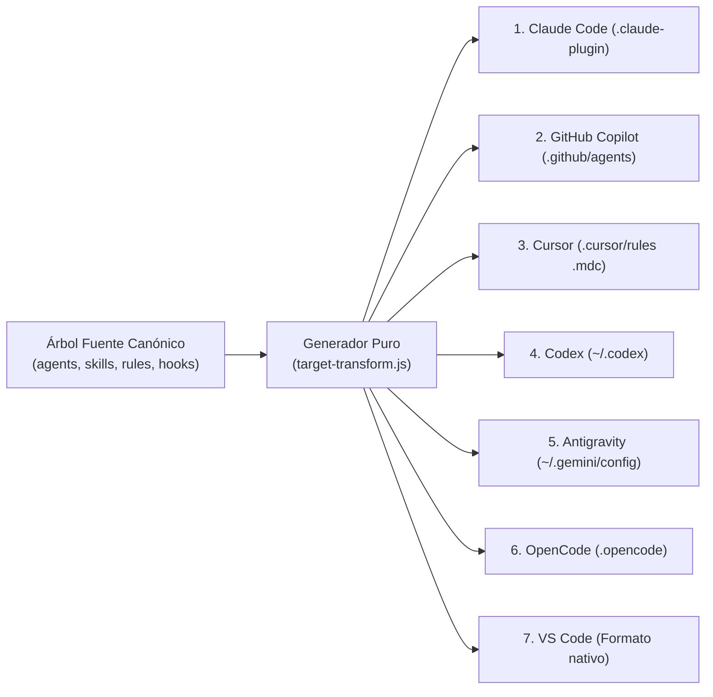

# Arquitectura y Generador Multi-Target

> **En pocas palabras:** Mantener agentes, prompts y reglas para múltiples asistentes de IA (Claude, Copilot, Cursor, etc.) suele significar copiar y pegar archivos en carpetas distintas. `ospec-workflow` soluciona esto con una **fuente única de verdad**: escribes tus agentes una sola vez en formato canónico y un generador automático los adapta y empaqueta para **7 plataformas distintas** de forma instantánea y sin errores.

---

## ¿Por qué existe un generador multi-target?

Cada asistente de IA y cada editor de código espera que los agentes y las instrucciones se organicen de una forma completamente diferente:

- **Claude Code** espera una carpeta `.claude-plugin/` con manifiestos JSON específicos y expone al orquestador como una *skill*.
- **GitHub Copilot** espera `.github/agents/*.agent.md` con nombres de herramientas específicos (`ask_user`).
- **Cursor** necesita archivos de reglas `.mdc` en `.cursor/rules/` con propiedades `alwaysApply`.
- **Codex (OpenAI)** utiliza una jerarquía plana con configuraciones de sandbox de grano fino.
- **Antigravity** requiere despliegues en `~/.gemini/config/` con mapeos de herramientas propios.
- **OpenCode** organiza sus agentes con un mapa de herramientas y plugins en Javascript.
- **VS Code** utiliza el formato canónico directamente sin necesidad de transformación.

En lugar de actualizar a mano 7 carpetas diferentes cada vez que mejoras un agente, el generador toma la carpeta fuente y crea automáticamente cada versión lista para usar.


```mermaid
flowchart LR
    A["Árbol Fuente Canónico\n(agents, skills, rules, hooks)"] --> B["Generador Puro\n(target-transform.js)"]
    B --> C["1. Claude Code (.claude-plugin)"]
    B --> D["2. GitHub Copilot (.github/agents)"]
    B --> E["3. Cursor (.cursor/rules .mdc)"]
    B --> F["4. Codex (~/.codex)"]
    B --> G["5. Antigravity (~/.gemini/config)"]
    B --> H["6. OpenCode (.opencode)"]
    B --> I["7. VS Code (Formato nativo)"]
```

---

## Cómo Funciona el Proceso de Generación

El proceso de generación es **puro, determinista y seguro**:

1. **Lectura del árbol canónico:** Lee los archivos de agentes (`.agent.md`), habilidades (`SKILL.md`) e instrucciones.
2. **Transformación sin efectos secundarios:** La lógica de transformación (`scripts/lib/target-transform.js`) convierte nombres de herramientas, cabeceras YAML y rutas a la convención que cada editor espera.
3. **Resolución de modelos de IA:** Traduce los niveles de modelos (`default`, `cheap`, `premium`) declarados en `models.yaml` a los nombres de modelos nativos de cada proveedor.
4. **Validación estricta:** Antes de dar por buena la salida, un validador específico por plataforma comprueba que la estructura cumpla al 100% las especificaciones del fabricante.

---

## Tabla de Plataformas Soportadas

| Asistente / IDE | Carpeta de Salida | Adaptaciones Clave |
| --- | --- | --- |
| **VS Code** | *(Formato Canónico)* | Es la fuente original; no requiere transformación. |
| **Claude Code** | `dist/claude/` | Estructura `.claude-plugin/`, orquestador como skill y adaptación de herramientas de contexto. |
| **GitHub Copilot** | `dist/github-copilot/` | Agentes en `.github/agents/`, comandos en `.github/prompts/` y reglas en `.github/instructions/`. |
| **Cursor** | `dist/cursor/` | Reglas en formato `.mdc`, agentes adaptados y archivo global `agents-protocol.mdc`. |
| **Codex (OpenAI)** | `dist/codex/` | Formato plano de agentes con políticas de aprobación y sandbox estricto. |
| **Antigravity** | `dist/antigravity/` | Despliegue en `~/.gemini/config/` con mapa de herramientas nativo (`ask_question`, `view_file`, etc.). |
| **OpenCode** | `dist/opencode/` | Formato `.opencode/` con mapeo de herramientas y puente de hooks en JavaScript. |

---

## Comandos para Generar Distribuciones

Puedes generar una distribución específica o todas a la vez con un solo comando:

```bash
# Compilar para una plataforma específica
node scripts/configure/cli.js --target claude          --out dist/claude
node scripts/configure/cli.js --target github-copilot  --out dist/github-copilot
node scripts/configure/cli.js --target cursor           --out dist/cursor
node scripts/configure/cli.js --target codex            --out dist/codex
node scripts/configure/cli.js --target antigravity      --out dist/antigravity
node scripts/configure/cli.js --target opencode         --out dist/opencode

# O compilar todas las distribuciones simultáneamente
npm run build:targets
```

---

## Ventajas Principales

- **Consistencia Garantizada:** Si ajustas una regla de seguridad o un prompt de prueba, el cambio se aplica de inmediato y de forma idéntica en todas las herramientas del equipo.
- **Sin Dependencias Pesadas:** Los paquetes generados son ligeros y autocontenidos; incluyen únicamente el código necesario para funcionar sin arrastrar tests ni archivos temporales.
- **Validado Automáticamente:** Cada compilación se compara contra pruebas de referencia (*golden fixtures*) para evitar regresiones.
