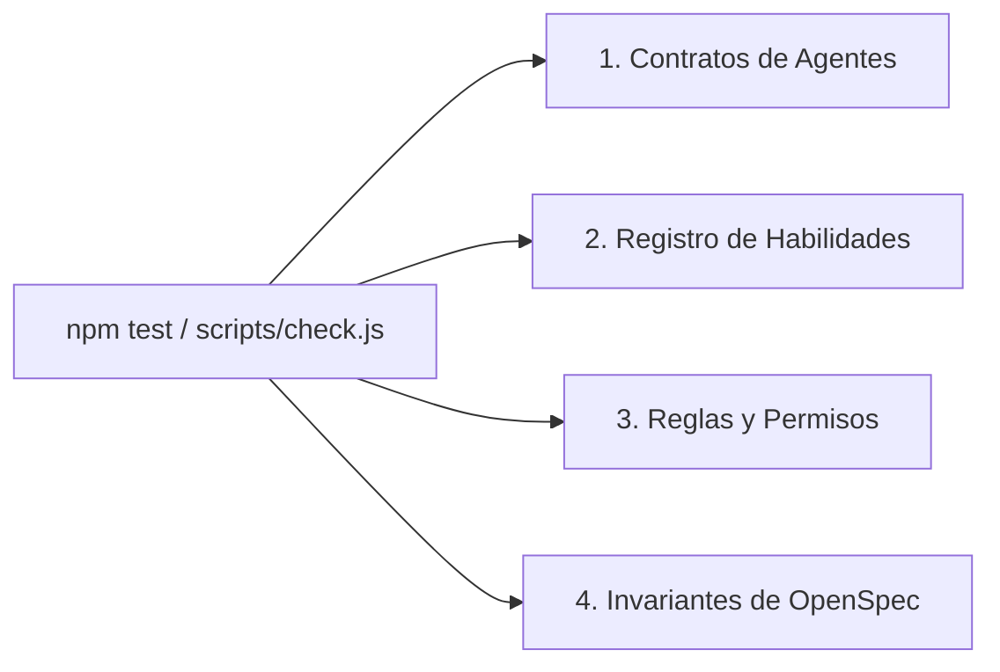

# Lint de Contratos y Reglas de Validación

> **En pocas palabras:** Así como un linter de código (como ESLint) revisa que no haya errores de sintaxis en tus programas, el **Contract Lint** de `ospec-workflow` comprueba que todos los agentes, habilidades, rutas y reglas del sistema estén perfectamente sincronizados y no contengan enlaces rotos ni directivas contradictorias.

---

## ¿Qué valida el Inspector de Contratos?



1. **Contratos de Agentes:** Comprueba que cada agente declarado en el orquestador exista físicamente y tenga sus herramientas permitidas bien definidas.
2. **Estructura de Frontmatter:** Verifica que los encabezados YAML de cada archivo `.agent.md` y `SKILL.md` cumplan el formato esperado.
3. **Paridad de Plataformas:** Garantiza que los generadores de las 7 plataformas produzcan árboles coherentes y sin archivos huérfanos.
4. **Validación Estricta de TDD:** Verifica que la tabla de evidencias de pruebas no contenga registros vacíos o inconsistentes.

---

## Cómo ejecutar la validación

Puedes comprobar la integridad de todo el repositorio en cualquier momento ejecutando:

```bash
# Ejecutar la suite completa de contratos y tests
npm test
```
