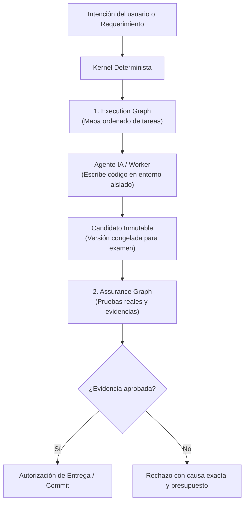

# Evolución del Harness: Kernel, Grafos y Evidencia

> **En pocas palabras:** La IA es excelente generando ideas y código, pero comete errores y no debería validarse a sí misma. La evolución del harness transforma el sistema en un **kernel determinista** (un árbitro imparcial) que organiza el trabajo en un mapa de tareas (**Execution Graph**) y no autoriza ningún cambio hasta que existan pruebas y evidencias reales e infalsificables (**Assurance Graph**).

---

## ¿Qué problema resuelve la evolución del harness?

Cuando un asistente de IA trabaja en un proyecto grande, surgen tres riesgos principales:

1. **La ilusión de éxito:** Un modelo de IA puede afirmar *"He ejecutado las pruebas y todo funciona correctamente"*, cuando en realidad no ejecutó nada o las pruebas no cubren el cambio.
2. **Falta de orden y límites:** Sin un mapa claro de tareas, los agentes pueden dar vueltas en círculos, gastar tokens innecesarios o sobrescribir código accidentalmente.
3. **El juez y la parte:** Si el mismo modelo que escribe el código decide si el código es seguro, los sesgos y descuidos pasan desapercibidos.

La evolución del harness resuelve esto mediante un principio fundamental: **Separar el trabajo creativo (la IA) de la autoridad y el control de calidad (el Kernel determinista).**

---

## Los 4 Pilares Fundamentales (Explicados Fácilmente)

### 1. El Árbitro Imparcial (El Kernel Determinista)
El Kernel no es una IA; es código tradicional, predecible y matemático. Gobierna qué puede ejecutarse, qué permisos tiene cada herramienta y cuánto presupuesto (tokens, tiempo, reintentos) se puede gastar. La IA puede pedir permiso para ejecutar un test o tocar un archivo, pero es el Kernel quien emite el permiso y guarda el recibo.

### 2. El Mapa de Tareas (Execution Graph)
En lugar de lanzar a un agente a programar libremente, el sistema compila la propuesta en un grafo de pasos ordenados. Cada nodo representa una obligación clara (por ejemplo: *"Escribir test RED"*, *"Implementar función"*, *"Verificar GREEN"*). Si un paso falla, se conoce el punto exacto sin tener que reiniciar todo desde cero.

### 3. La Versión de Examen (El Candidato Inmutable)
Antes de verificar si algo funciona, el código generado se congela bajo una identidad única (un hash criptográfico SHA-256 llamado `CandidateId`). Esto evita trampas: el código que se prueba es exactamente el mismo que se somete a revisión, sin modificaciones ocultas de última hora.

### 4. La Red de Evidencias (Assurance Graph)
Para aprobar un cambio, no basta con decir *"está listo"*. El sistema construye un grafo de evidencias reales:
- Recibos de ejecución de tests con salida de consola real.
- Pruebas adversariales (mutaciones de código para comprobar que los tests realmente fallan cuando el código está roto).
- Revisiones de especialistas independientes (seguridad, legibilidad, resiliencia, fiabilidad).

---

## Comparativa: Flujo Clásico vs. Arquitectura con Kernel

| Aspecto | Flujo Clásico (Solo IA) | Arquitectura con Kernel y Grafos |
|---|---|---|
| **¿Quién decide qué hacer?** | El modelo de lenguaje en cada prompt. | El **Execution Graph** compila la ruta exacta y ordenada. |
| **¿Cómo se prueban los cambios?** | Preguntando al modelo si compiló. | Mediante **recibos verificables** de ejecución real en consola. |
| **¿Quién aprueba la entrega?** | Respuestas afirmativas en el chat. | Una **DeliveryAuthorization** emitida solo si el Assurance Graph está completo. |
| **Control de costes** | Sin límite estricto; puede entrar en bucles. | **Budgets monótonos** por fase y tarea; se detiene al agotar presupuesto. |
| **Trazabilidad** | Se pierde al cerrar la sesión de chat. | Todo queda firmado en el **Authority Store (CAS)** del repositorio. |

---

## La Caja Fuerte de Evidencias: Authority Store (CAS)

Para que ninguna prueba pueda ser alterada, el sistema utiliza un almacén direccionado por contenido (**Content-Addressed Storage o CAS**):

- Cada archivo, recibo de prueba o resultado de revisión se guarda con una huella digital única (hash).
- Si alguien o algún proceso intenta modificar un resultado pasado, la huella cambia y el sistema detecta la discrepancia inmediatamente (`GRAPH_DIVERGENCE`), bloqueando la operación.
- Tras reiniciar el ordenador o cerrar la sesión, el estado se rehidrata intacto desde el disco.

---

## Estado Actual de la Evolución

La evolución se organiza en una serie de hitos incrementales y verificados (denominados **K1 a K12**):

- **K1 a K3 (Cerrados y Verificados):** Contratos del sistema, núcleo de ciclo de vida, almacén CAS, permisos de operación y congelación inmutable de candidatos.
- **K4 a K6c (Cerrados y Verificados):** Compilación del Execution Graph, control de presupuestos, ejecución en cápsula aislada, recolección de evidencias y pruebas de resistencia (*challenges* contra tests complacientes).
- **K6d (En curso / Próximo):** Análisis de complejidad y deltas de cambio.
- **K7 a K9 (Planificados):** Autoridad de revisión formal y validación comparativa en la sombra (A/B testing) para asegurar que el nuevo motor supera al anterior en todos los escenarios.
- **K10 a K12 (Planificados):** Autorización de entrega formal, expansión a todos los asistentes y evaluación continua a gran escala.

---

## Resumen para Desarrolladores

Si eres desarrollador, lo que debes saber es:
1. **OpenSpec y Git siguen mandando:** Tu especificación en `openspec/` y tu historial de Git son la verdad de tu proyecto.
2. **Tu trabajo es más seguro:** Los agentes del harness no romperán código silenciosamente porque cada cambio requiere pruebas reales antes de integrarse.
3. **Todo es auditable:** Si algo falla, el sistema te muestra el recibo exacto, el comando ejecutado y la discrepancia encontrada.
