# Roadmap del Harness: De la Base a la Madurez Total (K1 a K12)

> **En pocas palabras:** El desarrollo de `ospec-workflow` sigue una ruta por etapas estrictamente verificadas (denominadas **K1** a **K12**). Cada hito resuelve un problema real concreto, pasando de un sistema con reglas fijas hacia una plataforma autónoma con garantías matemáticas de seguridad y calidad.

---

## La Ruta Crítica en un Vistazo

```mermaid
flowchart LR
    subgraph Fase1 ["1. Identidad y Contratos"]
        K1["K1: Contratos"] --> K2["K2: Ciclo de Vida"]
        K2 --> K2_1["K2.1: Almacén CAS"]
        K2_1 --> K3["K3: Candidato Inmutable"]
    end

    subgraph Fase2 ["2. Grafos y Pruebas Reales"]
        K3 --> K4a["K4a: Compilar Grafo"]
        K4a --> K5["K5: Presupuestos"]
        K5 --> K6a["K6a: Aislamiento"]
        K6a --> K6b["K6b: Evidencias"]
        K6b --> K6c["K6c: Tests Adversariales"]
    end

    subgraph Fase3 ["3. Validación y Comparación"]
        K6c --> K6d["K6d: Complejidad"]
        K6d --> K7["K7: Autoridad de Review"]
        K7 --> K8["K8: Atestación Formal"]
        K8 --> K9["K9: Pruebas A/B Sombra"]
    end

    subgraph Fase4 ["4. Entrega y Expansión"]
        K9 --> K10["K10: Entrega por Perfil"]
        K10 --> K11["K11: Multi-Target Completo"]
        K11 --> K12["K12: Evaluación Masiva"]
    end

    Fase1 --> Fase2
    Fase2 --> Fase3
    Fase3 --> Fase4
```

---

## Las 4 Grandes Etapas del Roadmap

### Etapa 1: Fundación, Seguridad y Candidatos Inmutables (K1 – K3)
*¿Qué problema resolvió?* Asegurar que las reglas sean claras y que el código evaluado no pueda cambiar a mitad del examen.

- **K1 (Contratos e Invariantes):** Define el vocabulario formal, tipos de errores y reglas del sistema para que todos los módulos hablen el mismo idioma.
- **K2 (Núcleo de Ciclo de Vida):** Implementa el arnés mínimo que controla las transiciones entre fases.
- **K2.1 (Authority Store CAS y Permisos):** Almacén seguro con huellas digitales (Content-Addressed Storage) donde cada permiso y recibo de operación queda registrado de forma inalterable.
- **K2a (Host Headless y Adaptador de Referencia):** Primer entorno de ejecución automatizado sin interfaz gráfica.
- **K3 (Identidad y Congelación de Candidatos):** Introduce el `CandidateId`. El código que se prueba queda congelado en el tiempo para que las revisiones sean 100% justas.

---

### Etapa 2: Compilación de Grafos y Verificación Sin Trampas (K4 – K6)
*¿Qué problema resolvió?* Evitar que la IA ejecute código destructivo, gaste presupuesto infinito o apruebe pruebas falsas.

- **K4a (Compilador de Grafos de Ejecución):** Traduce los requerimientos del usuario en una red de tareas ordenada y predecible.
- **K5 (Presupuestos, Fallos y Recuperación):** Límites estrictos de tokens, tiempo y reintentos. Si un agente se pierde, el sistema lo detiene y recupera el control.
- **K6a (Cápsula de Aislamiento para Workers):** Los agentes trabajan dentro de un contenedor seguro para que un error nunca corrompa el repositorio principal.
- **K4b (Ejecución Shadow de Reparaciones):** Las correcciones automáticas se prueban primero en segundo plano antes de tocar el código real.
- **K6b (Verificador y Grafo de Evidencias):** Exige recibos reales de ejecución de pruebas. Las afirmaciones sin pruebas son rechazadas.
- **K6c (Tests Adversariales / Retos contra Complacencia):** Inyecta mutaciones de código intencionadas para verificar que los tests fallen de verdad si el código tuviera errores (evita tests "falsos positivos").

---

### Etapa 3: Revisión Formal y Validación en la Sombra (K6d – K9)
*¿Qué problema resuelve?* Garantizar que la nueva arquitectura sea demostrablemente superior antes de convertirla en el estándar por defecto.

- **K6d (Delta de Complejidad - *Próximo a implementar*):** Mide el impacto y la densidad de cada cambio para ajustar el nivel de exigencia en la revisión.
- **K7 (Autoridad de Revisión):** Sistema que coordina a los 4 revisores especializados (Riesgo, Legibilidad, Resiliencia y Fiabilidad).
- **K8 (Atestación Formal de Evaluación):** Certificado inmutable que acredita que un candidato superó todos los exámenes bajo una política específica.
- **K9 (Validación A/B y Replay en la Sombra):** Ejecuta el nuevo motor en paralelo con el anterior para comprobar que nunca rinde por debajo del sistema clásico.

---

### Etapa 4: Entrega y Expansión a Todo el Ecosistema (K10 – K12)
*¿Qué problema resuelve?* Desplegar la solución a todos los editores y asistentes de IA con soporte empresarial.

- **K10 (Autorización de Entrega y Rutas Inteligentes):** Entrega automática según el tipo de cambio (hotfix rápido, estándar o refactorización profunda).
- **K11 (Expansión Multi-Target Completa):** Soporte nativo de primera clase para los 7 asistentes e IDEs: Claude Code, GitHub Copilot, VS Code, OpenCode, Codex, Cursor y Antigravity.
- **K12 (Evaluación Longitudinal a Gran Escala):** Medición de calidad, velocidad y estabilidad a lo largo de miles de cambios reales.

---

## Tabla de Estado de los Hitos

| Hito | Nombre / Alcance | Estado | Versión de Entrega |
|---|---|---|---|
| **O2B** | Línea base fija de referencia (Control) | `Cerrado (done)` | v2.36.0 |
| **K1** | Suite de contratos, vocabulario e invariantes | `Cerrado (done)` | v2.37.0 |
| **K2** | Ciclo de vida y arnés mínimo | `Cerrado (done)` | v2.38.0 |
| **K2.1** | Authority Store CAS, permisos y recibos | `Cerrado (done)` | v2.39.0 |
| **K2a** | Conformance Host y adaptador Claude | `Cerrado (done)` | v2.40.0 |
| **K3** | 4 Identidades y congelación de Candidatos | `Cerrado (done)` | v2.42.3 |
| **K4a** | Compilador de Grafo de Ejecución y Replay | `Cerrado (done)` | v2.45.7 |
| **K5** | Presupuestos, manejo de fallos y recuperación | `Cerrado (done)` | v2.45.13 |
| **K6a** | Aislamiento de workers y cápsula de trabajo | `Cerrado (done)` | v2.46.0 |
| **K4b** | Ejecución shadow de reparaciones | `Cerrado (done)` | v2.48.3 |
| **K6b** | Verificador, procedencia y Assurance Graph | `Cerrado (done)` | v2.55.0 |
| **K6c** | Retos adversariales contra tests complacientes | `Cerrado (done)` | v2.56.0 |
| **K6d** | Análisis de delta de complejidad | `Próximo (next-eligible)` | Planificado |
| **K7 – K8** | Autoridad de review y atestación de candidato | `Planificado (pending)` | Planificado |
| **K9** | Comparación A/B en la sombra | `Planificado (pending)` | Planificado |
| **K10 – K12**| Entrega por perfil, expansión multi-target y corpus | `Planificado (pending)` | Planificado |

---

## Reglas de Oro del Roadmap

1. **Sin saltos al vacío:** No se activa una nueva política como predeterminada hasta que supere el periodo de prueba en la sombra (K9).
2. **Una sola autoridad por etapa:** No se mantienen dos motores compitiendo entre sí; cada mejora consolida y reemplaza ordenadamente la anterior.
3. **Las pruebas reales mandan:** Ninguna tarea se marca como completada sin tests automáticos que demuestren su funcionamiento.
