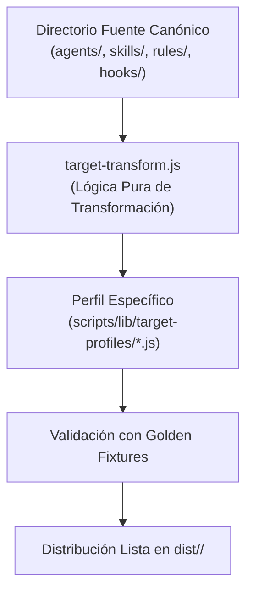

# Generador Multi-Target en Profundidad

> **En pocas palabras:** El generador multi-target es el compilador que transforma las definiciones universales de agentes y habilidades en los formatos específicos que demandan las **7 plataformas de IA soportadas**, sin duplicación de código.

---

## Proceso de Transformación Interno

### Transformaciones Realizadas
1. **Reescritura de Frontmatter:** Adapta las cabeceras YAML a las claves requeridas por cada plataforma.
2. **Mapeo de Herramientas:** Convierte nombres de herramientas genéricas a los identificadores nativos (por ejemplo, `ask_question` en Antigravity o `ask_user` en Copilot).
3. **Conversión de Reglas:** Transforma instrucciones markdown en reglas `.mdc` para Cursor o directivas de instrucciones para Copilot.
4. **Resolución de Modelos:** Traduce los tiers abstractos (`cheap`, `default`, `premium`) a los identificadores exactos de los proveedores.
