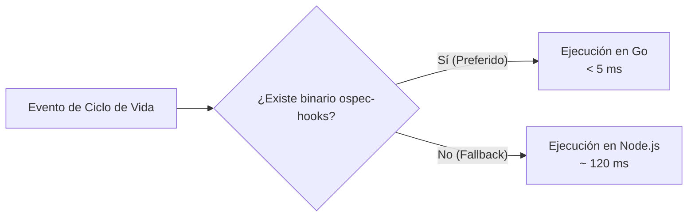

# Implementación de Hooks en Go: Velocidad y Eficiencia

> **En pocas palabras:** Cada vez que la IA realiza una acción, los hooks se ejecutan en segundo plano. Para que tu editor no se congele ni un milisegundo, los hooks están programados y precompilados en **Go** (`ospec-hooks`), respondiendo en menos de 5 milisegundos y con consumo de memoria casi nulo.

---

## ¿Por qué Go en lugar de solo Node.js?

En flujos de trabajo con asistentes de IA, un agente puede llamar a herramientas decenas de veces por minuto. Iniciar el motor de Node.js en cada llamada añade una pequeña latencia que se acumula.

Con la versión en **Go**:
- **Arranque instantáneo:** El binario nativo se ejecuta directamente en el sistema operativo sin cargar máquinas virtuales.
- **Paridad absoluta:** El binario en Go y los scripts en Node.js ejecutan exactamente la misma lógica de validación y pasan la misma suite de 888+ tests.
- **Fallback transparente:** Si un usuario clona el repositorio y aún no tiene el binario compilado de Go, el sistema cambia automáticamente al ejecutor de Node.js sin mostrar ningún error.



---

## Compilación y Pruebas del Módulo Go

Para compilar el binario nativo en tu máquina:

```bash
# Compilar el ejecutable nativo de hooks
go build -o release/dist/ospec-hooks ./cmd/ospec-hooks

# Ejecutar las pruebas unitarias en Go
go test ./internal/hooks/...
```
