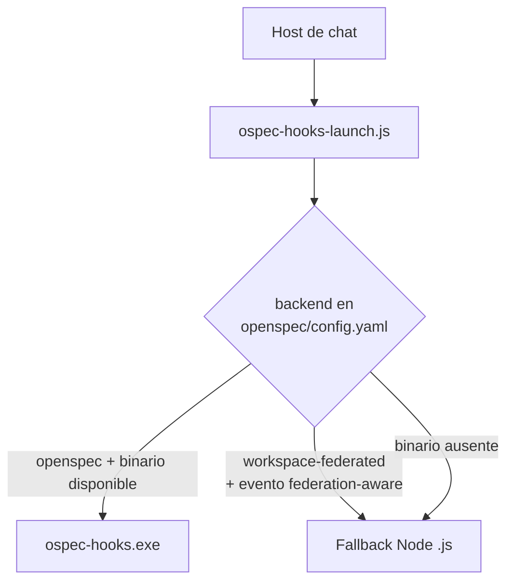

# Runtime de hooks de ciclo de vida

Cinco eventos de ciclo de vida del host de chat (`SessionStart`, `PreToolUse`,
`PreCompact`, `SubagentStop`, `Stop`) descargan del prompt tareas repetitivas
del ciclo SDD y aplican políticas de seguridad y control. Este dominio cubre
su registro, su doble implementación (Node.js y Go) y el launcher que decide
cuál usar.

## Registro y contrato stdin/stdout

`hooks/hooks.json` es la única fuente de verdad para el binding de hooks:
lista los cinco eventos, cada uno de tipo `"command"`, invocando
`node "${CLAUDE_PLUGIN_ROOT}/scripts/hooks/<name>.js"` a través del launcher.

| Evento | Script Node | Timeout | Responsabilidad |
| --- | --- | --- | --- |
| `SessionStart` | `session-start.js` | (ninguno) | Valida OpenSpec, refresca la caché de skills, ejecuta escaneos AgentShield. |
| `PreToolUse` | `pre-tool-use.js` | 5s | Bloquea/pregunta ante comandos peligrosos, evalúa Token Budget Advisor y AgentShield. |
| `PreCompact` | `pre-compact.js` | 5s | Persiste un resumen recuperable antes de compactar contexto. |
| `SubagentStop` | `subagent-stop.js` | 5s | Detecta degradación en la resolución de skills. |
| `Stop` | `stop.js` | 5s | Registra la continuidad mínima de la sesión. |

Todo hook DEBE leer su payload como JSON UTF-8 de stdin (stdin vacío resuelve a
`{}`), escribir exactamente una línea JSON UTF-8 en stdout antes de salir, y
nunca fallar silenciosamente — los errores deben producir una línea JSON
válida igual.

## Doble implementación: Node.js y Go

Cada hook existe dos veces:

- **Node.js** (`scripts/hooks/*.js`) — CommonJS, Node 22+, referencia original.
- **Go** (`internal/hooks/*.go`, compilado como `cmd/ospec-hooks/main.go` →
  `ospec-hooks.exe`) — versión nativa optimizada para arranque rápido.

### Reglas de ruteo del launcher (`scripts/hooks/ospec-hooks-launch.js`)

1. El launcher prefiere el binario Go compilado cuando está disponible en la
   plataforma.
2. El binario Go **no soporta federación de workspaces**. Para mantener
   paridad, el launcher debe rutear eventos federation-aware
   (`session-start`, `pre-compact`, `stop`) al fallback Node.js cuando el
   backend resuelto es `workspace-federated`.
3. Si el backend es `openspec` (single-repo) o el subcomando no es
   federation-aware (`pre-tool-use`, `subagent-stop`), usa el binario Go si
   existe.
4. **Protección del hot path**: para `pre-tool-use` y `subagent-stop` el
   launcher NUNCA lee ni parsea `openspec/config.yaml` — evita I/O de disco
   en el camino más frecuente y sensible a latencia.
5. Si `openspec/config.yaml` falta, es ilegible, o no especifica `backend`,
   el launcher asume `openspec` por defecto.
6. El **wrapper de degradación ASK** garantiza que ningún hook Node.js se
   queda callado ante un error: ante excepción no capturada, siempre retorna
   una línea JSON válida con `behavior: ask` y el motivo de error. El binario
   Go aplica la misma política desde `74ce1cb`.

## Detección de drift de dominio

`scripts/lib/ospec-state.js` expone un helper de "domain drift": dado el
commit de baseline registrado para un dominio
(`openspec/specs/_baseline/manifest.md`) y sus globs de fuente, determina si
el dominio cambió desde ese commit (`git diff --name-only <hash>..HEAD`,
filtrado por esos globs). Es fail-safe ante cualquier fallo de git (hash
inexistente, repo vacío, HEAD detached, git ausente): retorna "sin datos de
drift" en vez de lanzar, y los llamadores (`SessionStart`, `PreToolUse`) nunca
deben bloquearse por este fallo. Un dominio con cambios ya cubiertos por el
scope de un cambio OpenSpec activo se excluye del resultado de drift.

## Por qué la arquitectura está diseñada así

Mantener Node.js como implementación de referencia y Go como optimización de
arranque permite validar el binario nativo contra los mismos tests de
comportamiento (`scripts/hooks/parity-contract.test.js`), sin bifurcar el
contrato observable. La federación de workspaces es la única capacidad que el
binario Go no replica todavía, así que el launcher hace ese ruteo explícito en
vez de degradar silenciosamente.

## Principales puntos de extensión

- Agregar un hook nuevo: registrar el evento en `hooks/hooks.json`,
  implementar el script Node en `scripts/hooks/`, y — si aplica paridad Go —
  el handler correspondiente en `internal/hooks/`.
- Extender el ruteo del launcher: agregar el subcomando a la lista
  federation-aware si el nuevo hook necesita fallback a Node en workspaces
  federados.

## Cosas a vigilar al editar

- Un cambio de contrato en el hook Node.js casi siempre exige el espejo en Go
  — de lo contrario `parity-contract.test.js` debe actualizarse
  deliberadamente, nunca omitirse.
- No leer `openspec/config.yaml` dentro de los handlers de `pre-tool-use` o
  `subagent-stop` — rompe la protección de hot path.
- Los hooks nunca deben lanzar excepciones sin capturar: siempre deben
  devolver JSON válido en stdout, incluso en el camino de error.
- El wrapper de degradación ASK es el último cinturón de seguridad: no
  eliminar ni debilitar su captura de errores.

## Mapa de fuentes

- `/hooks/hooks.json` — `git log`: `b817438` (binding vscode/O1), `efa7c60` (wrapper 5 eventos + ASK)
- `/scripts/hooks/session-start.js`, `/scripts/hooks/pre-tool-use.js`, `/scripts/hooks/pre-compact.js`, `/scripts/hooks/subagent-stop.js`, `/scripts/hooks/stop.js`
- `/scripts/hooks/ospec-hooks-launch.js`, `/scripts/hooks/parity-contract.test.js`
- `/scripts/hooks/lib/model-tier.js` — clasifica tier de modelo (`cheap`, `default`, `premium`) para routing de hooks
- `/internal/hooks/`, `/cmd/ospec-hooks/main.go` — `git log`: `74ce1cb` (degradación ASK + guard atribución Go)
- `/scripts/lib/ospec-state.js`
- `/openspec/specs/hooks/spec.md`, `/openspec/specs/launcher/spec.md`
