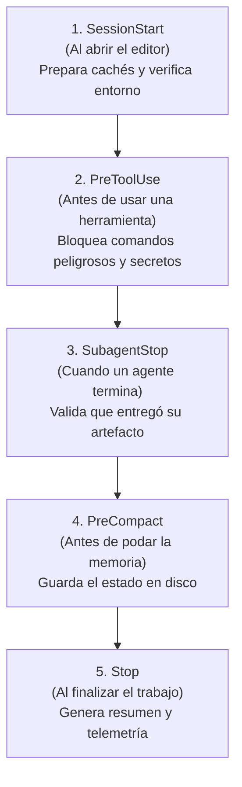

# Ciclo de Vida y Runtime de Hooks

> **En pocas palabras:** Los hooks son los **sensores y frenos automáticos** de `ospec-workflow`. Se disparan de forma transparente en momentos clave de tu sesión de trabajo (cuando inicias la herramienta, antes de que la IA ejecute un comando o al guardar un cambio) para proteger tu código, evitar fugas de secretos y mantener todo en orden.

---

## Los 5 Eventos del Ciclo de Vida

```mermaid
flowchart TD
    E1["1. SessionStart
(Al abrir el editor)
Prepara cachés y verifica entorno"] --> E2["2. PreToolUse
(Antes de usar una herramienta)
Bloquea comandos peligrosos y secretos"]
    E2 --> E3["3. SubagentStop
(Cuando un agente termina)
Valida que entregó su artefacto"]
    E3 --> E4["4. PreCompact
(Antes de podar la memoria)
Guarda el estado en disco"]
    E4 --> E5["5. Stop
(Al finalizar el trabajo)
Genera resumen y telemetría"]
```

---

## ¿Qué hace cada Hook exactamente?

### 1. `SessionStart` (Inicio de Sesión)
- Se ejecuta en cuanto abres tu asistente de IA.
- Comprueba si las habilidades cambiaron y regenera la caché (`skill-registry`).
- Inyecta las variables de entorno y las capacidades del proyecto.

### 2. `PreToolUse` (Control Previo de Herramientas)
- Se ejecuta cada vez que la IA quiere escribir un archivo o ejecutar un comando en la terminal.
- **AgentShield:** Analiza los comandos para evitar que se ejecuten instrucciones destructivas (como borrar el disco o alterar credenciales).
- **Token Budget:** Monitorea el consumo para evitar respuestas kilométricas innecesarias.

### 3. `SubagentStop` (Cierre de Tarea de Sub-Agente)
- Se ejecuta cuando un especialista (por ejemplo, el diseñador o el evaluador) termina su labor.
- Comprueba que el archivo prometido (como `design.md` o `verify-report.md`) se haya escrito correctamente antes de pasar el turno al siguiente agente.

### 4. `PreCompact` (Protección ante Podado de Contexto)
- Cuando la conversación con la IA se vuelve muy larga, los editores suelen borrar los primeros mensajes para ahorrar espacio en memoria.
- Este hook se asegura de que toda la información importante esté guardada en archivos en la carpeta `openspec/` antes de que la memoria se borre.

### 5. `Stop` (Cierre de Sesión)
- Registra la telemetría de costes, tiempo y tareas completadas para auditoría.
