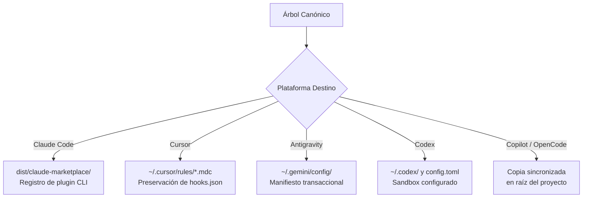

# Instalación y Configuración por Asistente de IA

> **En pocas palabras:** `ospec-workflow` se adapta automáticamente a tu entorno de trabajo favorito. Con un solo comando puedes compilar, instalar y sincronizar las habilidades y agentes en Claude Code, GitHub Copilot, Cursor, Codex, Antigravity, OpenCode o VS Code, garantizando que nunca se sobrescriban tus configuraciones personales.

---

## Métodos de Instalación Rápida

Elige tu asistente o editor de código habitual y ejecuta el comando correspondiente en la raíz del repositorio:

```bash
# 1. Claude Code (Registro en marketplace local)
npm run setup:claude

# 2. Cursor (Instalación global en ~/.cursor/)
npm run setup:cursor

# 3. Antigravity (Despliegue transaccional en ~/.gemini/config/)
npm run setup:antigravity

# 4. Codex / OpenAI (Instalación global en ~/.codex/)
npm run setup:codex

# 5. GitHub Copilot (Sincronización al repositorio destino)
npm run install:copilot -- /ruta/a/tu/proyecto

# 6. OpenCode (Sincronización al repositorio destino)
npm run install:opencode -- /ruta/a/tu/proyecto
```

---

## Cómo Funciona la Instalación en Cada Plataforma



### 1. Claude Code
- Compila el plugin en `dist/claude-marketplace/`.
- Registra el marketplace local e instala el plugin usando el CLI oficial de `claude`.
- Para iteraciones rápidas durante el desarrollo, puedes ejecutar `npm run reload:claude` y recargar en la sesión con `/reload-plugins`.

### 2. Cursor
- Compila la distribución en `dist/cursor/` y la sincroniza en tu directorio global `~/.cursor/`.
- Traduce las instrucciones a reglas nativas `.mdc` (`alwaysApply: true`) para que Cursor las aplique en todo momento.
- Si ya tienes configuraciones personales en `hooks.json`, el instalador las respeta y fusiona sin borrar nada.

### 3. Antigravity
- Compila los perfiles de agentes y skills para Antigravity.
- Despliega los archivos en `~/.gemini/config/` mediante un manifiesto transaccional que asegura que la instalación sea limpia y reversible.

### 4. Codex (OpenAI)
- Registra las definiciones de agentes, el runtime nativo y los servidores MCP en `~/.codex/`.
- Respeta estrictamente tu archivo `config.toml` preexistente para evitar sobrescribir claves o ajustes propios.

### 5. GitHub Copilot y OpenCode
- Operan mediante sincronización directa en el sistema de archivos hacia el repositorio donde estés trabajando.
- Copian de forma recursiva los agentes y reglas en `.github/` o `.opencode/` para su autodescubrimiento automático.

---

## Garantías de Seguridad e Idempotencia

Todos los instaladores incluyen salvaguardas automáticas:

- **Protección de rutas:** Verifican mediante `assertSafeDest` que nunca se instale en la raíz del sistema de archivos, en directorios del sistema o en rutas destructivas.
- **Idempotencia total:** Puedes ejecutar el comando de instalación tantas veces como quieras; el resultado siempre será un estado limpio, consistente y sin duplicar recursos.
- **Resolución inteligente de CLI:** En Windows, el sistema detecta ejecutables con extensiones `.cmd` y `.exe` para evitar problemas comunes de resolución en PowerShell.
