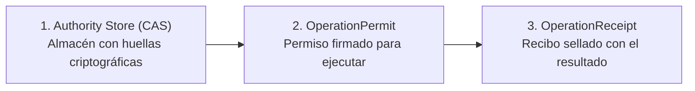

# El Runtime del Kernel y el Almacén Seguro CAS

> **En pocas palabras:** El **Kernel** es el núcleo de seguridad de `ospec-workflow`. Se encarga de que ninguna acción importante se realice sin un permiso firmado y guarda todos los resultados en una caja fuerte digital (**Authority Store CAS**) donde nadie puede falsificar pruebas ni alterar registros pasados.

---

## Los 3 Conceptos Clave del Kernel

1. **Authority Store (CAS):** Es un almacén direccionado por contenido. Cada dato se guarda bajo su huella SHA-256. Si alguien cambia una sola letra de un resultado antiguo, la huella cambia y el kernel detecta el fraude de inmediato.
2. **OperationPermit:** Antes de que un agente pueda tocar un archivo o correr un comando, el kernel emite un permiso con límites estrictos de tiempo y recursos.
3. **OperationReceipt:** Al terminar la acción, se guarda un recibo inalterable con la salida exacta de la consola y el código de retorno.

---

## ¿Por qué esto protege tu proyecto?

- **Previene alucinaciones:** Un modelo de IA no puede inventarse que las pruebas pasaron si no existe un `OperationReceipt` firmado que lo demuestre.
- **Control de costes:** El kernel descuenta el presupuesto en cada operación; si el presupuesto se agota, detiene la ejecución limpiamente antes de generar costes no deseados.
