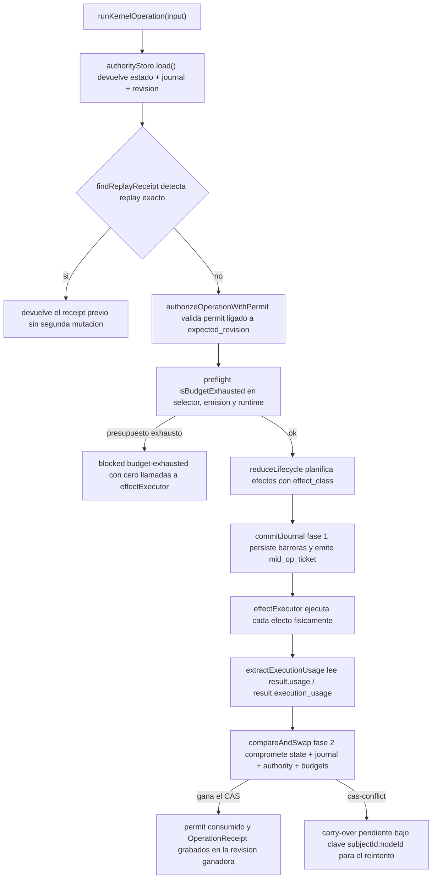

# Runtime del kernel (kernel runtime)

El kernel runtime es el núcleo mecánico que ejecuta cada operación sobre un
sujeto autoritativo del arnés: carga el estado con su revisión, valida
presupuestos en preflight, autoriza la mutación con un permiso de operación de
un solo uso, ejecuta los efectos y consolida el resultado mediante un commit
compare-and-swap (CAS) atómico. Existe para que ninguna mutación pueda ocurrir
sin revisión vigente, presupuesto y autorización del runtime — ni siquiera por
accidente de un modelo o de un writer concurrente. Cubre las entregas K2.1 a
K5 del roadmap kernel: Authority Store, permisos/receipts, semántica de
efectos y presupuestos/fallos/recuperación.

## Flujo principal

Toda operación pasa por `runKernelOperation` (`scripts/lib/lifecycle-kernel/index.js`):

El resultado público distingue siempre `outcome` (`advanced`, `blocked`,
`terminal`), `revision`, `operation_permit_id` y `operation_receipt`; el modo
conformance ejecuta exactamente este camino vía `runHarnessScenario`
(`minimal-kernel-harness.js`) — nunca por reductores privados.

## Detalles técnicos

### Authority Store

`createAuthorityStore` (`scripts/lib/authority-store/index.js`) mantiene un
sujeto por defecto (`DEFAULT_SUBJECT_ID = "lifecycle:default"`) y serializa
cada lectura/escritura con un mutex por sujeto. API pública:

| Método | Función |
| --- | --- |
| `load(subjectId)` | Devuelve estado clonado, journal, `revision`, budgets y authority bag; sujeto ausente falla cerrado con `subject-not-found`. |
| `commitJournal(nextJournal, subjectId, fromRevision)` | Fase 1 del protocolo de dos fases: hace durable el journal sin chequeo CAS y acuña un `mid_op_ticket` ligado a `fromRevision` + digests. |
| `compareAndSwap(subjectId, expectedRevision, nextState, nextJournal, midOpTicket, authorityCommit)` | Único contrato de mutación: avanza la cabeza solo si la revisión coincide (o hay ticket mid-op válido); si no, `stale-revision` / `cas-conflict`. |
| `snapshot(subjectId)` | Vista coherente pre-CAS mientras un commit está en vuelo; la usa el emisor controlado de permisos. |
| `getBudgets(subjectId)` | Copia de los presupuestos persistentes del sujeto. |

La revisión se calcula con `computeRevision`: huella SHA-256 sobre
`state_digest`, `journal_digest` y `authority_root_digest`. El digest raíz del
bag (`digestAuthority`) excluye el campo `revision` de cada receipt para evitar
autoreferencia. El journal se fusiona por `effect_id` (upsert merge-safe,
monotónico: un `completed` jamás degrada a `started`/`failed`). Tras ganar el
CAS se borra únicamente el ticket propio (`midOpTickets.delete(midOpTicket)`),
preservando los tickets de writers concurrentes.

Para disco, `createFileSystemStore` (`scripts/lib/filesystem-store.js`)
garantiza durabilidad crash-safe: escritura a temporal + `fsync`, rename
atómico y `fsync` de directorio; serialización entre procesos con lockfile
`.lock` (con detección de locks huérfanos) y recuperación desde `.bak` ante
`ENOENT`; sin cabeza y sin backup falla cerrada (`authority-head-not-found`),
nunca reinicia estado.

### Permisos y receipts

| Artefacto | Qué es | Qué NO es |
| --- | --- | --- |
| `TransitionOffer` | Describe una operación posible. | Nunca autoriza mutación. |
| `OperationPermit` | Autoriza una mutación concreta: `permit_id`, `expected_revision`, digests de argumentos/scope/política, `single_use=true`. | No lo acuña el modelo ni el host; solo el runtime. |
| `OperationReceipt` | Registra finalización mecánica (`kind: "operation-receipt/v1"`), referenciando el `permit_id` consumido. | No vale como attestation ni como delivery authorization. |

La emisión ocurre solo dentro del closure privado de `createKernelRuntime`
mediante `issuePermitForSelectedTransition`: exige snapshot autoritativo
(`authoritative-snapshot-required` si falta), revisión vigente, presupuestos
con carry-over en cuenta y allowlist causal vía `resolvePrimaryFailure()` +
`validateRecoveryTransition()`. El auto-mint público está deshabilitado
(`auto-mint-disabled`). El consumo y el receipt se graban en la misma revisión
que `next_state` y `next_journal`; un payload incompleto aborta el CAS
(`authority-commit-incomplete`). El replay exacto devuelve el receipt previo
sin segundo avance ni segundo receipt.

### Presupuestos de ejecución

`isBudgetExhausted` (`scripts/lib/execution-budgets.js`) evalúa diez
dimensiones ortogonales antes de invocar `effectExecutor`:

| Grupo | Dimensiones (valores por defecto) |
| --- | --- |
| Nodo | `turns` (10), `patches` (10), `commands` (25), `wall_time_minutes` (30), `changed_lines` (400), `allowed_paths` ([]) |
| Autoridad | `effect_attempts` (3), `authority_mutations` (10), `evidence_runs` (20), `review_sweeps` (1) |

Cualquier dimensión agotada marca el nodo exhausto y la ejecución falla cerrada
con cero invocaciones al executor; el selector poda las transiciones
ordinarias y solo ofrece `escalate` / `replan` / `stop`.

La contabilidad es estrictamente monótona: los deltas se extraen exclusivamente
de `result.usage` o `result.execution_usage` del executor (sin ese campo,
`execution-usage-required`); `input.consumed` jamás es autoridad contable.
Deltas no confirmados por CAS quedan como carry-over pendiente particionado
por `${subjectId}:${nodeId}`, se deducen exactamente una vez contra la revisión
ganadora y nunca reponen cuotas ni contaminan nodos hermanos. Una mutación
portadora de efecto sin progreso (`isZeroDeltaMutation`) consume doble penalización —
un turno de nodo y un `effect_attempts`— con evento durable `zero-delta-attempt`
antes del CAS; las transiciones de control de ciclo de vida (`start`,
`complete`, `fail`, `recover`, `replan`, `status`, `escalate`, `stop`,
`invalidate-node`, `decide`) y las inspecciones de solo lectura están exentas.

### Canon de autoridad

`scripts/lib/authority-canon.js` fija que OpenSpec/Git son la autoridad
semántica: Graph IR (`assertOpenSpecAuthoritative`, `reconcileGraphIr`) y
claims de adaptadores (`assertAdaptersNotSemanticAuthority`) no pueden
sobrescribirla; los campos estructurales ausentes fallan cerrado
(`rejectProseFallback`) en lugar de interpretar prosa.

## Por qué la arquitectura está diseñada así

- **Writers concurrentes**: dos procesos pueden cargar la misma revisión R;
  sin CAS ambos escribirían. El CAS garantiza un único ganador, y el perdedor
  recibe `cas-conflict` con la revisión actual sin reiniciar trabajo ni inflar
  presupuestos — sus efectos ya ejecutados se conservan como carry-over
  durable para el reintento.
- **Fail-closed en todas las fronteras**: sujeto ausente, snapshot faltante,
  revisión vencida, permiso reutilizado o forjado, payload de consumo
  incompleto o usage inexistente bloquean la operación en vez de degradarla.
  Es más barato bloquear y reconciliar que inventar estado.
- **Presupuestos anti-bucle**: turnos, comandos, líneas cambiadas y sweeps de
  review acotados hacen terminal todo bucle de reparación/recuperación; la
  penalización dual zero-delta cierra el caso patológico del paso estéril que
  no avanza nada. La monotonicidad estricta impide reabrir el bucle mediante
  reintentos o conflictos CAS.
- **Autoridad encapsulada**: mintear permisos vive en el closure del runtime;
  ni modelos ni hosts ni proyecciones pueden auto-concederse capacidad de
  mutación.

## Principales puntos de extensión

- Nuevo backend de persistencia del head: implementar
  `load` / `commit` / `commitJournal` / `snapshot` con las mismas garantías
  (merge por `effect_id`, verificación de revisión, durabilidad crash-safe)
  siguiendo el patrón de `filesystem-store.js`.
- Nueva dimensión de presupuesto: añadir la clave a `isBudgetExhausted`,
  `decrementBudgetMonotonic` y al default correspondiente, manteniendo la
  semántica fail-closed y el código `BUDGET_EXHAUSTED` /
  `AUTHORITY_BUDGET_EXHAUSTED`.
- Instrumentación de operaciones: los checkpoints (`before-journal`,
  `after-journal`, `after-effect`, `before-state-commit`,
  `after-state-commit`) permiten interrumpir u observar sin tocar el núcleo.

## Cosas a vigilar al editar

- No reintroducir `commit` directo como API pública de sujetos autoritativos:
  un store sin `compareAndSwap` es rechazado por el runtime
  (`authority-store-required`). El journal es registro, no ruta de mutación.
- No aceptar `input.consumed` ni estimaciones como contabilidad de uso; solo
  el `result.usage` del executor físico cuenta, y debe deducirse exactamente
  una vez.
- No exponer el emisor de permisos (`getPermitIssuer`, `getPrivateIssuer`,
  símbolos de fábrica): la spec prohíbe que aparezcan en la superficie pública.
- Al fusionar journal concurrente, respeta la monotonicidad de estados
  (`completed` absorbente) y borra solo tu ticket mid-op.
- Los schemas kernel (`schemas/kernel/`) están versionados y congelados por el
  contract-lint; cualquier cambio de forma pasa por sus gates — ver
  [Lint de contratos y reglas de validación](../contract-lint/validation-rules.md).
- La telemetría de consumo vive fuera del estado semántico: no altera digests
  ni equivalencia de transiciones.

## Mapa de fuentes

- `/openspec/specs/authority-store/spec.md` — `git log`: `e1a99c8`
- `/openspec/specs/operation-permits/spec.md` — `git log`: `fca7b66`
- `/openspec/specs/execution-budgets/spec.md` — `git log`: `e1a99c8`
- `/openspec/specs/lifecycle-kernel-runtime/spec.md` — `git log`: `e1a99c8`
- `/openspec/specs/harness-authority-canon/spec.md` — `git log`: `ec245a1`
- `/scripts/lib/lifecycle-kernel/index.js` — `runKernelOperation`, `createKernelRuntime` — `git log`: `e1a99c8`
- `/scripts/lib/lifecycle-kernel/permits.js` — ledger y receipts — `git log`: `740371f`
- `/scripts/lib/lifecycle-kernel/internal/permit-authority.js` — emisor controlado — `git log`: `279f6dd`
- `/scripts/lib/authority-store/index.js` — `git log`: `e1a99c8`
- `/scripts/lib/filesystem-store.js` — `git log`: `e1a99c8`
- `/scripts/lib/execution-budgets.js` — `git log`: `1c2c957`
- `/scripts/lib/authority-canon.js` — `git log`: `42a3a221`
- `/scripts/lib/minimal-kernel-harness.js` — conformance headless — `git log`: `e1a99c8`

La relación de esta capa con los almacenes documentales del repo (specs,
memoria operativa, `state.yaml`) se describe en
[Persistencia y estado](../state-management/persistence.md).
