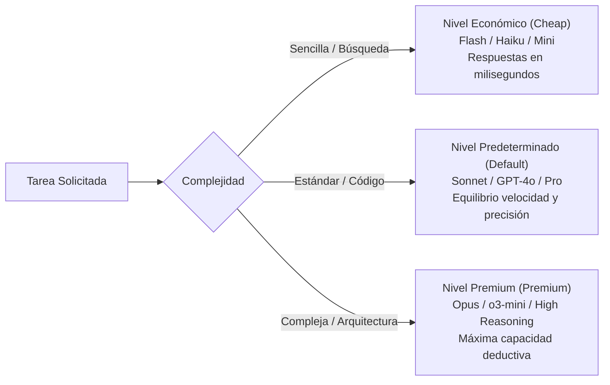

# Ruteo Inteligente de Modelos de IA

> **En pocas palabras:** Utilizar siempre el modelo de Inteligencia Artificial más grande y caro para todas las tareas es lento y derrocha dinero. El **Ruteo de Modelos** asigna de forma inteligente el modelo adecuado para cada trabajo: modelos ultrarrápidos y económicos para tareas sencillas, y modelos avanzados para diseño de arquitectura y revisión crítica.

---

## Los 3 Niveles de Modelos (*Tiers*)

---

## Matriz de Asignación por Proveedor

El archivo central `models.yaml` define cómo se mapea cada nivel abstracto al modelo real de cada proveedor de IA:

| Nivel (*Tier*) | Rol Típico | Anthropic / Claude | OpenAI / Codex | Google / Gemini |
|---|---|---|---|---|
| **`cheap`** | Búsquedas rápidas, resúmenes breves, lectura de archivos. | Claude Haiku | GPT-4o Mini | Gemini Flash |
| **`default`** | Programación TDD, tareas estándar, propuestas. | Claude Sonnet | GPT-4o | Gemini Pro |
| **`premium`** | Diseño de arquitectura compleja, auditoría de seguridad crítica. | Claude Opus | o3-mini / o1 | Gemini Ultra |

---

## Ventajas del Ruteo Inteligente

1. **Ahorro de hasta un 70% en costes de API:** Las tareas cotidianas de inspección y lectura se delegan a modelos ultraligeros.
2. **Mayor velocidad de respuesta:** Los modelos económicos procesan consultas en una fracción de segundo, agilizando el flujo diario.
3. **Máxima calidad donde importa:** Cuando se requiere diseñar una base de datos o validar seguridad, el sistema invoca automáticamente la máxima potencia de razonamiento disponible.
