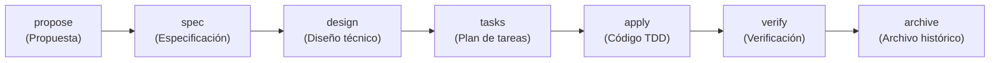

# Orquestación de Fases y Rutas SDD

> **En pocas palabras:** No todos los cambios en un proyecto son iguales: arreglar una errata no requiere el mismo proceso que diseñar una arquitectura desde cero. El **orquestador** analiza lo que quieres hacer y elige automáticamente la ruta más rápida y segura para tu caso, asegurando que solo se ejecuten los pasos necesarios.

---

## El Ciclo Completo de Desarrollo (SDD)

El ciclo de desarrollo guiado por especificaciones (Spec-Driven Development) consta de 7 fases fundamentales:

---

## Catálogo de Rutas Inteligentes

El orquestador consulta la tabla de rutas de `openspec/config.yaml` y activa la primera ruta que coincide con tu necesidad:

| Ruta | ¿Cuándo se utiliza? | Fases que ejecuta |
|---|---|---|
| **standard** | Desarrollo normal de nuevas funcionalidades en proyectos activos. | `propose → spec → design → tasks → apply → verify → archive` |
| **lite** | Cambios pequeños y directos de bajo riesgo. | `propose → tasks → apply → verify → archive` |
| **hotfix** | Corrección urgente de emergencia que debe aplicarse ya. | `apply → verify → archive` |
| **bugfix** | Corrección de un fallo tras investigar la causa raíz. | `explore → tasks → apply → verify → archive` |
| **refactor** | Reestructuración de código sin alterar el comportamiento externo. | `design → tasks → apply → verify → archive` |
| **foundation** | Creación inicial de un proyecto desde cero. | `sdd-foundation` (construye la base antes de programar) |
| **brownfield** | Proyectos existentes con código pero sin especificaciones. | `sdd-baseline` (genera especificaciones por dominios) |
| **federated** | Cambios coordinados en múltiples repositorios a la vez. | `sdd-workspace → propose → spec → design → ...` |

---

## Compuertas de Control y Seguridad (*Gates*)

En puntos críticos de la ruta, el orquestador aplica compuertas de calidad automáticas:

1. **Gate de Aclaración (`clarify`):** Si la especificación tiene contradicciones o ambigüedades graves, el sistema se detiene y realiza preguntas puntuales al usuario antes de permitir el diseño técnico.
2. **Gate de Revisión 4R (`4r-review-gate`):** Tras verificar el código, un evaluador generalista examina el cambio y convoca a los especialistas necesarios:
   - *Cambios normales:* Hasta **2 revisores** enfocados.
   - *Cambios de alto riesgo (seguridad, pagos, auth):* Los **4 revisores especializados** (Riesgo, Legibilidad, Fiabilidad y Resiliencia).
3. **Límite de Carga de Revisión (`review-workload`):** Advierte si un cambio supera las **400 líneas modificadas**, recomendando dividirlo en entregas encadenadas para proteger la atención del revisor humano.
