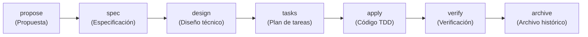

# Orquestación de Fases y Rutas SDD

> **En pocas palabras:** No todos los cambios en un proyecto son iguales: arreglar una errata no requiere el mismo proceso que diseñar una arquitectura desde cero. En el modo SDD, el **orquestador** analiza lo que quieres hacer y elige automáticamente la ruta más rápida y segura para tu caso, asegurando que solo se ejecuten los pasos necesarios.

---

## Antes del orquestador: el router

Cada instalador añade un router pequeño a las instrucciones que el asistente carga siempre. Decide qué flujo sigue cada petición:

| Petición | Flujo |
|---|---|
| Un cambio de código | **IDD**, el flujo por defecto: la skill `idd` lo lleva con el CLI `ospec` hasta `ospec close`. |
| Una pregunta, una explicación o trabajo de solo lectura | Directo, sin cambio registrado. |
| Un comando `/sdd-*` o «hazme un SDD para X» | **SDD**: el orquestador de esta página, si el paquete se instaló con `--with-sdd`. |
| Un proyecto con `mode: sdd` en `idd/config.yaml` | IDD apagado: trabajo directo y SDD solo bajo petición. |

Los cambios SDD en curso terminan en SDD. El resto de esta página describe el modo SDD.

---

## El Ciclo Completo de Desarrollo (SDD)

El ciclo de desarrollo guiado por especificaciones (Spec-Driven Development) consta de 7 fases fundamentales:

```mermaid
flowchart LR
    A["propose
(Propuesta)"] --> B["spec
(Especificación)"]
    B --> C["design
(Diseño técnico)"]
    C --> D["tasks
(Plan de tareas)"]
    D --> E["apply
(Código TDD)"]
    E --> F["verify
(Verificación)"]
    F --> G["archive
(Archivo histórico)"]
```

---

## Catálogo de Rutas Inteligentes

El orquestador consulta la tabla de rutas de `openspec/config.yaml` y activa la primera ruta que coincide con tu necesidad:

| Ruta | ¿Cuándo se utiliza? | Fases que ejecuta |
|---|---|---|
| **standard** | Desarrollo normal de nuevas funcionalidades en proyectos activos. | `propose → spec → design → tasks → apply → verify → archive` |
| **lite** | Cambios pequeños y directos de bajo riesgo. | `propose → tasks → apply → verify → archive` |
| **hotfix** | Corrección urgente de emergencia que debe aplicarse ya. | `apply → verify → archive` |
| **bugfix** | Corrección de un fallo tras investigar la causa raíz. | `explore → tasks → apply → verify → archive` |
| **refactor** | Reestructuración de código sin alterar el comportamiento externo. | `design → tasks → apply → verify → archive` |
| **foundation** | Creación inicial de un proyecto desde cero. | `foundation` (construye la base antes de programar) |
| **brownfield** | Proyectos existentes con código pero sin especificaciones. | `sdd-baseline` (genera especificaciones por dominios) |
| **federated** | Cambios coordinados en múltiples repositorios a la vez. | `sdd-workspace → propose → spec → design → ...` |

---

## Compuertas de Control y Seguridad (*Gates*)

En puntos críticos de la ruta, el orquestador aplica compuertas de calidad automáticas:

1. **Gate de Aclaración (`clarify`):** Si la especificación tiene contradicciones o ambigüedades graves, el sistema se detiene y realiza preguntas puntuales al usuario antes de permitir el diseño técnico.
2. **Gate de revisión de calidad (`quality-review-gate`):** Tras verificar el código, una clasificación determinista elige qué dimensiones revisar (Confianza, Runtime, Evolución y Eficiencia), y cada revisor seleccionado actúa una sola vez dentro de un linaje de revisión acotado.
3. **Límite de Carga de Revisión (`review-workload`):** Advierte si un cambio supera las **400 líneas modificadas**, recomendando dividirlo en entregas encadenadas para proteger la atención del revisor humano.
