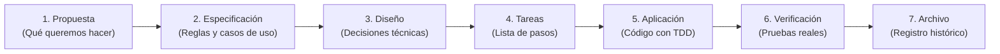

# Guía Rápida: ospec-workflow

> **En pocas palabras:** `ospec-workflow` es un sistema que ayuda a los desarrolladores y a los asistentes de Inteligencia Artificial a construir software de forma ordenada, segura y con pruebas reales. Transforma una simple idea en una especificación clara, diseña la solución, escribe el código mediante TDD estricto y verifica todo antes de hacer commit. Funciona de manera idéntica en 7 herramientas y editores distintos (como Claude Code, Cursor, Copilot o VS Code).

---

## ¿Cómo funciona el flujo de trabajo?

El desarrollo sigue un ciclo de fases coordinadas paso a paso:

1. **Propuesta (`propose`):** Define el objetivo, el alcance y los riesgos del cambio.
2. **Especificación (`spec`):** Escribe los requerimientos en lenguaje claro y estructurado con OpenSpec.
3. **Diseño (`design`):** Planifica la arquitectura técnica, los archivos afectados y la estrategia de pruebas.
4. **Tareas (`tasks`):** Divide el trabajo en unidades pequeñas y manejables (máximo 400 líneas por revisión).
5. **Aplicación (`apply`):** Los agentes escriben primero los tests (RED) y luego el código necesario (GREEN).
6. **Verificación (`verify`):** Un agente independiente comprueba que todos los tests pasen en la consola real.
7. **Archivo (`archive`):** Guarda un registro histórico inmutable del cambio para futuras auditorías.

---

## ¿Qué ventajas ofrece a tu equipo?

- **Cero alucinaciones sin pruebas:** La IA no puede dar un cambio por bueno si no aporta un recibo de consola real con las pruebas en verde.
- **La memoria vive en archivos:** Todo el progreso y las decisiones se guardan en la carpeta `openspec/` de tu repositorio, no en el chat efímero. Si cierras la ventana, no pierdes nada.
- **Un solo código para 7 plataformas:** Escribes tus agentes y reglas una sola vez y el generador los distribuye a Claude Code, VS Code, GitHub Copilot, OpenCode, Codex, Cursor y Antigravity.
- **Seguridad y ahorro:** Filtra automáticamente credenciales secretas y controla el consumo de tokens para evitar gastos imprevistos.

---

## Mapa de la Documentación

Explora los temas organizados de menor a mayor profundidad técnica:

### 1. Primeros Pasos
- [Instalación por Asistente o IDE](installation/target-installation.md) — Cómo instalar y sincronizar el plugin en tu herramienta favorita.

### 2. Visión y Futuro
- [Evolución del Harness](evolution/harness-evolution.md) — Por qué el sistema evoluciona hacia un kernel determinista con grafos de evidencia.
- [Roadmap de Hitos K1 a K12](evolution/roadmap.md) — Las etapas de desarrollo, su estado actual y el plan futuro.

### 3. Arquitectura y Funcionamiento
- [Visión General de Arquitectura](architecture/overview.md) — Cómo se distribuye un árbol fuente único a 7 plataformas sin duplicar trabajo.
- [Orquestación de Fases y Rutas](orchestration/routing.md) — Cómo el sistema elige la ruta más eficiente (hotfix rápido o ciclo completo).
- [El Runtime del Kernel](kernel-runtime/kernel-runtime.md) — Almacén seguro CAS, permisos de operación y control de presupuestos.

### 4. Agentes y Habilidades
- [Catálogo de Agentes y Skills](agents-skills/agents-and-skills.md) — Los roles especializados y sus manuales de instrucciones paso a paso.
- [Sistema de Reglas de Comportamiento](rules-system/agent-rules.md) — Restricciones obligatorias para que la IA nunca cometa abusos.
- [Ruteo Inteligente de Modelos](model-routing/routing-profiles.md) — Usar modelos rápidos y económicos para tareas simples y avanzados para arquitectura.

### 5. Ciclo de Vida y Seguridad
- [Ciclo de Vida de los Hooks](hooks-runtime/lifecycle.md) — Qué ocurre al iniciar sesión, antes de usar herramientas o al hacer commit.
- [Implementación de Hooks en Go](hooks-runtime/go-implementation.md) — Ejecución instantánea y paridad total con Node.js.
- [Guardrails de Seguridad y Costes](security/guardrails.md) — Detección de secretos, control de tokens y protección de Git.
- [Validación de Contratos y Lint](contract-lint/validation-rules.md) — Reglas automáticas para que nadie rompa la estructura del proyecto.

### 6. Calidad, Estado y Distribución
- [Persistencia y Gestión del Estado](state-management/persistence.md) — OpenSpec como fuente única de verdad en disco.
- [Testing y Strict TDD](testing-quality/verification.md) — Por qué el código debe nacer con tests y cómo se valida la evidencia.
- [Generador Multi-Target](generator/multi-target-generator.md) — El motor que traduce el código a cada asistente de IA.
- [Federación Multi-Repositorio](workspace-federation/multi-repo.md) — Coordinar cambios que afectan a varios repositorios a la vez.

---

## Archivos Clave del Repositorio

| Archivo | ¿Para qué sirve? |
| --- | --- |
| `openspec/config.yaml` | Archivo de configuración central: define rutas, reglas y herramientas activas. |
| `agents/` | Definición de los agentes especializados (orquestador, evaluadores, aplicadores). |
| `skills/` | Guías de procedimientos paso a paso que ejecutan los agentes. |
| `scripts/configure/cli.js` | Generador que compila el código fuente para los 7 asistentes de IA. |
| `scripts/hooks/` e `internal/hooks/` | Hooks de ciclo de vida en JavaScript y Go para máxima velocidad. |
| `scripts/check.js` | Suite de pruebas y validación del repositorio (`npm test`). |
