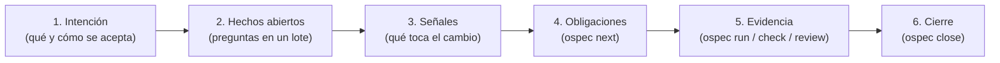

# Guía Rápida: ospec-workflow

> **En pocas palabras:** `ospec-workflow` ayuda a los asistentes de Inteligencia Artificial a cambiar código con pruebas reales en lugar de promesas. Por defecto usa **IDD** (desarrollo guiado por impacto): cada cambio debe lo que su impacto exige, y solo está hecho cuando el CLI `ospec` lo cierra con evidencia de ejecuciones reales. El desarrollo guiado por especificación (**SDD**) sigue disponible como modo opcional. Funciona igual en 7 herramientas (como Claude Code, Cursor, Copilot o VS Code).

---

## ¿Cómo funciona el flujo de trabajo?

Pides el cambio con tus palabras y el router lo manda a IDD. No hay fases ni documentos que escribir antes:

```mermaid
flowchart LR
    A["1. Intención\n(qué y cómo se acepta)"] --> B["2. Hechos abiertos\n(preguntas en un lote)"]
    B --> C["3. Señales\n(qué toca el cambio)"]
    C --> D["4. Obligaciones\n(ospec next)"]
    D --> E["5. Evidencia\n(ospec run / check / review)"]
    E --> F["6. Cierre\n(ospec close)"]
```

1. **Intención (`ospec record intent`):** el agente registra qué quieres y cómo se comprueba que está hecho.
2. **Hechos abiertos:** enumera los comportamientos que ni la petición ni el código fijan y te los pregunta todos juntos antes de editar.
3. **Señales (`ospec signals`):** declara los ficheros que va a tocar; el CLI deriva señales de impacto (contrato público, datos persistentes, frontera de seguridad, bug, Strict TDD).
4. **Obligaciones (`ospec next`):** cada señal añade una obligación, como un test de reproducción para un bug o una revisión de confianza para un cambio de autenticación.
5. **Evidencia:** solo cuenta lo que el CLI ve ejecutarse sobre el árbol actual. Decir «los tests pasan» no satisface nada.
6. **Cierre (`ospec close`):** con todo satisfecho, archiva el cambio en `idd/archive/`. Ramas, commits y PRs siguen siendo decisión tuya.

El agente solo se detiene en cuatro *gates*: intención ambigua, hechos abiertos, operación irreversible y ADR enmendado o contradicho. Solo una respuesta explícita tuya los resuelve.

### Modo SDD opcional

Si prefieres escribir y aprobar el contrato antes del código, instala el paquete SDD con `--with-sdd` y usa un comando `/sdd-*`. SDD recorre siete fases (propuesta, especificación, diseño, tareas, aplicación con TDD, verificación y archivo) con artefactos OpenSpec; ver [Orquestación de Fases y Rutas](/orchestration/routing/).

---

## ¿Qué ventajas ofrece a tu equipo?

- **Cero alucinaciones sin pruebas:** La IA no puede dar un cambio por bueno si no aporta un recibo de consola real con las pruebas en verde.
- **Ceremonia proporcional:** Un arreglo de una línea solo debe pasar los checks; una migración de esquema debe además su test de migración y su plan de vuelta atrás.
- **La memoria vive en archivos:** Todo el progreso y las decisiones se guardan en `idd/` (o en `openspec/` en modo SDD) dentro de tu repositorio, no en el chat efímero. Si cierras la ventana, no pierdes nada.
- **Un solo código para 7 plataformas:** Escribes tus agentes y reglas una sola vez y el generador los distribuye a Claude Code, VS Code, GitHub Copilot, OpenCode, Codex, Cursor y Antigravity.
- **Seguridad y ahorro:** Filtra automáticamente credenciales secretas y controla el consumo de tokens para evitar gastos imprevistos.

---

## Mapa de la Documentación

Explora los temas organizados de menor a mayor profundidad técnica:

### 1. Primeros Pasos
- [Instalación por Asistente o IDE](installation/target-installation.md) — Cómo instalar y sincronizar el plugin en tu herramienta favorita.

### 2. Visión y Futuro
- [Evolución del Harness](evolution/harness-evolution.md) — Histórico: el programa del kernel determinista con grafos de evidencia.
- [Roadmap de Hitos K1 a K12](evolution/roadmap.md) — Histórico: las etapas K1–K12. La dirección vigente (IDD por defecto) está en el roadmap único del repositorio.

### 3. Arquitectura y Funcionamiento
- [Visión General de Arquitectura](architecture/overview.md) — Cómo se distribuye un árbol fuente único a 7 plataformas sin duplicar trabajo.
- [Orquestación de Fases y Rutas](orchestration/routing.md) — Cómo el sistema elige la ruta más eficiente (hotfix rápido o ciclo completo).
- [El Runtime del Kernel](kernel-runtime/kernel-runtime.md) — Almacén seguro CAS, permisos de operación y control de presupuestos.

### 4. Agentes y Habilidades
- [Catálogo de Agentes y Skills](agents-skills/agents-and-skills.md) — Los roles especializados y sus manuales de instrucciones paso a paso.
- [Sistema de Reglas de Comportamiento](rules-system/agent-rules.md) — Restricciones obligatorias para que la IA nunca cometa abusos.
- [Ruteo Inteligente de Modelos](model-routing/routing-profiles.md) — Usar modelos rápidos y económicos para tareas simples y avanzados para arquitectura.

### 5. Ciclo de Vida y Seguridad
- [Ciclo de Vida de los Hooks](hooks-runtime/lifecycle.md) — Qué ocurre al iniciar sesión, antes de usar herramientas o al hacer commit.
- [Implementación de Hooks en Go](hooks-runtime/go-implementation.md) — Ejecución instantánea y paridad total con Node.js.
- [Guardrails de Seguridad y Costes](security/guardrails.md) — Detección de secretos, control de tokens y protección de Git.
- [Validación de Contratos y Lint](contract-lint/validation-rules.md) — Reglas automáticas para que nadie rompa la estructura del proyecto.

### 6. Calidad, Estado y Distribución
- [Persistencia y Gestión del Estado](state-management/persistence.md) — OpenSpec como fuente única de verdad en disco.
- [Testing y Strict TDD](testing-quality/verification.md) — Por qué el código debe nacer con tests y cómo se valida la evidencia.
- [Generador Multi-Target](generator/multi-target-generator.md) — El motor que traduce el código a cada asistente de IA.
- [Federación Multi-Repositorio](workspace-federation/multi-repo.md) — Coordinar cambios que afectan a varios repositorios a la vez.

---

## Archivos Clave del Repositorio

| Archivo | ¿Para qué sirve? |
| --- | --- |
| `idd/config.yaml` | Configuración IDD: checks del proyecto, Strict TDD, patrones de impacto y documentos de contrato (`mode: sdd` apaga IDD). |
| `scripts/ospec.js` | El CLI `ospec`: `status`, `next`, `record`, `signals`, `check`, `run`, `review` y `close`. |
| `openspec/config.yaml` | Configuración del modo SDD: rutas, reglas y herramientas activas. |
| `agents/` | Revisores `review-*` que usa IDD y, con el paquete SDD, el orquestador y los agentes de fase. |
| `skills/` | Guías de procedimientos paso a paso que ejecutan los agentes. |
| `scripts/configure/cli.js` | Generador que compila el código fuente para los 7 asistentes de IA. |
| `scripts/hooks/` e `internal/hooks/` | Hooks de ciclo de vida en JavaScript y Go para máxima velocidad. |
| `scripts/check.js` | Suite de pruebas y validación del repositorio (`npm test`). |
